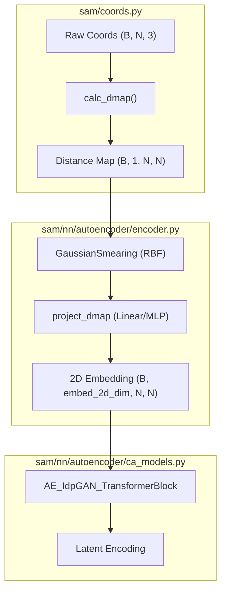
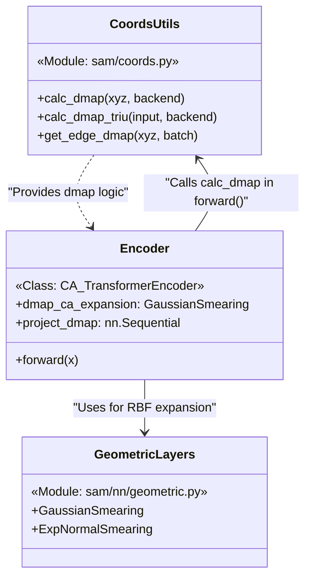

# Distance Map Calculations

> **Relevant source files**
> * [sam/coords.py](https://github.com/giacomo-janson/idpsam/blob/ec63c24a/sam/coords.py)
> * [sam/nn/autoencoder/encoder.py](https://github.com/giacomo-janson/idpsam/blob/ec63c24a/sam/nn/autoencoder/encoder.py)

Distance map calculations are fundamental to the idpSAM architecture, serving both as primary input features for structural encoding and as key metrics for post-generation ensemble analysis. The system provides optimized implementations for computing pairwise distance matrices and extracting upper-triangle elements for dimensionality reduction (PCA).

## Overview of Distance Map Functions

The `sam/coords.py` module contains the core logic for geometric calculations. It supports both **PyTorch** and **NumPy** backends to allow seamless integration within neural network forward passes and standalone analysis scripts.

| Function | Input Shape | Output Shape | Purpose |
| --- | --- | --- | --- |
| `calc_dmap` | `(B, N, 3)` or `(N, 3)` | `(B, 1, N, N)` or `(1, N, N)` | Computes full pairwise Euclidean distance matrix. |
| `calc_dmap_triu` | `(B, N, 3)` or `(B, 1, N, N)` | `(B, N*(N-1)/2)` | Extracts the flattened upper triangle of a distance map. |
| `get_edge_dmap` | `(N_nodes, 3)` | `(N_edges,)` | Computes distances for specific graph edges defined in a batch. |

Sources: [sam/coords.py L5-L71](https://github.com/giacomo-janson/idpsam/blob/ec63c24a/sam/coords.py#L5-L71)

 [sam/coords.py L144-L150](https://github.com/giacomo-janson/idpsam/blob/ec63c24a/sam/coords.py#L144-L150)

## Implementation Details

### calc_dmap

The `calc_dmap` function computes the Euclidean distance between all pairs of particles (typically Cα atoms). It includes a small `epsilon` (default `1e-12`) to ensure numerical stability during square root operations, preventing zero-distance gradients from exploding [sam/coords.py L5-L24](https://github.com/giacomo-janson/idpsam/blob/ec63c24a/sam/coords.py#L5-L24)

The function dynamically handles batching:

* **Batched Input:** If the input is `(B, N, 3)`, it uses broadcasting `xyz[:,None,:,:] - xyz[:,:,None,:]` to compute the $N \times N$ matrix for each batch element [sam/coords.py L20-L24](https://github.com/giacomo-janson/idpsam/blob/ec63c24a/sam/coords.py#L20-L24)
* **Single Structure:** If the input is `(N, 3)`, it computes a single $N \times N$ matrix [sam/coords.py L26-L31](https://github.com/giacomo-janson/idpsam/blob/ec63c24a/sam/coords.py#L26-L31)

### calc_dmap_triu

This utility is primarily used for Principal Component Analysis (PCA) and structural clustering. Because distance maps are symmetric and have a zero diagonal, only the upper triangle is needed to represent the unique pairwise constraints.

* It accepts either raw coordinates or a pre-computed distance map [sam/coords.py L42-L55](https://github.com/giacomo-janson/idpsam/blob/ec63c24a/sam/coords.py#L42-L55)
* It utilizes `torch.triu_indices` or `np.triu_indices` with `offset=1` to exclude the diagonal [sam/coords.py L61-L63](https://github.com/giacomo-janson/idpsam/blob/ec63c24a/sam/coords.py#L61-L63)

Sources: [sam/coords.py L5-L71](https://github.com/giacomo-janson/idpsam/blob/ec63c24a/sam/coords.py#L5-L71)

## Data Flow: From Coordinates to RBF Features

In the idpSAM pipeline, distance maps are not used as raw values. Instead, they are transformed into a high-dimensional Radial Basis Function (RBF) representation within the `CA_TransformerEncoder`.

### Featurization Logic

1. **Distance Calculation**: The `CA_TransformerEncoder.forward` method calls `calc_dmap` on the input Cα coordinates [sam/nn/autoencoder/encoder.py L10](https://github.com/giacomo-janson/idpsam/blob/ec63c24a/sam/nn/autoencoder/encoder.py#L10-L10)
2. **Expansion**: The resulting map is passed through an expansion layer (either `GaussianSmearing` or `ExpNormalSmearing`) [sam/nn/autoencoder/encoder.py L91-L103](https://github.com/giacomo-janson/idpsam/blob/ec63c24a/sam/nn/autoencoder/encoder.py#L91-L103)
3. **Projection**: The expanded RBF features are projected into a 2D embedding space (`embed_2d_dim`) using a Linear layer or MLP (`project_dmap`) [sam/nn/autoencoder/encoder.py L105-L112](https://github.com/giacomo-janson/idpsam/blob/ec63c24a/sam/nn/autoencoder/encoder.py#L105-L112)
4. **Transformer Injection**: These 2D embeddings are injected into the `AE_IdpGAN_TransformerBlock` to bias the attention mechanism [sam/nn/autoencoder/encoder.py L138-L155](https://github.com/giacomo-janson/idpsam/blob/ec63c24a/sam/nn/autoencoder/encoder.py#L138-L155)

### Distance Map Processing Pipeline

Sources: [sam/coords.py L5-L37](https://github.com/giacomo-janson/idpsam/blob/ec63c24a/sam/coords.py#L5-L37)

 [sam/nn/autoencoder/encoder.py L91-L112](https://github.com/giacomo-janson/idpsam/blob/ec63c24a/sam/nn/autoencoder/encoder.py#L91-L112)

 [sam/nn/autoencoder/encoder.py L138-L155](https://github.com/giacomo-janson/idpsam/blob/ec63c24a/sam/nn/autoencoder/encoder.py#L138-L155)

## Code Entity Mapping

The following diagram maps the logical structural analysis concepts to their specific implementation entities in the `idpsam` codebase.

### Entity Relationship Diagram

Sources: [sam/coords.py L5-L40](https://github.com/giacomo-janson/idpsam/blob/ec63c24a/sam/coords.py#L5-L40)

 [sam/nn/autoencoder/encoder.py L32-L112](https://github.com/giacomo-janson/idpsam/blob/ec63c24a/sam/nn/autoencoder/encoder.py#L32-L112)

 [sam/nn/geometric.py L1-L20](https://github.com/giacomo-janson/idpsam/blob/ec63c24a/sam/nn/geometric.py#L1-L20)

## Usage in Analysis

Outside of the neural network, `calc_dmap_triu` is the standard tool for preparing ensembles for dimensionality reduction. By flattening the unique distances, it creates a feature vector for each frame in an IDP ensemble, which can then be used for:

1. **PCA**: Identifying the major modes of structural variation.
2. **Clustering**: Grouping similar conformations in the latent or coordinate space.
3. **Validation**: Comparing the distribution of distances between generated samples and ground truth data.

Sources: [sam/coords.py L40-L71](https://github.com/giacomo-janson/idpsam/blob/ec63c24a/sam/coords.py#L40-L71)

 [sam/coords.py L131-L141](https://github.com/giacomo-janson/idpsam/blob/ec63c24a/sam/coords.py#L131-L141)