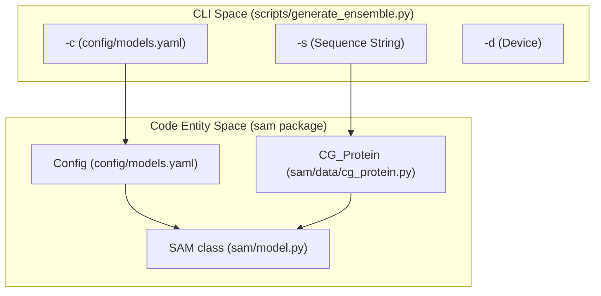

# Getting Started

> **Relevant source files**
> * [README.md](https://github.com/giacomo-janson/idpsam/blob/ec63c24a/README.md?plain=1)
> * [sam.yml](https://github.com/giacomo-janson/idpsam/blob/ec63c24a/sam.yml)
> * [sam/data/__init__.py](https://github.com/giacomo-janson/idpsam/blob/ec63c24a/sam/data/__init__.py)
> * [setup.py](https://github.com/giacomo-janson/idpsam/blob/ec63c24a/setup.py)
> * [weights/v1.0/enc_std_scaler.pt](https://github.com/giacomo-janson/idpsam/blob/ec63c24a/weights/v1.0/enc_std_scaler.pt)
> * [weights/v1.0/nn.dec.pt](https://github.com/giacomo-janson/idpsam/blob/ec63c24a/weights/v1.0/nn.dec.pt)
> * [weights/v1.0/nn.enc.pt](https://github.com/giacomo-janson/idpsam/blob/ec63c24a/weights/v1.0/nn.enc.pt)
> * [weights/v1.0/nn.eps.pt](https://github.com/giacomo-janson/idpsam/blob/ec63c24a/weights/v1.0/nn.eps.pt)

This page provides a comprehensive guide for setting up the **idpSAM** environment, installing the core library, and executing the first ensemble generation using both the Command Line Interface (CLI) and Jupyter Notebooks.

## Installation Overview

The installation process is designed to ensure a reproducible environment using Conda. The package is installed in editable mode to allow for development and easy access to the `sam` library within the Python path.

### 1. Environment Setup

It is recommended to use the provided `sam.yml` to manage dependencies, which include specific versions of PyTorch, MDTraj, and the Hugging Face `diffusers` library [sam.yml L1-L138](https://github.com/giacomo-janson/idpsam/blob/ec63c24a/sam.yml#L1-L138)

```sql
# Clone the repositorygit clone https://github.com/giacomo-janson/idpsam.gitcd idpsam # Create and activate the environmentconda env create -f sam.ymlconda activate sam # Install the sam library in editable modepip install -e .
```

### 2. Optional: All-Atom Reconstruction

By default, idpSAM generates Cα (Alpha Carbon) traces. To generate all-atom ensembles, you must install the `cg2all` package [README.md L33-L37](https://github.com/giacomo-janson/idpsam/blob/ec63c24a/README.md?plain=1#L33-L37)

```
pip install git+http://github.com/huhlim/cg2all
```

**Sources:** [README.md L11-L38](https://github.com/giacomo-janson/idpsam/blob/ec63c24a/README.md?plain=1#L11-L38)

 [sam.yml L1-L138](https://github.com/giacomo-janson/idpsam/blob/ec63c24a/sam.yml#L1-L138)

 [setup.py L1-L18](https://github.com/giacomo-janson/idpsam/blob/ec63c24a/setup.py#L1-L18)

---

## Pre-trained Weights

Before running inference, ensure the pre-trained weights are available in the `weights/v1.0/` directory. The model requires four specific files to initialize the latent diffusion pipeline:

| File Name | Description |
| --- | --- |
| `nn.enc.pt` | Weights for the Cα Transformer Encoder [weights/v1.0/nn.enc.pt L1-L10](https://github.com/giacomo-janson/idpsam/blob/ec63c24a/weights/v1.0/nn.enc.pt#L1-L10) |
| `nn.dec.pt` | Weights for the Cα Transformer Decoder [weights/v1.0/nn.dec.pt L1-L10](https://github.com/giacomo-janson/idpsam/blob/ec63c24a/weights/v1.0/nn.dec.pt#L1-L10) |
| `nn.eps.pt` | Weights for the Epsilon (Noise Prediction) Transformer [weights/v1.0/nn.eps.pt L1-L10](https://github.com/giacomo-janson/idpsam/blob/ec63c24a/weights/v1.0/nn.eps.pt#L1-L10) |
| `enc_std_scaler.pt` | Normalization constants for the latent space [weights/v1.0/enc_std_scaler.pt L1-L10](https://github.com/giacomo-janson/idpsam/blob/ec63c24a/weights/v1.0/enc_std_scaler.pt#L1-L10) |

**Sources:** [README.md L4-L5](https://github.com/giacomo-janson/idpsam/blob/ec63c24a/README.md?plain=1#L4-L5)

 [weights/v1.0/nn.enc.pt L1-L10](https://github.com/giacomo-janson/idpsam/blob/ec63c24a/weights/v1.0/nn.enc.pt#L1-L10)

 [weights/v1.0/nn.dec.pt L1-L10](https://github.com/giacomo-janson/idpsam/blob/ec63c24a/weights/v1.0/nn.dec.pt#L1-L10)

 [weights/v1.0/nn.eps.pt L1-L10](https://github.com/giacomo-janson/idpsam/blob/ec63c24a/weights/v1.0/nn.eps.pt#L1-L10)

 [weights/v1.0/enc_std_scaler.pt L1-L10](https://github.com/giacomo-janson/idpsam/blob/ec63c24a/weights/v1.0/enc_std_scaler.pt#L1-L10)

---

## Running Your First Generation

### CLI Workflow

The primary entry point for local generation is `scripts/generate_ensemble.py`. This script handles sequence validation, model loading, and coordinate output.

```
python scripts/generate_ensemble.py \  -c config/models.yaml \  -s "MFDNASTRNNKRERGKRQGKQTRTQRHADRSQT" \  -o my_peptide \  -n 1000 \  -d cuda
```

**Key Arguments:**

* `-c`: Path to the YAML configuration defining model hyperparameters [README.md L52](https://github.com/giacomo-janson/idpsam/blob/ec63c24a/README.md?plain=1#L52-L52)
* `-s`: The amino acid sequence of the IDP [README.md L53](https://github.com/giacomo-janson/idpsam/blob/ec63c24a/README.md?plain=1#L53-L53)
* `-n`: Total number of conformations to sample [README.md L55](https://github.com/giacomo-janson/idpsam/blob/ec63c24a/README.md?plain=1#L55-L55)
* `-a`: (Optional) Flag to trigger all-atom reconstruction via `cg2all` [README.md L56](https://github.com/giacomo-janson/idpsam/blob/ec63c24a/README.md?plain=1#L56-L56)

### Notebook Workflow

For interactive analysis and visualization, the `notebooks/idpsam_experiments.ipynb` provides a pre-configured environment. This is particularly useful for Google Colab users who wish to leverage cloud GPUs without local installation [README.md L61-L66](https://github.com/giacomo-janson/idpsam/blob/ec63c24a/README.md?plain=1#L61-L66)

**Sources:** [README.md L44-L66](https://github.com/giacomo-janson/idpsam/blob/ec63c24a/README.md?plain=1#L44-L66)

---

## System Data Flow

The following diagrams illustrate the transition from the user-facing CLI to the underlying code entities and the internal data transformation pipeline.

### CLI to Code Entity Mapping

This diagram maps the CLI arguments to the specific classes and functions in the `sam` package that handle them.



**Sources:** [README.md L47-L59](https://github.com/giacomo-janson/idpsam/blob/ec63c24a/README.md?plain=1#L47-L59)

 [sam/model.py L1-L10](https://github.com/giacomo-janson/idpsam/blob/ec63c24a/sam/model.py#L1-L10)

 [sam/data/cg_protein.py L1-L10](https://github.com/giacomo-janson/idpsam/blob/ec63c24a/sam/data/cg_protein.py#L1-L10)

### Inference Data Pipeline

This diagram tracks the transformation of data from a raw sequence to a generated structural ensemble.

**Sources:** [README.md L4-L9](https://github.com/giacomo-janson/idpsam/blob/ec63c24a/README.md?plain=1#L4-L9)

 [sam/model.py L1-L10](https://github.com/giacomo-janson/idpsam/blob/ec63c24a/sam/model.py#L1-L10)

 [weights/v1.0/nn.enc.pt L1-L10](https://github.com/giacomo-janson/idpsam/blob/ec63c24a/weights/v1.0/nn.enc.pt#L1-L10)

 [weights/v1.0/nn.dec.pt L1-L10](https://github.com/giacomo-janson/idpsam/blob/ec63c24a/weights/v1.0/nn.dec.pt#L1-L10)

 [weights/v1.0/nn.eps.pt L1-L10](https://github.com/giacomo-janson/idpsam/blob/ec63c24a/weights/v1.0/nn.eps.pt#L1-L10)

Would you like the summary of the next section, **1.2. Inference Quickstart: generate_ensemble.py**?