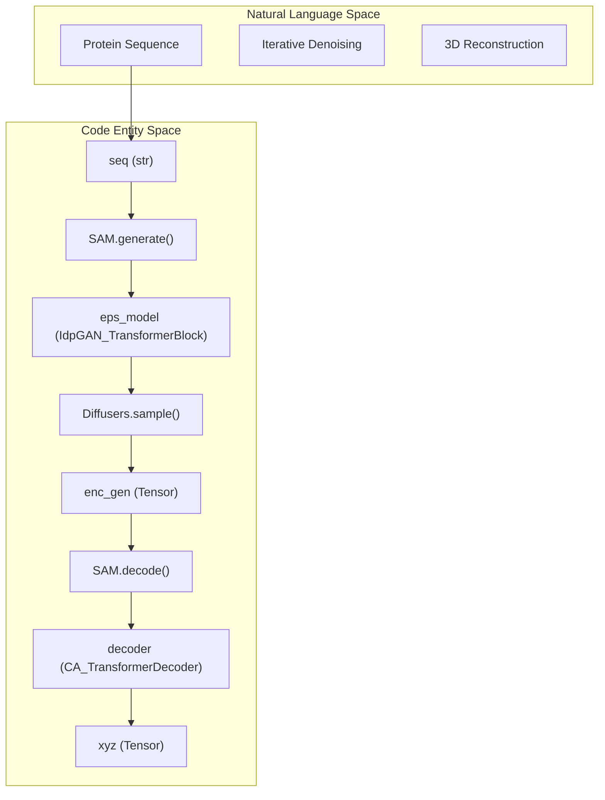
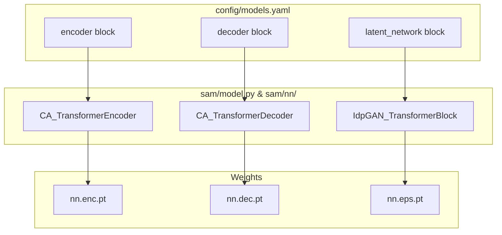

# Glossary

> **Relevant source files**
> * [README.md](https://github.com/giacomo-janson/idpsam/blob/ec63c24a/README.md?plain=1)
> * [config/models.yaml](https://github.com/giacomo-janson/idpsam/blob/ec63c24a/config/models.yaml)
> * [notebooks/idpsam_experiments.ipynb](https://github.com/giacomo-janson/idpsam/blob/ec63c24a/notebooks/idpsam_experiments.ipynb)
> * [sam/coords.py](https://github.com/giacomo-janson/idpsam/blob/ec63c24a/sam/coords.py)
> * [sam/data/cg_protein.py](https://github.com/giacomo-janson/idpsam/blob/ec63c24a/sam/data/cg_protein.py)
> * [sam/diffusion/diffusers_dm.py](https://github.com/giacomo-janson/idpsam/blob/ec63c24a/sam/diffusion/diffusers_dm.py)
> * [sam/model.py](https://github.com/giacomo-janson/idpsam/blob/ec63c24a/sam/model.py)
> * [sam/nn/noise_prediction/eps.py](https://github.com/giacomo-janson/idpsam/blob/ec63c24a/sam/nn/noise_prediction/eps.py)

This page provides definitions for the specialized terminology, biological concepts, and architectural components utilized within the **idpSAM** codebase. Each entry includes pointers to the relevant source code for implementation details.

## Biological Concepts

### Intrinsically Disordered Proteins (IDPs)

Proteins that lack a stable, well-defined 3D structure under physiological conditions. Unlike globular proteins, IDPs exist as a dynamic ensemble of conformations [notebooks/idpsam_experiments.ipynb L23](https://github.com/giacomo-janson/idpsam/blob/ec63c24a/notebooks/idpsam_experiments.ipynb#L23-L23)

 idpSAM is specifically designed to model these structural ensembles [README.md L1-L4](https://github.com/giacomo-janson/idpsam/blob/ec63c24a/README.md?plain=1#L1-L4)

### Cα (Alpha Carbon) Trace

A coarse-grained representation of a protein structure using only the positions of the alpha carbon atoms. idpSAM's core diffusion process operates on these coordinates [README.md L4](https://github.com/giacomo-janson/idpsam/blob/ec63c24a/README.md?plain=1#L4-L4)

* **Sources:** [README.md L1-L10](https://github.com/giacomo-janson/idpsam/blob/ec63c24a/README.md?plain=1#L1-L10)  [sam/model.py L144](https://github.com/giacomo-janson/idpsam/blob/ec63c24a/sam/model.py#L144-L144)

### ABSINTH / CAMPARI

The simulation framework used to generate the training data for idpSAM. ABSINTH is an implicit solvent model implemented in the CAMPARI package [notebooks/idpsam_experiments.ipynb L27](https://github.com/giacomo-janson/idpsam/blob/ec63c24a/notebooks/idpsam_experiments.ipynb#L27-L27)

* **Sources:** [notebooks/idpsam_experiments.ipynb L27](https://github.com/giacomo-janson/idpsam/blob/ec63c24a/notebooks/idpsam_experiments.ipynb#L27-L27)  [README.md L4](https://github.com/giacomo-janson/idpsam/blob/ec63c24a/README.md?plain=1#L4-L4)

---

## Architectural Components

### SAM (Structural Autoencoding Model) Class

The primary interface for the codebase. It orchestrates the loading of the encoder, decoder, and diffusion (epsilon) networks [sam/model.py L41-L43](https://github.com/giacomo-janson/idpsam/blob/ec63c24a/sam/model.py#L41-L43)

* **Key Methods:** * `sample()`: Generates a Cα ensemble for a given sequence [sam/model.py L134-L160](https://github.com/giacomo-janson/idpsam/blob/ec63c24a/sam/model.py#L134-L160) * `generate()`: Runs the diffusion process to produce latent encodings [sam/model.py L201-L210](https://github.com/giacomo-janson/idpsam/blob/ec63c24a/sam/model.py#L201-L210) * `decode()`: Transforms latent encodings into 3D Cartesian coordinates [sam/model.py L236-L241](https://github.com/giacomo-janson/idpsam/blob/ec63c24a/sam/model.py#L236-L241)
* **Sources:** [sam/model.py L41-L43](https://github.com/giacomo-janson/idpsam/blob/ec63c24a/sam/model.py#L41-L43)  [sam/model.py L134-L250](https://github.com/giacomo-janson/idpsam/blob/ec63c24a/sam/model.py#L134-L250)

### Latent Diffusion

A generative process where noise is added to a compressed "latent" representation rather than the raw 3D coordinates. idpSAM predicts the noise ($\epsilon$) added to these encodings during the reverse diffusion steps [sam/diffusion/diffusers_dm.py L105-L112](https://github.com/giacomo-janson/idpsam/blob/ec63c24a/sam/diffusion/diffusers_dm.py#L105-L112)

* **Sources:** [sam/model.py L82-L93](https://github.com/giacomo-janson/idpsam/blob/ec63c24a/sam/model.py#L82-L93)  [sam/diffusion/diffusers_dm.py L10-L187](https://github.com/giacomo-janson/idpsam/blob/ec63c24a/sam/diffusion/diffusers_dm.py#L10-L187)

### Epsilon ($\epsilon$) Network

The transformer-based neural network that predicts the noise present in a latent encoding at a specific timestep $t$ [sam/model.py L85-L93](https://github.com/giacomo-janson/idpsam/blob/ec63c24a/sam/model.py#L85-L93)

* **Implementation:** `IdpGAN_TransformerBlock` [sam/nn/noise_prediction/eps.py L21](https://github.com/giacomo-janson/idpsam/blob/ec63c24a/sam/nn/noise_prediction/eps.py#L21-L21)
* **Sources:** [sam/model.py L85-L93](https://github.com/giacomo-janson/idpsam/blob/ec63c24a/sam/model.py#L85-L93)  [sam/nn/noise_prediction/eps.py L21-L193](https://github.com/giacomo-janson/idpsam/blob/ec63c24a/sam/nn/noise_prediction/eps.py#L21-L193)

### Timewarp Attention

A specialized attention mechanism used in the decoder to handle sequential dependencies in protein chains [config/models.yaml L44](https://github.com/giacomo-janson/idpsam/blob/ec63c24a/config/models.yaml#L44-L44)

* **Sources:** [config/models.yaml L39-L58](https://github.com/giacomo-janson/idpsam/blob/ec63c24a/config/models.yaml#L39-L58)

---

## Data Structures & Utilities

### CG_Protein

A container for coarse-grained protein data, including the amino acid sequence, one-hot encodings, and coordinates [sam/data/cg_protein.py L94-L115](https://github.com/giacomo-janson/idpsam/blob/ec63c24a/sam/data/cg_protein.py#L94-L115)

* **Sources:** [sam/data/cg_protein.py L94-L126](https://github.com/giacomo-janson/idpsam/blob/ec63c24a/sam/data/cg_protein.py#L94-L126)

### StaticData / StaticDataEnc

Namedtuples used to pass batches of protein data (coordinates or encodings) through the neural networks [sam/data/cg_protein.py L32-L39](https://github.com/giacomo-janson/idpsam/blob/ec63c24a/sam/data/cg_protein.py#L32-L39)

* **Sources:** [sam/data/cg_protein.py L30-L88](https://github.com/giacomo-janson/idpsam/blob/ec63c24a/sam/data/cg_protein.py#L30-L88)

### Standard Scaler (enc_std_scaler)

A normalization object containing the mean and standard deviation of latent encodings, used to scale data before diffusion and descale it before decoding [sam/model.py L96-L106](https://github.com/giacomo-janson/idpsam/blob/ec63c24a/sam/model.py#L96-L106)

* **Sources:** [sam/model.py L96-L106](https://github.com/giacomo-janson/idpsam/blob/ec63c24a/sam/model.py#L96-L106)  [config/models.yaml L37](https://github.com/giacomo-janson/idpsam/blob/ec63c24a/config/models.yaml#L37-L37)

---

## Technical Mappings (Natural Language to Code)

### Pipeline Flow Diagram

The following diagram maps the logical stages of ensemble generation to specific code entities within the `SAM` class and its sub-modules.

"Ensemble Generation Pipeline"

**Sources:** [sam/model.py L134-L190](https://github.com/giacomo-janson/idpsam/blob/ec63c24a/sam/model.py#L134-L190)

 [sam/diffusion/diffusers_dm.py L151-L187](https://github.com/giacomo-janson/idpsam/blob/ec63c24a/sam/diffusion/diffusers_dm.py#L151-L187)

### Configuration to Model Mapping

This diagram shows how user-defined parameters in `config/models.yaml` map to instances of neural network classes in the runtime.

"Config to Code Mapping"

**Sources:** [config/models.yaml L11-L106](https://github.com/giacomo-janson/idpsam/blob/ec63c24a/config/models.yaml#L11-L106)

 [sam/model.py L82-L123](https://github.com/giacomo-janson/idpsam/blob/ec63c24a/sam/model.py#L82-L123)

---

## Acronyms & Jargon

| Term | Definition | Code Pointer |
| --- | --- | --- |
| **DCD** | Trajectory file format for storing multiple 3D conformations. | [README.md L54](https://github.com/giacomo-janson/idpsam/blob/ec63c24a/README.md?plain=1#L54-L54) |
| **DDPM / DDIM** | Denoising Diffusion Probabilistic Models / Implicit Models; the scheduling algorithms for diffusion. | [sam/diffusion/diffusers_dm.py L27-L60](https://github.com/giacomo-janson/idpsam/blob/ec63c24a/sam/diffusion/diffusers_dm.py#L27-L60) |
| **cg2all** | An external dependency used to reconstruct all-atom details from the Cα traces. | [README.md L33-L37](https://github.com/giacomo-janson/idpsam/blob/ec63c24a/README.md?plain=1#L33-L37)    [sam/model.py L252-L253](https://github.com/giacomo-janson/idpsam/blob/ec63c24a/sam/model.py#L252-L253) |
| **Dmap** | Distance Map; a matrix representing all-to-all distances between residues. | [sam/coords.py L5-L37](https://github.com/giacomo-janson/idpsam/blob/ec63c24a/sam/coords.py#L5-L37) |
| **RBF** | Radial Basis Function; used to featurize distances into higher-dimensional embeddings. | [config/models.yaml L33](https://github.com/giacomo-janson/idpsam/blob/ec63c24a/config/models.yaml#L33-L33) |
| **EMA** | Exponential Moving Average; used to stabilize model weights for inference. | [sam/diffusion/diffusers_dm.py L16-L17](https://github.com/giacomo-janson/idpsam/blob/ec63c24a/sam/diffusion/diffusers_dm.py#L16-L17)    [config/models.yaml L101-L106](https://github.com/giacomo-janson/idpsam/blob/ec63c24a/config/models.yaml#L101-L106) |

**Sources:** [README.md L33-L54](https://github.com/giacomo-janson/idpsam/blob/ec63c24a/README.md?plain=1#L33-L54)

 [sam/diffusion/diffusers_dm.py L16-L60](https://github.com/giacomo-janson/idpsam/blob/ec63c24a/sam/diffusion/diffusers_dm.py#L16-L60)

 [sam/coords.py L5-L37](https://github.com/giacomo-janson/idpsam/blob/ec63c24a/sam/coords.py#L5-L37)

 [config/models.yaml L33-L106](https://github.com/giacomo-janson/idpsam/blob/ec63c24a/config/models.yaml#L33-L106)