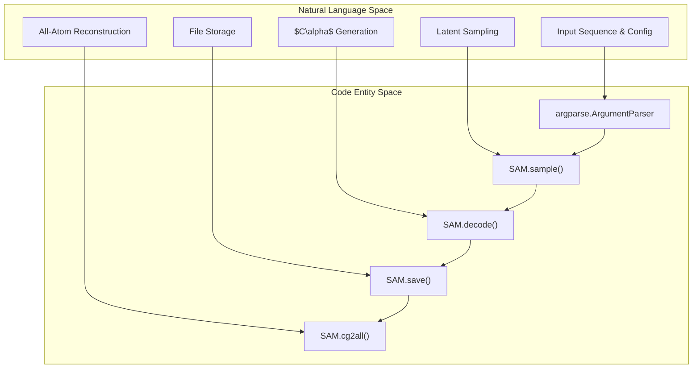
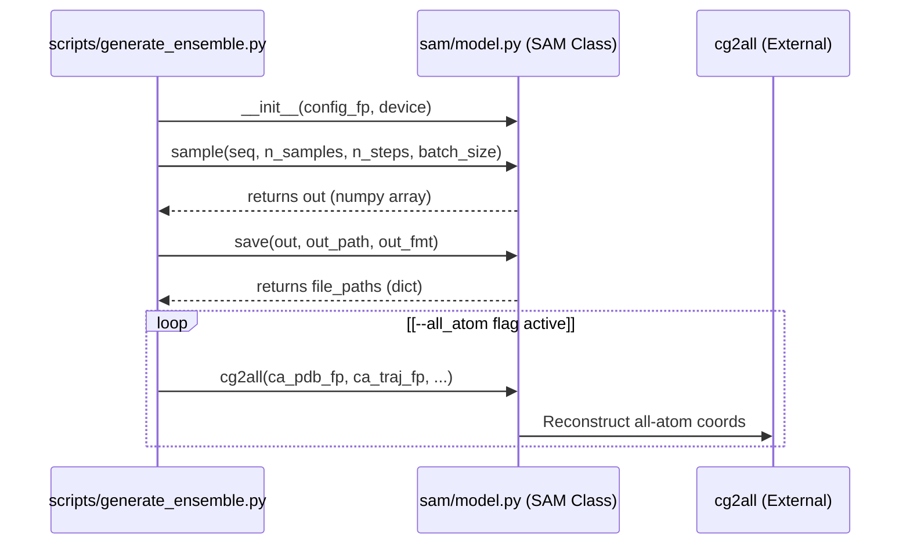

# Inference Quickstart: generate_ensemble.py

> **Relevant source files**
> * [README.md](https://github.com/giacomo-janson/idpsam/blob/ec63c24a/README.md?plain=1)
> * [scripts/generate_ensemble.py](https://github.com/giacomo-janson/idpsam/blob/ec63c24a/scripts/generate_ensemble.py)

The `scripts/generate_ensemble.py` script serves as the primary Command Line Interface (CLI) entrypoint for generating structural ensembles using the idpSAM model. It orchestrates the process of loading pre-trained weights, performing latent diffusion sampling, decoding latent representations into $C\alpha$ coordinates, and optionally reconstructing all-atom details.

## Overview and Execution Flow

The script follows a linear execution path from argument parsing to final file serialization. It acts as a wrapper around the `SAM` class, which handles the underlying neural network operations.

### Data Flow Diagram: Natural Language to Code Entities

This diagram maps the conceptual steps of ensemble generation to the specific code entities in `scripts/generate_ensemble.py` and `sam/model.py`.

**Sources:** `scripts/generate_ensemble.py:16-49`(), `scripts/generate_ensemble.py:89-113`()

---

## CLI Arguments and Validation

The script utilizes `argparse` to handle user inputs. Key parameters control the quality of the ensemble and the computational resources used.

### Core Arguments

| Argument | Flag | Type | Default | Description |
| --- | --- | --- | --- | --- |
| Configuration | `-c`, `--config_fp` | `str` | Required | Path to `config/models.yaml`. |
| Sequence | `-s`, `--seq` | `str` | Required | Amino acid sequence (Standard 1-letter codes). |
| Output Path | `-o`, `--out_path` | `str` | Required | Base filename for output files. |
| Samples | `-n`, `--n_samples` | `int` | 1000 | Total number of conformations to generate. |
| Steps | `-t`, `--n_steps` | `int` | 100 | Diffusion denoising steps (1 to 1000). |
| Batch Size | `-b`, `--batch_size` | `int` | 250 | Batch size for sampling and decoding. |
| All-Atom | `-a`, `--all_atom` | `flag` | False | Enable `cg2all` reconstruction. |

### Validation Logic

The script performs several validation checks before initializing the model:

1. **Sequence Integrity:** Ensures the sequence only contains valid amino acid characters `[QWERTYIPASDFGHKLCVNM]` using a regular expression [scripts/generate_ensemble.py L56-L59](https://github.com/giacomo-janson/idpsam/blob/ec63c24a/scripts/generate_ensemble.py#L56-L59) .
2. **Library Availability:** If `--all_atom` is requested, the script checks if the `cg2all` package is importable [scripts/generate_ensemble.py L61-L66](https://github.com/giacomo-janson/idpsam/blob/ec63c24a/scripts/generate_ensemble.py#L61-L66) .
3. **Batch Divisibility:** For all-atom reconstruction, `n_samples` must be an exact divisor of `cg2all_batch_size` to ensure consistent trajectory handling [scripts/generate_ensemble.py L73-L79](https://github.com/giacomo-janson/idpsam/blob/ec63c24a/scripts/generate_ensemble.py#L73-L79) .

**Sources:** `scripts/generate_ensemble.py:19-49`(), `scripts/generate_ensemble.py:56-81`()

---

## Implementation Detail: The Sampling Loop

The script initializes the `SAM` model class and invokes the `sample` method. This method encapsulates the three-stage pipeline: encoding the sequence, diffusing in the latent space, and decoding to coordinates.

### Logic Flow in generate_ensemble.py

**Sources:** `scripts/generate_ensemble.py:89-113`()

### Output File Formats

The `SAM.save()` method generates multiple files based on the `--out_path` (e.g., if `-o peptide` is used):

* **`peptide_ca.pdb`**: A topology file containing the $C\alpha$ atoms.
* **`peptide_ca.dcd`**: A trajectory file containing the generated $C\alpha$ coordinates for all $N$ samples.
* **`peptide_aa.pdb` / `peptide_aa.dcd`**: (Optional) All-atom topology and trajectory files generated if `-a` is provided.

**Sources:** `scripts/generate_ensemble.py:103-113`(), `README.md:53-57`()

---

## All-Atom Reconstruction (cg2all)

If the `-a` flag is provided, the script invokes `SAM.cg2all()`. This is a post-processing step that takes the generated $C\alpha$ traces and uses the external `cg2all` library to predict the positions of all heavy atoms and hydrogens.

* **Integration:** The script passes the file paths of the generated $C\alpha$ PDB and DCD files to the `cg2all` reconstruction engine [scripts/generate_ensemble.py L108-L113](https://github.com/giacomo-janson/idpsam/blob/ec63c24a/scripts/generate_ensemble.py#L108-L113) .
* **Device Management:** Users can specify a separate device for reconstruction via `--cg2all_device` (e.g., running idpSAM on `cuda` but `cg2all` on `cpu` if DGL/GPU issues persist) [scripts/generate_ensemble.py L43-L46](https://github.com/giacomo-janson/idpsam/blob/ec63c24a/scripts/generate_ensemble.py#L43-L46) .

**Sources:** `scripts/generate_ensemble.py:7-11`(), `scripts/generate_ensemble.py:108-113`(), `README.md:33-37`()