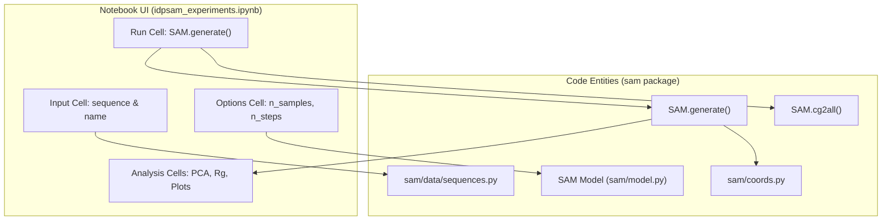
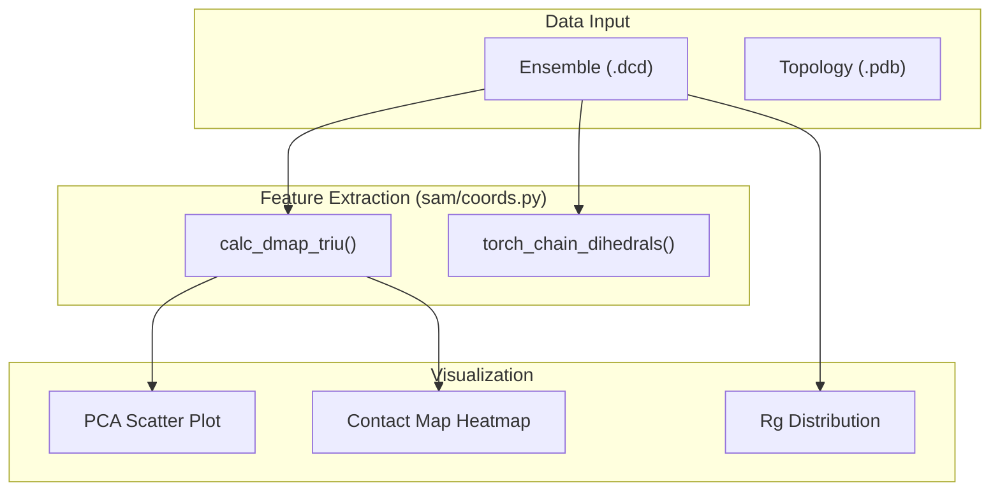

# Jupyter Notebook Experiments

> **Relevant source files**
> * [notebooks/idpsam_experiments.ipynb](https://github.com/giacomo-janson/idpsam/blob/ec63c24a/notebooks/idpsam_experiments.ipynb)

The `idpsam_experiments.ipynb` notebook provides an interactive environment for generating structural ensembles of Intrinsically Disordered Proteins (IDPs) and performing detailed structural analysis. It serves as both a demonstration tool and a research workbench for visualizing IDP properties such as radius of gyration, contact maps, and torsion angle distributions.

## Notebook Workflow and Data Flow

The notebook is structured into a linear pipeline that manages the lifecycle of a SAM model instance, from sequence input to ensemble visualization.

### System Architecture Diagram

The following diagram illustrates how the notebook interface interacts with the core `sam` library components.

**Notebook-to-Code Mapping**

**Sources:** [notebooks/idpsam_experiments.ipynb L137-L175](https://github.com/giacomo-janson/idpsam/blob/ec63c24a/notebooks/idpsam_experiments.ipynb#L137-L175)

 [sam/model.py L10-L30](https://github.com/giacomo-janson/idpsam/blob/ec63c24a/sam/model.py#L10-L30)

---

## Interactive Ensemble Generation

The generation process in the notebook utilizes the `SAM` class to perform latent diffusion sampling. Users can specify the number of conformations and the number of denoising steps.

### Key Configuration Parameters

| Parameter | Code Reference | Description |
| --- | --- | --- |
| `n_samples` | [notebooks/idpsam_experiments.ipynb L171](https://github.com/giacomo-janson/idpsam/blob/ec63c24a/notebooks/idpsam_experiments.ipynb#L171-L171) | Total number of 3D conformations to generate. |
| `n_steps` | [notebooks/idpsam_experiments.ipynb L172](https://github.com/giacomo-janson/idpsam/blob/ec63c24a/notebooks/idpsam_experiments.ipynb#L172-L172) | Number of DDIM/DDPM denoising steps. |
| `reconstruct_all_atom` | [notebooks/idpsam_experiments.ipynb L173](https://github.com/giacomo-janson/idpsam/blob/ec63c24a/notebooks/idpsam_experiments.ipynb#L173-L173) | Whether to use `cg2all` for all-atom reconstruction. |

### Generation Execution

The notebook initializes the `SAM` model using a configuration file (typically `idpsam/config/models.yaml`) and calls the `generate` method.

1. **Initialization**: `model = SAM(config_fp, device=device)` [notebooks/idpsam_experiments.ipynb L189](https://github.com/giacomo-janson/idpsam/blob/ec63c24a/notebooks/idpsam_experiments.ipynb#L189-L189)
2. **Sampling**: `model.generate(sequence, n_samples=n_samples, ...)` [notebooks/idpsam_experiments.ipynb L206](https://github.com/giacomo-janson/idpsam/blob/ec63c24a/notebooks/idpsam_experiments.ipynb#L206-L206)
3. **Output**: The resulting ensemble is saved as a DCD trajectory file and a PDB topology file in the `output/` directory [notebooks/idpsam_experiments.ipynb L167-L168](https://github.com/giacomo-janson/idpsam/blob/ec63c24a/notebooks/idpsam_experiments.ipynb#L167-L168)

**Sources:** [notebooks/idpsam_experiments.ipynb L163-L210](https://github.com/giacomo-janson/idpsam/blob/ec63c24a/notebooks/idpsam_experiments.ipynb#L163-L210)

 [sam/model.py L145-L170](https://github.com/giacomo-janson/idpsam/blob/ec63c24a/sam/model.py#L145-L170)

---

## Structural Analysis and Visualization

Once the ensemble is generated, the notebook provides several cells for statistical analysis of the IDP's conformational space.

### 1. Principal Component Analysis (PCA)

The notebook performs PCA on the inter-residue distance maps to visualize the diversity of the generated ensemble.

* **Implementation**: It uses `calc_dmap_triu` from `sam.coords` to extract the upper triangle of the distance matrix for each frame [sam/coords.py L34-L52](https://github.com/giacomo-janson/idpsam/blob/ec63c24a/sam/coords.py#L34-L52)
* **Data Flow**: `[N_frames, N_res, N_res]` distance maps $\rightarrow$ `[N_frames, N_features]` flattened vectors $\rightarrow$ Scikit-learn PCA.

### 2. Radius of Gyration ($R_g$)

The distribution of $R_g$ is calculated to assess the compactness of the generated structures.

* **Logic**: The notebook uses `mdtraj` to compute $R_g$ from the generated DCD file.
* **Comparison**: It often compares the generated distribution against expected scaling laws for polymers.

### 3. Contact Maps and Torsions

The notebook visualizes the average contact probability and the distribution of alpha-carbon torsion angles.

* **Contact Maps**: Computed by thresholding the distance maps (usually at 8.0 Å) and averaging across the ensemble.
* **Alpha Torsions**: Calculated using `torch_chain_dihedrals` [sam/coords.py L55-L88](https://github.com/giacomo-janson/idpsam/blob/ec63c24a/sam/coords.py#L55-L88)  This provides insight into the local backbone geometry, often visualized via Ramachandran-like plots for IDPs.

### Analysis Logic Diagram

**Sources:** [sam/coords.py L34-L88](https://github.com/giacomo-janson/idpsam/blob/ec63c24a/sam/coords.py#L34-L88)

 [notebooks/idpsam_experiments.ipynb L220-L250](https://github.com/giacomo-janson/idpsam/blob/ec63c24a/notebooks/idpsam_experiments.ipynb#L220-L250)

 (implied by analysis sections).

---

## Data Export

The notebook concludes by packaging the generated data for local download.

* **Files**: Includes the `pept.dcd` trajectory and `pept.pdb` topology [notebooks/idpsam_experiments.ipynb L168](https://github.com/giacomo-janson/idpsam/blob/ec63c24a/notebooks/idpsam_experiments.ipynb#L168-L168)
* **All-Atom**: If `reconstruct_all_atom` was enabled, the `pept_allatom.dcd` file is also provided, containing full atomic coordinates reconstructed from the Cα traces [sam/model.py L213-L240](https://github.com/giacomo-janson/idpsam/blob/ec63c24a/sam/model.py#L213-L240)

**Sources:** [notebooks/idpsam_experiments.ipynb L165-L175](https://github.com/giacomo-janson/idpsam/blob/ec63c24a/notebooks/idpsam_experiments.ipynb#L165-L175)

 [sam/model.py L213-L245](https://github.com/giacomo-janson/idpsam/blob/ec63c24a/sam/model.py#L213-L245)