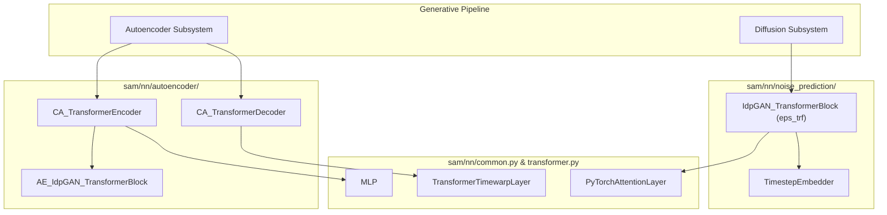
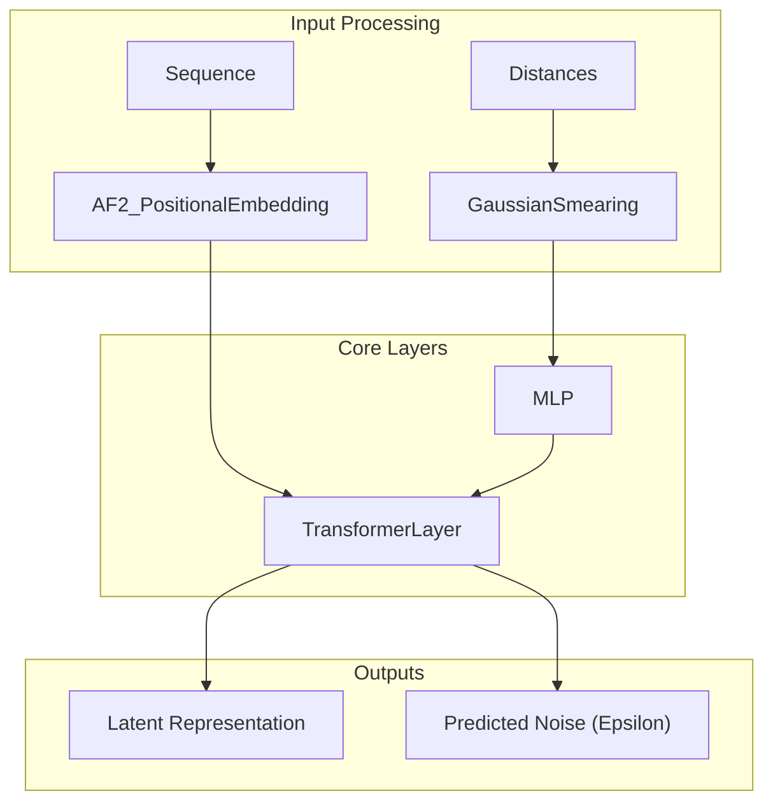

# Neural Network Modules

> **Relevant source files**
> * [sam/nn/__init__.py](https://github.com/giacomo-janson/idpsam/blob/ec63c24a/sam/nn/__init__.py)
> * [sam/nn/common.py](https://github.com/giacomo-janson/idpsam/blob/ec63c24a/sam/nn/common.py)
> * [sam/nn/geometric.py](https://github.com/giacomo-janson/idpsam/blob/ec63c24a/sam/nn/geometric.py)
> * [sam/nn/transformer.py](https://github.com/giacomo-janson/idpsam/blob/ec63c24a/sam/nn/transformer.py)

The `sam/nn/` package contains the neural network architectures that power the idpSAM framework. It is organized into shared geometric and transformer utilities, and three specialized sub-packages that implement the core generative pipeline: the autoencoder, the noise prediction network (diffusion backbone), and common transformer layers.

### Package Structure

The neural network components are divided into the following functional areas:

* **`sam/nn/autoencoder/`**: Implements the `CA_TransformerEncoder` and `CA_TransformerDecoder`. These modules handle the compression of protein structures into a latent space and their subsequent reconstruction.
* **`sam/nn/noise_prediction/`**: Contains the `eps_trf` (Epsilon Transformer), which is the core of the diffusion process, responsible for predicting the noise added to latent representations.
* **`sam/nn/transformer.py`**: Provides the fundamental `TransformerLayer` and specialized variants like `TransformerTimewarpLayer`.
* **`sam/nn/common.py`**: General-purpose building blocks such as `MLP` and `AF2_PositionalEmbedding`.
* **`sam/nn/geometric.py`**: Geometric featurization tools like `GaussianSmearing` and `ExpNormalSmearing`.

### Code Entity Mapping

The following diagram maps the logical components of the idpSAM neural architecture to their specific class implementations in the codebase.

**Architecture to Code Mapping**

Sources: [sam/nn/common.py L41](https://github.com/giacomo-janson/idpsam/blob/ec63c24a/sam/nn/common.py#L41-L41)

 [sam/nn/transformer.py L10](https://github.com/giacomo-janson/idpsam/blob/ec63c24a/sam/nn/transformer.py#L10-L10)

 [sam/nn/transformer.py L129](https://github.com/giacomo-janson/idpsam/blob/ec63c24a/sam/nn/transformer.py#L129-L129)

---

### 3.1 Autoencoder: Encoder and Decoder

The autoencoder is responsible for mapping high-dimensional Cα coordinates and structural features into a compact latent space. The encoder (`CA_TransformerEncoder`) utilizes distance-map RBF featurization and torsion features to capture the local and global geometry of the IDP. The decoder (`CA_TransformerDecoder`) reconstructs the coordinates, employing a specialized `TransformerTimewarpLayer` to maintain structural consistency.

For details, see [Autoencoder: Encoder and Decoder](/giacomo-janson/idpsam/3.1-autoencoder:-encoder-and-decoder).

**Key Classes:**

* `CA_TransformerEncoder`: Processes structural inputs into latents.
* `CA_TransformerDecoder`: Reconstructs 3D coordinates from latents.
* `AE_IdpGAN_TransformerBlock`: The primary computational block for the autoencoder.

Sources: [sam/nn/transformer.py L129](https://github.com/giacomo-janson/idpsam/blob/ec63c24a/sam/nn/transformer.py#L129-L129)

---

### 3.2 Noise Prediction Network (Epsilon Transformer)

The Epsilon Transformer (`eps_trf`) is the backbone of the latent diffusion model. It is implemented using `IdpGAN_TransformerBlock` and is designed to predict the noise component $\epsilon$ at a given diffusion timestep. It supports various conditional injection modes (such as `adanorm` or `concat`) to incorporate the protein sequence and the current diffusion timestep via the `TimestepEmbedder`.

For details, see [Noise Prediction Network (Epsilon Transformer)](/giacomo-janson/idpsam/3.2-noise-prediction-network-(epsilon-transformer)).

**Key Classes:**

* `IdpGAN_TransformerBlock`: The transformer architecture used for noise prediction.
* `TimestepEmbedder`: Projects scalar diffusion timesteps into vector embeddings.

Sources: [sam/nn/common.py L12-L26](https://github.com/giacomo-janson/idpsam/blob/ec63c24a/sam/nn/common.py#L12-L26)

---

### 3.3 Shared Layers and Geometric Utilities

This module contains the foundational math and structural layers used across both the autoencoder and the diffusion network. It includes standard utilities like `MLP` and activation function getters, as well as specialized geometric kernels for converting distances into high-dimensional embeddings.

For details, see [Shared Layers and Geometric Utilities](/giacomo-janson/idpsam/3.3-shared-layers-and-geometric-utilities).

**Key Components:**

* **Geometric Kernels**: `GaussianSmearing` and `ExpNormalSmearing` for Radial Basis Function (RBF) encoding of inter-residue distances [sam/nn/geometric.py L6](https://github.com/giacomo-janson/idpsam/blob/ec63c24a/sam/nn/geometric.py#L6-L6)  [sam/nn/geometric.py L22](https://github.com/giacomo-janson/idpsam/blob/ec63c24a/sam/nn/geometric.py#L22-L22)
* **Positional Embeddings**: `AF2_PositionalEmbedding` which provides relative sequence separation encoding similar to AlphaFold2 [sam/nn/common.py L149](https://github.com/giacomo-janson/idpsam/blob/ec63c24a/sam/nn/common.py#L149-L149)
* **Attention Mechanisms**: `PyTorchAttentionLayer` for standard multi-head attention and `TransformerLayer` for augmented attention with 2D bias terms [sam/nn/transformer.py L10](https://github.com/giacomo-janson/idpsam/blob/ec63c24a/sam/nn/transformer.py#L10-L10)

**Feature Interaction Diagram**

Sources: [sam/nn/geometric.py L15-L19](https://github.com/giacomo-janson/idpsam/blob/ec63c24a/sam/nn/geometric.py#L15-L19)

 [sam/nn/common.py L173-L180](https://github.com/giacomo-janson/idpsam/blob/ec63c24a/sam/nn/common.py#L173-L180)

 [sam/nn/transformer.py L52-L126](https://github.com/giacomo-janson/idpsam/blob/ec63c24a/sam/nn/transformer.py#L52-L126)

---

**Sources:**

* `sam/nn/common.py`: [12-66](https://github.com/giacomo-janson/idpsam/blob/ec63c24a/12-66)  [149-180](https://github.com/giacomo-janson/idpsam/blob/ec63c24a/149-180)
* `sam/nn/geometric.py`: [6-20](https://github.com/giacomo-janson/idpsam/blob/ec63c24a/6-20)  [22-64](https://github.com/giacomo-janson/idpsam/blob/ec63c24a/22-64)  [67-95](https://github.com/giacomo-janson/idpsam/blob/ec63c24a/67-95)
* `sam/nn/transformer.py`: [10-127](https://github.com/giacomo-janson/idpsam/blob/ec63c24a/10-127)  [129-182](https://github.com/giacomo-janson/idpsam/blob/ec63c24a/129-182)