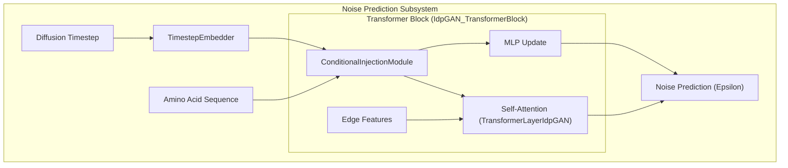
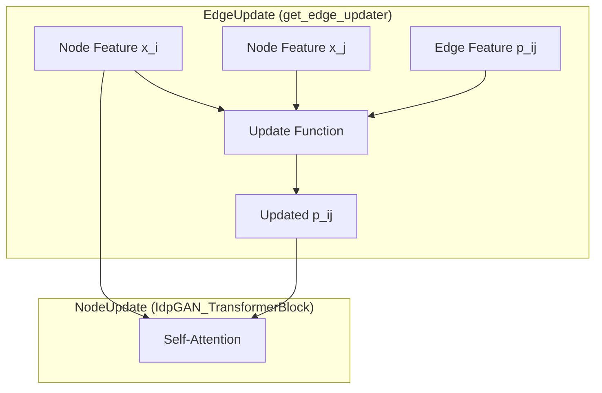

# Noise Prediction Network (Epsilon Transformer)

> **Relevant source files**
> * [sam/nn/noise_prediction/__init__.py](https://github.com/giacomo-janson/idpsam/blob/ec63c24a/sam/nn/noise_prediction/__init__.py)
> * [sam/nn/noise_prediction/embedding.py](https://github.com/giacomo-janson/idpsam/blob/ec63c24a/sam/nn/noise_prediction/embedding.py)
> * [sam/nn/noise_prediction/eps.py](https://github.com/giacomo-janson/idpsam/blob/ec63c24a/sam/nn/noise_prediction/eps.py)

The Noise Prediction Network, primarily implemented via the `eps_trf` transformer, is the core generative engine of idpSAM. It is responsible for predicting the noise $\epsilon$ added to the latent representations during the diffusion process. The network operates on latent embeddings of protein structures, conditioned on amino acid sequences and diffusion timesteps, to iteratively denoise the latent space into a valid structural ensemble.

## Architecture Overview

The primary component is the `IdpGAN_TransformerBlock` [sam/nn/noise_prediction/eps.py L21-L46](https://github.com/giacomo-janson/idpsam/blob/ec63c24a/sam/nn/noise_prediction/eps.py#L21-L46)

 which follows a modified transformer architecture designed for geometric data. It integrates three main information streams:

1. **Node Representations (`x`)**: The latent embeddings of the coarse-grained beads.
2. **Edge Representations (`p`)**: Pairwise geometric or positional information.
3. **Conditional Information**: Timestep embeddings (`t`) and amino acid sequence embeddings (`a`).

### Code-to-System Mapping: Noise Prediction

The following diagram maps the high-level noise prediction components to their specific class implementations within `sam/nn/noise_prediction/`.

**Sources:** [sam/nn/noise_prediction/eps.py L21-L46](https://github.com/giacomo-janson/idpsam/blob/ec63c24a/sam/nn/noise_prediction/eps.py#L21-L46)

 [sam/nn/noise_prediction/embedding.py L14-L19](https://github.com/giacomo-janson/idpsam/blob/ec63c24a/sam/nn/noise_prediction/embedding.py#L14-L19)

 [sam/nn/noise_prediction/embedding.py L62-L71](https://github.com/giacomo-janson/idpsam/blob/ec63c24a/sam/nn/noise_prediction/embedding.py#L62-L71)

---

## Timestep and Sequence Embedding

Diffusion models require the network to be aware of the current noise level. This is achieved through the `TimestepEmbedder`.

### TimestepEmbedder

The `TimestepEmbedder` [sam/nn/noise_prediction/embedding.py L14-L52](https://github.com/giacomo-janson/idpsam/blob/ec63c24a/sam/nn/noise_prediction/embedding.py#L14-L52)

 converts a scalar timestep $t$ into a high-dimensional vector:

1. **Sinusoidal Embedding**: Uses `timestep_embedding` [sam/nn/noise_prediction/embedding.py L29-L47](https://github.com/giacomo-janson/idpsam/blob/ec63c24a/sam/nn/noise_prediction/embedding.py#L29-L47)  to generate fixed frequency embeddings (sine/cosine pairs).
2. **MLP Projection**: A two-layer MLP with `SiLU` activation projects these frequencies into the `hidden_size` used by the transformer blocks [sam/nn/noise_prediction/embedding.py L21-L25](https://github.com/giacomo-janson/idpsam/blob/ec63c24a/sam/nn/noise_prediction/embedding.py#L21-L25)

### Conditional Injection Module

The `ConditionalInjectionModule` [sam/nn/noise_prediction/embedding.py L62-L111](https://github.com/giacomo-janson/idpsam/blob/ec63c24a/sam/nn/noise_prediction/embedding.py#L62-L111)

 manages how timestep and amino acid information are merged and injected into the transformer layers. It supports multiple modes:

* **`adanorm` (Adaptive Layer Norm)**: The preferred mode in idpSAM. It projects the combined condition into 6 modulation parameters (shift, scale, and gate for both attention and MLP blocks) [sam/nn/noise_prediction/embedding.py L141-L151](https://github.com/giacomo-janson/idpsam/blob/ec63c24a/sam/nn/noise_prediction/embedding.py#L141-L151)
* **`concat`**: Concatenates embeddings along the feature dimension (used in the original idpGAN) [sam/nn/noise_prediction/eps.py L79-L84](https://github.com/giacomo-janson/idpsam/blob/ec63c24a/sam/nn/noise_prediction/eps.py#L79-L84)
* **`add`**: Directly adds projected embeddings to the node features [sam/nn/noise_prediction/embedding.py L163-L167](https://github.com/giacomo-janson/idpsam/blob/ec63c24a/sam/nn/noise_prediction/embedding.py#L163-L167)

**Sources:** [sam/nn/noise_prediction/embedding.py L14-L111](https://github.com/giacomo-janson/idpsam/blob/ec63c24a/sam/nn/noise_prediction/embedding.py#L14-L111)

 [sam/nn/noise_prediction/eps.py L94-L102](https://github.com/giacomo-janson/idpsam/blob/ec63c24a/sam/nn/noise_prediction/eps.py#L94-L102)

---

## Transformer Block Logic

The `IdpGAN_TransformerBlock` implements the forward pass by interleaving attention mechanisms with conditional modulation.

### Data Flow in forward()

The data flow within a single block [sam/nn/noise_prediction/eps.py L164-L189](https://github.com/giacomo-janson/idpsam/blob/ec63c24a/sam/nn/noise_prediction/eps.py#L164-L189)

 follows these steps:

1. **Condition Preparation**: `cond_injection_module` generates modulation parameters `inj_out` from sequence `a` and time `t` [sam/nn/noise_prediction/eps.py L168](https://github.com/giacomo-janson/idpsam/blob/ec63c24a/sam/nn/noise_prediction/eps.py#L168-L168)
2. **Attention Path**: * If `norm_pos="pre"`, the input `x` is normalized [sam/nn/noise_prediction/eps.py L171](https://github.com/giacomo-janson/idpsam/blob/ec63c24a/sam/nn/noise_prediction/eps.py#L171-L171) * `inject_1_pre` applies `adanorm` scaling/shifting [sam/nn/noise_prediction/eps.py L172](https://github.com/giacomo-janson/idpsam/blob/ec63c24a/sam/nn/noise_prediction/eps.py#L172-L172) * `self_attn` (typically `TransformerLayerIdpGAN`) processes node features `x` using edge bias `p` [sam/nn/noise_prediction/eps.py L173](https://github.com/giacomo-janson/idpsam/blob/ec63c24a/sam/nn/noise_prediction/eps.py#L173-L173) * `inject_1_post` applies gating (if `adanorm`) [sam/nn/noise_prediction/eps.py L175](https://github.com/giacomo-janson/idpsam/blob/ec63c24a/sam/nn/noise_prediction/eps.py#L175-L175)
3. **MLP Path**: * Similar pre-modulation is applied [sam/nn/noise_prediction/eps.py L184](https://github.com/giacomo-janson/idpsam/blob/ec63c24a/sam/nn/noise_prediction/eps.py#L184-L184) * A standard two-layer MLP updates the features [sam/nn/noise_prediction/eps.py L185](https://github.com/giacomo-janson/idpsam/blob/ec63c24a/sam/nn/noise_prediction/eps.py#L185-L185) * Post-modulation gating and residual connection are applied [sam/nn/noise_prediction/eps.py L186-L187](https://github.com/giacomo-janson/idpsam/blob/ec63c24a/sam/nn/noise_prediction/eps.py#L186-L187)

### Implementation Details

| Component | Implementation | Source |
| --- | --- | --- |
| **Attention** | `TransformerLayerIdpGAN` or `PyTorchAttentionLayer` | [sam/nn/noise_prediction/eps.py L59-L76](https://github.com/giacomo-janson/idpsam/blob/ec63c24a/sam/nn/noise_prediction/eps.py#L59-L76) |
| **Normalization** | `nn.LayerNorm` (affine disabled if using `adanorm`) | [sam/nn/noise_prediction/eps.py L56-L57](https://github.com/giacomo-janson/idpsam/blob/ec63c24a/sam/nn/noise_prediction/eps.py#L56-L57) |
| **Modulation** | `modulate(x, shift, scale)` function | [sam/nn/noise_prediction/embedding.py L59-L60](https://github.com/giacomo-janson/idpsam/blob/ec63c24a/sam/nn/noise_prediction/embedding.py#L59-L60) |
| **Edge Updating** | Optional `edge_updater` module | [sam/nn/noise_prediction/eps.py L105-L115](https://github.com/giacomo-janson/idpsam/blob/ec63c24a/sam/nn/noise_prediction/eps.py#L105-L115) |

**Sources:** [sam/nn/noise_prediction/eps.py L164-L189](https://github.com/giacomo-janson/idpsam/blob/ec63c24a/sam/nn/noise_prediction/eps.py#L164-L189)

 [sam/nn/noise_prediction/embedding.py L59-L60](https://github.com/giacomo-janson/idpsam/blob/ec63c24a/sam/nn/noise_prediction/embedding.py#L59-L60)

---

## Edge Representation Updates

The network can optionally update the edge representations (`p`) between transformer blocks. This is handled by `get_edge_updater` [sam/nn/noise_prediction/eps.py L105-L111](https://github.com/giacomo-janson/idpsam/blob/ec63c24a/sam/nn/noise_prediction/eps.py#L105-L111)

### Edge Update Mechanism

The following diagram illustrates how node and edge features interact within the block.

If `edge_update_mode` is enabled, the `edge_updater` modifies the geometric representation passed to the next layer, allowing the model to refine its understanding of inter-residue relationships as the denoising progresses.

**Sources:** [sam/nn/noise_prediction/eps.py L105-L115](https://github.com/giacomo-janson/idpsam/blob/ec63c24a/sam/nn/noise_prediction/eps.py#L105-L115)

 [sam/nn/noise_prediction/eps.py L173](https://github.com/giacomo-janson/idpsam/blob/ec63c24a/sam/nn/noise_prediction/eps.py#L173-L173)