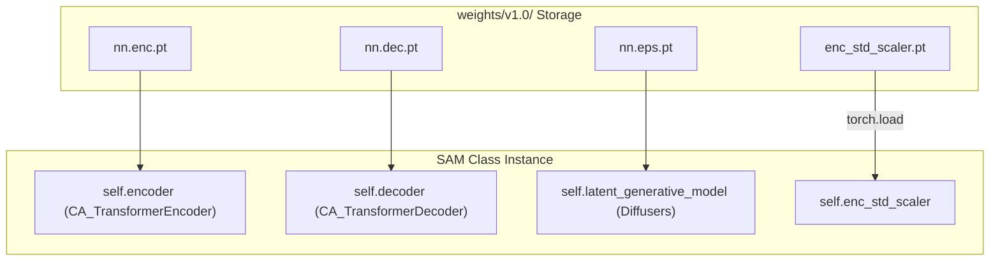

# Pre-trained Weights

> **Relevant source files**
> * [config/models.yaml](https://github.com/giacomo-janson/idpsam/blob/ec63c24a/config/models.yaml)
> * [weights/v1.0/enc_std_scaler.pt](https://github.com/giacomo-janson/idpsam/blob/ec63c24a/weights/v1.0/enc_std_scaler.pt)
> * [weights/v1.0/nn.dec.pt](https://github.com/giacomo-janson/idpsam/blob/ec63c24a/weights/v1.0/nn.dec.pt)
> * [weights/v1.0/nn.enc.pt](https://github.com/giacomo-janson/idpsam/blob/ec63c24a/weights/v1.0/nn.enc.pt)
> * [weights/v1.0/nn.eps.pt](https://github.com/giacomo-janson/idpsam/blob/ec63c24a/weights/v1.0/nn.eps.pt)

This page documents the pre-trained neural network weights and normalization parameters for the idpSAM model version 1.0. These files are essential for performing inference using the `SAM` class and are referenced throughout the system configuration.

## Weight File Overview

The pre-trained weights are located in `weights/v1.0/` and consist of four primary files. These files contain the state dictionaries for the encoder, decoder, and epsilon (noise prediction) networks, along with a scaler for latent space normalization.

| File | Component | Role |
| --- | --- | --- |
| `nn.enc.pt` | `CA_TransformerEncoder` | Maps physical coordinates (distance maps/torsions) to latent space. |
| `nn.dec.pt` | `CA_TransformerDecoder` | Maps latent vectors back to 3D Cartesian coordinates. |
| `nn.eps.pt` | `IdpGAN_TransformerBlock` | Predicts noise ($\epsilon$) in the latent diffusion process. |
| `enc_std_scaler.pt` | `StandardScaler` | Normalizes the encoder output before diffusion. |

**Sources:** [config/models.yaml L36-L37](https://github.com/giacomo-janson/idpsam/blob/ec63c24a/config/models.yaml#L36-L37)

 [config/models.yaml L58](https://github.com/giacomo-janson/idpsam/blob/ec63c24a/config/models.yaml#L58-L58)

 [config/models.yaml L106](https://github.com/giacomo-janson/idpsam/blob/ec63c24a/config/models.yaml#L106-L106)

## Loading Mechanism

The `SAM` model orchestrates the loading of these weights during initialization. The paths are resolved via `config/models.yaml`, and the `SAM` class handles the transfer of parameters to the appropriate device (CPU or GPU).

### Data Flow: Weight Initialization

The following diagram illustrates how the `SAM` class consumes the weight files to initialize its internal modules.

**Diagram: SAM Weight Loading and Module Mapping**

**Sources:** [config/models.yaml L36-L106](https://github.com/giacomo-janson/idpsam/blob/ec63c24a/config/models.yaml#L36-L106)

 [weights/v1.0/nn.enc.pt L1-L10](https://github.com/giacomo-janson/idpsam/blob/ec63c24a/weights/v1.0/nn.enc.pt#L1-L10)

 [weights/v1.0/nn.dec.pt L1-L10](https://github.com/giacomo-janson/idpsam/blob/ec63c24a/weights/v1.0/nn.dec.pt#L1-L10)

 [weights/v1.0/nn.eps.pt L1-L10](https://github.com/giacomo-janson/idpsam/blob/ec63c24a/weights/v1.0/nn.eps.pt#L1-L10)

## Detailed File Contents

### 1. Encoder Weights (nn.enc.pt)

Contains parameters for the `enc_ca_trf` architecture. Key layers include:

* **RBF Expansion:** `dmap_ca_expansion.offset` used for distance map featurization [weights/v1.0/nn.enc.pt L3-L7](https://github.com/giacomo-janson/idpsam/blob/ec63c24a/weights/v1.0/nn.enc.pt#L3-L7)
* **Projections:** `project_dmap` and `project_input` (for torsion angles) [weights/v1.0/nn.enc.pt L8-L15](https://github.com/giacomo-janson/idpsam/blob/ec63c24a/weights/v1.0/nn.enc.pt#L8-L15)
* **Transformer Blocks:** 5 layers of self-attention and MLPs [weights/v1.0/nn.enc.pt L18-L28](https://github.com/giacomo-janson/idpsam/blob/ec63c24a/weights/v1.0/nn.enc.pt#L18-L28)
* **Conditioning:** `cond_injection_module` for injecting sequence information [weights/v1.0/nn.enc.pt L30-L33](https://github.com/giacomo-janson/idpsam/blob/ec63c24a/weights/v1.0/nn.enc.pt#L30-L33)

### 2. Decoder Weights (nn.dec.pt)

Contains parameters for the `dec_ca_trf` architecture.

* **Architecture:** 5 layers using `timewarp` attention [config/models.yaml L43-L44](https://github.com/giacomo-janson/idpsam/blob/ec63c24a/config/models.yaml#L43-L44)
* **Layers:** Includes `project_input` and `layers.n.self_attn.elle` for relative position encoding [weights/v1.0/nn.dec.pt L3-L8](https://github.com/giacomo-janson/idpsam/blob/ec63c24a/weights/v1.0/nn.dec.pt#L3-L8)

### 3. Epsilon Network Weights (nn.eps.pt)

Contains the weights for the noise prediction network used within the `diffusers_dm` generative model.

* **Time Embedding:** `time_embed.mlp` for processing diffusion timesteps [weights/v1.0/nn.eps.pt L9-L10](https://github.com/giacomo-janson/idpsam/blob/ec63c24a/weights/v1.0/nn.eps.pt#L9-L10)
* **Transformer Backbone:** 16 layers of `IdpGAN_TransformerBlock` [config/models.yaml L74](https://github.com/giacomo-janson/idpsam/blob/ec63c24a/config/models.yaml#L74-L74)
* **EMA:** These weights typically represent the Exponential Moving Average (EMA) version of the model for improved stability during inference [config/models.yaml L101](https://github.com/giacomo-janson/idpsam/blob/ec63c24a/config/models.yaml#L101-L101)

### 4. Encoder Scaler (enc_std_scaler.pt)

This file is a serialized `OrderedDict` containing two tensors: `0` (mean) and `1` (standard deviation).

* **Purpose:** It ensures the latent representations produced by the encoder have zero mean and unit variance before being processed by the diffusion scheduler [config/models.yaml L8](https://github.com/giacomo-janson/idpsam/blob/ec63c24a/config/models.yaml#L8-L8)
* **Shape:** Tensors of size `(16,)` corresponding to the `encoding_dim` [weights/v1.0/enc_std_scaler.pt L5-L9](https://github.com/giacomo-janson/idpsam/blob/ec63c24a/weights/v1.0/enc_std_scaler.pt#L5-L9)

## Integration with Configuration

The `config/models.yaml` file acts as the source of truth for locating these weights. If the weights are moved, the `weights` and `std_scaler_fp` keys must be updated accordingly.

**Configuration Mapping**

| YAML Key | Target File | Architecture Key |
| --- | --- | --- |
| `encoder.weights` | `nn.enc.pt` | `enc_ca_trf` |
| `encoder.std_scaler_fp` | `enc_std_scaler.pt` | N/A |
| `decoder.weights` | `nn.dec.pt` | `dec_ca_trf` |
| `latent_network.weights` | `nn.eps.pt` | `eps_trf` |

**Sources:** [config/models.yaml L36-L37](https://github.com/giacomo-janson/idpsam/blob/ec63c24a/config/models.yaml#L36-L37)

 [config/models.yaml L58](https://github.com/giacomo-janson/idpsam/blob/ec63c24a/config/models.yaml#L58-L58)

 [config/models.yaml L106](https://github.com/giacomo-janson/idpsam/blob/ec63c24a/config/models.yaml#L106-L106)

## Versioning Conventions

* **v1.0:** The initial release corresponding to the publication "Transferable deep generative modeling of intrinsically disordered protein conformations".
* **File Extension:** All weights are stored in PyTorch serialized format (`.pt`).
* **Device Compatibility:** While the weight files themselves contain metadata indicating the device they were saved on (e.g., `cuda:0`), the `SAM` class automatically maps these to the user-specified `device` (CPU or GPU) during `torch.load` using `map_location`.

**Sources:** [weights/v1.0/nn.enc.pt L7](https://github.com/giacomo-janson/idpsam/blob/ec63c24a/weights/v1.0/nn.enc.pt#L7-L7)

 [weights/v1.0/nn.eps.pt L7](https://github.com/giacomo-janson/idpsam/blob/ec63c24a/weights/v1.0/nn.eps.pt#L7-L7)