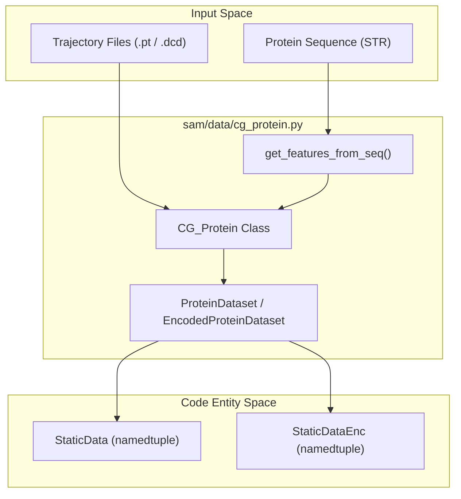
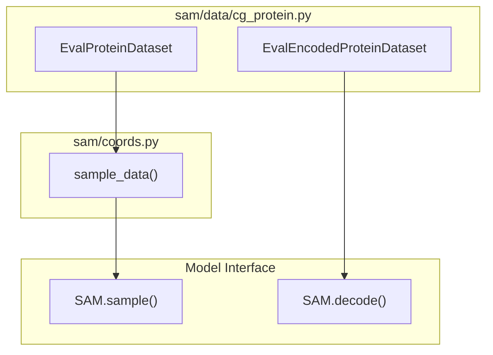

# Protein Dataset Classes

> **Relevant source files**
> * [sam/data/cg_protein.py](https://github.com/giacomo-janson/idpsam/blob/ec63c24a/sam/data/cg_protein.py)

This page provides a technical reference for the data layer of idpSAM, specifically focusing on the representation of coarse-grained protein structures and the dataset classes used for training and evaluation. These classes bridge the gap between raw molecular trajectories (e.g., DCD, PDB) and the tensor formats required by the latent diffusion models.

## Core Data Containers

The system utilizes specialized containers to handle both physical coordinates (XYZ) and their latent representations (Encodings).

### CG_Protein

The `CG_Protein` class is the primary container for individual protein metadata and structural data. It stores the amino acid sequence, one-hot encoded residue features, and the actual coordinates or latent encodings.

* **Residue Features**: It automatically converts the amino acid sequence into a feature tensor `a` using `get_features_from_seq`, which performs one-hot encoding across 20 standard amino acids [sam/data/cg_protein.py L94-L102](https://github.com/giacomo-janson/idpsam/blob/ec63c24a/sam/data/cg_protein.py#L94-L102)
* **Coordinate Storage**: Coordinates are stored in the `xyz` attribute, while residue positional IDs are stored in `r` [sam/data/cg_protein.py L112-L113](https://github.com/giacomo-janson/idpsam/blob/ec63c24a/sam/data/cg_protein.py#L112-L113)
* **Latent Storage**: If the protein has been processed by an encoder, the resulting latent vectors are stored in the `enc` attribute via `set_encoding()` [sam/data/cg_protein.py L123-L124](https://github.com/giacomo-janson/idpsam/blob/ec63c24a/sam/data/cg_protein.py#L123-L124)

### StaticData and StaticDataEnc

To facilitate batching and device management (similar to `torch_geometric`), the codebase defines `StaticData` and `StaticDataEnc` using `namedtuple` and a custom `StaticDataMixin`.

| Class | Key Fields | Purpose |
| --- | --- | --- |
| `StaticData` | `x`, `a`, `ae`, `r`, `x_t` | Contains physical coordinates (`x`) and sequence features. Used for training the Autoencoder. |
| `StaticDataEnc` | `z`, `a`, `ae`, `r`, `z_t` | Contains latent encodings (`z`) and sequence features. Used for training the Epsilon Transformer. |

These classes implement a `.to(device)` method to recursively move all internal tensors to the target hardware [sam/data/cg_protein.py L47-L49](https://github.com/giacomo-janson/idpsam/blob/ec63c24a/sam/data/cg_protein.py#L47-L49)

### Data Flow: From Sequence to Batch

The following diagram illustrates how raw protein data is transformed into the `StaticData` structures used by the models.

**Protein Data Transformation Diagram**

**Sources:** [sam/data/cg_protein.py L32-L88](https://github.com/giacomo-janson/idpsam/blob/ec63c24a/sam/data/cg_protein.py#L32-L88)

 [sam/data/cg_protein.py L94-L135](https://github.com/giacomo-janson/idpsam/blob/ec63c24a/sam/data/cg_protein.py#L94-L135)

---

## Dataset Implementations

The dataset classes handle the loading of protein trajectories and the sampling of frames during training.

### ProteinDataset

`ProteinDataset` is the base class for handling physical coordinates. It supports various sampling and augmentation modes.

* **Frames Sampling (`frames_mode`)**: * `all`: Returns all available frames in the trajectory. * `random`: Samples a single random frame per protein per epoch. * `fixed`: Samples a fixed number of frames defined by `n_frames`.
* **Perturbation (`xyz_perturb`)**: If enabled, it adds Gaussian noise to the coordinates during data retrieval to improve model robustness [sam/data/cg_protein.py L388-L393](https://github.com/giacomo-janson/idpsam/blob/ec63c24a/sam/data/cg_protein.py#L388-L393)
* **TBM Mode (`tbm_mode`)**: Template-Based Modeling mode. When active, it retrieves a "template" frame (`x_t`) alongside the target frame, which is used for conditional generation tasks [sam/data/cg_protein.py L375-L385](https://github.com/giacomo-janson/idpsam/blob/ec63c24a/sam/data/cg_protein.py#L375-L385)

### EncodedProteinDataset

`EncodedProteinDataset` inherits from `ProteinDataset` but operates on latent encodings (`z`) instead of coordinates (`x`). This is the primary dataset used for training the diffusion (Epsilon) network [sam/data/cg_protein.py L423-L431](https://github.com/giacomo-janson/idpsam/blob/ec63c24a/sam/data/cg_protein.py#L423-L431)

**Sources:** [sam/data/cg_protein.py L270-L320](https://github.com/giacomo-janson/idpsam/blob/ec63c24a/sam/data/cg_protein.py#L270-L320)

 [sam/data/cg_protein.py L365-L410](https://github.com/giacomo-janson/idpsam/blob/ec63c24a/sam/data/cg_protein.py#L365-L410)

---

## Evaluation Datasets

For validation and testing, the system provides `EvalProteinDataset` and `EvalEncodedProteinDataset`. These are designed to handle multiple proteins with potentially different lengths, ensuring consistent evaluation across the ensemble.

### Key Evaluation Features

* **Sequence Filtering**: Supports `min_res` and `max_res` to filter proteins based on length during evaluation [sam/data/cg_protein.py L488-L490](https://github.com/giacomo-janson/idpsam/blob/ec63c24a/sam/data/cg_protein.py#L488-L490)
* **Batch Retrieval**: The `get()` method constructs a `StaticData` object for a specific protein index, optionally sampling a subset of frames [sam/data/cg_protein.py L545-L560](https://github.com/giacomo-janson/idpsam/blob/ec63c24a/sam/data/cg_protein.py#L545-L560)

**Evaluation Data Flow Diagram**

**Sources:** [sam/data/cg_protein.py L482-L520](https://github.com/giacomo-janson/idpsam/blob/ec63c24a/sam/data/cg_protein.py#L482-L520)

 [sam/data/cg_protein.py L545-L580](https://github.com/giacomo-janson/idpsam/blob/ec63c24a/sam/data/cg_protein.py#L545-L580)

---

## Data Augmentation and Sampling Utilities

### xyz_perturb

Implementation of coordinate augmentation. It applies noise scaled by a standard deviation (default `0.01`) to the `x` coordinates of the `StaticData` object before it is passed to the encoder [sam/data/cg_protein.py L388-L393](https://github.com/giacomo-janson/idpsam/blob/ec63c24a/sam/data/cg_protein.py#L388-L393)

### sample_data

A utility function imported from `sam.coords` used by the dataset `get()` methods to slice large trajectories into manageable batches for the GPU [sam/data/cg_protein.py L15](https://github.com/giacomo-janson/idpsam/blob/ec63c24a/sam/data/cg_protein.py#L15-L15)

 [sam/data/cg_protein.py L557](https://github.com/giacomo-janson/idpsam/blob/ec63c24a/sam/data/cg_protein.py#L557-L557)

### Sequence Feature Extraction

The `get_features_from_seq` function maps amino acid strings to a $20 \times N$ matrix. It uses the `aa_list` from `sam.data.sequences` to maintain a consistent mapping index [sam/data/cg_protein.py L127-L135](https://github.com/giacomo-janson/idpsam/blob/ec63c24a/sam/data/cg_protein.py#L127-L135)

**Sources:** [sam/data/cg_protein.py L15-L16](https://github.com/giacomo-janson/idpsam/blob/ec63c24a/sam/data/cg_protein.py#L15-L16)

 [sam/data/cg_protein.py L127-L135](https://github.com/giacomo-janson/idpsam/blob/ec63c24a/sam/data/cg_protein.py#L127-L135)

 [sam/data/cg_protein.py L388-L393](https://github.com/giacomo-janson/idpsam/blob/ec63c24a/sam/data/cg_protein.py#L388-L393)