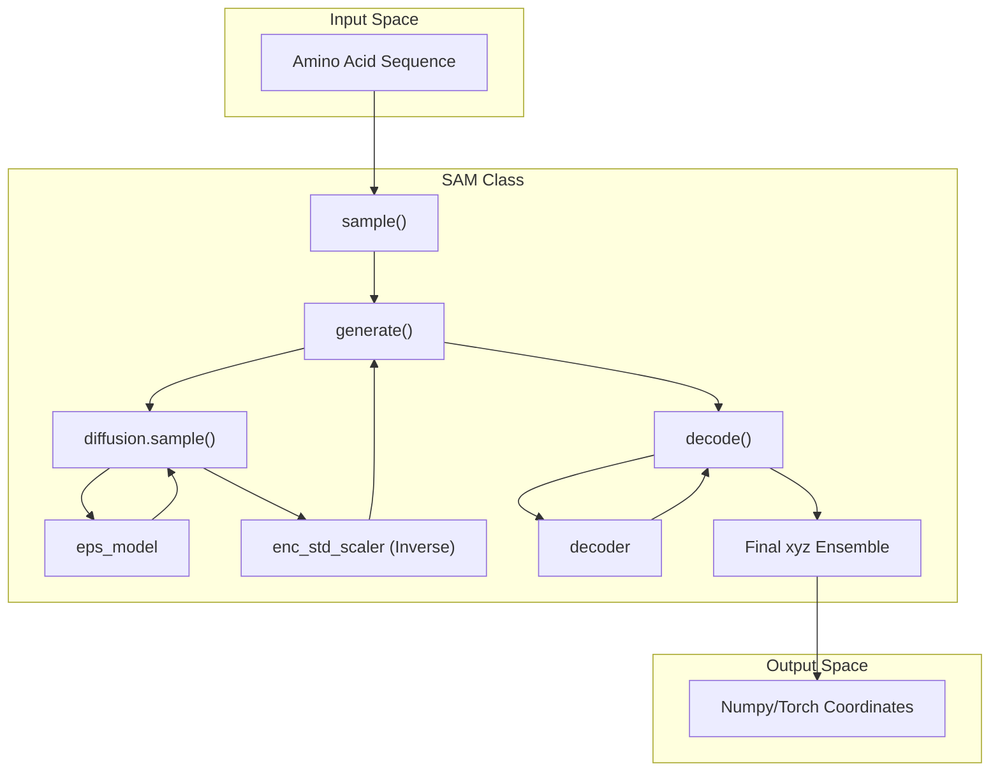
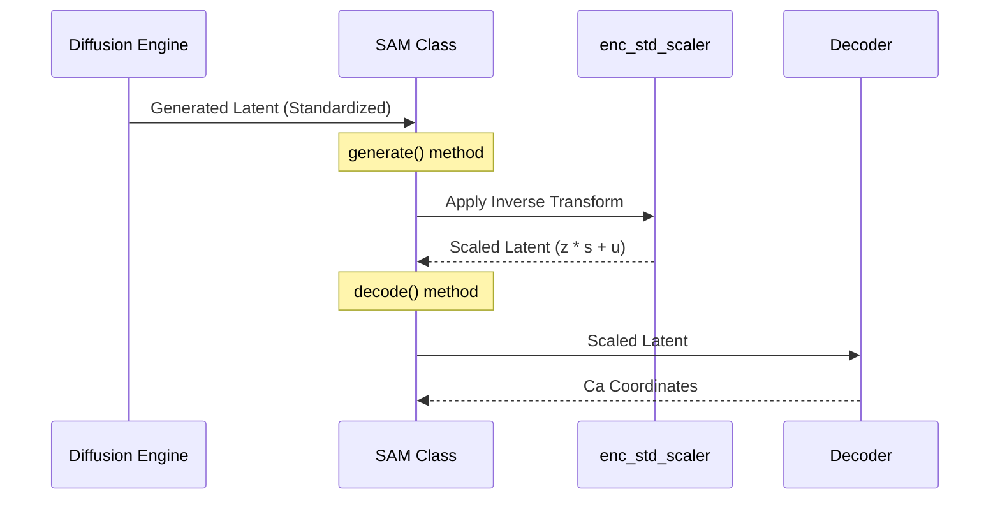

# SAM Model Class

> **Relevant source files**
> * [sam/__init__.py](https://github.com/giacomo-janson/idpsam/blob/ec63c24a/sam/__init__.py)
> * [sam/model.py](https://github.com/giacomo-janson/idpsam/blob/ec63c24a/sam/model.py)

The `SAM` class, defined in `sam/model.py`, serves as the primary high-level API for interacting with the idpSAM generative model [sam/model.py L41-L44](https://github.com/giacomo-janson/idpsam/blob/ec63c24a/sam/model.py#L41-L44)

 It orchestrates the loading of pre-trained weights, device management, and the execution of the latent diffusion and decoding pipelines.

## System Orchestration

The `SAM` class integrates three distinct components to generate protein ensembles:

1. **Epsilon Network (`eps_model`)**: A transformer-based network that predicts noise in the latent space during the diffusion process [sam/model.py L90-L92](https://github.com/giacomo-janson/idpsam/blob/ec63c24a/sam/model.py#L90-L92)
2. **Diffusion Engine (`diffusion`)**: Manages the iterative denoising process (DDPM/DDIM) [sam/model.py L109-L111](https://github.com/giacomo-janson/idpsam/blob/ec63c24a/sam/model.py#L109-L111)
3. **Decoder (`decoder`)**: A transformer-based module that maps latent encodings back to 3D Cartesian coordinates ($C\alpha$ traces) [sam/model.py L120-L122](https://github.com/giacomo-janson/idpsam/blob/ec63c24a/sam/model.py#L120-L122)

### Data Flow: Latent Space to Coordinates

The following diagram illustrates how the `SAM` class methods coordinate the flow of data from a sequence input to a generated ensemble.

**SAM Generation Workflow**

Sources: [sam/model.py L134-L190](https://github.com/giacomo-janson/idpsam/blob/ec63c24a/sam/model.py#L134-L190)

 [sam/model.py L201-L262](https://github.com/giacomo-janson/idpsam/blob/ec63c24a/sam/model.py#L201-L262)

 [sam/model.py L264-L323](https://github.com/giacomo-janson/idpsam/blob/ec63c24a/sam/model.py#L264-L323)

---

## Initialization and Weight Loading

The constructor handles the resolution of configuration files (JSON or YAML) and the initialization of model weights on the specified device [sam/model.py L46-L50](https://github.com/giacomo-janson/idpsam/blob/ec63c24a/sam/model.py#L46-L50)

### Device Management

The class supports `cpu` and `cuda` devices. During initialization, it sets `map_location` arguments to ensure weights are loaded correctly regardless of where they were originally saved [sam/model.py L65-L76](https://github.com/giacomo-janson/idpsam/blob/ec63c24a/sam/model.py#L65-L76)

### Weight Loading and Scaling

Weights are typically stored in a parent directory. The `_get_weights_path` helper resolves relative paths defined in the configuration file against the `weights_parent_path` [sam/model.py L125-L131](https://github.com/giacomo-janson/idpsam/blob/ec63c24a/sam/model.py#L125-L131)

A critical step in the initialization is the **Normalization Scaler** (`enc_std_scaler`). If enabled in the configuration (`use_enc_std_scaler`), the model loads mean (`u`) and standard deviation (`s`) tensors to normalize the latent space [sam/model.py L96-L106](https://github.com/giacomo-janson/idpsam/blob/ec63c24a/sam/model.py#L96-L106)

| Component | Code Entity | Source File |
| --- | --- | --- |
| Epsilon Network | `self.eps_model` | [sam/model.py L90](https://github.com/giacomo-janson/idpsam/blob/ec63c24a/sam/model.py#L90-L90) |
| Diffusion Process | `self.diffusion` | [sam/model.py L109](https://github.com/giacomo-janson/idpsam/blob/ec63c24a/sam/model.py#L109-L109) |
| Scaler | `self.enc_std_scaler` | [sam/model.py L106](https://github.com/giacomo-janson/idpsam/blob/ec63c24a/sam/model.py#L106-L106) |
| Decoder | `self.decoder` | [sam/model.py L120](https://github.com/giacomo-janson/idpsam/blob/ec63c24a/sam/model.py#L120-L120) |

Sources: [sam/model.py L46-L123](https://github.com/giacomo-janson/idpsam/blob/ec63c24a/sam/model.py#L46-L123)

 [sam/model.py L125-L131](https://github.com/giacomo-janson/idpsam/blob/ec63c24a/sam/model.py#L125-L131)

---

## Key Methods

### sample()

The primary entry point for users. It wraps both `generate()` and `decode()` to provide a seamless transition from sequence to coordinates [sam/model.py L134-L142](https://github.com/giacomo-janson/idpsam/blob/ec63c24a/sam/model.py#L134-L142)

* **Arguments**: Takes the protein sequence, desired number of samples, and diffusion steps.
* **Returns**: A dictionary containing the sequence, name, and `xyz` coordinates (shape: `[n_samples, L, 3]`) [sam/model.py L155-L160](https://github.com/giacomo-janson/idpsam/blob/ec63c24a/sam/model.py#L155-L160)

### generate()

Executes the latent diffusion process [sam/model.py L201-L207](https://github.com/giacomo-janson/idpsam/blob/ec63c24a/sam/model.py#L201-L207)

1. Wraps the sequence into an `EvalEncodedProteinDataset` [sam/model.py L228-L233](https://github.com/giacomo-janson/idpsam/blob/ec63c24a/sam/model.py#L228-L233)
2. Calls `self.diffusion.sample()` to generate noise-free latent encodings [sam/model.py L245-L251](https://github.com/giacomo-janson/idpsam/blob/ec63c24a/sam/model.py#L245-L251)
3. **Post-processing**: If `enc_std_scaler` is present, it performs an inverse transform: $z = (z_{gen} \cdot s) + u$ to return the encodings to their original scale [sam/model.py L255-L258](https://github.com/giacomo-janson/idpsam/blob/ec63c24a/sam/model.py#L255-L258)

### decode()

Translates latent encodings into physical $C\alpha$ coordinates [sam/model.py L264-L270](https://github.com/giacomo-janson/idpsam/blob/ec63c24a/sam/model.py#L264-L270)

1. Iterates through the generated encodings in batches defined by `batch_size` [sam/model.py L307-L310](https://github.com/giacomo-janson/idpsam/blob/ec63c24a/sam/model.py#L307-L310)
2. Passes the latent tensors through `self.decoder` [sam/model.py L311-L314](https://github.com/giacomo-janson/idpsam/blob/ec63c24a/sam/model.py#L311-L314)
3. Aggregates the resulting coordinates into a single output tensor [sam/model.py L318-L320](https://github.com/giacomo-janson/idpsam/blob/ec63c24a/sam/model.py#L318-L320)

### cg2all()

A utility method that interfaces with the `cg2all` external package to perform all-atom reconstruction from the generated $C\alpha$ traces [sam/model.py L365-L373](https://github.com/giacomo-janson/idpsam/blob/ec63c24a/sam/model.py#L365-L373)

 It generates a temporary PDB of the $C\alpha$ trace and runs the reconstruction command via `subprocess` [sam/model.py L408-L417](https://github.com/giacomo-janson/idpsam/blob/ec63c24a/sam/model.py#L408-L417)

Sources: [sam/model.py L134-L190](https://github.com/giacomo-janson/idpsam/blob/ec63c24a/sam/model.py#L134-L190)

 [sam/model.py L201-L262](https://github.com/giacomo-janson/idpsam/blob/ec63c24a/sam/model.py#L201-L262)

 [sam/model.py L264-L323](https://github.com/giacomo-janson/idpsam/blob/ec63c24a/sam/model.py#L264-L323)

 [sam/model.py L365-L430](https://github.com/giacomo-janson/idpsam/blob/ec63c24a/sam/model.py#L365-L430)

---

## Internal Logic: Latent Scaling

The normalization step is vital for the stability of the diffusion process. The `SAM` class ensures that the latent variables generated by the diffusion model are correctly scaled before being passed to the decoder.

**Latent Space Normalization Logic**

Sources: [sam/model.py L255-L258](https://github.com/giacomo-janson/idpsam/blob/ec63c24a/sam/model.py#L255-L258)

 [sam/model.py L311-L314](https://github.com/giacomo-janson/idpsam/blob/ec63c24a/sam/model.py#L311-L314)