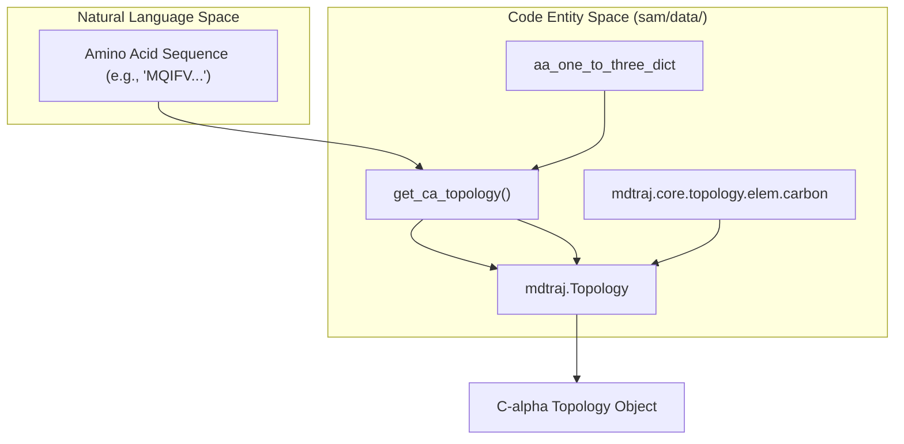
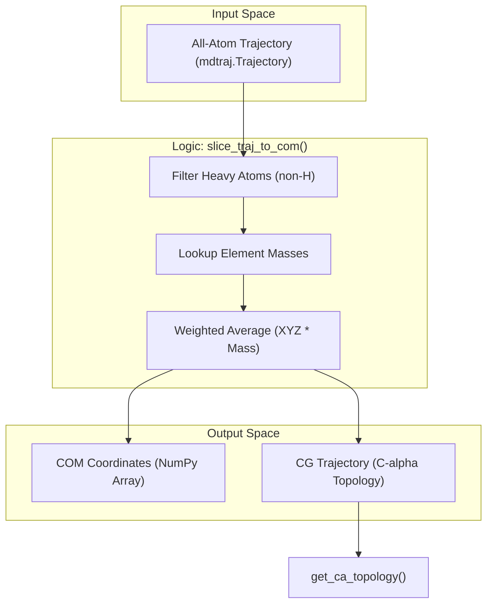

# Sequence and Topology Utilities

> **Relevant source files**
> * [sam/data/sequences.py](https://github.com/giacomo-janson/idpsam/blob/ec63c24a/sam/data/sequences.py)
> * [sam/data/topology.py](https://github.com/giacomo-janson/idpsam/blob/ec63c24a/sam/data/topology.py)

This page documents the utility modules within `sam/data/` responsible for handling amino acid sequences and structural topologies. These utilities bridge the gap between raw sequence strings and the geometric representations (like `mdtraj` objects) used during ensemble generation and analysis.

## Amino Acid Mappings and Sequence Analysis

The `sam/data/sequences.py` module provides standard lookup tables for amino acid nomenclature and simple biochemical property calculations.

### Implementation Details

The module defines mappings between one-letter and three-letter amino acid codes, which are used throughout the pipeline to ensure consistency when interacting with external libraries like `mdtraj` or when parsing FASTA files.

* **Lookup Tables**: The module maintains `aa_one_to_three_dict` [sequences.py L9-L14](https://github.com/giacomo-janson/idpsam/blob/ec63c24a/[sam/data/sequences.py#L9-L14) ] and `aa_three_to_one_dict` [sequences.py L16-L21](https://github.com/giacomo-janson/idpsam/blob/ec63c24a/[sam/data/sequences.py#L16-L21) ] for bidirectional conversion.
* **Charge Calculation**: The `get_net_q_res(seq)` function calculates the net charge per residue [sequences.py L27-L34](https://github.com/giacomo-janson/idpsam/blob/ec63c24a/[sam/data/sequences.py#L27-L34) ]. It identifies basic residues (K, R) as positive [sequences.py L24](https://github.com/giacomo-janson/idpsam/blob/ec63c24a/[sam/data/sequences.py#L24-L24) ] and acidic residues (D, E) as negative [sequences.py L25](https://github.com/giacomo-janson/idpsam/blob/ec63c24a/[sam/data/sequences.py#L25-L25) ].

### Summary of Constants

| Constant | Description | Source |
| --- | --- | --- |
| `aa_list` | List of 20 standard one-letter amino acid codes. | [sequences.py L1](https://github.com/giacomo-janson/idpsam/blob/ec63c24a/[sam/data/sequences.py#L1-L1)   ] |
| `aa_three_letters` | List of standard three-letter amino acid codes. | [sequences.py L4-L7](https://github.com/giacomo-janson/idpsam/blob/ec63c24a/[sam/data/sequences.py#L4-L7)   ] |
| `pos_aa` | Set containing `{"K", "R"}`. | [sequences.py L24](https://github.com/giacomo-janson/idpsam/blob/ec63c24a/[sam/data/sequences.py#L24-L24)   ] |
| `neg_aa` | Set containing `{"D", "E"}`. | [sequences.py L25](https://github.com/giacomo-janson/idpsam/blob/ec63c24a/[sam/data/sequences.py#L25-L25)   ] |

**Sources:**

* [sequences.py L1-L34](https://github.com/giacomo-janson/idpsam/blob/ec63c24a/[sam/data/sequences.py#L1-L34) ]

---

## Topology and Trajectory Utilities

The `sam/data/topology.py` module facilitates the creation of structural topologies for Coarse-Grained (CG) representations and provides utilities for processing all-atom trajectories into Center-of-Mass (COM) coordinates.

### CG Topology Generation

The function `get_ca_topology(sequence)` [topology.py L7-L13](https://github.com/giacomo-janson/idpsam/blob/ec63c24a/[sam/data/topology.py#L7-L13)

] is used to programmatically generate an `mdtraj.Topology` object consisting solely of Alpha Carbons ($C\alpha$). This is essential for saving generated ensembles into standard formats like DCD or PDB when the model output only contains $C\alpha$ coordinates.

### Trajectory Processing

The `slice_traj_to_com(traj, get_xyz=True)` function [topology.py L16-L37](https://github.com/giacomo-janson/idpsam/blob/ec63c24a/[sam/data/topology.py#L16-L37)

] converts an all-atom `mdtraj.Trajectory` into a coarse-grained representation where each residue is represented by its Center of Mass (COM).

1. **Heavy Atom Filtering**: It identifies all non-hydrogen atoms belonging to standard amino acids [topology.py L17-L19](https://github.com/giacomo-janson/idpsam/blob/ec63c24a/[sam/data/topology.py#L17-L19) ].
2. **COM Calculation**: For every residue, it calculates the mass-weighted average position of its heavy atoms [topology.py L23-L29](https://github.com/giacomo-janson/idpsam/blob/ec63c24a/[sam/data/topology.py#L23-L29) ].
3. **Return Format**: Depending on the `get_xyz` flag, it returns either a raw NumPy array of coordinates or a new `mdtraj.Trajectory` object with a $C\alpha$ topology mapping to the COM positions [topology.py L30-L37](https://github.com/giacomo-janson/idpsam/blob/ec63c24a/[sam/data/topology.py#L30-L37) ].

### Sequence to Topology Data Flow

The following diagram illustrates how raw sequence data is transformed into structural topology objects used by the sampling engine.

**Sequence to Topology Flow**

**Sources:**

* [sequences.py L9-L14](https://github.com/giacomo-janson/idpsam/blob/ec63c24a/[sam/data/sequences.py#L9-L14) ]
* [topology.py L7-L13](https://github.com/giacomo-janson/idpsam/blob/ec63c24a/[sam/data/topology.py#L7-L13) ]

---

## Coordinate Transformation Logic

The utilities in `topology.py` are frequently used to prepare data for the `CG_Protein` containers. The transformation from all-atom PDB/XTC files to the latent space involves a reduction to COM coordinates.

**Trajectory Coarse-Graining Process**

### Key Function Reference

| Function | Purpose | Key Dependency |
| --- | --- | --- |
| `get_net_q_res` | Normalizes sequence charge for analysis. | `pos_aa`, `neg_aa` |
| `get_ca_topology` | Creates `mdtraj` metadata for $C\alpha$ chains. | `aa_one_to_three_dict` |
| `slice_traj_to_com` | Reducer for all-atom structural data. | `aa_three_letters`, `mdtraj` |

**Sources:**

* [sequences.py L27-L34](https://github.com/giacomo-janson/idpsam/blob/ec63c24a/[sam/data/sequences.py#L27-L34) ]
* [topology.py L7-L13](https://github.com/giacomo-janson/idpsam/blob/ec63c24a/[sam/data/topology.py#L7-L13) ]
* [topology.py L16-L37](https://github.com/giacomo-janson/idpsam/blob/ec63c24a/[sam/data/topology.py#L16-L37) ]