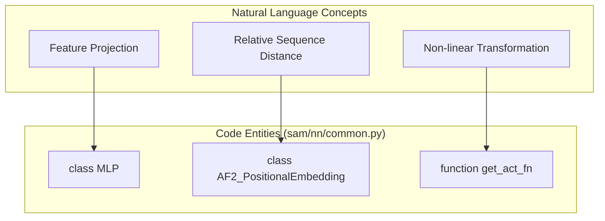
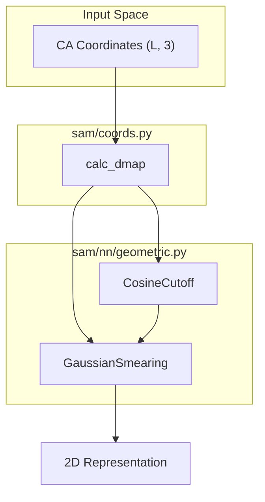

# Shared Layers and Geometric Utilities

> **Relevant source files**
> * [sam/nn/common.py](https://github.com/giacomo-janson/idpsam/blob/ec63c24a/sam/nn/common.py)
> * [sam/nn/geometric.py](https://github.com/giacomo-janson/idpsam/blob/ec63c24a/sam/nn/geometric.py)
> * [sam/nn/transformer.py](https://github.com/giacomo-janson/idpsam/blob/ec63c24a/sam/nn/transformer.py)

This section documents the foundational neural network building blocks and geometric featurization utilities used across the idpSAM architecture. These components provide standardized implementations for Multi-Layer Perceptrons (MLPs), specialized attention mechanisms for structural data, and radial basis functions (RBF) for encoding inter-residue distances.

## Core Neural Network Modules

The `sam/nn/common.py` file contains generic modules used for feature transformation and embedding.

### Multi-Layer Perceptron (MLP)

The `MLP` class provides a configurable stack of linear layers with interleaved activation functions and optional final normalization [sam/nn/common.py L41-L50](https://github.com/giacomo-janson/idpsam/blob/ec63c24a/sam/nn/common.py#L41-L50)

 It is used extensively for projecting latent dimensions and processing edge features.

### AlphaFold2-style Positional Embedding

The `AF2_PositionalEmbedding` module implements a relative positional encoding scheme [sam/nn/common.py L149-L160](https://github.com/giacomo-janson/idpsam/blob/ec63c24a/sam/nn/common.py#L149-L160)

 It calculates the relative distance between residue indices $|i - j|$ and maps these into a binned embedding space of dimension `pos_embed_dim`, clipped at a maximum relative distance defined by `pos_embed_r` [sam/nn/common.py L183-L195](https://github.com/giacomo-janson/idpsam/blob/ec63c24a/sam/nn/common.py#L183-L195)

### Activation Function Factory

The `get_act_fn` utility maps string identifiers to PyTorch activation classes [sam/nn/common.py L12-L26](https://github.com/giacomo-janson/idpsam/blob/ec63c24a/sam/nn/common.py#L12-L26)

* **Supported types**: `relu`, `elu`, `lrelu` (LeakyReLU), `prelu`, `swish`/`silu`, and `gelu`.

### Entity Association: Common Modules

The following diagram maps high-level architectural requirements to specific classes in `sam/nn/common.py`.

**Sources:** [sam/nn/common.py L12-L66](https://github.com/giacomo-janson/idpsam/blob/ec63c24a/sam/nn/common.py#L12-L66)

 [sam/nn/common.py L149-L195](https://github.com/giacomo-janson/idpsam/blob/ec63c24a/sam/nn/common.py#L149-L195)

---

## Transformer and Attention Layers

The `sam/nn/transformer.py` file defines specialized attention layers that allow the model to incorporate 2D geometric information (like distance maps) into the 1D sequence attention mechanism.

### TransformerLayer

A standard Multi-Head Attention (MHA) implementation extended to support 2D bias injection [sam/nn/transformer.py L10-L16](https://github.com/giacomo-janson/idpsam/blob/ec63c24a/sam/nn/transformer.py#L10-L16)

* **2D Branch**: If `in_dim_2d` is provided, the layer processes a pair-wise representation $P$ through an MLP to generate a bias term that is added to the dot-product attention scores before the softmax operation [sam/nn/transformer.py L100-L108](https://github.com/giacomo-janson/idpsam/blob/ec63c24a/sam/nn/transformer.py#L100-L108)
* **Normalization**: Supports scaling attention by either `d_model` or `head_dim` [sam/nn/transformer.py L63-L68](https://github.com/giacomo-janson/idpsam/blob/ec63c24a/sam/nn/transformer.py#L63-L68)

### TransformerTimewarpLayer

A specialized variant used in the decoder to handle structural transitions [sam/nn/transformer.py L129-L138](https://github.com/giacomo-janson/idpsam/blob/ec63c24a/sam/nn/transformer.py#L129-L138)

* **Squared Distance Affinities**: Instead of standard dot-products, it computes affinities based on squared Euclidean distances in a projected space [sam/nn/transformer.py L195-L207](https://github.com/giacomo-janson/idpsam/blob/ec63c24a/sam/nn/transformer.py#L195-L207)
* **Trainable Length Scale**: Includes a trainable parameter `elle` that scales the distance-based affinities [sam/nn/transformer.py L164-L165](https://github.com/giacomo-janson/idpsam/blob/ec63c24a/sam/nn/transformer.py#L164-L165)

### PyTorchAttentionLayer

A wrapper around `torch.nn.MultiheadAttention` that provides a consistent interface with the custom layers, specifically handling the `(L, N, E)` tensor format [sam/nn/transformer.py L223-L238](https://github.com/giacomo-janson/idpsam/blob/ec63c24a/sam/nn/transformer.py#L223-L238)

**Sources:** [sam/nn/transformer.py L10-L49](https://github.com/giacomo-janson/idpsam/blob/ec63c24a/sam/nn/transformer.py#L10-L49)

 [sam/nn/transformer.py L100-L126](https://github.com/giacomo-janson/idpsam/blob/ec63c24a/sam/nn/transformer.py#L100-L126)

 [sam/nn/transformer.py L129-L179](https://github.com/giacomo-janson/idpsam/blob/ec63c24a/sam/nn/transformer.py#L129-L179)

---

## Geometric Utilities and Smearing

The `sam/nn/geometric.py` file provides functions to transform raw Euclidean distances into high-dimensional feature vectors using Radial Basis Functions (RBF).

### Radial Basis Function (RBF) Implementations

| Class | Method | Implementation Detail |
| --- | --- | --- |
| `GaussianSmearing` | Gaussian RBF | Spaced linearly between `start` and `stop` [sam/nn/geometric.py L7-L13](https://github.com/giacomo-janson/idpsam/blob/ec63c24a/sam/nn/geometric.py#L7-L13) |
| `ExpNormalSmearing` | Exponential Normal | Uses a cosine cutoff and exponential normal distribution, following PhysNet [sam/nn/geometric.py L22-L32](https://github.com/giacomo-janson/idpsam/blob/ec63c24a/sam/nn/geometric.py#L22-L32) |
| `CosineCutoff` | Soft Cutoff | Smoothly decays features to zero as they approach the `cutoff_upper` distance [sam/nn/geometric.py L67-L72](https://github.com/giacomo-janson/idpsam/blob/ec63c24a/sam/nn/geometric.py#L67-L72) |

### Data Flow: Distance to Embedding

The following diagram illustrates how raw coordinates are transformed into geometric features used by the Encoder.

**Sources:** [sam/nn/geometric.py L6-L20](https://github.com/giacomo-janson/idpsam/blob/ec63c24a/sam/nn/geometric.py#L6-L20)

 [sam/nn/geometric.py L22-L64](https://github.com/giacomo-janson/idpsam/blob/ec63c24a/sam/nn/geometric.py#L22-L64)

 [sam/nn/geometric.py L67-L95](https://github.com/giacomo-janson/idpsam/blob/ec63c24a/sam/nn/geometric.py#L67-L95)

---

## Implementation Details

### Gaussian Smearing Forward Pass

The `GaussianSmearing` module computes:
$$e_k(d) = \exp\left(-\frac{1}{2\Delta^2} (d - \mu_k)^2\right)$$
where $\mu_k$ are the offsets registered in the buffer [sam/nn/geometric.py L15-L19](https://github.com/giacomo-janson/idpsam/blob/ec63c24a/sam/nn/geometric.py#L15-L19)

### Transformer 2D Injection

In `TransformerLayer`, the interaction between 1D sequence features $S$ and 2D pair features $P$ is implemented as:

1. Compute dot-product attention $A = \text{Softmax}(\frac{QK^T}{\sqrt{d_k}} + \text{MLP}(P))$ [sam/nn/transformer.py L91-L110](https://github.com/giacomo-janson/idpsam/blob/ec63c24a/sam/nn/transformer.py#L91-L110)
2. The `MLP(P)` term reshapes the pair-wise features to match the `(Batch * Heads, L, L)` shape of the attention matrix [sam/nn/transformer.py L101-L107](https://github.com/giacomo-janson/idpsam/blob/ec63c24a/sam/nn/transformer.py#L101-L107)

**Sources:** [sam/nn/geometric.py L15-L19](https://github.com/giacomo-janson/idpsam/blob/ec63c24a/sam/nn/geometric.py#L15-L19)

 [sam/nn/transformer.py L91-L110](https://github.com/giacomo-janson/idpsam/blob/ec63c24a/sam/nn/transformer.py#L91-L110)