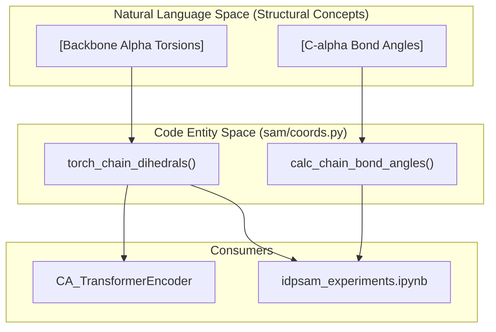
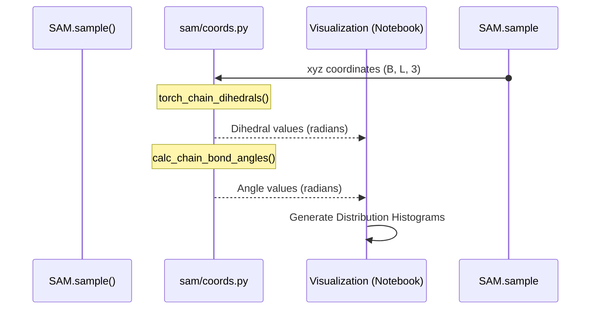

# Torsion Angles and Bond Geometry

> **Relevant source files**
> * [notebooks/idpsam_experiments.ipynb](https://github.com/giacomo-janson/idpsam/blob/ec63c24a/notebooks/idpsam_experiments.ipynb)
> * [sam/coords.py](https://github.com/giacomo-janson/idpsam/blob/ec63c24a/sam/coords.py)

This section details the geometric utility functions responsible for computing local structural features of the protein backbone. These functions are critical for both the featurization of input coordinates within the encoder and the statistical validation of generated ensembles (e.g., assessing the physical realism of the pseudo-bond geometry).

## Implementation of Torsion Angles

The codebase utilizes `torch_chain_dihedrals` to compute the torsion angles defined by the $C\alpha$ backbone. Unlike standard $\phi/\psi$ angles which require all-atom coordinates (N, $C\alpha$, C), these "alpha-torsions" are calculated strictly from the sequence of $C\alpha$ positions.

### Alpha-Torsion Vectorization

The function `torch_chain_dihedrals` [sam/coords.py L73-L92](https://github.com/giacomo-janson/idpsam/blob/ec63c24a/sam/coords.py#L73-L92)

 implements a vectorized approach to compute dihedrals for a batch of trajectories. It uses the `atan2` formulation to ensure the resulting angles are correctly signed within the range $[-\pi, \pi]$.

**Mathematical Flow in Code:**

1. **Vector Definition**: Three consecutive bond vectors ($b_0, b_1, b_2$) are derived from four consecutive $C\alpha$ atoms [sam/coords.py L80-L82](https://github.com/giacomo-janson/idpsam/blob/ec63c24a/sam/coords.py#L80-L82)
2. **Normal Vectors**: Orthogonal vectors to the planes defined by $(b_0, b_1)$ and $(b_1, b_2)$ are computed via `torch.cross` [sam/coords.py L83-L84](https://github.com/giacomo-janson/idpsam/blob/ec63c24a/sam/coords.py#L83-L84)
3. **Angle Projection**: The angle between these planes is resolved by projecting the cross products onto the $b_1$ axis [sam/coords.py L85-L88](https://github.com/giacomo-janson/idpsam/blob/ec63c24a/sam/coords.py#L85-L88)

| Feature | Description | Code Reference |
| --- | --- | --- |
| **Input Shape** | `(Batch, Residues, 3)` | [sam/coords.py L73](https://github.com/giacomo-janson/idpsam/blob/ec63c24a/sam/coords.py#L73-L73) |
| **Backend** | Supports `torch` and `numpy` (via conversion) | [sam/coords.py L74-L79](https://github.com/giacomo-janson/idpsam/blob/ec63c24a/sam/coords.py#L74-L79) |
| **Normalization** | Optional scaling to $[-1, 1]$ by dividing by $\pi$ | [sam/coords.py L91-L92](https://github.com/giacomo-janson/idpsam/blob/ec63c24a/sam/coords.py#L91-L92) |

Sources: [sam/coords.py L73-L93](https://github.com/giacomo-janson/idpsam/blob/ec63c24a/sam/coords.py#L73-L93)

## Bond Angle Geometry

The local geometry of the $C\alpha$ chain is further characterized by bond angles between three consecutive atoms. This is handled by `calc_chain_bond_angles`, which serves as a wrapper around the generic `calc_angles` function.

### Geometric Computation

The `calc_angles` function [sam/coords.py L100-L114](https://github.com/giacomo-janson/idpsam/blob/ec63c24a/sam/coords.py#L100-L114)

 computes the angle $\theta$ between vectors $u$ and $v$ sharing a common vertex. It utilizes the dot product identity:
$$\theta = \arccos\left(\frac{u \cdot v}{|u| |v|}\right)$$

In `calc_chain_bond_angles`, indices are automatically generated to slide a window of size 3 across the sequence length [sam/coords.py L95-L97](https://github.com/giacomo-janson/idpsam/blob/ec63c24a/sam/coords.py#L95-L97)

Sources: [sam/coords.py L95-L114](https://github.com/giacomo-janson/idpsam/blob/ec63c24a/sam/coords.py#L95-L114)

## System Data Flow: Geometry in Analysis and Encoding

The geometric functions in `sam/coords.py` bridge the gap between raw Cartesian coordinates (the "Natural Language" of 3D space) and the feature representations used by the "Code Entities" (the Neural Networks).

### Code Entity Mapping: Geometry Integration

The following diagram illustrates how these geometric utilities are consumed by the high-level experiment and modeling components.

**Geometric Feature Distribution**

Sources: [sam/coords.py L73-L114](https://github.com/giacomo-janson/idpsam/blob/ec63c24a/sam/coords.py#L73-L114)

 [notebooks/idpsam_experiments.ipynb L37](https://github.com/giacomo-janson/idpsam/blob/ec63c24a/notebooks/idpsam_experiments.ipynb#L37-L37)

## Usage in Ensemble Validation

In the `idpsam_experiments.ipynb` workflow, these functions are used to validate the generated ensembles against known IDP structural distributions.

1. **Ramachandran-like Plots**: While traditional Ramachandran plots use $\phi/\psi$, the `torch_chain_dihedrals` function allows for "Pseudo-Ramachandran" analysis of the $C\alpha$ trace to identify secondary structure propensities (e.g., alpha-helical vs. extended/random coil regions) [notebooks/idpsam_experiments.ipynb L37](https://github.com/giacomo-janson/idpsam/blob/ec63c24a/notebooks/idpsam_experiments.ipynb#L37-L37)
2. **Sampling for Statistics**: The `sample_data` utility [sam/coords.py L131-L141](https://github.com/giacomo-janson/idpsam/blob/ec63c24a/sam/coords.py#L131-L141)  is frequently used during analysis to downsample large generated ensembles (e.g., 10,000 frames) into manageable subsets for calculating torsion and angle distributions without memory overflow.

**Data Flow for Validation:**

Sources: [sam/coords.py L131-L141](https://github.com/giacomo-janson/idpsam/blob/ec63c24a/sam/coords.py#L131-L141)

 [notebooks/idpsam_experiments.ipynb L23-L43](https://github.com/giacomo-janson/idpsam/blob/ec63c24a/notebooks/idpsam_experiments.ipynb#L23-L43)