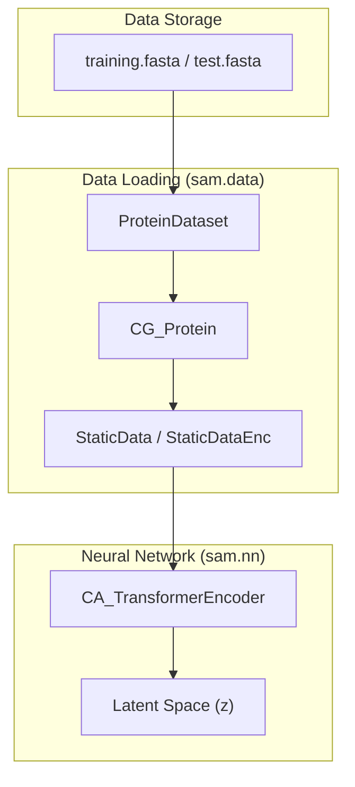

# Training and Evaluation Sequence Data

> **Relevant source files**
> * [data/sequences/test.fasta](https://github.com/giacomo-janson/idpsam/blob/ec63c24a/data/sequences/test.fasta)
> * [data/sequences/training.fasta](https://github.com/giacomo-janson/idpsam/blob/ec63c24a/data/sequences/training.fasta)
> * [data/sequences/training.part_1.fasta](https://github.com/giacomo-janson/idpsam/blob/ec63c24a/data/sequences/training.part_1.fasta)
> * [data/sequences/training.part_2.fasta](https://github.com/giacomo-janson/idpsam/blob/ec63c24a/data/sequences/training.part_2.fasta)
> * [data/sequences/training.part_3.fasta](https://github.com/giacomo-janson/idpsam/blob/ec63c24a/data/sequences/training.part_3.fasta)
> * [data/sequences/training.part_4.fasta](https://github.com/giacomo-janson/idpsam/blob/ec63c24a/data/sequences/training.part_4.fasta)
> * [data/sequences/validation.fasta](https://github.com/giacomo-janson/idpsam/blob/ec63c24a/data/sequences/validation.fasta)

This page documents the sequence datasets located in `data/sequences/` used for the training, validation, and benchmarking of the **idpSAM** model. These files define the biological space of Intrinsically Disordered Proteins (IDPs) that the model learns to represent and generate.

## Overview of Dataset Files

The repository contains three primary FASTA files used during the model lifecycle. The training data is also provided in a partitioned format to facilitate different loading strategies or parallel processing.

| File | Purpose | Sequence Count |
| --- | --- | --- |
| `training.fasta` | Primary training set for the Diffusion and Autoencoder modules. | ~9,000+ entries |
| `validation.fasta` | Used for hyperparameter tuning and monitoring overfitting. | 25 entries |
| `test.fasta` | Benchmarking set containing well-known IDPs (e.g., Sic1, Drk SH3). | 22 entries |

### Training Data Partitioning

The training set is further divided into four parts for convenience:

* `training.part_1.fasta` [data/sequences/training.part_1.fasta L1-L358](https://github.com/giacomo-janson/idpsam/blob/ec63c24a/data/sequences/training.part_1.fasta#L1-L358)
* `training.part_2.fasta` [data/sequences/training.part_2.fasta L1-L206](https://github.com/giacomo-janson/idpsam/blob/ec63c24a/data/sequences/training.part_2.fasta#L1-L206)
* `training.part_3.fasta` [data/sequences/training.part_3.fasta L1-L320](https://github.com/giacomo-janson/idpsam/blob/ec63c24a/data/sequences/training.part_3.fasta#L1-L320)
* `training.part_4.fasta` [data/sequences/training.part_4.fasta L1-L300](https://github.com/giacomo-janson/idpsam/blob/ec63c24a/data/sequences/training.part_4.fasta#L1-L300)

Sources: [data/sequences/training.fasta L1-L399](https://github.com/giacomo-janson/idpsam/blob/ec63c24a/data/sequences/training.fasta#L1-L399)

 [data/sequences/validation.fasta L1-L50](https://github.com/giacomo-janson/idpsam/blob/ec63c24a/data/sequences/validation.fasta#L1-L50)

 [data/sequences/test.fasta L1-L44](https://github.com/giacomo-janson/idpsam/blob/ec63c24a/data/sequences/test.fasta#L1-L44)

---

## Data Flow and Usage

The sequences defined in these files are consumed by the `sam.data` package to create PyTorch-compatible datasets. The `ProteinDataset` class parses these FASTA files to map amino acid characters to numerical indices.

### Sequence to Model Pipeline

The following diagram illustrates how raw FASTA data is transformed into latent representations for the Diffusion process.

**Diagram: Sequence Data Transformation Flow**

Sources: [sam/data/cg_protein.py L20-L100](https://github.com/giacomo-janson/idpsam/blob/ec63c24a/sam/data/cg_protein.py#L20-L100)

 [sam/nn/autoencoder/encoder.py L10-L50](https://github.com/giacomo-janson/idpsam/blob/ec63c24a/sam/nn/autoencoder/encoder.py#L10-L50)

---

## Biological Content and Diversity

### Training Set Characteristics

The training data consists of sequences derived from the **DisProt** database and other IDP repositories. The sequences range from short fragments (e.g., `GDHYINFTKVHD` [data/sequences/training.fasta L2](https://github.com/giacomo-janson/idpsam/blob/ec63c24a/data/sequences/training.fasta#L2-L2)

) to longer disordered regions.

Key features include:

* **Low Complexity Regions:** High frequency of small or polar residues (Gly, Ser, Ala).
* **Charge Distribution:** Sequences with high net charges, such as the synthetic poly-arginine `RRRRRRRRRRRRRRRRRRRRRRRRRRRRRRRRRR` [data/sequences/test.fasta L20](https://github.com/giacomo-janson/idpsam/blob/ec63c24a/data/sequences/test.fasta#L20-L20)
* **Repeats:** Simple sequence repeats common in IDPs, such as `PTPTPTTPTPTPTTPTPTPT` [data/sequences/training.part_1.fasta L94](https://github.com/giacomo-janson/idpsam/blob/ec63c24a/data/sequences/training.part_1.fasta#L94-L94)

### Benchmark Test Set (test.fasta)

The test set contains biologically significant proteins used to evaluate idpSAM's ability to capture specific ensemble properties (e.g., Radius of Gyration, Scaling Exponents).

| Header | Sequence Example | Biological Context |
| --- | --- | --- |
| `sic1_nterm_40` | `MTPSTPPRSRGTRYLAQPSG...` | Cell cycle regulator (yeast) |
| `drk_sh3` | `MEAIAKHDFSATADDELSFR...` | Signaling adaptor protein |
| `his5` | `DSHAKRHHGYKRKFHEKHHSHRGY` | Histatin-5 antimicrobial peptide |
| `nls` | `ACETNKRKREQISTDNEAKM...` | Nuclear Localization Signal |

Sources: [data/sequences/test.fasta L1-L44](https://github.com/giacomo-janson/idpsam/blob/ec63c24a/data/sequences/test.fasta#L1-L44)

 [data/sequences/training.fasta L1-L100](https://github.com/giacomo-janson/idpsam/blob/ec63c24a/data/sequences/training.fasta#L1-L100)

---

## Technical Implementation in sam.data

The sequences are mapped to the model using the utilities in `sam/data/sequences.py`.

### Code Mapping: Natural Language to Code Entity

This diagram maps the biological concepts found in the FASTA files to the specific Python classes and functions that handle them.

**Diagram: Sequence Handling Mapping**

### Key Functions

1. **AA Lookup:** The model uses a standard mapping where 'A' -> 0, 'C' -> 1, etc.
2. **Dataset Initialization:** `ProteinDataset` [sam/data/cg_protein.py L126-L140](https://github.com/giacomo-janson/idpsam/blob/ec63c24a/sam/data/cg_protein.py#L126-L140)  reads the FASTA file and prepares the sequence tensors.
3. **Validation Loop:** During training, the `validation.fasta` [data/sequences/validation.fasta L1-L50](https://github.com/giacomo-janson/idpsam/blob/ec63c24a/data/sequences/validation.fasta#L1-L50)  is loaded to calculate validation loss via the `Diffusers.loss()` method [sam/diffusion/diffusers_dm.py L100-L120](https://github.com/giacomo-janson/idpsam/blob/ec63c24a/sam/diffusion/diffusers_dm.py#L100-L120)

Sources: [sam/data/cg_protein.py L126-L180](https://github.com/giacomo-janson/idpsam/blob/ec63c24a/sam/data/cg_protein.py#L126-L180)

 [sam/data/sequences.py L5-L30](https://github.com/giacomo-janson/idpsam/blob/ec63c24a/sam/data/sequences.py#L5-L30)

 [sam/diffusion/diffusers_dm.py L100-L120](https://github.com/giacomo-janson/idpsam/blob/ec63c24a/sam/diffusion/diffusers_dm.py#L100-L120)