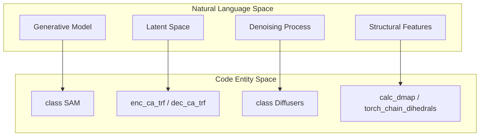

# idpSAM Overview

> **Relevant source files**
> * [LICENSE](https://github.com/giacomo-janson/idpsam/blob/ec63c24a/LICENSE)
> * [README.md](https://github.com/giacomo-janson/idpsam/blob/ec63c24a/README.md?plain=1)
> * [notebooks/idpsam_experiments.ipynb](https://github.com/giacomo-janson/idpsam/blob/ec63c24a/notebooks/idpsam_experiments.ipynb)

idpSAM is a latent diffusion model implemented in PyTorch for generating 3D conformational ensembles of **Intrinsically Disordered Proteins (IDPs)** and peptides [README.md L1-L4](https://github.com/giacomo-janson/idpsam/blob/ec63c24a/README.md?plain=1#L1-L4)

 It addresses the challenge of modeling the highly flexible and heterogeneous structural landscapes of IDPs by leveraging generative modeling trained on extensive Markov Chain Monte Carlo (MCMC) simulations [README.md L4-L5](https://github.com/giacomo-janson/idpsam/blob/ec63c24a/README.md?plain=1#L4-L5)

The system produces C$\alpha$ traces as its primary output, with optional support for all-atom reconstruction via integration with the `cg2all` model [README.md L8-L10](https://github.com/giacomo-janson/idpsam/blob/ec63c24a/README.md?plain=1#L8-L10)

## Biological Motivation

Traditional structural biology focuses on well-folded proteins, but IDPs lack a stable 3D structure under physiological conditions. idpSAM was trained on 3,259 intrinsically disordered regions obtained from the **DisProt** database [README.md L4-L5](https://github.com/giacomo-janson/idpsam/blob/ec63c24a/README.md?plain=1#L4-L5)

 These regions were simulated using the **ABSINTH** implicit solvent model within the **CAMPARI 4.0** package to provide a ground-truth distribution of flexible states [README.md L4-L5](https://github.com/giacomo-janson/idpsam/blob/ec63c24a/README.md?plain=1#L4-L5)

 The model is optimized for peptides with lengths between 12 and 60 amino acids [notebooks/idpsam_experiments.ipynb L141-L142](https://github.com/giacomo-janson/idpsam/blob/ec63c24a/notebooks/idpsam_experiments.ipynb#L141-L142)

## System Architecture

idpSAM utilizes a three-stage pipeline centered around a latent diffusion process. Instead of diffusing Cartesian coordinates directly, the model operates in a compressed latent space defined by a pre-trained autoencoder.

### Core Subsystems

* **Autoencoder**: Comprising a `CA_TransformerEncoder` and `CA_TransformerDecoder`, this subsystem maps C$\alpha$ structures to a latent representation and back.
* **Diffusion Engine**: A Denoising Diffusion Probabilistic Model (DDPM) or Denoising Diffusion Implicit Model (DDIM) that generates new latent samples from noise.
* **Noise Prediction**: The `eps_trf` (Epsilon Transformer) predicts the noise added to the latent representation during the diffusion process.
* **Reconstruction**: An optional post-processing step using `cg2all` to add side-chain and backbone atoms to the generated C$\alpha$ traces.

### Natural Language to Code Entity Mapping

The following diagram illustrates how high-level generative concepts map to specific classes and files within the `sam` package.

High-Level Concepts to Code Entities

**Sources:** [sam/model.py L163](https://github.com/giacomo-janson/idpsam/blob/ec63c24a/sam/model.py#L163-L163)

 [sam/diffusion/diffusers_dm.py L105](https://github.com/giacomo-janson/idpsam/blob/ec63c24a/sam/diffusion/diffusers_dm.py#L105-L105)

 [sam/coords.py L7](https://github.com/giacomo-janson/idpsam/blob/ec63c24a/sam/coords.py#L7-L7)

 [sam/coords.py L65](https://github.com/giacomo-janson/idpsam/blob/ec63c24a/sam/coords.py#L65-L65)

## Data Flow and Orchestration

The `SAM` class serves as the primary entry point, orchestrating the interaction between the neural networks and the diffusion scheduler.

Inference Pipeline Flow

**Sources:** [sam/model.py L163](https://github.com/giacomo-janson/idpsam/blob/ec63c24a/sam/model.py#L163-L163)

 [sam/diffusion/diffusers_dm.py L105](https://github.com/giacomo-janson/idpsam/blob/ec63c24a/sam/diffusion/diffusers_dm.py#L105-L105)

 [scripts/generate_ensemble.py L47-L57](https://github.com/giacomo-janson/idpsam/blob/ec63c24a/scripts/generate_ensemble.py#L47-L57)

## User Interfaces

idpSAM provides two primary ways to interact with the model:

1. **CLI Interface**: The `scripts/generate_ensemble.py` script allows for batch generation of ensembles with configurable devices, sample counts, and output formats [README.md L47-L57](https://github.com/giacomo-janson/idpsam/blob/ec63c24a/README.md?plain=1#L47-L57)
2. **Interactive Notebooks**: The `idpsam_experiments.ipynb` notebook provides a GUI-like experience for Google Colab or local Jupyter environments, including built-in analysis tools for Rg, contact maps, and PCA [notebooks/idpsam_experiments.ipynb L33-L38](https://github.com/giacomo-janson/idpsam/blob/ec63c24a/notebooks/idpsam_experiments.ipynb#L33-L38)

## Next Steps

For detailed information on setting up and using idpSAM, refer to the following child pages:

* **[Getting Started](/giacomo-janson/idpsam/1.1-getting-started)**: Installation via Conda, environment setup, and running your first generation [README.md L11-L32](https://github.com/giacomo-janson/idpsam/blob/ec63c24a/README.md?plain=1#L11-L32)
* **[Inference Quickstart: generate_ensemble.py](/giacomo-janson/idpsam/1.2-inference-quickstart:-generate_ensemble.py)**: Detailed documentation of the CLI arguments and output file formats [README.md L47-L60](https://github.com/giacomo-janson/idpsam/blob/ec63c24a/README.md?plain=1#L47-L60)
* **[Jupyter Notebook Experiments](/giacomo-janson/idpsam/1.3-jupyter-notebook-experiments)**: Guide to interactive generation and structural analysis workflows [notebooks/idpsam_experiments.ipynb L16-L43](https://github.com/giacomo-janson/idpsam/blob/ec63c24a/notebooks/idpsam_experiments.ipynb#L16-L43)

**Sources:**

* [README.md L1-L74](https://github.com/giacomo-janson/idpsam/blob/ec63c24a/README.md?plain=1#L1-L74)
* [notebooks/idpsam_experiments.ipynb L1-L157](https://github.com/giacomo-janson/idpsam/blob/ec63c24a/notebooks/idpsam_experiments.ipynb#L1-L157)