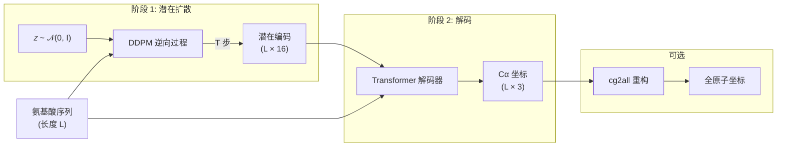

---
slug:1-overview
blog_type:normal
---


**IdpSAM** 是一个潜在扩散模型，用于生成**本质无序蛋白 (IDPs)** 的三维 Cα 构象系综。IdpSAM 并非生成单一的静态结构，而是对多种构象状态进行采样，这些状态共同表征了无序多肽和蛋白质的结构异质性特征。该模型使用 PyTorch 实现，并暴露单个 `SAM` 类作为其推理接口，使得仅凭一条氨基酸序列即可轻松生成数千个构象。

来源: [README.md](/README.md#L1-L75), [sam/model.py](/sam/model.py#L1-L50)

## IdpSAM 解决了什么问题？

本质无序蛋白不会折叠成单一的明确结构——它们以不断相互转化的构象动态系综形式存在。传统的结构预测方法（如 AlphaFold）专为有序蛋白设计，只能产生单一的静态输出。IdpSAM 弥补了这一缺陷，通过在粗粒化 Cα 层级**生成完整的构象系综**，其训练数据来自于使用 ABSINTH 隐式溶剂模型的马尔可夫链蒙特卡洛 (MCMC) 模拟。生成的系综还可以选择通过 [cg2all](https://github.com/huhlim/cg2all) 包重构为全原子细节。

来源: [README.md](/README.md#L1-L6), [notebooks/idpsam_experiments.ipynb](/notebooks/idpsam_experiments.ipynb#L1-L40)

## 两阶段架构

IdpSAM 采用了**潜在扩散**架构，将生成过程分离为两个不同阶段。这种设计模式通过在压缩的潜在空间而非直接在三维坐标空间中运行，提升了样本质量和计算效率。

**阶段 1 — 潜在扩散采样：** DDPM（去噪扩散概率模型）将随机潜在向量迭代去噪为结构化编码。一个基于 Transformer 的**噪声预测网络**（ε-网络）引导每一步去噪，该网络通过自适应层归一化以时间步和氨基酸序列为条件。

**阶段 2 — 确定性解码：** Transformer **解码器**将生成的潜在编码映射回三维 Cα 坐标。编码器（仅在训练期间使用）通过计算欧几里得不变特征——经 RBF 嵌入的 Cα–Cα 距离图和骨架扭转角——从三维结构生成潜在表示。



来源: [sam/model.py](/sam/model.py#L120-L198), [sam/diffusion/diffusers_dm.py](/sam/diffusion/diffusers_dm.py#L130-L188), [sam/nn/autoencoder/decoder.py](/sam/nn/autoencoder/decoder.py#L33-L175), [sam/nn/autoencoder/encoder.py](/sam/nn/autoencoder/encoder.py#L58-L200)

## 核心组件一览

| 组件 | 模块 | 作用 | 关键细节 |
|---|---|---|---|
| **SAM** | `sam.model` | 推理封装 | 加载配置、权重，编排 `generate()` → `decode()` |
| **Encoder** | `sam.nn.autoencoder.encoder` | 仅用于训练：3D → 潜在 | RBF 距离图 + 扭转角特征 → 16 维编码 |
| **Decoder** | `sam.nn.autoencoder.decoder` | 潜在 → 3D 坐标 | 带序列条件注入的 Transformer |
| **ε-Network** | `sam.nn.noise_prediction.eps` | 预测每一步的噪声 | 带 AdaLN-Zero 条件注入的 16 层 Transformer |
| **Diffusion** | `sam.diffusion.diffusers_dm` | DDPM/DDIM 采样循环 | 封装 HuggingFace `diffusers` 调度器 |
| **Coords** | `sam.coords` | 几何特征计算 | 距离图、扭转角、键角 |
| **Geometric** | `sam.nn.geometric` | 距离嵌入层 | GaussianSmearing (RBF)、ExpNormalSmearing |

来源: [sam/model.py](/sam/model.py#L52-L118), [sam/diffusion/diffusers_dm.py](/sam/diffusion/diffusers_dm.py#L1-L40), [sam/nn/geometric.py](/sam/nn/geometric.py#L1-L50), [sam/coords.py](/sam/coords.py#L1-L30)

## 项目结构

```
idpsam/
├── config/
│   └── models.yaml            # 默认模型配置（架构、超参数）
├── data/
│   └── sequences/             # 训练、验证和测试 FASTA 文件
├── notebooks/
│   └── idpsam_experiments.ipynb  # 用于云端推理的 Google Colab 笔记本
├── sam/                       # 核心 Python 包
│   ├── model.py               # SAM 类 — 主推理接口
│   ├── coords.py              # 距离图、扭转角、键角计算
│   ├── data/
│   │   ├── cg_protein.py      # 蛋白质批次的 Dataset 类
│   │   ├── sequences.py       # 氨基酸定义与工具
│   │   └── topology.py        # MDTraj 拓扑构建器
│   ├── diffusion/
│   │   ├── common.py          # 基础扩散类（EMA 选择）
│   │   └── diffusers_dm.py    # 通过 HuggingFace diffusers 进行 DDPM/DDIM 采样
│   └── nn/
│       ├── autoencoder/
│       │   ├── encoder.py     # CA_TransformerEncoder（训练）
│       │   ├── decoder.py     # CA_TransformerDecoder（推理）
│       │   └── ca_models.py   # 自编码器的共享 Transformer 模块
│       ├── noise_prediction/
│       │   ├── eps.py         # IdpGAN 噪声预测 Transformer
│       │   └── embedding.py   # 时间步嵌入器、AdaLN、条件注入
│       ├── transformer.py     # 带二维偏置的自定义多头注意力
│       ├── geometric.py       # RBF / ExpNormal 距离嵌入模块
│       └── common.py          # 共享工具（激活函数、位置嵌入）
├── scripts/
│   └── generate_ensemble.py   # CLI 推理脚本
├── weights/
│   └── v1.0/                  # 预训练模型权重（编码器、解码器、ε-网络、缩放器）
├── sam.yml                    # Conda 环境规范
└── setup.py                   # 包安装
```

来源: [setup.py](/setup.py#L1-L18), [config/models.yaml](/config/models.yaml#L1-L106)

## 预训练权重

本仓库在 `weights/v1.0/` 下提供了预训练权重，无需任何训练即可直接进行推理：

| 文件 | 组件 | 描述 |
|---|---|---|
| `nn.enc.pt` | Encoder | Transformer 编码器权重（训练用） |
| `nn.dec.pt` | Decoder | Transformer 解码器权重（推理用） |
| `nn.eps.pt` | ε-Network | 噪声预测网络权重 |
| `enc_std_scaler.pt` | Scaler | 潜在编码的标准缩放器（均值 μ，标准差 σ） |

编码标准缩放器在 DDPM 采样之后应用，用于将生成的潜在向量重新缩放回编码器原始的分布：`enc = enc × σ + μ`。这由配置中的 `use_enc_std_scaler` 标志控制。

来源: [sam/model.py](/sam/model.py#L96-L110), [config/models.yaml](/config/models.yaml#L5-L8)

## 配置

模型架构和推理行为由单个 YAML 配置文件（`config/models.yaml`）控制。该配置分为四个顶层部分，分别对应各架构组件：

| 部分 | 控制 |
|---|---|
| `generative_model` | 编码维度 (16)、珠子类型 (Cα)、最大序列长度 (60)、标准缩放器使用 |
| `encoder` | 编码器 Transformer 架构、RBF 距离嵌入、扭转角特征 |
| `decoder` | 解码器 Transformer 架构、注意力类型、序列条件注入 |
| `latent_generative_model` | 扩散调度器 (DDPM/DDIM)、噪声调度、损失类型 |
| `latent_network` | ε-网络 Transformer 架构、时间步/序列嵌入、AdaLN 模式 |

来源: [config/models.yaml](/config/models.yaml#L1-L106)

## 推理工作流

由 `SAM.sample()` 方法编排的端到端推理过程，遵循以下精确序列：

1. 使用配置文件和设备**初始化** `SAM` 模型——这将把 ε-网络、解码器、扩散调度器和可选的编码缩放器加载到内存中
2. 通过 `SAM.generate()` **生成潜在编码**——DDPM 逆向过程以氨基酸序列为条件，对高斯噪声进行 `n_steps` 步的迭代去噪
3. 使用标准缩放器**缩放编码**（若已配置），以匹配编码器的输出分布
4. 通过 `SAM.decode()` **解码为坐标**——解码器将每个潜在编码映射为形状为 `(L, 3)` 的 Cα 坐标张量
5. **保存输出**——坐标被写入带有伴随 PDB 拓扑文件的 DCD 轨迹文件
6. 通过 `SAM.cg2all()` **可选的全原子重构**——cg2all 包将 Cα 轨迹转换为全原子表示

<CgxTip>DDPM 采样步数 (`n_steps`) 控制着质量与速度的权衡：默认的 100 步（总训练时间步为 1000）提供了良好的平衡。增加步数可以提升样本质量，但代价是更长的生成时间。</CgxTip>

来源: [sam/model.py](/sam/model.py#L120-L198), [sam/model.py](/sam/model.py#L200-L320), [scripts/generate_ensemble.py](/scripts/generate_ensemble.py#L85-L113)

## 接下来去哪

现在你已经了解了 IdpSAM 是什么及其架构的组织方式，以下是推荐的阅读顺序：

1. **[快速开始](2-quick-start)** — 安装 IdpSAM 并在几分钟内生成你的首个构象系综
2. **[推理脚本用法](3-inference-script-usage)** — `generate_ensemble.py` 脚本的详细 CLI 参数和输出格式
3. **[两阶段架构概述](4-two-stage-architecture-overview)** — 深入探讨编码器、潜在扩散和解码器如何作为一个统一的生成系统交互
4. **[DDPM 采样过程](7-ddpm-sampling-process)** — 理解扩散逆向过程、调度器参数以及质量与速度的权衡
5. **[SAM 模型 API 参考](14-sam-model-api-reference)** — `SAM` 类方法及返回类型的完整参考