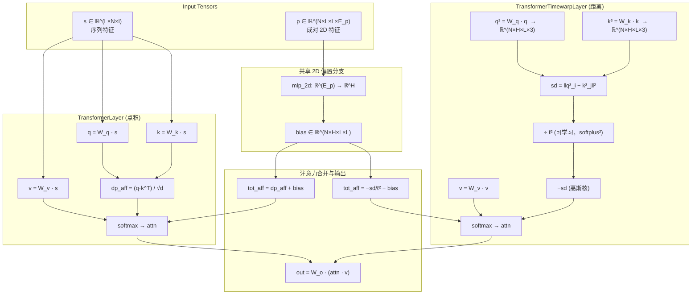

---
slug:11-custom-transformer-attention
blog_type:normal
---


idpsam 不同于标准的 PyTorch Transformer 层，它在单一模块中实现了**三种自定义注意力机制**，每种机制旨在捕获与蛋白质构象生成相关的不同结构归纳偏置。这些层共享共同的架构基因 —— 一个**成对 2D 偏置分支**，将位置或边级别的信息直接注入到注意力对数中 —— 而它们的不同之处在于计算主要注意力亲和度的方式：经典点积、高斯核距离或 PyTorch 原生多头注意力。

## 三种注意力变体一览

| 层类 | 亲和度计算 | 关键归纳偏置 | 使用方 |
|---|---|---|---|
| `TransformerLayer` | 缩放点积：$QK^\top / \sqrt{d}$ | 基于内容的 token 交互 | 噪声预测网络 (`EpsTransformer`) |
| `TransformerTimewarpLayer` | 负平方距离：$-\|q_i - k_j\|^2 / \ell^2$ | **高斯核空间邻近度** —— 附近残基获得更多注意力 | 自编码器解码器 (`CA_TransformerDecoder`) |
| `PyTorchAttentionLayer` | 带有 `attn_mask` 的 `nn.MultiheadAttention` | 带边偏置的 PyTorch 优化 MHA | 噪声预测网络（替代方案） |

来源：[transformer.py](sam/nn/transformer.py#L1-L312)

## 架构概述

下图展示了这三种注意力变体如何融入更广泛的 Transformer 块中，以及它们如何与共享的 2D 偏置分支交互：



来源：[transformer.py](sam/nn/transformer.py#L10-L127), [transformer.py](sam/nn/transformer.py#L129-L271)

## TransformerLayer —— 带 2D 偏置的缩放点积注意力

`TransformerLayer` 从头实现了多头缩放点积注意力，其显著特点是增加了一个 **2D 偏置分支**，在 softmax 之前将成对位置偏置添加到注意力对数中。

### 构造

该层接受 `in_dim`（输入嵌入维度）、`d_model`（总注意力维度 = `head_dim × nhead`）以及选择缩放分母的关键参数 `dp_attn_norm`：

```python
self.q_linear = nn.Linear(in_dim, d_model, bias=False)
self.k_linear = nn.Linear(in_dim, d_model, bias=False)
self.v_linear = nn.Linear(in_dim, d_model, bias=False)
self.out_linear = nn.Linear(d_model, in_dim)
```

注意，Q、K、V 投影是**无偏置**的，而输出线性层保留了偏置项。当提供 `in_dim_2d` 时，会有条件地实例化 2D 分支：

```python
if self.in_dim_2d is not None:
    self.mlp_2d = nn.Sequential(
        nn.Linear(in_dim_2d, self.nhead, bias=use_bias_2d))
```

这个单一线性层将成对特征直接映射到**每个注意力头的一个标量偏置**，这是一种高效的设计 —— 不需要多层 MLP，因为成对输入（通常是 `AF2_PositionalEmbedding` 的输出）已经携带了丰富的结构编码。

来源：[transformer.py](sam/nn/transformer.py#L10-L49)

### 前向传播 —— 张量形状流转

前向传播的签名为 `forward(self, s, _k, _v, p)`，其中 `s` 是序列张量，`p` 是成对 2D 张量。虽然存在 `_k` 和 `_v` 参数（为了 API 兼容性），但它们被**忽略**了 —— 这是严格的自注意力。

| 阶段 | 张量形状 | 操作 |
|---|---|---|
| 输入 `s` | `(L, N, I)` | 序列长度 × 批次 × 输入维度 |
| Q, K, V | `(L, N, D·H)` | 线性投影 |
| 重塑的 Q, K, V | `(N·H, L, D)` | 为 `bmm` 合并批次与头 |
| 点积亲和度 | `(N·H, L, L)` | 缩放 `1/√d` 后的 `bmm(q, k^T)` |
| 2D 偏置 `p` | `(N, L, L, H)` → `(N·H, L, L)` | 经 `mlp_2d` 投影，随后转置并重塑 |
| 总亲和度 | `(N·H, L, L)` | `dp_aff + p` |
| 注意力权重 | `(N·H, L, L)` | `softmax(dim=-1)` |
| 更新的值 | `(L, N, D·H)` | `bmm(attn, v)`，重塑回去 |
| 输出 | `(L, N, I)` | `out_linear` |

**缩放因子** `w_t` 由 `dp_attn_norm` 控制：当设置为 `"d_model"`（idpsam 中的默认值）时，缩放为 $1/\sqrt{d_{\text{model}}}$；当设置为 `"head_dim"` 时，缩放为 $1/\sqrt{d_{\text{head}}}$（标准的逐头归一化）。解码器和噪声预测网络中均使用了默认配置 `"d_model"`。

来源：[transformer.py](sam/nn/transformer.py#L52-L126), [ca_models.py](sam/nn/autoencoder/ca_models.py#L75-L82), [eps.py](sam/nn/noise_prediction/eps.py#L59-L66)

## TransformerTimewarpLayer —— 高斯核距离注意力

`TransformerTimewarpLayer` 用查询和键 token 的低维坐标投影之间的**负平方欧几里得距离**代替了点积亲和度。这产生了一种**高斯核注意力**模式，即投影坐标在 3D 空间中更近的 token 会获得更高的注意力权重 —— 对于蛋白质结构而言，这是一种自然的归纳偏置，因为空间邻近性驱动了相互作用。

### 坐标投影与距离计算

Q 和 K 不再投影到 `d_model` 维向量，而是投影到**每个头的 3D 坐标向量**：

```python
self.n_points = 1
self.n_coords = 3
self.q_linear = nn.Linear(in_dim, nhead * n_points * n_coords, bias=False)
self.k_linear = nn.Linear(in_dim, nhead * n_points * n_coords, bias=False)
```

因此，每个$H$头生成一个单一的 3D 点（`n_points=1, n_coords=3`）。平方距离亲和度计算如下：

$$\text{sd\_aff}_{h}(i,j) = \frac{\|q^3_{h,i} - k^3_{h,j}\|^2}{\ell_h^2 + \epsilon}$$

其中 $\ell_h$ 是一个**逐头可学习的长度尺度**参数，初始化为 1.0，并通过 softplus 平方进行参数化以保证正定性：

```python
elle_init = torch.log(torch.exp(torch.full((1, nhead, 1, 1), 1.)) - 1.)
self.elle = nn.Parameter(elle_init)
# ...
elle_sp = nn.functional.softplus(self.elle)**2
sd_aff = sd_aff / (elle_sp + self.eps_elle)
```

最$H$终的亲和度为 `tot_aff = -sd_aff`，因此 softmax 计算如下：

$$\text{attn}_{h}(i,j) = \frac{\exp\left(-\|q^3_{h,i} - k^3_{h,j}\|^2 / \ell_h^2\right)}{\sum_j \exp\left(-\|q^3_{h,i} - k^3_{h,j}\|^2 / \ell_h^2\right)}$$

这恰好是投影坐标上的一个**高斯 (RBF) 核**，使得注意力权重随空间距离平滑衰减。逐头长度尺度 $\ell_h$ 允许不同的头在不同的空间分辨率上关注 —— 某些头可以捕获长程相互作用，而其他头则聚焦于局部邻域。

### 值投影

值分支比 Q/K 更灵活。它投影到 `v_dim = nhead × v_dim_head` 维度，其中 `v_dim_head` 由 `v_dim_mode` 控制：

- `"custom"`：`v_dim_head = d_model // nhead`，允许值空间大于 3D 坐标空间
- 否则：`v_dim_head = n_points × n_coords = 3`，与 Q/K 维度匹配

来源：[transformer.py](sam/nn/transformer.py#L129-L271)

### 距离计算 —— 张量形状流转

| 阶段 | 张量形状 | 操作 |
|---|---|---|
| 输入 `q` | `(L, N, I)` | 序列长度 × 批次 × 输入维度 |
| `q³`, `k³` | `(L, N, H·1·3)` | 投影到每个头的 3D 坐标 |
| 重塑的 `q³`, `k³` | `(N·H, L, 1, 3)` | 用于成对差值计算 |
| 成对差值 | `(N·H, L, L, 1, 3)` | `q³[:,None,...] - k³[:,:,None,...]` |
| 平方距离 | `(N·H, L, L)` | 在坐标和点上求和 |
| `elle` 缩放后 | `(N·H, L, L)` | 除以 `softplus(elle)²` |
| 总亲和度 | `(N·H, L, L)` | `−sd_aff + bias_2d` |
| 注意力 → 输出 | `(L, N, I)` | softmax，与 v 进行 bmm，out_linear |

来源：[transformer.py](sam/nn/transformer.py#L182-L271)

## PyTorchAttentionLayer —— 带边偏置的原生 MHA

`PyTorchAttentionLayer` 封装了 PyTorch 内置的 `nn.MultiheadAttention`，并将成对边特征作为 `attn_mask` 偏置注入。这提供了一个标准化、优化的替代方案来取代自定义的 `TransformerLayer`，同时保留了 2D 偏置分支模式：

```python
self.mha = nn.MultiheadAttention(embed_dim, num_heads, ...)
self.edge_to_bias = nn.Linear(edge_dim, num_heads, bias=use_bias_2d)
```

在前向传播中，边特征被投影为逐头标量，并重塑为 `(N·H, L, L)` 以作为 `attn_mask` 参数：

```python
p = self.edge_to_bias(p)
p = p.transpose(1, 3).transpose(2, 3)
p = p.contiguous().view(b_size * num_heads, seq_l, seq_l)
out = self.mha(q, k, v, attn_mask=p)
```

<CgxTip>PyTorch 的 `MultiheadAttention` 中的 `attn_mask` 在 softmax 之前**加到**注意力权重上（而非相乘），这在语义上与自定义层中的 2D 偏置注入完全一致。这确保了在使用相同成对特征时，所有三种注意力变体的行为一致性。</CgxTip>

来源：[transformer.py](sam/nn/transformer.py#L278-L312)

## 2D 偏置分支 —— 成对特征注入

所有三种注意力层共享 **2D 偏置分支** 模式，这是将成对结构信息（位置嵌入、边特征）注入注意力的核心机制。该设计在不同变体中保持一致：

1. **输入**：形状为 `(N, L, L, E_p)` 的 4D 张量 `p` —— 序列上的成对表示（例如，来自 `AF2_PositionalEmbedding` 的相对位置嵌入）
2. **投影**：单一线性层映射 `E_p → H`（头的数量），为每个头每个残基对生成一个偏置标量
3. **转置与重塑**：将 `(N, L, L, H)` 结果置换为 `(N, H, L, L)` 并重塑为 `(N·H, L, L)`，以与批头注意力矩阵布局对齐
4. **相加**：偏置在 softmax 之前**加到**主要注意力亲和度上

这种设计意味着 2D 偏置充当了注意力模式上的**软结构先验**。例如，当 `p` 编码相对序列间隔时（通过 `AF2_PositionalEmbedding`），附近的残基无论内容如何都会获得偏置提升 —— 这对于局部接触在统计上更常见的蛋白质来说，是一种有用的归纳偏置。

来源：[transformer.py](sam/nn/transformer.py#L99-L108), [transformer.py](sam/nn/transformer.py#L248-L256), [transformer.py](sam/nn/transformer.py#L305-L311)

## 注意力类型选择 —— 各变体的使用场景

`attention_type` 字符串参数选择在 Transformer 块内实例化哪个层。下表展示了调度逻辑和实际配置：

| `attention_type` | Transformer 块 | 实例化的层 | 配置使用 |
|---|---|---|---|
| `"transformer"` | `AE_IdpGAN_TransformerBlock` | `TransformerLayer` | — |
| `"timewarp"` | `AE_IdpGAN_TransformerBlock` | `TransformerTimewarpLayer` | **解码器** (`attention_type: timewarp`) |
| `"transformer"` | `IdpGAN_TransformerBlock` | `TransformerLayer` | **噪声预测** (`attention_type: transformer`) |
| `"pytorch"` | `IdpGAN_TransformerBlock` | `PyTorchAttentionLayer` | — |

**自编码器解码器**使用 `"timewarp"` 注意力（高斯核距离），因为它重建的是 3D 坐标，空间邻近性是其自然的注意力模式。**噪声预测网络**使用 `"transformer"`（点积）注意力，因为它在潜空间编码上操作，此时基于内容的交互比空间邻近性更合适。

### 配置快照

```yaml
# 解码器 —— 使用 timewarp 注意力
decoder:
  attention_type: timewarp
  d_model: 512
  num_heads: 32    # head_dim = 512/32 = 16

# 噪声预测 —— 使用点积注意力
latent_network:
  attention_type: transformer
  d_model: null    # 默认为 embed_dim = 256
  num_heads: 16    # head_dim = 256/16 = 16
```

注意，两种配置都产生了**头维度 16**，这可能是一个有意的设计选择，旨在保持两个阶段间一致的逐头容量。

来源：[ca_models.py](sam/nn/autoencoder/ca_models.py#L75-L91), [eps.py](sam/nn/noise_prediction/eps.py#L59-L76), [models.yaml](config/models.yaml#L39-L58), [models.yaml](config/models.yaml#L72-L101)

## 自注意力 API 契约

所有三层都暴露了相同的前向传播签名：`forward(q, k, v, p)`，其中 `p` 是成对 2D 张量。然而，在实践中它们总是作为**自注意力**被调用 —— 相同的张量被传递给 `q`、`k` 和 `v`：

```python
# 在 AE_IdpGAN_TransformerBlock 中
x = self.self_attn(x, x, x, p=z_hat)[0]

# 在 IdpGAN_TransformerBlock 中
x = self.self_attn(x, x, x, p=p)[0]
```

输出始终是**单元素元组** `(output,)`，在调用处通过 `[0]` 解包。这种元组返回约定允许未来扩展（例如，返回注意力权重以进行可视化）而不破坏接口。

<CgxTip>`TransformerLayer` 的前向传播签名使用命名参数 `(s, _k, _v, p)`，其中 `_k` 和 `_v` 带有下划线以表明它们未被使用 —— 这仅是自注意力。`TransformerTimewarpLayer` 使用 `(q, k, v, p)`，但在实践中也应用自注意力。如果需要交叉注意力，`TransformerTimewarpLayer` 可以自然地支持，因为 Q 和 K 被独立投影到 3D 坐标。</CgxTip>

来源：[ca_models.py](sam/nn/autoencoder/ca_models.py#L136-L136), [eps.py](sam/nn/noise_prediction/eps.py#L173-L173)

## 后续步骤

注意力层与准备其输入的归一化和嵌入机制紧密交互。要理解 Transformer 块中的完整数据流：

- **[自适应层归一化](12-adaptive-layer-normalization)** —— 时间步和氨基酸嵌入如何通过 AdaLN 调制注意力前和 MLP 前的激活
- **[时间步与序列嵌入](13-timestep-and-sequence-embedding)** —— 扩散时间步和氨基酸标识如何在注入注意力流水线之前进行编码