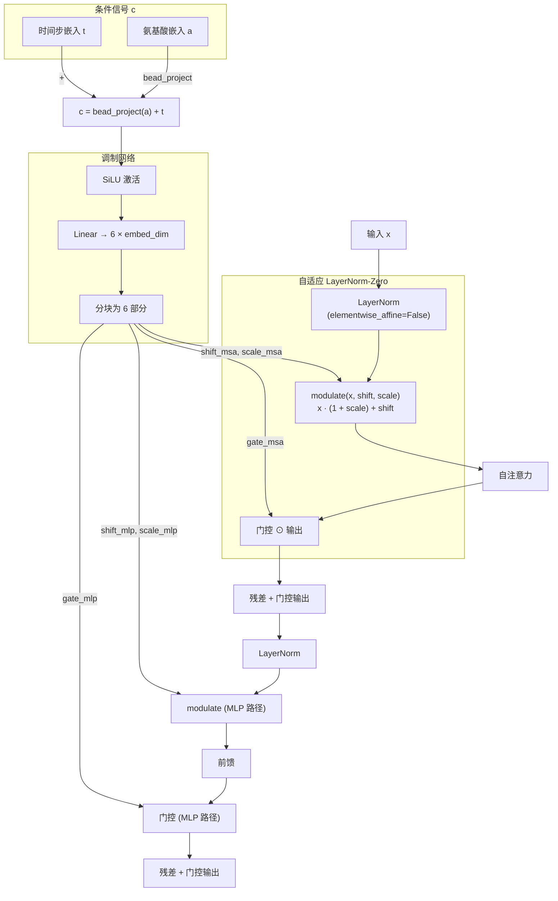
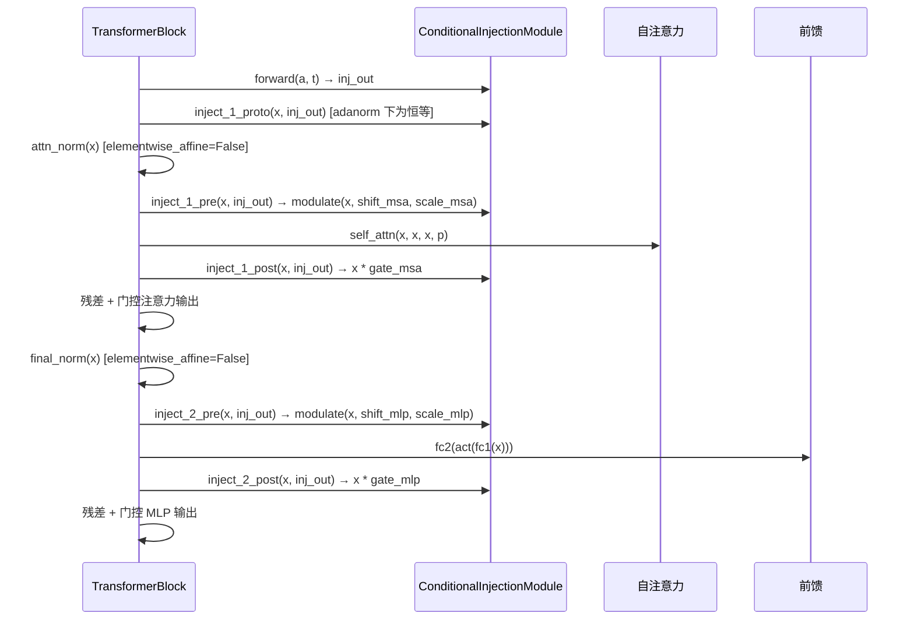

---
slug:12-adaptive-layer-normalization
blog_type:normal
---


自适应层归一化（AdaLN）是 idpsam 噪声预测网络中的主要条件化机制，使扩散 Transformer 能够根据**时间步**和**氨基酸序列**嵌入来调制其隐藏表征。与简单的条件化策略（拼接或相加）不同，AdaLN 将 LayerNorm 的仿射参数——缩放和平移——重新参数化为条件信号的学习函数，产生随 Transformer 块变化且依赖于时间步和序列的归一化。该实现遵循 DiT 架构中的 **AdaLN-Zero** 变体，它将调制层初始化为恒等变换并包含输出门控，从而确保训练从一开始就保持稳定。

## 理论基础

标准 LayerNorm 在归一化后应用固定的仿射变换：`LayerNorm(x) = γ · Norm(x) + β`，其中 γ（缩放）和 β（平移）是所有输入共享的可学习参数。在条件生成模型中，这是不够的——网络在不同的扩散时间步和对于不同的蛋白质序列必须表现出不同的行为。**自适应层归一化**用条件网络产生的动态值替换静态的 γ 和 β：`AdaLN(x, c) = γ(c) · Norm(x) + β(c)`，其中 c 是条件信号。这等价于 **FiLM**（特征线性调制）条件化范式，并且与 DiT 论文中描述的自适应实例归一化和自适应组归一化密切相关。核心洞见是，调制归一化特征的*缩放*和*平移*提供了一种比简单相加或拼接条件嵌入更具表达力且参数效率更高的条件化路径。



来源: [embedding.py](sam/nn/noise_prediction/embedding.py#L59-L60), [embedding.py](sam/nn/noise_prediction/embedding.py#L62-L156)

## `modulate` 函数

所有 AdaLN 条件化的基础原子操作是 `modulate` 函数，它将学习到的缩放和平移应用于归一化后的张量：

```
modulate(x, shift, scale) = x * (1 + scale) + shift
```

`1 + scale` 的公式确保当 `scale` 被零初始化时，调制退化为对归一化特征的恒等变换加上一个平移项——同样也是零初始化的。这就是 AdaLN-Zero 中的 **Zero**：在初始化时，整个调制路径充当恒等映射，意味着 Transformer 作为一个标准的预归一化 Transformer 启动，条件化路径的残差贡献为零。这种设计极大地稳定了扩散模型中早期的训练动态。

| 参数 | 形状 | 作用 |
|-----------|-------|------|
| `x` | `(L, B, D)` | 归一化后的隐藏状态（LayerNorm 输出） |
| `shift` | `(1, B, D)` | 每个嵌入维度的加性调制（偏置） |
| `scale` | `(1, B, D)` | 每个嵌入维度的乘性调制（增益） |

在序列维度 `L` 上的广播语义至关重要：**平移和缩放在批次元素内的所有残基间共享**，反映了时间步和序列条件化的全局性质。每个残基接收相同的调制参数，但这些参数的*值*在每个批次元素（每个扩散样本和时间步）中是不同的。

来源: [embedding.py](sam/nn/noise_prediction/embedding.py#L59-L60)

## `ConditionalInjectionModule`：核心 AdaLN-Zero 实现

`ConditionalInjectionModule` 是主要的 AdaLN 条件化机制，在每个 Transformer 块中实例化一次。当 `mode="adanorm"` 时，它实现了完整的 AdaLN-Zero 协议，每个块包含**六个调制参数**：用于注意力机制和 MLP 归一化点的缩放与平移，以及用于这两条路径的门控标量。

### 条件信号组合

条件信号 `c` 通过将时间步嵌入 `t` 与（可选投影的）氨基酸嵌入 `a` 相加来构建：

```
c = bead_project(a) + t    (氨基酸条件化)
c = t                       (氨基酸非条件化)
```

当 `bead_embed_dim ≠ time_embed_dim` 时，一个学习到的线性投影 `bead_project` 将氨基酸嵌入对齐到时间步嵌入空间。当维度匹配时，则使用 `nn.Identity()`。将两个嵌入求和为单一条件向量 `c` 意味着调制网络在单次前向传播中联合处理时间与序列信息。

### 调制网络架构

调制参数由一个两层序列网络产生：

```
adaLN_modulation = Sequential(SiLU(), Linear(time_embed_dim → 6 × embed_dim))
```

SiLU 激活函数首先处理条件信号 `c`，然后单层线性层将其投影到 `6 × embed_dim` 个输出。这些输出沿嵌入维度被均分为六个块：

| 块索引 | 名称 | 目标 | 作用 |
|-------------|------|--------|------|
| 0 | `shift_msa` | 注意力预归一化 | 自注意力前的加性调制 |
| 1 | `scale_msa` | 注意力预归一化 | 自注意力前的乘性调制 |
| 2 | `gate_msa` | 注意力后 | 自注意力后的输出门控 |
| 3 | `shift_mlp` | MLP 预归一化 | 前馈层前的加性调制 |
| 4 | `scale_mlp` | MLP 预归一化 | 前馈层前的乘性调制 |
| 5 | `gate_mlp` | MLP 后 | 前馈层后的输出门控 |

### 零初始化

`initialize_weights` 方法将最终线性层的权重和偏置设置为零：

```python
nn.init.constant_(self.adaLN_modulation[-1].weight, 0)
nn.init.constant_(self.adaLN_modulation[-1].bias, 0)
```

这确保了所有六个调制参数从零开始，使得 `modulate(x, 0, 0) = x * (1 + 0) + 0 = x`。门控参数（`gate_msa`、`gate_mlp`）也从零开始，意味着条件化的残差贡献最初为零，并在训练过程中逐渐增长。

### 与 LayerNorm 的交互

当 `embed_inject_mode="adanorm"` 时，`IdpGAN_TransformerBlock` 中伴随的 `LayerNorm` 层在创建时设置了 `elementwise_affine=False`：

```python
self.attn_norm = nn.LayerNorm(embed_dim, elementwise_affine=embed_inject_mode != "adanorm")
```

这禁用了 LayerNorm 中默认可学习的 γ 和 β，因为 `modulate` 函数现在承担了该作用。因此，LayerNorm 仅执行标准化步骤（零均值、单位方差），而仿射变换则完全委托给条件化路径。

来源: [embedding.py](sam/nn/noise_prediction/embedding.py#L62-L156), [eps.py](sam/nn/noise_prediction/eps.py#L56-L57), [eps.py](sam/nn/noise_prediction/eps.py#L89-L91)

## 注入协议：AdaLN 如何集成到 Transformer 块中

`ConditionalInjectionModule` 暴露了一个多阶段注入 API，`IdpGAN_TransformerBlock` 在其前向传播的精确位置调用它。此协议实现了预归一化 Transformer 的 AdaLN-Zero 变体：



注入阶段如下：

1. **`inject_1_proto`** — AdaLN 模式下的恒等直通（被 `concat`/`add` 模式用于早期注入；AdaLN 将条件化推迟到归一化之后）。
2. **`inject_1_pre`** — 在 LayerNorm 之后、自注意力之前应用 `modulate(x, shift_msa, scale_msa)`。这是注意力路径的核心 AdaLN 操作。
3. **`inject_1_post`** — 将注意力输出乘以 `gate_msa`，实现了区分 AdaLN-Zero 与标准 AdaLN 的输出门控。
;4. **`inject_2_pre`** — 在第二个 LayerNorm 之后、前馈 MLP 之前应用 `modulate(x, shift_mlp, scale_mlp)`。
5. **`inject_2_post`** — 将 MLP 输出乘以 `gate_mlp`，完成 MLP 路径的 AdaLN-Zero 门控。

<CgxTip>门控参数（`gate_msa`、`gate_mlp`）是 AdaLN-Zero 区别于普通 AdaLN 的决定性特征。它们缩放每个子层（注意力或 MLP）的*整体残差贡献*，而不仅仅是调制输入。通过零初始化，Transformer 对于条件化路径以恒等映射启动，并在训练过程中逐渐学习“打开”这些门。</CgxTip>

来源: [embedding.py](sam/nn/noise_prediction/embedding.py#L158-L212), [eps.py](sam/nn/noise_prediction/eps.py#L164-L200)

## `InputInjectionModule`：用于结构输入条件化的 AdaLN

除了时间步和序列条件化之外，idpsam 还支持一条辅助 AdaLN 路径，用于注入**初始结构编码** `x_0`（扩散步为零时的编码器输出）。带有 `mode="adanorm"` 的 `InputInjectionModule` 实现了一个简化变体，使用**三个调制参数**而非六个：

```
adaLN_modulation = Sequential(SiLU(), Linear(embed_dim → 3 × embed_dim))
```

| 块索引 | 名称 | 作用 |
|-------------|------|------|
| 0 | `shift_mlp` | LayerNorm 后的加性调制 |
| 1 | `scale_mlp` | LayerNorm 后的乘性调制 |
| 2 | `gate_mlp` | MLP 后的输出门控 |

条件信号结合了投影后的输入编码和时间步嵌入：`c = input_project(x_0) + time_project(t)`。前向传播随后应用一个完整的残差块模式：归一化 → 调制 → MLP → 门控 → 添加残差。该模块在 Transformer 块的 `output` 位置（在注意力和 MLP 子层均完成后）被调用，为结构信息提供了一条后期融合路径。

<CgxTip>`InputInjectionModule` 的 AdaLN 在其自身内部的 `nn.LayerNorm` 上使用了 `elementwise_affine=False`，这与调制函数替代静态仿射参数的原则一致。然而，该模块包含其自身*独立*的 LayerNorm 实例，与块的 `attn_norm` 和 `final_norm` 不同。</CgxTip>

来源: [embedding.py](sam/nn/noise_prediction/embedding.py#L219-L288), [eps.py](sam/nn/noise_prediction/eps.py#L118-L140), [eps.py](sam/nn/noise_prediction/eps.py#L203-L220)

## 模式对比：AdaLN 与替代条件化策略

`ConditionalInjectionModule` 支持三种条件化模式，通过 `embed_inject_mode` 参数选择。下表对比了它们在 Transformer 块内的行为：

| 方面 | `adanorm` (AdaLN-Zero) | `concat` | `add` |
|--------|------------------------|----------|-------|
| **归一化仿射** | 禁用 (`elementwise_affine=False`) | 启用 | 启用 |
| **注意力前置** | `modulate(LN(x), shift, scale)` | 标准 `LN(x)` | 标准 `LN(x)` |
| **注意力后置** | 输出 × `gate_msa` | 恒等 | 恒等 |
| **MLP 输入** | `modulate(LN(x), shift, scale)` | 沿维度 `cat([x, a, t])` | 标准 `x` |
| **MLP 后置** | 输出 × `gate_mlp` | 恒等 | 恒等 |
| **早期注入** | 恒等（延迟） | 恒等 | `x + project(a + t)` |
| **每块参数量** | `6 × embed_dim`（调制） | 0（拼接改变输入维度） | `embed_dim`（投影） |
| **初始化** | 零（恒等启动） | 标准 | 标准 |
| **表达力** | 每个子层的缩放 + 平移 + 门控 | 拼接 + MLP 学习交互 | 仅加性偏置 |

在默认的 idpsam 配置中，潜变量扩散网络使用 `embed_inject_mode: adanorm`，而编码器使用 `embed_inject_mode: concat`，解码器使用 `embed_inject_mode: null`（无条件化）。这反映了一个设计原则：AdaLN 在**条件生成**场景中最具价值，2此时网络必须在不同扩散时间步之间显著区分其行为。

来源: [embedding.py](sam/nn/noise_prediction/embedding.py#L62-L212), [models.yaml](config/models.yaml#L97-L98), [models.yaml](config/models.yaml#L28-L29), [models.yaml](config/models.yaml#L57)

## 生产配置

`config/models.yaml` 中的默认模型配置指定了潜变量噪声预测网络的 AdaLN 设置：

```yaml
latent_network:
  embed_inject_mode: adanorm     # 主要条件化：AdaLN-Zero
  input_inject_mode: add         # 输入注入：加性（非 AdaLN）
  input_inject_pos: out          # 在块输出处注入
  time_embed_dim: 256            # 时间步嵌入维度
  bead_embed_dim: 32             # 氨基酸嵌入维度（投影至 256）
  embed_dim: 256                 # Transformer 隐藏维度
  num_layers: 16                 # 16 个; Transformer 块，每个都有独立的 AdaLN
  norm_pos: pre                  # 预归一化架构
  activation: gelu               # Transformer 中使用 GELU；调制 MLP 中使用 SiLU
```

16 个 Transformer 块中的每一个都包含一个独立的 `ConditionalInjectionModule` 及其自身的 `adaLN_modulation` 网络（SiLU → Linear(256 → 1536)）。调制参数在层间**不共享**，允许每个块学习不同的条件化变换。当 `bead_embed_dim=32` 且 `time_embed_dim=256` 时，一个学习到的 `bead_project: Linear(32 → 256)` 在与时间步嵌入相加之前对齐氨基酸嵌入。

来源: [models.yaml](config/models.yaml#L72-L106), [eps.py](sam/nn/noise_prediction/eps.py#L578-L617)

## 与 DiT 架构的关系

实现文件头将 Facebook Research 的 [Diffusion Transformer (DiT)](https://github.com/facebookresearch/DiT) 归功为参考架构。idpsam 的适配在几个显著方面扩展了原始 DiT 设计：

- **双重条件信号**：DiT 以时间步和类别标签为条件；idpsam 以时间步和氨基酸序列嵌入为条件，需要 `bead_project` 对齐层。
- **二维位置（边）偏置**：Transformer 块将成对位置嵌入作为注意力偏置纳入，这是图像域 DiT 中不存在的蛋白质结构特有添加项。
- **输入注入模块**：用于结构编码注入的辅助 `InputInjectionModule` 及其自身 AdaLN 路径在 DiT 中没有对应物。
- **预归一化架构**：idpsam 默认使用预归一化（`norm_pos: pre`），而 DiT 也在预归一化模式下运行——这种对齐确保了 AdaLN-Zero 协议在两个子层中均在归一化后一致地应用调制。

来源: [embedding.py](sam/nn/noise_prediction/embedding.py#L10-L12)

## 延伸阅读

AdaLN 机制在更广泛的 Transformer 块架构内运行，该架构记录于[自定义 Transformer 注意力](11-custom-transformer-attention)中，并依赖于[时间步与序列嵌入](13-timestep-and-sequence-embedding)产生的条件嵌入。关于完整的网络级集成，请参阅[噪声预测网络](8-noise-prediction-network)。