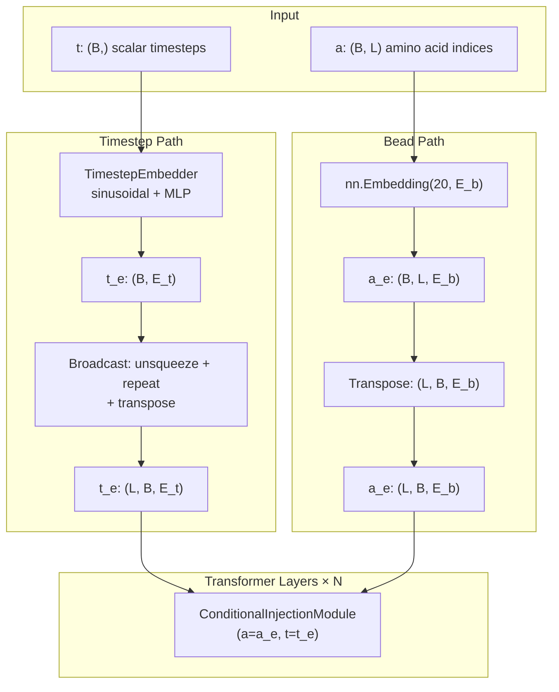
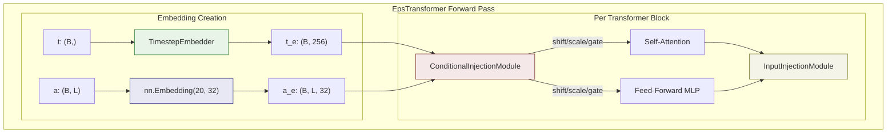

---
slug:13-timestep-and-sequence-embedding
blog_type:normal
---

**时间步**和**序列（珠）嵌入**是两个主要的条件信号，它们引导噪声预测 Transformer 朝着与特定扩散时间和氨基酸序列一致的去噪潜构象方向进行。它们共同构成了 `EpsTransformer` 网络的条件骨干：时间步嵌入告诉模型它在反向扩散过程中的*位置*，而珠嵌入则告诉模型它正在生成*什么*蛋白质序列。这些嵌入通过 `ConditionalInjectionModule` 融合并注入到每个 Transformer 块中，该模块支持三种不同的注入范式——**自适应层归一化**、**拼接**和**加性投影**——每种范式对条件信息如何调节内部表示施加了不同的归纳偏置。

来源: [embedding.py](sam/nn/noise_prediction/embedding.py#L1-L288), [eps.py](sam/nn/noise_prediction/eps.py#L424-L678)

## 时间步嵌入：正弦频率编码 + MLP

`TimestepEmbedder` 通过一个两阶段流水线将标量扩散时间步 $t \in [0, T)$ 转换为密集向量表示：**正弦频率编码**，随后是一个**两层 MLP**。此设计改编自 DiT（Diffusion Transformer）架构，并可追溯至最初的 GLIDE 位置嵌入方案。

**阶段 1 —— 正弦频率编码。** 静态方法 `timestep_embedding(t, dim, max_period=10000)` 将一批标量时间步映射到 `dim` 维的频率表示。对于半维度 `half = dim // 2`，它计算指数间隔的频率：

$$\text{freqs}_i = \exp\left(-\ln(\text{max\_period}) \cdot \frac{i}{\text{half}}\right), \quad i = 0, 1, \ldots, \text{half}-1$$

然后，该嵌入是在缩放时间步下求值的余弦和正弦的拼接：$[\cos(t \cdot \text{freqs}),\; \sin(t \cdot \text{freqs})]$。如果 `dim` 是奇数，则会追加一个零填充列以确保精确E精确的维度。`max_period=10000` 参数控制最小频率——较大的值会产生变化较慢（较粗糙）的频率分量，使模型能够区分相近和较远的时间步。

**阶段 2 —— MLP 投影。** 正弦编码通过带有 SiLU 激活函数的两层 MLP：`Linear(freq_dim → hidden_dim) → SiLU → Linear(hidden_dim → hidden_dim)`。这种可学习的投影将固定的正弦基重塑为适合模型内部几何结构的表示。默认配置使用 `frequency_embedding_size=256` 和 `hidden_size=256`（等于 `time_embed_dim`）。

来源: [embedding.py](sam/nn/noise_prediction/embedding.py#L14-L52), [eps.py](sam/nn/noise_prediction/eps.py#L544-L550)

## 序列（珠）嵌入：氨基酸查找表

珠嵌入向 Transformer 提供每个残基的氨基酸身份。它被实现为一个标准的 `nn.Embedding` 查找&表，包含 **20 个条目**（每个标准氨基酸一个5一个）和可配置的 `bead_embed_dim`。氨基酸排序遵循在(在 `aa_list = list("QWERTYIPASDFGHKLCVNM")` 中定义的)项目特定约定，该约定将 20 个标准残基中的?中的每一个映射到整数索引 0–19。在数据层面，`get_features_from_seq(seq)` 构建一个 20 通道的独热编码，`argmax` 提取存储在 `CG_Protein.a` 中的整数索引。

当 `use_bead_embed=False` 时，模型在?在**氨基酸无条件**模式下运行——在没有序列特异性的情况下生成构象。该架构还通过 `pt_embed_bead_dim` 为预训练嵌入（例如 ESM-2）预留了基础设施，尽管该路径目前未被激活。

| 参数 | 默认值 | 作用 |
|-----------|---------|------|
| `use_bead_embed` | `True` | 启用/禁用序列条件 |
| `bead_embed_dim` | `32` | 每个残基的嵌入维度 |
| `pt_embed_bead_dim` | `None` | 预训练 AA 嵌入的维度（未使用） |
| `use_single_bead` | `False` | 折叠为单个珠类型（1 个条目） |

来源: [sequences.py](sam/data/sequences.py#L1-L1), [cg_protein.py](sam/data/cg_protein.py#L96-L135), [eps.py](sam/nn/noise_prediction/eps.py#L527-L542)

## EpsTransformer 内部的嵌入流

`EpsTransformer` 的前向传播在将两种嵌入传入 Transformer 层之前，协调它们的创建和广播：

时间步嵌入 `t_e` 计算一次，形状为 `(B, E_t)`，然后通过 `unsqueeze(1).repeat(1, L, 1).transpose(0, 1)` **在所有序列位置上进行广播**，以生成 `(L, B, E_t)` 张量——批次元素中的每个残基都接收相同的时间步表示。珠嵌入 `a_e` 在转置后自然具有每个残基的变化，形状为 `(L, B, E_b)`。两者都作为参数传递给每个 `IdpGAN_TransformerBlock`。

来源: [eps.py](sam/nn/noise_prediction/eps.py#L634-L671)

## ConditionalInjectionModule：三种注入范式

`ConditionalInjectionModule` 是将时间步和珠嵌入与 Transformer 隐藏状态融合的核心机制。它支持三种模式，每种模式具有不同的架构含义：

### AdaLN-Zero 模式 (`mode="adanorm"`)

这是噪声预测网络中**主要且默认**的模式。它遵循 DiT 设计，实现了带有零初始化的自适应层归一化。组合条件信号 `c = bead_project(a_e) + t_e`（或在无条件下仅为 `c = t_e`）被馈送到 `SiLU → Linear(E_t → 6·E_embed)` 调制 MLP，通过 `.chunk(6, dim=2)` 产生六个缩放/偏移/门控向量：

| 输出 | 符号 | 应用点 |
|--------|--------|-------------------|
| `shift_msa` | $\gamma_1$ | 注意力前：$\text{modulate}(x, \gamma_1, \beta_1) = x(1+\beta_1) + \gamma_1$ |
| `scale_msa` | $\beta_1$ | 注意力前（相同调制） |
| `gate_msa` | $\alpha_1$ | 注意力后：$x \cdot \alpha_1$ |
| `shift_mlp` | $\gamma_2$ | MLP 前：$\text{modulate}(x, \gamma_2, \beta_2)$ |
| `scale_mlp` | $\beta_2$ | MLP 前（相同调制） |
| `gate_mlp` | $\alpha_2$ | MLP 后：$x \cdot \alpha_2$ |

如果 `bead_embed_dim ≠ time_embed_dim`，一个可学习的线性投影 `bead_project: Linear(E_b → E_t)` 会在求和前将珠嵌入对齐到时间步维度。最后线性层的权重和偏置的**零初始化**确保每个 Transformer 块始于恒等变换——条件信号在初始化时没有影响，其影响在训练期间逐渐增长。

### 拼接模式 (`mode="concat"`)

在此模式下，珠和时间步嵌入在 `inject_2_pre` 中直接拼接到 MLP 输入：MLP 输入变为 `[x; a_e; t_e]`（或在无条件下为 `[x; t_e]`），相应地扩展了 MLP 的输入维度。这是一种更简单、参数效率较低的方法，曾在原始 idpGAN 编码器中使用（配置中的 `embed_inject_mode: concat`）。

### 加性模式 (`mode="add"`)

加性模式将组合条件信号 `seq_project(t_e + bead_project(a_e))` 投影到嵌入维度，并将其添加到隐藏状态：`x = x + seq_project(t_e + bead_project(a_e))`。这仅在 `inject_1_proto` 阶段（归一化和注意力之前）应用，为所有位置提供统一的偏移。

来源: [embedding.py](sam/nn/noise_prediction/embedding.py#L59-L212), [eps.py](sam/nn/noise_prediction/eps.py#L94-L102)

## InputInjectionModule：调节潜输入

次级注入路径 `InputInjectionModule` 将**初始潜编码** `z_0` 与时间步嵌入融合，为网络提供对其输入的直接访问。它在每个 Transformer 块的输出处运行（由 `input_inject_pos="out"` 控制）。在 **`add` 模式**下，它将 `z_0` 投影到嵌入空间，并使用层归一化将其相加。在 **`adanorm` 模式**下，它使用完整的 adaLN 残差块：组合信号 `c = input_project(z_0) + time_project(t_e)` 驱动调制 MLP 产生偏移/缩放/门控三元组，这些三元组调节内部的 MLP，并封装在残差连接中。默认配置使用 `input_inject_mode="add"`。

来源: [embedding.py](sam/nn/noise_prediction/embedding.py#L219-L288), [eps.py](sam/nn/noise_prediction/eps.py#L117-L140)

## 配置摘要

下表将 `models.yaml` 中 `latent_network` 下的配置键映射到嵌入架构：

| 配置键 | 默认值 | 嵌入组件 |
|------------|---------|---------------------|
| `time_embed_dim` | `256` | `TimestepEmbedder` 的输出维度 |
| `time_freq_dim` | `256` | 正弦频率编码维度 |
| `use_bead_embed` | `true` | 启用氨基酸条件 |
| `bead_embed_dim` | `32` | `nn.Embedding` 输出维度 |
| `embed_inject_mode` | `adanorm` | `ConditionalInjectionModule` 模式 |
| `input_inject_mode` | `add` | `InputInjectionModule` 模式 |
| `input_inject_pos` | `out` | 应用输入注入的位置 |

<CgxTip>`bead_embed_dim=32` 被刻意设置为小于 `time_embed_dim=256` ——可学习的 `bead_project: Linear(32→256)` 投影将氨基酸身份扩展到完整的条件空间，确保时间步和序列信号在 adaLN 路径中共享公共维度以便求和。</CgxTip>

<CgxTip>六参数 adaLN-Zero 调制（偏移、缩放、门控 × {注意力, MLP}）意味着条件信号*同时*控制注意力/MLP 输入的归一化和它们输出的门控。这种双向控制对扩散模型至关重要：在早期时间步（高噪声），门控可以抑制注意力以防止对嘈杂输入的过拟合；在晚期时间步（低噪声），偏移和缩放可以锐化模型对近乎收敛结构的响应。</CgxTip>

来源: [models.yaml](config/models.yaml#L72-L106), [eps.py](sam/nn/noise_prediction/eps.py#L424-L460)

## 架构关系图

时间步嵌入不变地流经**每个** Transformer 层——它只计算一次并被重用。类似地，珠嵌入在序列级别计算一次并广播到所有层。每层的 `ConditionalInjectionModule` 独立学习如何调节该层的注意力和 MLP 子块，赋予每个深度级别自身的条件行为。

有关这些嵌入如何与 Transformer 注意力机制和层归一化交互的更深层上下文，请参阅[自定义 Transformer 注意力](11-custom-transformer-attention)和[自适应层归一化](12-adaptive-layer-normalization)。有关协调这些组件的完整噪声预测网络，请参阅[噪声预测网络](8-noise-prediction-network)。