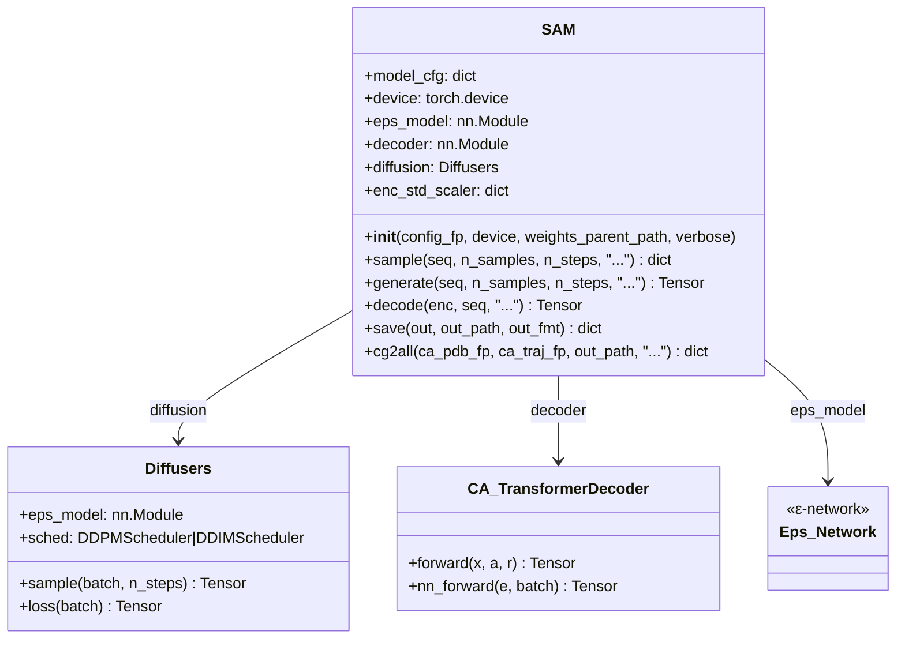
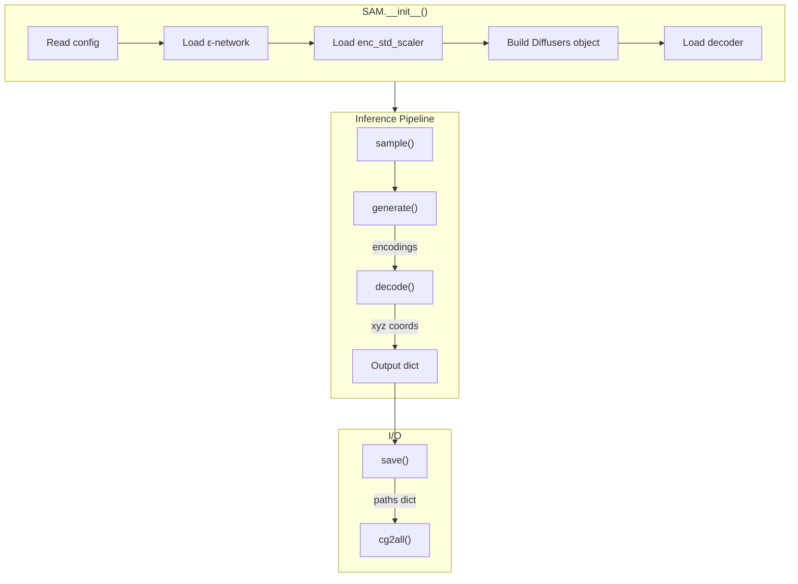

---
slug:14-sam-model-api-reference
blog_type:normal
---


`SAM` 类是运行 idpSAM 推理的主要编程接口。它将完整的两阶段流水线——**潜空间扩散采样**及随后的 **Transformer 解码**——封装在一个紧凑的、配置驱动的 API 之后，仅需一个序列字符串即可生成 Cα 构象系综。本文档详细记录了每个公共方法、其参数、返回类型，以及连接它们的内部数据流。

来源: [model.py](sam/model.py#L1-L434)

## 类概述

`SAM` 类位于 `sam.model` 中，充当一个自包含的推理封装器。在实例化时，它会读取 YAML/JSON 配置文件，加载三组预训练权重（ε-网络、解码器、可选的编码标准缩放器），并构建控制 DDPM 逆过程的 HuggingFace diffusers 调度器。后续所有的方法调用均基于这些预加载的组件运行。



初始化期间加载的三个神经网络组件对应于架构的两个阶段加上扩散调度器：

| 属性 | 配置项来源 | 权重文件 | 作用 |
|---|---|---|---|
| `eps_model` | `latent_network` | `nn.eps.pt` | 潜空间中的噪声预测 |
| `decoder` | `decoder` | `nn.dec.pt` | 潜变量 → Cα 坐标重建 |
| `diffusion` | `latent_generative_model` | (使用 `eps_model`) | DDPM/DDIM 采样循环 |
| `enc_std_scaler` | `encoder.std_scaler_fp` | `enc_std_scaler.pt` | 反归一化生成的编码 |

来源: [model.py](sam/model.py#L41-L123), [models.yaml](config/models.yaml#L1-L106)

## 构造函数

```python
SAM(config_fp, device="cpu", weights_parent_path=None, verbose=False)
```

| 参数 | 类型 | 默认值 | 描述 |
|---|---|---|---|
| `config_fp` | `str` | *必填* | YAML 或 JSON 模型配置文件的路径（例如 `config/models.yaml`） |
| `device` | `str` | `"cpu"` | PyTorch 设备——`"cpu"` 或 `"cuda"`。如果请求 `"cuda"` 但不可用，则抛出 `OSError` |
| `weights_parent_path` | `str` | `None` | 可选的基础目录，将前置到配置中的所有权重路径。当为 `None` 时，权重路径将按原样使用 |
| `verbose` | `bool` | `False` | 在初始化和推理期间打印进度消息 |

**初始化序列** 分三个阶段进行：

1. **配置阶段** — 通过 `read_cfg_file` 解析配置文件，支持 `.yaml`（需要 `pyyaml`）和 `.json` 扩展名。生成的字典存储为 `self.model_cfg`。
2. **扩散阶段** — 通过 `get_eps_network(model_cfg)` 实例化 ε-网络，从磁盘加载其状态字典，并将其移动至目标设备。如果 `generative_model.use_enc_std_scaler` 为 `True`，则同时加载编码标准缩放器（均值 `u` 和标准差 `s` 张量）。随后，使用该网络和调度器参数构建 `Diffusers` 扩散对象。
3. **解码阶段** — 通过 `get_decoder(model_cfg)` 实例化 `CA_TransformerDecoder`，加载其权重，并将其移动至目标设备。

<CgxTip>在 CPU 上加载时，所有 `torch.load` 调用均使用 `map_location=torch.device('cpu')`，以避免在装有 GPU 驱动但无可用设备的机器上分配 CUDA 内存。</CgxTip>

来源: [model.py](sam/model.py#L46-L123), [model.py](sam/model.py#L24-L38)

## `sample()` — 端到端系综生成

```python
sample(seq, n_samples=1000, n_steps=100, batch_size_eps=256,
       batch_size_dec=None, prot_name="protein", return_enc=False,
       out_type="numpy") → dict
```

这是**主要公共方法**。它编排完整的流水线：通过 DDPM 采样生成潜空间编码，然后将其解码为 Cα xyz 坐标。

| 参数 | 类型 | 默认值 | 描述 |
|---|---|---|---|
| `seq` | `str` | *必填* | 氨基酸序列（单字母代码，例如 `"GSWYR"`） |
| `n_samples` | `int` | `1000` | 要生成的构象数量 |
| `n_steps` | `int` | `100` | DDPM 逆扩散步数（范围：1–1000） |
| `batch_size_eps` | `int` | `256` | 扩散采样循环的批大小 |
| `batch_size_dec` | `int` | `None` | 解码的批大小。若为 `None`，则回退至 `batch_size_eps` |
| `prot_name` | `str` | `"protein"` | 嵌入在输出字典中的标识字符串 |
| `return_enc` | `bool` | `False` | 若为 `True`，则在输出中包含原始潜空间编码 |
| `out_type` | `str` | `"numpy"` | 输出张量格式：`"numpy"` (ndarray) 或 `"torch"` (CPU 张量) |

**返回字典结构：**

| 键 | 形状 | 类型 | 描述 |
|---|---|---|---|
| `"seq"` | — | `str` | 输入的氨基酸序列 |
| `"name"` | — | `str` | 蛋白质名称标识符 |
| `"xyz"` | `(n_samples, L, 3)` | ndarray 或 Tensor | Cα 坐标，单位为纳米 |
| `"time"` | — | `dict` | 计时细分：`"tot"` (总时间)，`"ddpm"` (扩散时间)，`"dec"` (解码时间) |
| `"enc"` | `(n_samples, L, enc_dim)` | ndarray 或 Tensor | 潜空间编码——**仅在 `return_enc=True` 时存在** |

在内部，`sample()` 依次调用 `generate()` 和 `decode()`，并合并它们的计时信息：

```mermaid
flowchart LR
    A["seq &#40;string&#41;"] --> B["generate&#40;&#41;"]
    B -->|"enc: &#40;N, L, 16&#41;"| C["decode&#40;&#41;"]
    C -->|"xyz: &#40;N, L, 3&#41;"| D["Output dict"]
    B -->|"time_ddpm"| D
    C -->|"time_dec"| D
```



来源: [model.py](sam/model.py#L134-L198)

## `generate()` — 潜空间编码采样

```python
generate(seq, n_samples=1000, n_steps=100, batch_size=256,
         prot_name="protein", return_time=False) → torch.Tensor
```

通过运行 DDPM 逆过程生成潜空间编码。如果你仅需要潜变量表示（例如用于分析或自定义解码），可以独立调用此方法。

| 参数 | 类型 | 默认值 | 描述 |
|---|---|---|---|
| `seq` | `str` | *必填* | 长度为 *L* 的氨基酸序列 |
| `n_samples` | `int` | `1000` | 编码样本数 |
| `n_steps` | `int` | `100` | DDPM 去噪步数 |
| `batch_size` | `int` | `256` | 数据加载器的小批量大小 |
| `prot_name` | `str` | `"protein"` | 数据集的蛋白质标识符 |
| `return_time` | `bool` | `False` | 若为 `True`，返回 `(encodings, elapsed_time)` 元组 |

**返回值：** 形状为 `(n_samples, L, enc_dim)` 的 `torch.Tensor`，其中 `enc_dim` 由 `model_cfg["generative_model"]["encoding_dim"]` 指定（默认值：16）。若 `return_time=True`，则返回 `(tensor, float)`。

**内部数据流：**

1. 构建一个 `EvalEncodedProteinDataset`，包含形状为 `(n_frames, L, enc_dim)` 的零初始化编码占位符。
2. 标准的 PyTorch `DataLoader` 对该数据集进行批量迭代。
3. 对于每个批次，`self.diffusion.sample(batch, n_steps=n_steps)` 执行完整的 DDPM 逆链，从纯高斯噪声 `x_T ~ N(0, I)` 开始，逐步去噪 `n_steps` 步。
4. 生成的编码被拼接并裁剪至恰好 `n_samples` 个。
5. 如果加载了 `enc_std_scaler`，则应用逆标准化 `enc = enc * s + u` 将编码重新缩放回原始分布。

来源: [model.py](sam/model.py#L201-L266), [cg_protein.py](sam/data/cg_protein.py#L1275-L1324)

## `decode()` — 编码到坐标解码

```python
decode(enc, seq, batch_size=256, prot_name="protein",
       return_time=False) → torch.Tensor
```

使用预训练的 `CA_TransformerDecoder` 将潜空间编码映射为 Cα xyz 坐标。

| 参数 | 类型 | 默认值 | 描述 |
|---|---|---|---|
| `enc` | `torch.Tensor` | *必填* | 形状为 `(n_samples, L, enc_dim)` 的编码 |
| `seq` | `str` | *必填* | 氨基酸序列（提供残基身份特征） |
| `batch_size` | `int` | `256` | 解码的小批量大小 |
| `prot_name` | `str` | `"protein"` | 数据集的蛋白质标识符 |
| `return_time` | `bool` | `False` | 若为 `True`，返回 `(xyz, elapsed_time)` 元组 |

**返回值：** 形状为 `(n_samples, L, 3)` 的 `torch.Tensor`，包含以纳米为单位的 Cα 位置。若 `return_time=True`，则返回 `(tensor, float)`。

**内部数据流：**

1. 从序列字符串构建 `EvalProteinDataset`，提供每个残基的氨基酸索引 (`batch.a`) 和残基位置索引 (`batch.r`)。
2. 对于每个批次，将编码切片 `enc[tot:tot+batch_size]` 对齐到形状为 `(B, L, enc_dim)` 的 `batch_y` 中。
3. 在 `torch.no_grad()` 下调用解码器的 `nn_forward(batch_y, batch)`，生成 xyz 坐标。
4. 将结果拼接并裁剪至恰好 `n_samples` 个。

来源: [model.py](sam/model.py#L269-L338)

## `save()` — 将输出持久化到磁盘

```python
save(out, out_path, out_fmt="dcd") → dict
```

将输出字典（来自 `sample()`）写入磁盘。始终保存 FASTA 序列文件；坐标格式可选。

| 参数 | 类型 | 默认值 | 描述 |
|---|---|---|---|
| `out` | `dict` | *必填* | `sample()` 返回的输出字典 |
| `out_path` | `str` | *必填* | 基础输出路径（扩展名会自动追加） |
| `out_fmt` | `str` | `"dcd"` | 坐标格式：`"dcd"` 或 `"numpy"` |

**按格式生成的输出文件：**

| 格式 | 创建的文件 | 描述 |
|---|---|---|
| `"dcd"` | `*.seq.fasta`, `*.ca.traj.dcd`, `*.ca.top.pdb` | 兼容 MDTraj 的 DCD 轨迹 + Cα PDB 拓扑 |
| `"numpy"` | `*.seq.fasta`, `*.ca.xyz.npy` | 坐标的原始 NumPy ndarray |

**返回值：** 一个将文件类型键（`"fasta"`、`"ca_dcd"`、`"ca_pdb"` 或 `"ca_npy"`）映射到其 `pathlib.Path` 对象的字典。这些路径在链式调用 `cg2all()` 时非常有用。

来源: [model.py](sam/model.py#L341-L393), [topology.py](sam/data/topology.py#L7-L13)

## `cg2all()` — 全原子重建

```python
cg2all(ca_pdb_fp, ca_traj_fp, out_path, batch_size=1,
       device="cpu") → dict
```

委托给外部 `cg2all` 工具，从 Cα 构象中重建全原子细节。此方法将 `convert_cg2all` 命令行工具作为子进程调用。

| 参数 | 类型 | 默认值 | 描述 |
|---|---|---|---|
| `ca_pdb_fp` | `str` | *必填* | Cα 拓扑 PDB 文件的路径（来自 `save()["ca_pdb"]`） |
| `ca_traj_fp` | `str` | *必填* | Cα 轨迹 DCD 文件的路径（来自 `save()["ca_dcd"]`） |
| `out_path` | `str` | *必填* | 全原子文件的基础输出路径 |
| `batch_size` | `int` | `1` | 用于 GPU 加速的 cg2all 批大小 |
| `device` | `str` | `"cpu"` | cg2all 推理的设备（`"cpu"` 或 `"cuda"`） |

**返回值：** 包含键 `"aa_dcd"` 和 `"aa_top"` 的字典，分别映射到输出的全原子 DCD 轨迹和 PDB 拓扑路径。

<CgxTip>必须单独安装 `cg2all` 库。如果外部命令失败，此方法将抛出 `subprocess.SubprocessError`——请检查异常消息中的 stderr 以进行诊断。</CgxTip>

来源: [model.py](sam/model.py#L396-L434)

## 完整使用模式

以下示例反映了推理脚本，并按规范的调用顺序演示了每个公共方法：

```python
from sam.model import SAM

# 1. 从配置初始化。
model = SAM(config_fp="config/models.yaml", device="cuda", verbose=True)

# 2. 生成 Cα 系综。
out = model.sample(
    seq="GSWYRAPTLLV",       # 氨基酸序列
    n_samples=500,           # 构象数量
    n_steps=100,             # 扩散去噪步数
    batch_size_eps=250,      # 扩散批大小
    batch_size_dec=250,      # 解码器批大小
    return_enc=False,        # 设为 True 以同时获取潜空间编码
    out_type="numpy"         # "numpy" 或 "torch"
)

# 3. 将坐标保存到磁盘。
paths = model.save(out=out, out_path="outputs/my_protein", out_fmt="dcd")

# 4. (可选) 重建全原子细节。
aa_paths = model.cg2all(
    ca_pdb_fp=str(paths["ca_pdb"]),
    ca_traj_fp=str(paths["ca_dcd"]),
    out_path="outputs/my_protein",
    batch_size=50,
    device="cuda"
)
```

对于逐步分解，`generate()` 和 `decode()` 可以独立调用：

```python
# 仅阶段 1：潜空间采样
enc = model.generate(seq="GSWYRAPTLLV", n_samples=500, n_steps=100)

# 仅阶段 2：解码预存的编码
xyz = model.decode(enc=enc, seq="GSWYRAPTLLV", batch_size=250)
```

来源: [generate_ensemble.py](scripts/generate_ensemble.py#L84-L112), [model.py](sam/model.py#L134-L198)

## 方法交互图



来源: [model.py](sam/model.py#L41-L123), [model.py](sam/model.py#L134-L434)

## 内部辅助方法

| 方法 | 签名 | 用途 |
|---|---|---|
| `_get_weights_path` | `(path) → str` | 解析权重文件路径。若设置了 `weights_parent_path`，则将其前置；否则原样返回该路径 |
| `_to` | `(t, out_type) → ndarray 或 Tensor` | 将张量转换为所需的输出格式（`"numpy"` → `.cpu().numpy()`，`"torch"` → `.cpu()`） |

来源: [model.py](sam/model.py#L125-L131), [model.py](sam/model.py#L192-L198)

## SAM 类使用的配置键

构造函数从模型配置字典中读取以下键。有关包含默认值的完整架构，请参见[配置参考](15-configuration-reference)。

| 配置节 | 键 | 使用者 |
|---|---|---|
| `latent_network` | `weights` | `__init__` — ε-网络权重路径 |
| `generative_model` | `use_enc_std_scaler` | `__init__` — 是否加载编码缩放器 |
| `generative_model` | `encoding_dim` | `generate()` — 潜向量维度 |
| `encoder` | `std_scaler_fp` | `__init__` — 缩放器权重路径 |
| `decoder` | `weights` | `__init__` — 解码器权重路径 |
| `latent_generative_model` | `type`, `sched_params` | `__init__` — 扩散调度器配置 |

来源: [model.py](sam/model.py#L86-L111), [models.yaml](config/models.yaml#L60-L71)

---

**下一步：** 有关配置文件的详细参数架构，请参见[配置参考](15-configuration-reference)。有关为内部数据加载器提供支持的 Dataset 类，请参见[数据集与数据流水线](16-dataset-and-data-pipeline)。有关 cg2all 重建过程，请参见[通过 cg2all 进行全原子重建](17-all-atom-reconstruction-via-cg2all)。