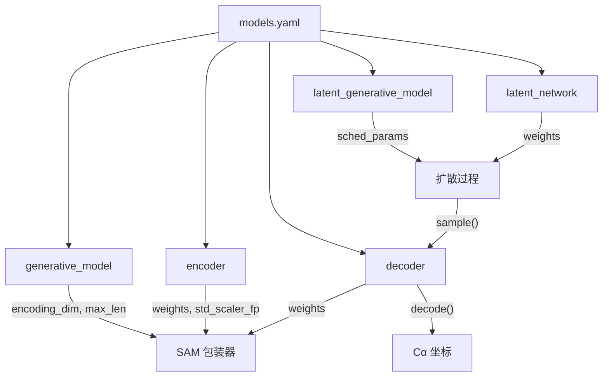

---
slug:15-configuration-reference
blog_type:normal
---


idpSAM 模型由单个 **YAML 配置文件**驱动，该文件声明了两阶段自编码器 + 潜在扩散流水线中的每一个架构选择、超参数和权重路径。参考实现随 [`config/models.yaml`](config/models.yaml) 一起提供，它被 [`SAM`](sam/model.py#L48) 包装类通过 [`read_cfg_file()`](sam/model.py#L27) 消费。本页面为该配置文件中的每个部分和参数提供了完整的逐字段参考。

来源：[models.yaml](config/models.yaml#L1-L106), [model.py](sam/model.py#L27-L46)

## 配置文件格式

系统同时接受 **YAML** (`.yaml`) 和 **JSON** (`.json`) 配置文件。YAML 是首选格式——它对 `!!float` 标签和嵌套字典的支持自然地映射到分层的模型规范。加载器根据文件扩展名进行分派，对 YAML 使用 `yaml.safe_load`，对 JSON 使用 `json.load`。**配置中的文件路径相对于当前工作目录**；请使用绝对路径指向系统上的特定位置。

来源：[model.py](sam/model.py#L27-L46), [README.md](config/README.md#L1-L2)

## 顶层结构

配置被组织为 **五个顶层部分**，每个部分管控流水线的一个不同组件：

| 部分 | 目标组件 | 用途 |
|---|---|---|
| `generative_model` | 全局流水线 | 数据类型、编码维度、序列限制 |
| `encoder` | 欧几里得不变编码器 | 架构、距离图嵌入、扭转角特征 |
| `decoder` | Transformer 解码器 | 架构、注意力机制、氨基酸条件化 |
| `latent_generative_model` | DDPM 扩散过程 | 噪声调度、损失函数 |
| `latent_network` | 噪声预测网络 | Transformer 架构、时间步/序列嵌入、EMA |



来源：[models.yaml](config/models.yaml#L1-L106), [model.py](sam/model.py#L65-L120)

## `generative_model` — 全局流水线设置

此部分定义了粗粒度表示以及所有流水线阶段共享的潜在空间维度。

| 参数 | 类型 | 默认值 | 描述 |
|---|---|---|---|
| `data_type` | `str` | `"cg_protein"` | 数据格式标识符。目前仅支持 `"cg_protein"`。 |
| `bead_type` | `str` | `"ca"` | 粗粒度珠类型。`"ca"` 表示仅 Cα 表示。 |
| `encoding_dim` | `int` | `16` | 潜在编码向量的维度。此值同时传递给编码器输出和解码器/噪声预测输入。 |
| `use_enc_std_scaler` | `bool` | `true` | 是否在生成编码之后、解码之前应用学习到的标准缩放器（均值/标准差）。当为 `true` 时，将加载 `encoder.std_scaler_fp` 处的缩放器权重。 |
| `max_len` | `int` | `60` | 模型训练时的最大序列长度（以残基计）。 |

`encoding_dim` 值尤为关键——它作为 `input_dim` 流入噪声预测网络，并作为 `encoding_dim` 流入解码器，从而确立了整个潜在空间的维度约束。

来源：[models.yaml](config/models.yaml#L4-L9), [model.py](sam/model.py#L88-L99)

## `encoder` — 欧几里得不变编码器

此部分配置 [`CA_TransformerEncoder`](sam/nn/autoencoder/encoder.py#L32)，它将 Cα 坐标映射为潜在编码。这是唯一一个在推理时不由 `SAM` 包装器加载的组件（编码器仅在训练期间使用），但模型初始化一致性仍需其配置。

### 架构参数

| 参数 | 类型 | 默认值 | 描述 |
|---|---|---|---|
| `arch` | `str` | `"enc_ca_trf"` | 架构标识符。用于模型分派。 |
| `num_layers` | `int` | `5` | Transformer 编码器层数。 |
| `embed_dim` | `int` | `128` | 编码器全局的隐藏嵌入维度。 |
| `embed_2d_dim` | `int` | `192` | 2D（成对）嵌入的维度——距离图投影。 |
| `d_model` | `int|null` | `null` | 多头注意力的内部维度。当为 `null` 时，默认为 `embed_dim`。 |
| `num_heads` | `int` | `8` | 注意力头数。 |
| `mlp_dim` | `int` | `256` | 每个 Transformer 块中前馈 MLP 的隐藏维度。 |
| `dropout` | `float|null` | `null` | Dropout 率。`null` 表示无 Dropout。 |
| `norm_eps` | `float` | `1e-5` | LayerNorm 数值稳定性的 Epsilon 值。 |
| `norm_pos` | `str` | `"pre"` | LayerNorm 位置：`"pre"`（前置归一化）或 `"post"`（后置归一化）。 |
| `activation` | `str` | `"gelu"` | 激活函数名称。 |
| `out_mode` | `str` | `"idpgan_norm"` | 输出模块样式。`"idpgan_norm"` 添加一个最终的非仿射 LayerNorm。 |

### 嵌入与条件化参数

| 参数 | 类型 | 默认值 | 描述 |
|---|---|---|---|
| `bead_embed_dim` | `int` | `32` | 氨基酸类型嵌入的维度（20 种残基类型 → `bead_embed_dim`）。 |
| `pos_embed_dim` | `int` | `64` | 位置（序列间隔）嵌入的维度。 |
| `use_bias_2d` | `bool` | `true` | 是否在 2D 嵌入线性投影中使用偏置。 |
| `pos_embed_r` | `int` | `32` | AlphaFold2 风格位置嵌入的序列间隔阈值。 |
| `embed_inject_mode` | `str` | `"concat"` | 氨基酸嵌入的注入方式：`"concat"`（拼接）或 `"adanorm"`（自适应层归一化）。 |
| `embed_2d_inject_mode` | `str` | `"concat"` | 2D（成对）嵌入注入注意力的方式。 |

### 距离图与扭转角参数

| 参数 | 类型 | 默认值 | 描述 |
|---|---|---|---|
| `dmap_ca_min` | `float` | `0.0` | RBF 展开起始的最小 Cα–Cα 距离 (Å)。 |
| `dmap_ca_cutoff` | `float` | `3.0` | RBF 展开终止的最大 Cα–Cα 距离 (Å)。 |
| `dmap_ca_num_gaussians` | `int` | `320` | RBF 距离嵌入中高斯基函数的数量。 |
| `dmap_embed_type` | `str` | `"rbf"` | 距离嵌入类型：`"rbf"`（高斯平滑）或 `"expnorm"`（指数归一化）。 |
| `use_dmap_mlp` | `bool` | `true` | 是否在 RBF 投影后应用 2 层 MLP（对比单层线性层）。 |
| `use_torsions` | `bool` | `true` | 是否将主链扭转角特征作为 1D 输入包含。 |

### 权重路径

| 参数 | 类型 | 默认值 | 描述 |
|---|---|---|---|
| `weights` | `str` | `"./weights/v1.0/nn.enc.pt"` | 编码器检查点文件的路径。 |
| `std_scaler_fp` | `str` | `"./weights/v1.0/enc_std_scaler.pt"` | 编码标准缩放器检查点的路径。仅当 `generative_model.use_enc_std_scaler` 为 `true` 时使用。 |

来源：[models.yaml](config/models.yaml#L11-L37), [encoder.py](sam/nn/autoencoder/encoder.py#L32-L183)

## `decoder` — Transformer 解码器

此部分配置 [`CA_TransformerDecoder`](sam/nn/autoencoder/decoder.py#L18)，它将潜在编码映射为 Cα 坐标。解码器在推理时加载，并分批应用于生成的编码。

| 参数 | 类型 | 默认值 | 描述 |
|---|---|---|---|
| `type` | `str` | `"deterministic"` | 解码器类型。`"deterministic"` 表示单次前向传播且无采样噪声。 |
| `arch` | `str` | `"dec_ca_trf"` | 用于模型分派的架构标识符。 |
| `use_input_mlp` | `bool` | `true` | 是否通过 2 层 MLP（`Linear → Activation → Linear`）投影潜在输入，而非单层线性层。 |
| `num_layers` | `int` | `5` | Transformer 解码器层数。 |
| `attention_type` | `str` | `"timewarp"` | 注意力机制：`"transformer"`（自定义）或 `"timewarp"`。 |
| `embed_dim` | `int` | `128` | 隐藏嵌入维度。 |
| `d_model` | `int` | `512` | 多头注意力的内部维度。覆盖 `null` 默认值以使用更宽的注意力瓶颈。 |
| `num_heads` | `int` | `32` | 注意力头数。 |
| `mlp_dim` | `int` | `256` | 前馈 MLP 隐藏维度。 |
| `dropout` | `float|null` | `null` | Dropout 率。`null` 表示无 Dropout。 |
| `norm_eps` | `float` | `1e-5` | LayerNorm Epsilon 值。 |
| `norm_pos` | `str` | `"pre"` | LayerNorm 位置。 |
| `activation` | `str` | `"gelu"` | 激活函数。 |
| `bead_embed_dim` | `int|null` | `null` | 氨基酸嵌入维度。当为 `null` 时，不创建珠嵌入。 |
| `pos_embed_dim` | `int` | `64` | 位置嵌入维度。 |
| `use_bias_2d` | `bool` | `true` | 2D 嵌入投影中的偏置。 |
| `pos_embed_r` | `int` | `32` | 位置嵌入阈值。 |
!| `embed_inject_mode` | `str|null` | `null` | 氨基酸条件化模式。`null` 禁用解码器中的条件化。 |
| `weights` | `str` | `"./weights/v1.0/nn.dec.pt"` | 解码器检查点的路径。 |

解码器的 `embed_inject_mode: null` 是一个深思熟虑的设计选择：在推理时，解码器对氨基酸类型**无条件**操作——仅依赖位置嵌入和潜在编码输入。这与编码器和噪声预测网络形成对比，后者均使用了氨基酸条件化)。

来源：[models.yaml](config/models.yaml#L39-L58), [decoder.py](sam/nn/autoencoder/decoder.py#L18-L187)

## `latent_generative_model` — DDPM 扩散过程

此部分配置 [`Diffusers`](sam/diffusion/diffusers_dm.py#L10) 扩散调度器和损失，它们管控前向/加噪过程和反向采样过程。它封装了 HuggingFace `diffusers` 库的 `DDPMScheduler`。

| 参数 | 类型 | 默认值 | 描述 |
|---|---|---|---|
| `type` | `str` | `"diffusers_dm"` | 扩散后端标识符。`"diffusers_dm"` 使用 HuggingFace diffusers 集成。 |
| `loss` | `str` | `"l2"` | 训练损失函数。目前仅支持 `"l2"` (MSE)。 |

### `sched_params` — 噪声调度参数

| 参数 | 类型 | 默认值 | 描述 |
|---|---|---|---|
| `name` | `str` | `"ddpm"` | 调度器类型：`"ddpm"` 或 `"ddim"`。 |
| `num_train_timesteps` | `int` | `1000` | 训练调度中扩散时间步 T 的总数。推理时通过 `n_steps` 使用其子集进行采样。 |
| `beta_start` | `float` | `0.0001` | β 调度的起始值。 |
| `beta_end` | `float` | `0.02` | β 调度的结束值。 |
| `beta_schedule` | `str` | `"sigmoid"` | β 调度形状。选项包括 `"linear"`、`"scaled_linear"`、`"squaredcos5cos_cap_v2"` 和 `"sigmoid"`。 |
| `variance_type` | `str` | `"fixed_small"` | 反向过程的方差类型。`"fixed_small"` 使用后验方差。 |
| `prediction_type` | `str` | `"epsilon"` | 噪声预测网络的输出内容。`"epsilon"` 表示预测噪声（ε-预测）。 |

在推理时，采样步数由传递给 [`SAM.sample()`](sam/model.py#L130) 的 `n_steps` 参数控制，而非配置文件。这允许在不修改模型定义的情况下权衡质量与速度。

来源：[models.yaml](config/models.yaml#L60-L70), [diffusers_dm.py](B/sam/diffusion/diffusers_dm.py#L10-L66), [__init__.py](sam/diffusion/__init__.py#L4-L15)

## `latent_network` — 噪声预测网络

此部分配置 [`EpsTransformer`](sam/nn/noise_prediction/eps.py#L424)，它根据带噪潜在编码、扩散时间步和氨基酸序列预测噪声 ε。这是最大且参数最丰富的部分。

### 核心架构

| 参数 | 类型 | 默认值 | 描述 |
|---|---|---|---|
| `arch` | `str` | `"eps_trf"` | 噪声预测网络的架构标识符。 |
| `num_layers` | `int` | `16` | Transformer 层数。这是流水线中最深的组件。 |
| `attention_type` | `str` | `"transformer"` | 注意力类型：`"transformer"`（自定义实现）或 `"pytorch"`（PyTorch 原生）。 |
| `embed_dim` | `int` | `256` | 隐藏嵌入维度。 |
| `d_model` | `int|null` | `null` | 内部注意力维度。`null` 默认为 `embed_dim`。 |
| `num_heads` | `int` | `16` | 多头注意力头数。 |
| `mlp_dim` | `int` | `512` | 前馈 MLP 隐藏维度。 |
| `dropout` | `float|null` | `null` | Dropout 率。`null` = 无 Dropout。 |
| `norm_eps` | `float` | `1e-5` | LayerNorm Epsilon 值。 |
| `norm_pos` | `str` | `"pre"` | LayerNorm 位置。 |
| `activation` | `str` | `"gelu"` | 激活函数。 |
| `out_mode` | `str` | `"idpgan"` | 输出模块样式。`"idpgan"` 使用 2 层 MLP：`Linear → Activation → Linear`。 |

### 时间步与珠嵌入

| 参数 | 类型 | 默认值 | 描述 |
|---|---|---|---|
| `time_embed_dim` | `int` | `256` | 时间步嵌入向量的维度。 |
| `time_freq_dim` | `int` | `256` | 投影前正弦频率嵌入的维度。 |
| `use_bead_embed` | `bool` | `true` | 是否使用氨基酸类型嵌入进行条件化。 |
| `bead_embed_dim` | `int` | `32` | 氨基酸嵌入的维度。 |
| `pt_embed_bead_dim` | `int|null` | `null` | 预训练氨基酸嵌入（如 ESM-2）的维度。`null` 表示从零开始学习嵌入。 |

### 位置与边嵌入

| 参数 | 类型 | 默认值 | 描述 |
|---|---|---|---|
| `pos_embed_dim` | `int` | `64` | 位置（序列间隔）嵌入的维度。 |
| `use_bias_2d` | `bool` | `true` | 2D 嵌入线性投影中的偏置。 |
| `pos_embed_r` | `int` | `32` | 序列间隔的位置嵌入阈值。 |
| `edge_embed_dim` | `int` | `192` | 边（成对）嵌入的维度。 |
| `edge_embed_mode` | `str|null` | `null` | 边嵌入模式。`null` 禁用位置以外的边嵌入。 |
| `edge_update_mode` | `str|null` | `null` | 边更新机制。`null` 禁用边更新。 |
| `edge_update_freq` | `int` | `1` | 应用边更新的频率（以层计）。 |

### 条件化与注入模式

| 参数 | 类型 | 默认值 | 描述 |
|---|---|---|---|
| `embed_inject_mode` | `str` | `"adanorm"` | 时间步 + 珠嵌入注入每个 Transformer 块的方式。`"adanorm"` 使用自适应层归一化 (AdaLN)。 |
| `input_inject_mode` | `str` | `"add"` | 初始（带噪）输入重新注入 Transformer 层的方式。`"add"` 在投影后执行残差加法。 |
| `input_inject_pos` | `str` | `"out"` | 块中输入注入发生的位置：`"out"` = 在 MLP 之后。 |

### 混合精度与 EMA（仅训练时）

| 参数 | 类型 | 默认值 | 描述 |
|---|---|---|---|
| `_use_fp16` | `bool` | `true` | 在训练期间启用 FP16 混合精度。前缀 `_` 表示仅训练时有效。 |
| `_use_ema` | `bool` | `true` | 在训练期间启用模型权重的指数移动平均。 |
| `_ema_params.beta` | `float` | `0.9999` | EMA 衰减率。 |
| `_ema_params.update_after_step` | `int` | `100` | 在此训练步数之后开始 EMA 更新。 |
| `_ema_params.update_every` | `int` | `10` | 每 N 步更新一次 EMA 权重。 |

### 权重路径

| 参数 | 类型 | 默认值 | 描述 |
|---|---|---|---|
| `weights` | `str` | `"./weights/v1.0/nn.eps.pt"` | 噪声预测网络检查点的路径。 |

<CgxTip>`_use_fp16`、`_use_ema` 和 `_ema_params` 子参数是**仅训练时**的设置——它们在推理时无效。`SAM` 包装器直接从 `weights` 指定的检查点文件中加载最终的（EMA 平均后的）权重。</CgxTip>

来源：[models.yaml](config/models.yaml#L72-L106), [eps.py](sam/nn/noise_prediction/eps.py#L424-L632), [eps.py](sam/nn/noise_prediction/eps.py#L711-L724)

## 参数加载机制

配置并非严格的模式——每个网络构造函数使用**基于 inspect 的签名匹配**来提取其识别的参数。`get_eps_network()` 和 `get_decoder()` 函数遍历其目标类的 `__init__` 参数名称，从相应的配置部分提取匹配的键：

```python
# 来自 get_eps_network():
eps_args = list(inspect.signature(EpsTransformer.__init__).parameters.keys())
eps_args.remove("input_dim")  # 由 generative_model.encoding_dim 提供
eps_params = {}
for eps_arg in eps_args:
    if eps_arg in model_cfg["latent_network"]:
        eps_params[eps_arg] = model_cfg["latent_network"][eps_arg]
```

这意味着：(1) 配置中与任何构造函数参数不匹配的**额外键**将被静默忽略，(2) **缺失键**将回退到构造函数的默认值。`input_dim` / `encoding_dim` 参数始终从 `generative_model.encoding_dim` 显式提供，而非来自该部分的字典。

来源：[eps.py](sam/nn/noise_prediction/eps.py#L711-L724), [decoder.py](sam/nn/autoencoder/decoder.py#L172-L187)

## 默认配置摘要

下表一览总结了随附的 v1.0 配置，突出了三个网络组件之间的架构不对称性：

| 方面 | 编码器 | 解码器 | 噪声预测 (ε) |
|---|---|---|---|
| 层数 | 5 | 5 | **16** |
| `embed_dim` | 128 | 128 | **256** |
| `d_model` | null (=128) | **512** | null (=256) |
| `num_heads` | 8 | 32 | 16 |
| `mlp_dim` | 256 | 256 | **512** |
| 注意力类型 | — | **timewarp** | transformer |
| AA 条件化 | **concat** | **none** | **adanorm** |
| 2D 嵌入 | **192** (距离图) | none | none |
| 输入投影 | 扭转角 MLP | 输入 MLP | 线性 |
| 特殊特征 | RBF + 扭转角 | — | 时间步嵌入 + 输入注入 |

<CgxTip>噪声预测网络是计算瓶颈——它拥有 16 层 256 维，而自编码器仅为 5 层 128 维。在调整批大小或序列长度限制时，请主要为此组件预算 GPU 显存。</CgxTip>

来源：[models.yaml](config/models.yaml#L1-L106)

## 修改配置

要使用自定义配置，请复制 `config/models.yaml` 并调整所需参数。将推理脚本或 `SAM` 构造函数指向新文件：

```bash
# 通过推理脚本
python scripts/generate_ensemble.py -c path/to/custom_models.yaml -s SEQUENCE -o output

# 通过 Python API
from sam.model import SAM
model = SAM(config_fp="path/to/custom_models.yaml", device="cuda")
```

推理时最常见的调整是：(1) `encoder.weights`、`decoder.weights` 和 `latent_network.weights` 下的**权重路径**，用于加载不同的模型检查点；(2) `generative_model.max_len`，用于处理训练长度范围之外的序列。**架构参数**（层数、维度等）必须与加载的检查点相匹配——未经重训练而更改它们将产生形状不匹配错误。

要深入探索这些参数如何在每个网络中体现，请参阅[欧几里得不变编码器](5-euclidean-invariant-encoder)、[Transformer 解码器](6-transformer-decoder)、[噪声预测网络](8-noise-prediction-network) 和 [DDPM 采样过程](7-ddpm-sampling-process)。