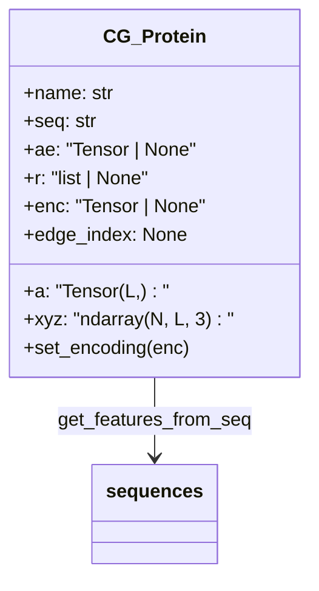
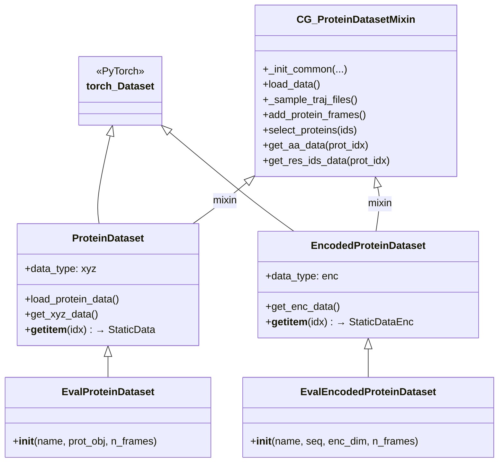
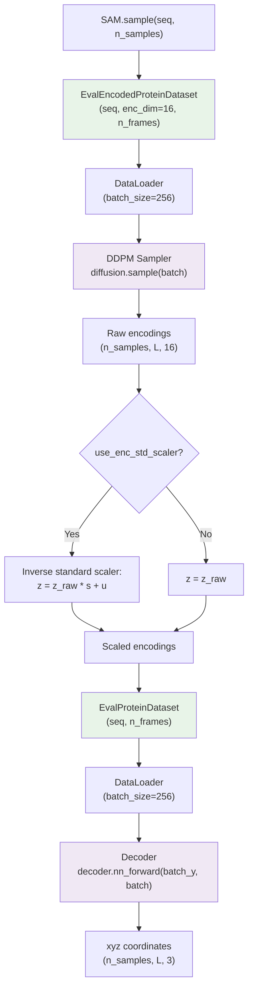

---
slug:16-dataset-and-data-pipeline
blog_type:normal
---

idpsam 中的数据管道连接了原始分子轨迹数据与两阶段生成模型，将粗粒化蛋白质构象转换为批次张量，以供编码器/解码器使用及潜空间扩散采样。该管道的核心围绕 PyTorch `Dataset` 类的层次结构展开，这些类对存储格式（DCD 轨迹、NumPy 数组、Torch 张量）、珠子表示（Cα、质心、自定义粗粒化）和数据模态（XYZ 坐标 vs. 潜空间编码）进行了抽象——所有这些均通过一个基于 `namedtuple` 的共享批次协议统一起来，该协议在不引入依赖的情况下模拟了 `torch_geometric` 的语义。

## 氨基酸词汇表与序列特征

每个数据样本的基础是氨基酸序列。模块 [`sequences.py`](sam/data/sequences.py) 以固定顺序（`QWERTYIPASDFGHKLCVNM`）定义了 **20 种标准残基**，该顺序决定了由 `get_features_from_seq` 生成的独热编码。此顺序并非按字母排列——它是项目专属的约定，在训练和推理过程中必须保持一致。该模块还提供了双向单字母 ↔ 三字母字典、将残基划分为**带正电**（`K`、`R`）和**带负电**（`D`、`E`）的子集，以及一个用于计算序列净电荷比例的辅助函数 `get_net_q_res`。

来源: [sequences.py](sam/data/sequences.py#L1-L34)

## CG_Protein：分子数据容器

`CG_Protein` 类是数据管道的原子单元——即承载其名称、序列、坐标数组和衍生特征的单一蛋白质实体。在构造时，它会立即计算**独热氨基酸特征向量** `a`（形状为 `(L,)`，包含整数类别索引，由 20 通道独热编码通过 `argmax` 导出），并为可选的氨基酸嵌入（`ae`）、能量（`e`）、编码（`enc`）和图结构属性（`edge_index`、`nr_edge_index`、`chain_torsion_mask`）预留槽位。坐标数组 `xyz` 遵循 `(n_frames, L, 3)` 的约定，其中 `L` 为序列长度，`r` 则存储可选的位置残基 ID（在下游默认为 `torch.arange(0, L)`）。

来源: [cg_protein.py](sam/data/cg_protein.py#L94-L135)

## 批次数据协议：StaticData 与 StaticDataEnc

idpsam 没有依赖 `torch_geometric` 的 `Data` 对象，而是通过两个派生自 `namedtuple` 的类定义了自己的轻量级批次协议。**`StaticData`** 封装了 XYZ 帧批次，包含键 `x`、`a`、`ae`、`r`、`x_t`——供坐标空间编码器和解码器使用。**`StaticDataEnc`** 则用潜空间编码槽替换了坐标槽，包含键 `z`、`a`、`ae`、`r`、`z_t`——供潜空间扩散模型使用。两者均继承自 `StaticDataMixin`，该混合类提供了以下功能：

| 方法 / 属性 | 用途 |
|---|---|
| `.to(device)` | 将所有张量字段移动到指定设备 |
| `.num_graphs` | 返回批次大小（主张量的第一维度） |
| `.num_nodes` | 返回批次中的节点总数 |
| `.batch` | 构造一个 `torch.arange` 批次索引向量，用于按图聚合 |
| `.select_ids(ids)` | 通过批次索引掩码对所有字段进行切片 |

`x_t` / `z_t` 字段支持**基于模板的建模**（TBM），其中每个样本会附带一个参考构象。当禁用 TBM 时（`tbm_mode=None`），这些字段默认为 `0`。

来源: [cg_protein.py](sam/data/cg_protein.py#L32-L88)

## 数据集类层次结构

数据集架构遵循清晰的继承链，将数据模态与使用上下文的关注点分离开来：

### ProteinDataset — 坐标空间训练数据

`ProteinDataset` 是在自编码器训练期间加载原始分子动力学轨迹的主数据集。它接受一个 JSON 输入文件路径列表（`input_fp_list`），每个路径指向一个蛋白质的数据清单。关键的初始化参数控制着数据的选择与增强：

| 参数 | 类型 | 默认值 | 描述 |
|---|---|---|---|
| `input_fp_list` | `list` | 必需 | JSON 蛋白质清单的 Glob 模式或路径 |
| `stride` | `int` | `1` | 帧步长（目前必须为 1） |
| `n_trajs` | `int` | `None` | 每个蛋白质随机选择 N 个轨迹文件 |
| `n_frames` | `int` | `None` | 从已加载数据中随机选择 N 帧 |
| `frames_mode` | `str` | `"ensemble"` | `"trajectory"` 按文件采样；`"ensemble"` 从合并集合中采样 |
| `input_format` | `str` | `"dcd"` | `"dcd"` 代表 MDTraj 轨迹；`"numpy"` 代表 `.npy` 文件 |
| `bead_type` | `str` | `"ca"` | `"ca"`（Cα 原子），`"com"`（质心），`"cg"`（自定义粗粒化） |
| `xyz_sigma` | `float` | `None` | 添加至坐标的高斯噪声标准差（用于数据增强） |
| `xyz_perturb` | `dict` | `None` | 用于增强训练鲁棒性的指数进度坐标扰动 |

在执行 `__getitem__(idx)` 时，该数据集从其内部帧列表中解析出一个帧元组 `(protein_index, n_residues, frame_index)`，随后通过获取 XYZ 坐标、氨基酸特征和残基位置 ID 来组装 `StaticData` 对象。`get_xyz_data` 方法可选择使用加性高斯噪声（`xyz_sigma`）或指数混合进度（`xyz_perturb`）对坐标进行扰动，并在 `tbm_mode="random"` 时检索模板帧。

来源: [cg_protein.py](sam/data/cg_protein.py#L443-L709)

### EncodedProteinDataset — 潜空间训练数据

`EncodedProteinDataset` 与 `ProteinDataset` 相对应，但其操作对象是存储为 PyTorch 张量文件（`.enc.pt` 或 `.enc_std.pt`）的预计算编码器输出。它设定 `data_type="enc"` 且 `use_xyz=False`，从而使得 `__getitem__` 返回含有形状为 `(L, encoding_dim)` 的潜向量 `z` 的 `StaticDataEnc` 对象，而非 XYZ 坐标。`get_enc_data` 方法遵循与 `get_xyz_data` 相同的基于模板的逻辑，但访问的是 `protein.enc` 而非 `protein.xyz`。

来源: [cg_protein.py](sam/data/cg_protein.py#L1092-L1272)

### 评估数据集 — 推理时适配器

`EvalProteinDataset` 和 `EvalEncodedProteinDataset` 均为专为**推理**设计的轻量级子类。它们完全绕过了完整的 JSON 清单/轨迹加载管道：

- **`EvalProteinDataset`** 接受 `mdtraj.Trajectory` 对象或原始序列字符串。当给定字符串时，它会创建一个形状为 `(n_frames, L, 3)` 的零填充占位坐标数组——实际坐标在解码时无关紧要，因为解码器仅需氨基酸特征和残基 ID 作为条件。
- **`EvalEncodedProteinDataset`** 接受序列字符串和 `enc_dim`，创建一个形状为 `(n_frames, L, enc_dim)` 的零填充编码张量。这些零值作为 DDPM 采样器在 `SAM.generate()` 期间迭代去噪的**初始噪声**。

此设计干净利落地将“模型期望何种数据形状”与“数据从何而来”的关注点分离开来——在推理时，数据容器仅仅是模型前向传播的脚手架。

来源: [cg_protein.py](sam/data/cg_protein.py#L1030-L1085), [cg_protein.py](sam/data/cg_protein.py#L1275-L1324)

## 拓扑与质心投影

[`topology.py`](sam/data/topology.py) 模块提供了两个用于从序列数据构建 MDTraj 拓扑的工具：

- **`get_ca_topology(sequence)`** 构建一个单链 MDTraj `Topology`，其中每个残基恰好包含一个 Cα 碳原子。此函数用于将生成的构象保存为 DCD/PDB 格式。
- **`slice_traj_to_com(traj)`** 将全原子轨迹投影至残基质心坐标上。它根据残基名称过滤重原子，计算每个残基的质量加权质心位置，并返回原始的 `(N_frames, L, 3)` NumPy 数组或带有 Cα 拓扑的 `mdtraj.Trajectory`——从而在 `ProteinDataset` 中启用了 `"com"` 珠子类型。

来源: [topology.py](sam/data/topology.py#L1-L37)

## 坐标工具

[`coords.py`](sam/coords.py) 模块提供了馈入编码器距离图和扭转角特征计算的几何基元（详见[距离图与扭转角特征](9-distance-map-and-torsion-features)）：

| 函数 | 输出 | 描述 |
|---|---|---|
| `calc_dmap(xyz)` | `(B, 1, L, L)` | 完整的成对欧氏距离图 |
| `calc_dmap_triu(input_data)` | `(B, L*(L-1)/2)` | 上三角距离（无冗余） |
| `torch_chain_dihedrals(xyz)` | `(B, L-3)` | 通过 `atan2` 计算主链二面角 |
| `calc_chain_bond_angles(xyz)` | `(B, L-2)` | 主链键角 |
| `sample_data(data, n_samples)` | `data` 的子集 | 带替换控制的均匀随机帧采样 |

`sample_data` 函数是两个数据集类及评估适配器中 `n_frames` 子集逻辑的核心支撑。

来源: [coords.py](sam/coords.py#L1-L141)

## SAM 推理管道中的数据流

下图描绘了调用 `SAM.sample()` 时的端到端数据流，展示了评估数据集如何与生成模型相集成：

此流程中有两个关键细节：(1) **编码标准缩放器**在 DDPM 采样*之后*通过逆变换（`z * s + u`）应用，这意味着扩散模型在标准化的潜空间中运行；(2) 解码时的 `EvalProteinDataset` 仅需序列——其零填充坐标不会被解码器读取，解码器以 `StaticData` 批次中的氨基酸特征 `a` 和残基 ID `r` 为条件。

来源: [model.py](sam/model.py#L134-L199), [model.py](sam/model.py#L201-L266), [model.py](sam/model.py#L269-L338)

## 配置交互

数据管道通过 [`models.yaml`](config/models.yaml) 文件进行配置。`generative_model` 部分控制着与数据相关的参数：

| YAML 键 | 值 | 管道作用 |
|---|---|---|
| `data_type` | `cg_protein` | 选择 `CG_Protein` 数据容器 |
| `bead_type` | `ca` | `ProteinDataset` 中的 Cα 原子选择 |
| `encoding_dim` | `16` | `EvalEncodedProteinDataset` 的潜空间维度 |
| `use_enc_std_scaler` | `true` | 是否在采样后应用逆缩放器 |
| `max_len` | `60` | 最大序列长度（模型容量约束） |

编码器的 `std_scaler_fp` 指向预计算的缩放器权重（`enc_std_scaler.pt`），后者存储了用于潜空间归一化/反归一化的逐维度均值 `u` 和标准差 `s` 张量。

来源: [models.yaml](config/models.yaml#L1-L9), [models.yaml](config/models.yaml#L36-L37)

<CgxTip>评估数据集（`EvalProteinDataset`、`EvalEncodedProteinDataset`）有意创建零填充占位张量，因为它们充当的是**结构脚手架**——模型仅需氨基酸特征和残基 ID 来作为计算条件，而不需要实际的坐标/编码值。真实数据通过模型自身的前向传播流动（DDPM 采样 → 解码器）。这意味着你可以在推理时自由调整 `n_frames`，而不会产生任何 I/O 开销。</CgxTip>

<CgxTip>`frames_mode` 参数存在一个微妙但重要的语义差异：`"trajectory"` **按每个轨迹文件**应用 `n_frames` 子集化，这可能产生 `n_frames × n_trajs` 的总帧数；`"ensemble"` 则先将所有轨迹的所有帧合并，再子采样至恰好 `n_frames` 帧。为了在多样化的构象上训练自编码器，通常首选 `"ensemble"`，以避免过度代表拥有大量轨迹文件的蛋白质。</CgxTip>

## 序列数据文件

本仓库在 [`data/sequences/`](data/sequences/) 目录下附带了预切分的 FASTA 序列文件：

| 文件 | 用途 |
|---|---|
| `training.fasta` | 完整训练集序列 |
| `training.part_{1-4}.fasta` | 切分为 4 个分片的训练集 |
| `validation.fasta` | 验证集序列 |
| `test.fasta` | 测试集序列 |

这些 FASTA 文件被推理脚本和笔记本所使用，以定义用于生成构象集的蛋白质序列。

来源: [data/sequences/](data/sequences/)

## 相关页面

- [SAM 模型 API 参考](14-sam-model-api-reference) — `SAM` 类在推理期间如何编排这些数据集
- [DDPM 采样过程](7-ddpm-sampling-process) — 消耗 `EvalEncodedProteinDataset` 批次的扩散循环
- [Transformer 解码器](6-transformer-decoder) — 解码器如何处理 `EvalProteinDataset` 批次
- [距离图与扭转角特征](9-distance-map-and-torsion-features) — 通过 `coords.py` 从数据集坐标计算出的几何特征
- [配置参考](15-configuration-reference) — 包含数据管道参数的完整 YAML 架构