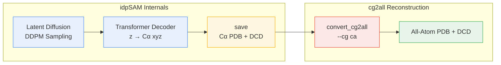
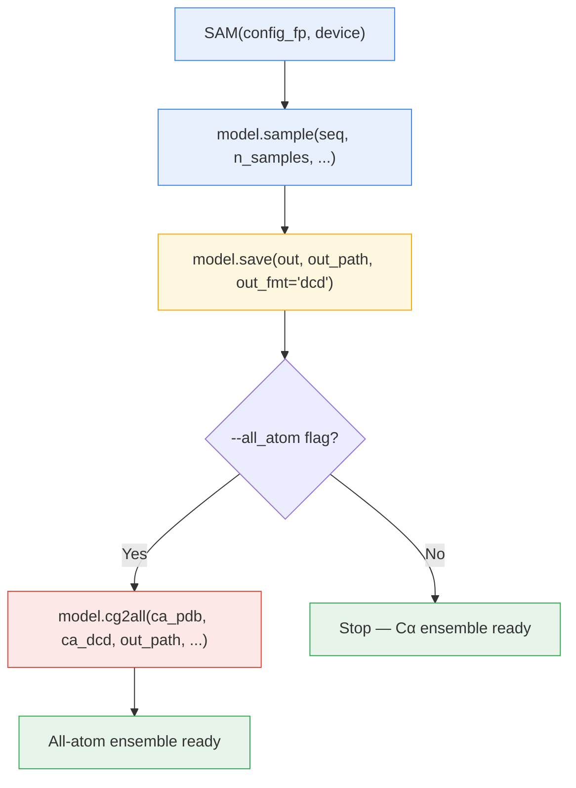

---
slug:17-all-atom-reconstruction-via-cg2all
blog_type:normal
---


IdpSAM 原生生成**粗粒度仅含 Cα 的构象**——每个残基由一个碳阿尔法原子表示。对于许多下游应用（分子动力学、对接、实验验证），需要完整的原子细节。本文档说明了 idpSAM 如何集成外部 **[cg2all](https://github.com/huhlim/cg2all)** 库，从 Cα 轨迹重建全原子结构，从而弥合粗粒度生成输出与完整原子系综之间的差距。

## Cα → 全原子桥接

cg2all 是由 Lim 等人独立维护的深度学习模型，用于学习从粗粒度蛋白质表征到全原子结构的映射。在 idpSAM 流程中，它作为**后处理阶段**运行——消耗 SAM 解码器生成的 Cα PDB 拓扑和 DCD 轨迹，并返回包含每个残基所有重原子和氢原子的新轨迹。

idpSAM 内部阶段与 cg2all 重建之间的关系如下图所示：



虚线边界表明 cg2all 是一个**外部依赖**——它通过 `try/except` 保护机制进行条件导入，即使没有它，idpSAM 仍能保持完整功能（尽管仅限于 Cα 输出）。

来源: [generate_ensemble.py](scripts/generate_ensemble.py#L7-L11), [model.py](sam/model.py#L396-L434)

## 安装

基础 `sam` conda 环境**未包含** cg2all，必须单独安装。推荐方法是在已激活的 `sam` 环境内进行仅限 CPU 的 pip 安装：

```bash
conda activate sam
pip install git+http://github.com/huhlim/cg2all
```

此操作将安装 `convert_cg2all` 命令行可执行文件和 `cg2all` Python 包。cg2all 也提供支持 GPU 的安装方式（有关 DGL/CUDA 设置说明，请参阅 [cg2all 仓库](https://github.com/huhlim/cg2all)），但对于典型的 idpSAM 系综大小，CPU 模式已足够，并可避免 DGL GPU 兼容性问题。

推理脚本中的导入保护机制确保了平滑降级：如果未安装 cg2all，`-a/--all_atom` 标志将不可用，而不会在模块加载时导致导入崩溃。

来源: [README.md](README.md#L33-L37), [generate_ensemble.py](scripts/generate_ensemble.py#L7-L11)

## SAM.cg2all() — API 参考

`SAM` 包装类将 cg2all 重建作为 `cg2all()` 方法暴露。该方法**不**直接调用 cg2all Python API——而是通过 `subprocess.run` 构建并执行 `convert_cg2all` CLI 命令。此设计选择将 cg2all 依赖隔离在子进程边界内，避免了 cg2all 的 DGL 后端与 idpSAM 的 PyTorch 生态系统之间出现进程内内存冲突。

```python
def cg2all(self,
    ca_pdb_fp: str,       # Cα 拓扑 PDB 路径 (来自 SAM.save)
    ca_traj_fp: str,      # Cα 轨迹 DCD 路径 (来自 SAM.save)
    out_path: str,        # 全原子文件的输出路径前缀
    batch_size: int = 1,  # cg2all 批大小
    device: str = "cpu"   # cg2all 设备: "cpu" 或 "cuda"
    ) -> dict             # 返回 {"aa_dcd": 路径, "aa_top": 路径}
```

内部构建的 CLI 命令为：

```
convert_cg2all -p <ca_pdb_fp> -d <ca_traj_fp> -o <aa_dcd_path>
    --cg ca --device <device> --batch <batch_size> -opdb <aa_pdb_path>
```

`--cg ca` 标志明确选择 Cα 作为粗粒度表征类型，这与 idpSAM 的输出模式相匹配。成功时，该方法返回包含全原子 DCD 轨迹和 PDB 拓扑路径的字典。失败时，它将抛出 `subprocess.SubprocessError`，并附带从 cg2all 进程解码的 stderr 信息。

来源: [model.py](sam/model.py#L396-L434)

## 端到端工作流

从序列到全原子系综的完整流程遵循严格的顺序：**生成 → 保存 → 重建**。`save` 步骤是必需的，因为 cg2all 消耗的是基于文件的输入（PDB + DCD），而非内存中的数组。



### 通过推理脚本

```bash
python scripts/generate_ensemble.py \
    -c config/models.yaml \
    -s MFDNASTRNNKRERGKRQGKQTRTQRHADRSQT \
    -o peptide \
    -n 1000 \
    -a \
    -d cuda \
    --cg2all_batch_size 250 \
    --cg2all_device cpu
```

### 通过 Python API

```python
from sam.model import SAM

model = SAM(config_fp="config/models.yaml", device="cuda")
out = model.sample(seq="MFDNASTRNNKRERGKRQGKQTRTQRHADRSQT",
                   n_samples=1000, n_steps=100)
save = model.save(out=out, out_path="peptide", out_fmt="dcd")
aa   = model.cg2all(ca_pdb_fp=save["ca_pdb"],
                    ca_traj_fp=save["ca_dcd"],
                    out_path="peptide",
                    batch_size=250,
                    device="cpu")
```

来源: [generate_ensemble.py](scripts/generate_ensemble.py#L88-L113), [model.py](sam/model.py#L341-L434)

## 全原子重建的 CLI 参数

推理脚本暴露了四个控制 cg2all 行为的参数。其中两个是顶层标志；两个是 cg2all 专用覆盖项。

| 参数 | 类型 | 默认值 | 描述 |
|---|---|---|---|
| `-a` / `--all_atom` | 标志 | `False` | 启用全原子重建。需要安装 cg2all，并强制使用 `--out_fmt dcd`。 |
| `--cg2all_batch_size` | int | `None` (→ `--batch_size`) | 每个 cg2all 批次处理的构象数量。必须是 `--n_samples` 的**精确因数**。如果出现内存错误，对于较长的肽段应减小此值。 |
| `--cg2all_device` | str | `"cpu"` | cg2all 推理的 PyTorch 设备。即使 PyTorch CUDA 可用，如果 DGL 无法定位 CUDA，也应使用 `"cpu"`。 |

**整除约束**（`n_samples % cg2all_batch_size == 0`）在参数解析阶段强制执行。这是 cg2all 的内部要求——转换脚本以固定大小的批次处理构象，无法处理末尾的非完整批次。

来源: [generate_ensemble.py](scripts/generate_ensemble.py#L35-L49), [generate_ensemble.py](scripts/generate_ensemble.py#L60-L81)

## 输入验证与错误处理

当请求 `--all_atom` 时，推理脚本会在任何生成开始之前执行一系列**预检**：

1. **cg2all 可用性**：如果 `import cg2all` 失败，将立即抛出 `ImportError`，并附带指向 cg2all 仓库的安装说明。
2. **输出格式**：全原子重建仅兼容 DCD 输出。如果同时指定了 `--out_fmt numpy` 和 `--all_atom`，将抛出 `ValueError`。
3. **批次整除性**：如果 `n_samples` 不能被 `cg2all_batch_size` 整除，将抛出 `ValueError`，并提示调整这些值。
4. **子进程失败**：在重建过程中，如果 `convert_cg2all` 进程返回非零退出码，将抛出 `subprocess.SubprocessError`，并附带完整的 stderr 输出以供诊断。

<CgxTip>cg2all 设备可以与 idpSAM 设备不同。这是有意为之：idpSAM 使用 PyTorch CUDA，而 cg2all 依赖的 DGL 可能无法检测到相同的 CUDA 安装。在 GPU 上运行 idpSAM（`-d cuda`）并在 CPU 上运行 cg2all（`--cg2all_device cpu`）是推荐的安全配置。</CgxTip>

来源: [generate_ensemble.py](scripts/generate_ensemble.py#L56-L81), [model.py](sam/model.py#L424-L429)

## 输出文件约定

`save()` 和 `cg2all()` 方法生成一组共享公共路径前缀的协调文件。命名约定区分了仅含 Cα 的输出（`ca`）和全原子输出（`aa`）：

| 阶段 | 方法 | 文件 | 返回字典中的键 |
|---|---|---|---|
| Cα 拓扑 | `save()` | `<prefix>.ca.top.pdb` | `"ca_pdb"` |
| Cα 轨迹 | `save()` | `<prefix>.ca.traj.dcd` | `"ca_dcd"` |
| 序列 | `save()` | `<prefix>.seq.fasta` | `"fasta"` |
| 全原子拓扑 | `cg2all()` | `<prefix>.aa.top.pdb` | `"aa_top"` |
| 全原子轨迹 | `cg2all()` | `<prefix>.aa.traj.dcd` | `"aa_dcd"` |

Cα PDB 文件存储单帧拓扑，每个残基包含一个 CA 原子，由 `get_ca_topology()` 使用 MDTraj 构建。该文件具有双重作用：它提供了用于加载 Cα DCD 轨迹的拓扑，同时作为 cg2all `--cg ca` 重建模式的输入参考结构。

来源: [model.py](sam/model.py#L341-L393), [model.py](sam/model.py#L403-L409), [topology.py](sam/data/topology.py#L7-L13)

## Notebook 集成

[Colab notebook](notebooks/idpsam_experiments.ipynb) 将 cg2all 作为表单切换选项暴露。布尔值 `all_atom` 参数控制是否执行可选的全原子单元格：

```python
if all_atom:
    cg2all_data = idpsam.cg2all(
        ca_pdb_fp=save_data["ca_pdb"],
        ca_traj_fp=save_data["ca_dcd"],
        out_path=out_path,
        batch_size=cg2all_batch_size,
        device=cg2all_device)
else:
    print("# Will not build all-atom structures.")
```

在 Colab 上，cg2all 的安装受 `use_cg2all` 标志（默认为 `False`）控制。将其设置为 `True` 会在设置单元格期间从 cg2all GitHub 仓库触发 pip 安装。如果安装失败，notebook 会将 `use_cg2all` 设为 `False` 并禁用 `all_atom` 复选框。

<CgxTip>在 Colab 上运行时，`cg2all_device` 被硬编码为 `"cpu"`，因为 Colab 运行时上的 DGL GPU 支持不可靠。这与 idpSAM 设备无关，后者在可用时会使用 CUDA。</CgxTip>

来源: [idpsam_experiments.ipynb](notebooks/idpsam_experiments.ipynb#L84-L118), [idpsam_experiments.ipynb](notebooks/idpsam_experiments.ipynb#L296-L307)

## 架构原理

通过**子进程**而非 Python API 调用 cg2all 的决定是深思熟虑的。cg2all 依赖于 [DGL (Deep Graph Library)](https://www.dgl.ai/)，后者管理着自己的 CUDA 上下文和内存分配器。在同一进程中加载 DGL 和 PyTorch 可能会产生 CUDA 上下文冲突，尤其是当它们针对不同的 CUDA 版本或运行时版本时。通过将 `convert_cg2all` 作为子进程执行，idpSAM 确保了：

- DGL 进程拥有隔离的 CUDA 上下文（或完全在 CPU 上运行）。
- idpSAM 的 PyTorch 张量和 CUDA 内存不会被 DGL 的分配器破坏。
- cg2all 可以使用与 idpSAM 不同的 CUDA 工具链安装，而不会发生冲突。
- cg2all 的崩溃不会拖垮父 idpSAM 进程——stderr 被捕获并作为 `SubprocessError` 报告。

此模式以少量的进程间序列化开销（写入/读取 DCD 文件）换取了显著的鲁棒性提升，对于磁盘 I/O 相较于神经网络评估时间可忽略不计的纯推理流程而言，这是正确的权衡。

来源: [model.py](sam/model.py#L411-L429)

## 相关页面

- [SAM 模型 API 参考](14-sam-model-api-reference) — `SAM` 类的完整文档，包括 `sample()`、`save()` 和 `cg2all()`。
- [推理脚本用法](3-inference-script-usage) — `generate_ensemble.py` 的完整 CLI 参数参考。
- [两阶段架构概述](4-two-stage-architecture-overview) — 输入到 cg2all 的 Cα 构象最初是如何生成的。
- [数据集与数据流程](16-dataset-and-data-pipeline) — 准备 cg2all 的 Cα PDB 输入的 `EvalProteinDataset` 和拓扑构建。