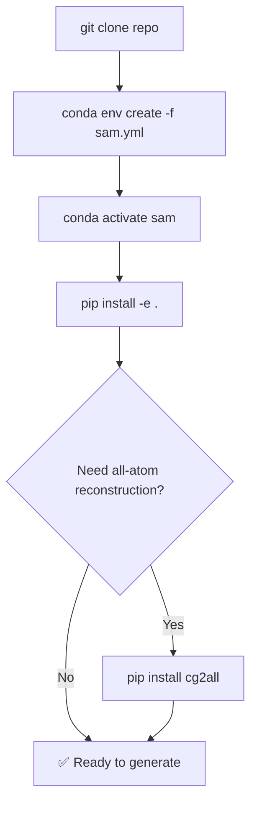

---
slug:2-quick-start
blog_type:normal
---


不到五分钟，让你的机器跑起 idpSAM——从克隆代码到生成你的首个 Cα 构象系综。本页涵盖**安装**、**通过 CLI 和 Python 进行首次推理**以及**理解输出**。如需了解脚本参数的详细说明，请参阅[推理脚本用法](3-inference-script-usage)；如需了解模型背后的架构，请参阅[两阶段架构概述](4-two-stage-architecture-overview)。

## 前提条件

在安装 idpSAM 之前，请确保你的系统满足以下要求：

| 要求 | 详情 |
|---|---|
| **操作系统** | Linux (x86_64) — Conda 环境已锁定至 Linux 软件包 |
| **CUDA** | 11.7 及兼容的 NVIDIA 驱动（可选，但对于大型系综强烈推荐） |
| **Conda** | Miniconda 或 Anaconda，用于环境管理 |
| **Git** | 用于克隆代码仓库 |

<CgxTip>idpSAM 使用基于 CUDA 11.7 的 PyTorch 1.13.1，如 Conda 配置文件所锁定。在提供的 `sam.yml` 之外混用 PyTorch 或 CUDA 版本，可能会导致推理时出现隐性失败。</CgxTip>

来源: [sam.yml](/sam.yml#L1-L139)

## 安装

推荐的安装路径使用提供的 Conda 环境文件，该文件将每一个依赖项——包括 PyTorch、diffusers、MDTraj 和 NumPy——均锁定至经过测试的版本。



**步骤 1 — 克隆代码仓库：**

```bash
git clone https://github.com/giacomo-janson/idpsam.git
cd idpsam
```

**步骤 2 — 创建并激活 Conda 环境：**

```bash
conda env create -f sam.yml
conda activate sam
```

**步骤 3 — 以可编辑模式安装 `sam` 包：**

```bash
pip install -e .
```

这会将 `sam` Python 库注册到你的 `PYTHONPATH` 上，使得 `from sam.model import SAM` 可以在任何工作目录下使用。`setup.py` 将该包声明为版本 `1.0.0` 的 `sam` 包。

**步骤 4 (可选) — 安装 cg2all 以进行全原子重构：**

```bash
pip install git+http://github.com/huhlim/cg2all
```

仅当你计划将 Cα 轨迹转换为完整的全原子结构时才需要此步骤。上述仅 CPU 的安装已足以满足 idpSAM 的用例需求。

来源: [README.md](/README.md#L18-L52), [setup.py](/setup.py#L1-L18), [sam.yml](/sam.yml#L1-L10)

## 验证安装

运行快速健全性检查以确认模型能否正确加载：

```bash
python -c "from sam.model import SAM; print('idpSAM imported successfully')"
```

预训练权重随代码仓库一起提供，位于 `weights/v1.0/` 目录下。请验证它们是否存在：

| 权重文件 | 作用 |
|---|---|
| `nn.enc.pt` | 编码器网络参数 |
| `nn.dec.pt` | 解码器网络参数 |
| `nn.eps.pt` | 潜在噪声预测 (ε) 网络参数 |
| `enc_std_scaler.pt` | 潜在编码的标准缩放器 |

如果缺少任何文件，请重新克隆或从代码仓库中恢复。

来源: [sam/model.py](/sam/model.py#L84-L135)

## 你的首个系综 — CLI

生成构象系综最快的方式是使用位于 `scripts/generate_ensemble.py` 的推理脚本。该脚本将完整的**采样 → 解码 → 保存**流程封装为一条单独的命令。

```bash
python scripts/generate_ensemble.py \
  -c config/models.yaml \
  -s MFDNASTRNNKRERGKRQGKQTRTQRHADRSQT \
  -o peptide \
  -n 1000 \
  -d cuda
```

各参数说明如下：

| 标志 | 描述 | 默认值 |
|---|---|---|
| `-c` | 模型配置 YAML 文件路径 | *(必填)* |
| `-s` | 氨基酸序列（仅限标准 20 个字母） | *(必填)* |
| `-o` | 输出路径前缀——扩展名会自动追加 | *(必填)* |
| `-n` | 要生成的构象数量 | `1000` |
| `-t` | 扩散去噪步数 (1–1000) | `100` |
| `-b` | 采样批次大小 | `250` |
| `-a` | 通过 cg2all 启用全原子重构 | 关闭 |
| `-d` | PyTorch 设备：`cpu` 或 `cuda` | `cpu` |
| `-q` | 安静模式（抑制输出） | 关闭 |

序列 `MFDNASTRNNKRERGKRQGKQTRTQRHADRSQT` (Q2KXY0) 是代码仓库中包含的测试肽段之一。它是来自 DisProt 的 32 残基内在无序蛋白。

<CgxTip>该模型在**12–60 个残基**的肽段上进行了训练。明显超出此范围的序列可能会产生非物理的构象（糟糕的链几何结构，不正确的相互作用模式）。</CgxTip>

来源: [scripts/generate_ensemble.py](/scripts/generate_ensemble.py#L1-L113), [data/sequences/test.fasta](/data/sequences/test.fasta#L1-L45)

## 你的首个系综 — Python API

对于编程式使用，`SAM` 类提供了相同的三步流程：**初始化 → 采样 → 保存**。

```python
from sam.model import SAM

# 1. 初始化模型（加载编码器、解码器、噪声网络和缩放器）
idpsam = SAM(config_fp="config/models.yaml", device="cuda", verbose=True)

# 2. 生成 Cα 构象
out = idpsam.sample(
    seq="MFDNASTRNNKRERGKRQGKQTRTQRHADRSQT",  # 氨基酸序列
    n_samples=1000,                            # 构象数量
    n_steps=100,                               # 扩散去噪步数
    batch_size_eps=250,                        # 扩散采样的批次大小
    batch_size_dec=250,                        # 解码的批次大小
    return_enc=False,                          # 设为 True 可同时返回潜在编码
    out_type="numpy"                           # "numpy" 或 "torch"
)

# 3. 保存为 DCD 轨迹 + PDB 拓扑
paths = idpsam.save(out=out, out_path="peptide", out_fmt="dcd")

# 可选：全原子重构
# idpsam.cg2all(ca_pdb_fp=paths["ca_pdb"], ca_traj_fp=paths["ca_dcd"],
#               out_path="peptide", batch_size=250, device="cpu")
```

`sample()` 方法返回一个具有以下结构的字典：

| 键 | 类型 | 形状 | 描述 |
|---|---|---|---|
| `seq` | `str` | — | 输入氨基酸序列 |
| `name` | `str` | — | 蛋白质名称标识符 |
| `xyz` | `ndarray` | `(n_samples, L, 3)` | Cα 坐标，单位为纳米 |
| `time` | `dict` | — | 计时信息：`tot`、`ddpm`、`dec`（秒） |
| `enc` | `ndarray` | `(n_samples, L, 16)` | 潜在编码（仅在 `return_enc=True` 时返回） |

来源: [sam/model.py](/sam/model.py#L57-L195), [sam/model.py](/sam/model.py#L197-L380)

## 理解输出

运行 `save()` 后，以下文件将被写入磁盘：

| 文件 | 格式 | 内容 |
|---|---|---|
| `peptide.ca.top.pdb` | PDB | 仅 Cα 拓扑（单帧，用于 MDTraj/MDAnalysis 加载） |
| `peptide.ca.traj.dcd` | DCD | 包含所有 `n_samples` 构象的 Cα 轨迹 |
| `peptide.seq.fasta` | FASTA | 输入氨基酸序列 |

如果启用了全原子重构（通过 `-a` 标志或 `cg2all()` 方法），将出现两个额外文件：

| 文件 | 格式 | 内容 |
|---|---|---|
| `peptide.aa.top.pdb` | PDB | 全原子拓扑 |
| `peptide.aa.traj.dcd` | DCD | 全原子轨迹 |

你可以使用 MDTraj 加载并分析 DCD 轨迹：

```python
import mdtraj
traj = mdtraj.load("peptide.ca.traj.dcd", top="peptide.ca.top.pdb")
print(f"Conformations: {traj.n_frames}, Residues: {traj.n_residues}")
```

来源: [sam/model.py](/sam/model.py#L310-L380)

## 在 Google Colab 上运行

如果你希望完全跳过本地安装，提供了一个预配置的 Colab 笔记本。它可在云端处理依赖安装、模型加载、生成和可视化。

[](https://colab.research.google.com/github/giacomo-janson/idpsam/blob/main/notebooks/idpsam_experiments.ipynb)

**重要提示：** 在 Colab 上运行时，请通过 **Edit → Notebook settings → Hardware accelerator → GPU** 启用 GPU 支持。使用 CPU 生成大型系综的速度会显著变慢。

该笔记本遵循相同的三步模式——唯一的区别是 `weights_parent_path` 被设置为 `"idpsam"`，以适应 Colab 上克隆的子目录结构。

来源: [notebooks/idpsam_experiments.ipynb](/notebooks/idpsam_experiments.ipynb#L1-L200), [README.md](/README.md#L54-L57)

## 尝试测试序列

代码仓库附带了一组以 FASTA 格式提供的即用型测试序列。以下是一些代表性示例：

| 名称 | 序列 | 长度 |
|---|---|---|
| angiotensin | `DRVYIHPF` | 8 |
| yesg6 | `YESGGGGGGATD` | 12 |
| Q9EP54 | `MACYPVNIRARGLGKNMGMKSRGRGKG` | 27 |
| Q2KXY0 | `MFDNASTRNNKRERGKRQGKQTRTQRHADRSQT` | 32 |
| drk_sh3 | `MEAIAKHDFSATADDELSFRKTQILKILNMEDDSNWYRAELDGKEGLIPSNYIEMKNHD` | 59 |

从 `data/sequences/test.fasta` 中选取任意序列，并通过 `-s` 标志传入，即可立即尝试生成。

来源: [data/sequences/test.fasta](/data/sequences/test.fasta#L1-L45)

## 常见问题

| 问题 | 原因 | 解决方案 |
|---|---|---|
| `OSError: CUDA is not available` | 无 GPU 或驱动不匹配 | 使用 `-d cpu` 或安装 CUDA 11.7 |
| `ImportError: cg2all not installed` | 缺少 cg2all 但使用了 `-a` 标志 | 安装 cg2all 或移除 `-a` 标志 |
| `ValueError: Invalid sequence` | 非标准氨基酸字母 | 仅使用 20 个标准单字母代码 |
| 采样期间内存不足 | 批次大小对 GPU 而言过大 | 减小 `-b`（例如 `100` 或 `50`） |
| 非物理构象 | 序列长度超出 12–60 范围 | 保持在训练的长度范围内 |

来源: [scripts/generate_ensemble.py](/scripts/generate_ensemble.py#L43-L72), [sam/model.py](/sam/model.py#L84-L110)

## 接下来去哪

既然你已经能够生成系综，可以深入探索该系统：

1. **[推理脚本用法](3-inference-script-usage)** — 完整的参数参考、批次大小策略和输出格式选项
2. **[两阶段架构概述](4-two-stage-architecture-overview)** — 了解编码器–扩散–解码器流程的工作原理
3. **[配置参考](15-configuration-reference)** — 通过 `config/models.yaml` 自定义模型行为
4. **[通过 cg2all 进行全原子重构](17-all-atom-reconstruction-via-cg2all)** — 将 Cα 轨迹转换为完整原子结构的详细指南