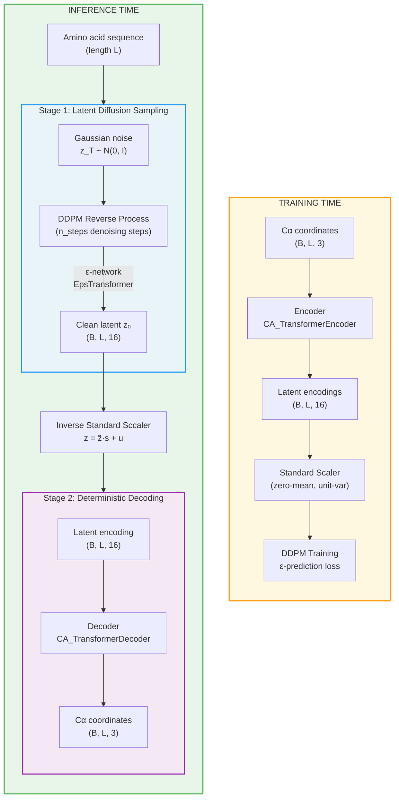

---
slug:4-two-stage-architecture-overview
blog_type:normal
---


idpSAM 通过**隐扩散**范式生成内在无序蛋白的构象系综，该范式将生成过程解耦为两个独立的阶段。该架构并非直接在 3D 坐标空间中进行扩散（因为这需要模型从头学习刚体对称性和几何约束），而是首先将 Cα 结构压缩为紧凑的、学习到的隐表示，随后在该隐空间中执行扩散采样，最后再解码回笛卡尔坐标。此设计产生了**每残基 16 维编码**作为隐基底，将扩散问题的维度从 ℝ³ 大幅降低至 ℝ¹⁶，同时通过训练好的解码器保持了结构表达能力。

来源: [model.py](sam/model.py#L41-L123), [models.yaml](config/models.yaml#L4-L9)

## 架构蓝图

这两个阶段由 `SAM` 包装类统一调度，该类暴露了一个 `sample()` 方法，并在内部依次调用 `generate()`（阶段 1）和 `decode()`（阶段 2）。编码器网络仅在训练期间使用，用于生成真实隐编码，供扩散模型学习复现。



来源: [model.py](sam/model.py#L134-L190), [model.py](sam/model.py#L201-L266), [model.py](sam/model.py#L269-L338)

## 阶段 1：隐扩散采样

第一阶段通过逆向运行**去噪扩散概率模型 (DDPM)** 来生成具有结构意义的隐编码。从纯高斯噪声 **z_T ~ 𝒩(0, I)** 开始，模型在 `n_steps` 个时间步上迭代去噪，以生成干净的隐向量 **z₀ ∈ ℝ^(B×L×16)**，其中 B 为批次大小，L 为序列长度，16 为编码维度。

### 去噪循环

`Diffusers.sample()` 方法使用 HuggingFace 的 `DDPMScheduler` 实现了逆扩散过程。在每个时间步 *i*，ε-网络预测噪声残差，调度器利用该残差计算噪声更低的状态：

```
z_T → z_{T-1} → ... → z_1 → z_0
     ε_θ        ε_θ          ε_θ
```

该调度器支持 **DDPM**（随机）和 **DDIM**（确定性）两种采样机制，可通过模型配置中的 `sched_params` 进行配置。

来源: [diffusers_dm.py](sam/diffusion/diffusers_dm.py#L151-L187), [diffusers_dm.py](sam/diffusion/diffusers_dm.py#L27-L66)

### 噪声预测网络 (ε-Transformer)

`EpsTransformer` 是预测噪声 ε_θ 的神经主干网络，其输入为带噪隐编码、扩散时间步和氨基酸序列。其架构遵循受 DiT（Diffusion Transformer）启发的设计，包含以下关键组件：

| 组件 | 用途 | 默认配置 |
|---|---|---|
| `project_input` | 将带噪隐编码 z_t 线性投影到嵌入空间 | Linear(16 → 256) |
| `TimestepEmbedder` | 扩散时间 *t* 的正弦频率嵌入 + MLP | freq_dim=256, hidden=256 |
| `beads_embed` | 学习到的氨基酸嵌入（20 种残基类型） | Embedding(20, 32) |
| `AF2_PositionalEmbedding` | AlphaFold2 风格的相对位置编码 | dim=64, r=32 |
| `IdpGAN_TransformerBlock` ×16 | 带有 AdaLN 条件的堆叠 Transformer 层 | embed=256, heads=16 |
| `ConditionalInjectionModule` | 用于注入时间步 + 氨基酸的自适应层归一化 (AdaLN-Zero) | mode="adanorm" |
| `InputInjectionModule` | 注入原始输入 z_t 的残差连接 | mode="add", pos="out" |
| `out_module` | 投影回编码维度的最终 MLP | 256 → 256 → 16 |

**AdaLN-Zero** 条件机制是核心：时间步嵌入与投影后的氨基酸嵌入之和经过一个 SiLU + Linear 层，输出 **6 × embed_dim** 个参数，为注意力子块和 MLP 子块分别生成平移、缩放和门控值。这确保了扩散时间步和序列信息能够调制每一层的计算。

**输入注入** 机制 (mode="add") 将原始带噪输入 z_t 的线性投影加到每个 Transformer 块的输出上，提供了一条跳跃连接，从而稳定训练并提高噪声预测精度。

来源: [eps.py](sam/nn/noise_prediction/eps.py#L424-L678), [embedding.py](sam/nn/noise_prediction/embedding.py#L14-L52), [embedding.py](sam/nn/noise_prediction/embedding.py#L59-L200)

### 编码标准缩放器

采样完成后，原始隐编码会使用存储的均值和标准差，从其标准化训练分布重新缩放回原始编码空间：**z = z̃ · s + u**，其中 z̃ 为生成的编码，(u, s) 从 `enc_std_scaler.pt` 加载。该缩放器拟合于编码器的训练输出，用于归一化扩散模型的目标分布。

来源: [model.py](sam/model.py#L96-L106), [model.py](sam/model.py#L260-L261)

## 阶段 2：确定性解码

第二阶段通过**确定性 Transformer 解码器**将隐编码映射回 3D Cα 坐标。给定隐编码 **z ∈ ℝ^(B×L×16)** 和氨基酸序列，解码器生成 **xyz ∈ ℝ^(B×L×3)**——即每个残基对应一个 3D 坐标。

### 解码器架构

`CA_TransformerDecoder` 通过具有独特注意力机制的 Transformer 层堆栈处理隐编码：

| 组件 | 用途 | 默认配置 |
|---|---|---|
| `project_input` | 将编码投影到嵌入空间的双层 MLP | 16 → 128 → 128 |
| `AF2_PositionalEmbedding` | 相对位置编码（轨迹顺序） | dim=64, r=32 |
| `AE_IdpGAN_TransformerBlock` ×5 | 带有 **TimeWarp 注意力** 的堆叠 Transformer 块 | embed=128, d_model=512, heads=32 |
| `out_module` | 生成 3D 坐标的最终 MLP | 128 → 128 → 3 |

与 ε-网络的关键架构区别在于，解码器使用了 **TimeWarp 注意力** (`attention_type="timewarp"`)，该注意力通过 `TransformerTimewarpLayer` 实现。这种注意力变体专为解码结构表示而设计，在此场景下，隐特征与空间位置之间的关系得益于不同于标准多头自注意力的注意力模式。解码器还使用了相对于其 `embed_dim` (128) 明显更大的 `d_model` (512)，为更丰富的注意力计算创建了扩展的键值空间。

请注意，在默认配置中，解码器**不使用氨基酸条件** (`embed_inject_mode: null`, `bead_embed_dim: null`)——隐编码本身已经捕获了依赖序列的结构信息，使得在此阶段显式注入氨基酸变得多余。

来源: [decoder.py](sam/nn/autoencoder/decoder.py#L18-L169), [models.yaml](config/models.yaml#L39-L58)

## 编码器（仅用于训练）

虽然不属于推理流程的一部分，但编码器定义了整个系统运行的隐空间。`CA_TransformerEncoder` 通过**欧几里得不变**设计将 Cα 坐标映射到隐编码：它消费 **Cα–Cα 距离图**（通过 RBF 高斯展宽嵌入）和**骨架扭转角**（作为 cos/sin 对嵌入），而非原始坐标。这确保了编码对全局旋转和平移具有不变性。

| 编码器输入 | 嵌入方式 | 维度 |
|---|---|---|
| Cα–Cα 距离图 | GaussianSmearing (RBF, 320 个高斯函数, 截断值 3.0 Å) → Linear | 192 (embed_2d_dim) |
| 骨架扭转角 φ | cos(φ), sin(φ), mask → 2 层 MLP | 128 (embed_dim) |
| 氨基酸标识 | 学习到的 Embedding(20, 32) | 32 (concat 模式) |
| 残基位置 | AF2_PositionalEmbedding | 64 |

编码器的 2D 距离图特征通过**拼接** (`embed_2d_inject_mode="concat"`) 注入到 Transformer 的注意力层中，在每个注意力步骤合并位置和结构配对信息。最终输出是经过 LayerNorm 处理的线性投影，降维至 16 维编码空间。

来源: [encoder.py](sam/nn/autoencoder/encoder.py#L32-L225), [models.yaml](config/models.yaml#L11-L37)

## 端到端数据流总结

下表追溯了单个构象经过完整推理流程的过程，展示了长度为 L、批次大小为 B 的蛋白质在每个阶段的张量形状：

| 步骤 | 操作 | 输入形状 | 输出形状 | 模块 |
|---|---|---|---|---|
| 1 | 初始化噪声 | — | (B, L, 16) | `torch.randn_like` |
| 2 | DDPM 逆过程 | (B, L, 16) + timestep | (B, L, 16) | `Diffusers.sample()` |
| 3 | 逆标准缩放器 | (B, L, 16) | (B, L, 16) | `enc_std_scaler` |
| 4 | 解码为坐标 | (B, L, 16) | (B, L, 3) | `CA_TransformerDecoder` |

来源: [model.py](sam/model.py#L134-L190), [diffusers_dm.py](sam/diffusion/diffusers_dm.py#L151-L187), [decoder.py](sam/nn/autoencoder/decoder.py#L134-L160)

## 权重文件与配置

这三个网络均作为独立的 PyTorch 状态字典保存在 `weights/v1.0/` 下：

| 文件 | 网络 | 作用 |
|---|---|---|
| `nn.eps.pt` | `EpsTransformer` | 阶段 1 噪声预测 |
| `nn.dec.pt` | `CA_TransformerDecoder` | 阶段 2 隐编码 → 坐标 |
| `nn.enc.pt` | `CA_TransformerEncoder` | 训练时编码器 |
| `enc_std_scaler.pt` | — | 编码归一化（均值 μ，标准差 σ） |

完整架构在 [models.yaml](config/models.yaml) 中指定，`SAM` 类在初始化时读取该文件以实例化并加载每个组件。该配置被划分为四个顶层键——`generative_model`、`encoder`、`decoder` 和 `latent_network`/`latent_generative_model`——反映了编码器、扩散过程、ε-网络与解码器之间的架构分离。

来源: [model.py](sam/model.py#L46-L123), [models.yaml](config/models.yaml#L1-L106)

<CgxTip>在推理期间，**编码器权重不会被加载**——仅需 `nn.eps.pt`、`nn.dec.pt` 和 `enc_std_scaler.pt`。编码器 (`nn.enc.pt`) 专门作为训练时产物，用于为扩散训练生成真实隐目标。</CgxTip>

<CgxTip>这两个阶段在**推理时完全解耦**：你可以独立于解码器的批次大小来改变 `n_steps`（扩散步数）和 `n_samples`。`sample()` 方法接受独立的 `batch_size_eps` 和 `batch_size_dec` 参数，允许在两个阶段间进行感知内存的调度。</CgxTip>

## 建议阅读路径

为了加深对每个组件的理解，请按照以下顺序阅读目录：

1. **[欧几里得不变编码器](5-euclidean-invariant-encoder)** — 编码器如何从距离图和扭转角构建旋转/平移不变的隐表示
2. **[Transformer 解码器](6-transformer-decoder)** — TimeWarp 注意力机制以及重建 3D 坐标的解码过程
3. **[DDPM 采样过程](7-ddpm-sampling-process)** — 逆扩散循环与调度器配置的详细解析
4. **[噪声预测网络](8-noise-prediction-network)** — ε-Transformer 架构、AdaLN-Zero 条件机制与输入注入
5. **[SAM 模型 API 参考](14-sam-model-api-reference)** — `SAM` 类的完整 API 文档