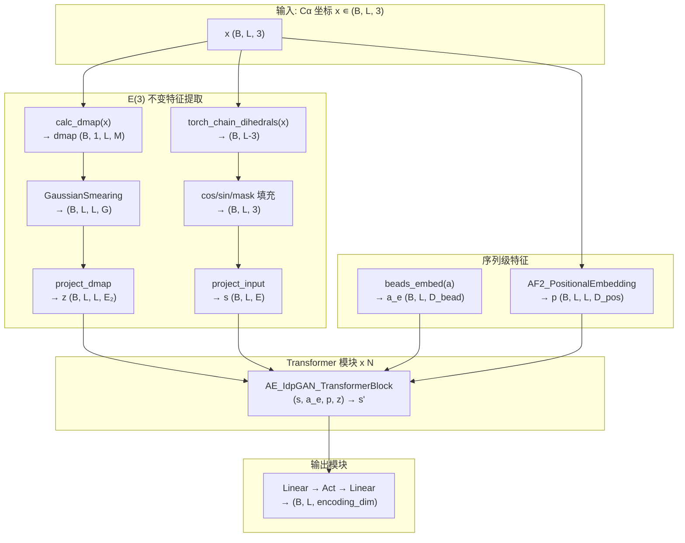
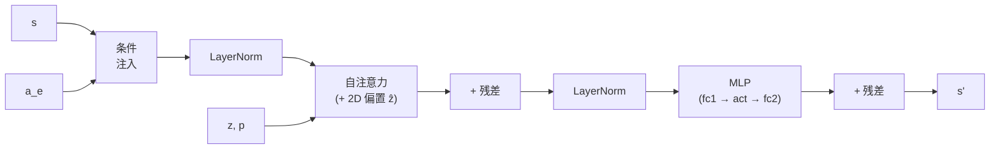

---
slug:5-euclidean-invariant-encoder
blog_type:normal
---


欧几里得不变编码器是 idpSAM 两阶段架构的第一阶段，将 Cα 坐标帧映射为紧凑的**旋转和平移不变**潜表示。通过仅提取内在不变几何特征——成对距离和主链二面角——该编码器保证在三维空间中任意放置的结构相同构象都能产生相同的编码。这一关键特性使得下游潜扩散模型能够在一个没有虚假欧几里得自由度的空间中运行。

## 为什么欧几里得不变性至关重要

由 Cα 坐标 **x** ∈ ℝ^(L×3) 描述的蛋白质构象包含六个物理上无意义的自由度：三个对应全局平移，三个对应全局旋转。如果编码器对这些自由度敏感，潜空间将包含对应于不同姿态下相同结构的冗余流形——严重损害扩散采样质量。`CA_TransformerEncoder` 通过从两个 **E(3) 不变**量构建其全部输入来消除此问题：

| 不变量 | 计算 | 物理意义 |
|---|---|---|
| **成对距离** | d_ij = ‖x_i − x_j‖ | 捕获全局折叠几何 |
| **主链二面角** | 由连续的 Cα 四元组计算出的 φ, ψ | 捕获局部链构象 |

由于距离在任何等距变换（旋转 + 平移）下保持不变，且二面角由键向量的叉积和点积（两者均旋转不变）计算得出，因此编码器的输出**从结构上可证明是 E(3) 不变的**。

来源: [encoder.py](sam/nn/autoencoder/encoder.py#L1-L14), [coords.py](sam/coords.py#L5-L37), [coords.py](sam/coords.py#L73-L92)

## 架构概述



该编码器遵循受 AlphaFold2 启发的 **1D+2D 双流**设计：一维逐残基序列 `s` 携带局部结构上下文，而二维成对表示 `z` 编码成对几何关系。这两个流在每个 Transformer 模块的注意力机制内部进行交互。

来源: [encoder.py](sam/nn/autoencoder/encoder.py#L32-L72), [encoder.py](sam/nn/autoencoder/encoder.py#L190-L225)

## 不变特征提取

### 距离图 → RBF 嵌入 (2D 特征)

通过 `calc_dmap(x)` 计算成对 Cα-Cα 距离矩阵，该函数为所有残基对 计算 ‖x_i − x_j‖，生成形状为 `(B, 1, L, L)` 的张量。原始距离并不直接馈入 Transformer，而是通过**径向基函数 (RBF) 核**进行展开：

$$\text{RBF}(d, \mu_k) = \exp\!\left(-\frac{(d - \mu_k)^2}{2\delta^2}\right), \quad k = 1, \dots, G$$

其中中心 μ_k 在 `[dmap_ca_min, dmap_ca_cutoff]` 之间均匀分布，δ 为相邻中心的间距。这会将每个标量距离映射为一个 G 维向量，提供适合神经网络处理的平滑、可微表示。支持两种 RBF 变体：

| 变体 | 类 | 关键特性 |
|---|---|---|
| **高斯涂抹** | `GaussianSmearing` | 固定、均匀分布的中心；不可训练 |
| **指数正态** | `ExpNormalSmearing` | PhysNet 风格参数化；中心和宽度可选可训练 |

RBF 展开后，线性投影（或当 `use_dmap_mlp=True` 时的两层 MLP）将 G 维 RBF 特征映射到 2D 嵌入维度 `embed_2d_dim`。

来源: [coords.py](sam/coords.py#L5-L37), [geometric.py](sam/nn/geometric.py#L6-L19), [geometric.py](sam/nn/geometric.py#L22-L64), [encoder.py](sam/nn/autoencoder/encoder.py#L90-L112)

### 主链二面角 (1D 特征)

使用 `torch_chain_dihedrals(x)` 从连续的 Cα 位置计算主链二面角，该函数将标准叉积公式应用于每个残基四元组 (i, i+1, i+2, i+3)。原始角度 α 随后被分解为每个残基的 **3 通道特征向量**：

```python
t_f = [cos(α_i), sin(α_i), 1.0]   # 形状 (B, L, 3)
```

`[cos, sin]` 对避免了直接使用原始角度在 ±π 处产生的不连续性，而常量通道充当可学习偏置。单侧填充 `(1, 2)` 用于处理无法定义二面角的边界残基。随后，两层 MLP (`project_input`) 将这 3 通道特征投影到 1D 嵌入维度 `embed_dim`。

来源: [encoder.py](sam/nn/autoencoder/encoder.py#L20-L25), [coords.py](sam/coords.py#L73-L92), [encoder.py](sam/nn/autoencoder/encoder.py#L113-L117)

### 氨基酸嵌入

标准的 `nn.Embedding(20, bead_embed_dim)` 将 20 种标准氨基酸分别映射为可学习的 `bead_embed_dim` 维向量。这些嵌入作为**条件信息**注入每个 Transformer 模块，可通过自适应层归一化（`embed_inject_mode="adanorm"`）或拼接（`embed_inject_mode="concat"`）实现。

来源: [encoder.py](sam/nn/autoencoder/encoder.py#L119-L123), [ca_models.py](sam/nn/autoencoder/ca_models.py#L109-L116)

### 位置嵌入

**受 AlphaFold2 启发的相对位置嵌入**编码残基对之间的序列偏移量。对于残基 i 和 j，偏移量 `j − i` 被划分到 `2 × pos_embed_r + 1` 个分箱之一，并通过一个可学习的 `nn.Embedding`，生成形状为 `(B, L, L, pos_embed_dim)` 的 2D 张量。该位置嵌入在每个 Transformer 模块内部与 2D 距离特征融合。

来源: [common.py](sam/nn/common.py#L149-L198), [encoder.py](sam/nn/autoencoder/encoder.py#L126-L129)

## Transformer 模块: AE_IdpGAN_TransformerBlock

每个编码器层是一个 `AE_IdpGAN_TransformerBlock`，它执行带有条件氨基酸注入的**预归一化残差更新**：



### 带有 2D 成对偏置的注意力

自注意力机制接收 1D 查询/键/值投影和 2D 成对表示 `ẑ`。2D 特征通过以下两种模式之一与位置嵌入结合：

| 模式 | 组合方式 | 结果维度 |
|---|---|---|
| `concat` | `ẑ = [z, p]`（沿特征轴拼接） | `embed_2d_dim + pos_embed_dim` |
| `add` | `ẑ = z + W·p`（线性投影后相加） | `embed_2d_dim` |

组合后的 2D 特征通过 `mlp_2d` 投影，产生**逐头注意力偏置**，并加到点积亲和力上：`attn_weights = softmax(QK^T/√d + mlp_2d(ẑ))`。这使得注意力能够优先关注在空间上接近（通过距离嵌入）且在序列上相关（通过位置嵌入）的残基对。

来源: [ca_models.py](sam/nn/autoencoder/ca_models.py#L15-L157), [transformer.py](sam/nn/transformer.py#L10-L126)

### 条件氨基酸注入

氨基酸嵌入通过 `AE_ConditionalInjectionModule` 对 Transformer 模块进行条件化，支持两种注入策略：

**自适应层归一化 (`adanorm`)：** 遵循 DiT（Diffusion Transformer）范式，氨基酸嵌入被投影以生成六个调制向量（偏移、缩放、门控）×（注意力、MLP）。这些向量调制归一化后的激活：`modulate(x, shift, scale) = x · (1 + scale) + shift`，并在每个子层后应用门控机制。

**拼接 (`concat`)：** 氨基酸嵌入与隐藏状态拼接，并在注意力前通过线性层投影回 `embed_dim`。对于使用后归一化的 MLP，拼接发生在 MLP 输入处。

来源: [ca_models.py](sam/nn/autoencoder/ca_models.py#L164-L279)

## 输出模块

在最后一个 Transformer 模块之后，1D 隐藏状态通过两层 MLP 映射到编码维度：

```
s → Linear(embed_dim, embed_dim) → Activation → Linear(embed_dim, encoding_dim) [→ LayerNorm]
```

当 `out_mode="idpgan_norm"` 时，应用可选的 `LayerNorm`（无仿射变换），提供归一化的编码以稳定下游扩散训练。输出张量的形状为 `(B, L, encoding_dim)`——每个残基对应一个紧凑向量，以欧几里得不变的方式编码局部结构环境。

来源: [encoder.py](sam/nn/autoencoder/encoder.py#L161-L183), [encoder.py](sam/nn/autoencoder/encoder.py#L219-L225)

## 默认配置

下表列出了已发布的 idpSAM v1.0 模型中使用的默认编码器超参数：

| 参数 | 值 | 描述 |
|---|---|---|
| `encoding_dim` | 16 | 每残基潜向量维度 |
| `num_layers` | 5 | Transformer 模块数量 |
| `embed_dim` | 128 | 1D 隐藏状态维度 |
| `embed_2d_dim` | 192 | 2D 成对表示维度 |
| `num_heads` | 8 | 注意力头数量 |
| `mlp_dim` | 256 | MLP 隐藏维度 |
| `activation` | gelu | 激活函数 |
| `norm_pos` | pre | LayerNorm 位置 (预归一化) |
| `out_mode` | idpgan_norm | 带有无仿射 LayerNorm 的输出 |
| `bead_embed_dim` | 32 | 氨基酸嵌入维度 |
| `pos_embed_dim` | 64 | 位置嵌入维度 |
| `pos_embed_r` | 32 | 相对位置范围 (±32) |
| `embed_inject_mode` | concat | 氨基酸注入模式 |
| `embed_2d_inject_mode` | concat | 2D 特征组合模式 |
| `dmap_ca_num_gaussians` | 320 | RBF 中心数量 |
| `dmap_ca_cutoff` | 3.0 | RBF 的最大距离 (Å, 缩放后) |
| `dmap_embed_type` | rbf | RBF 变体 (高斯涂抹) |
| `use_dmap_mlp` | true | 使用两层 MLP 进行距离投影 |

<CgxTip>配置中的 `dmap_ca_cutoff` 值 3.0 作用于**内部缩放后**的距离（坐标已预归一化）。在埃空间中，这对应于覆盖相关残基间距离范围的更大截断值。</CgxTip>

来源: [models.yaml](config/models.yaml#L11-L37)

## 前向传播总结

`CA_TransformerEncoder.forward(x, a, r)` 的完整前向传播过程如下：

1. **计算距离图**: `dmap_ca = calc_dmap(x)` → 形状 `(B, 1, L, L)`
2. **RBF 展开 + 投影**: `z = project_dmap(dmap_ca_expansion(dmap_ca))` → 形状 `(B, L, L, embed_2d_dim)`
3. **计算扭转特征 + 投影**: `s = project_input(get_chain_torsion_features(x))` → 形状 `(B, L, embed_dim)`
4. **氨基酸嵌入**: `a_e = beads_embed(a)` → 形状 `(B, L, bead_embed_dim)`
5. **位置嵌入**: `p = embed_pos(x, r)` → 形状 `(B, L, L, pos_embed_dim)`
6. **Transformer 堆叠**: `for layer in layers: s = layer(s, a_e, p, z)`
7. **输出投影**: `enc = out_module(s)` → 形状 `(B, L, encoding_dim)`

<CgxTip>原始 3D 坐标 `x` **绝不**作为任何可学习层的直接输入。它们仅出现在 `calc_dmap` 和 `torch_chain_dihedrals` 内部——两者均产生 E(3) 不变输出。这一架构约束使得编码器具有*可证明的*欧几里得不变性，而非仅仅是近似不变。</CgxTip>

来源: [encoder.py](sam/nn/autoencoder/encoder.py#L190-L225)

## 与解码器的关系

编码器和解码器构成一个**确定性自编码器**对。编码器使用距离和扭转特征将 `(B, L, 3)` 映射为 `(B, L, encoding_dim)`，而 [Transformer 解码器](6-transformer-decoder) 则将 `(B, L, encoding_dim)` 映射回 `(B, L, 3)`——从潜编码重建 Cα 坐标。值得注意的是，解码器**不**共享编码器的不变性约束：它必须在特定的欧几里得帧中生成坐标，它通过使用在已学习的 3D 坐标投影上操作的 `TransformerTimewarpLayer` 注意力机制来实现这一点。这两个网络联合训练，学习到的编码作为 [DDPM 采样过程](7-ddpm-sampling-process) 的目标分布。