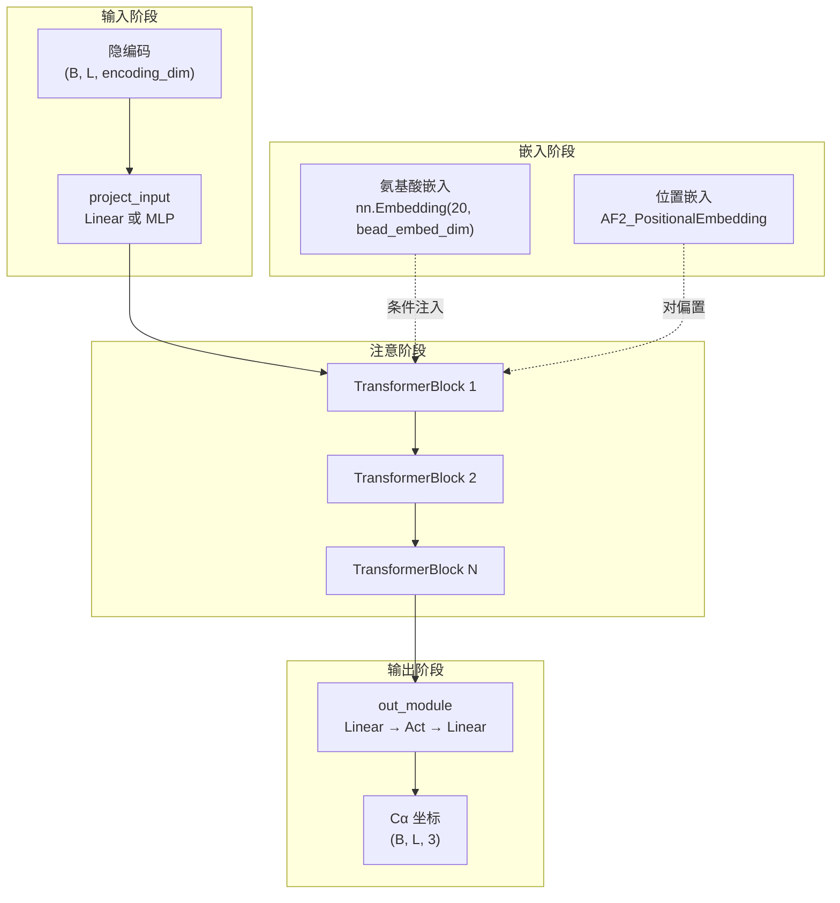
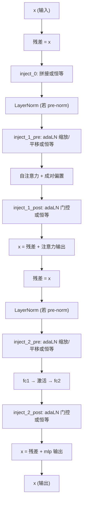

---
slug:6-transformer-decoder
blog_type:normal
---


**Transformer 解码器**是 idpSAM 两阶段架构的第二阶段——一个确定性的神经网络，将隐编码向量映射回三维 Cα 坐标空间。它接收紧凑的结构编码（由[欧几里得不变编码器](5-euclidean-invariant-encoder)生成，或由[DDPM 采样过程](7-ddpm-sampling-process)采样），并通过一堆注意力驱动的 Transformer 块重建完整的骨架构象。与生成分布的生成式解码器不同，该解码器是**确定性的**：给定的编码始终产生相同的 Cα 坐标集，使其成为编码器压缩过程的学习逆映射。

来源: [decoder.py](sam/nn/autoencoder/decoder.py#L1-L50), [model.py](sam/model.py#L127-L132)

## 架构概述

解码器遵循四阶段流水线——**投影 → 嵌入 → 注意 → 输出**——该流水线以逆序镜像编码器的结构。编码向量通过线性投影输入，经氨基酸和位置嵌入丰富后，穿过可配置的 Transformer 块堆栈，最终输出为 `(B, L, 3)` 的 Cα 坐标张量。



解码器通过 `get_decoder` 工厂函数实例化，该函数从模型配置中读取 `decoder` 部分，并仅将匹配的参数传递给 `CA_TransformerDecoder` 构造函数。这种设计将 YAML 配置架构与类签名解耦，允许未使用的构造函数参数自然采用默认值。

来源: [decoder.py](sam/nn/autoencoder/decoder.py#L151-L178), [decoder.py](sam/nn/autoencoder/decoder.py#L184-L199)

## 组件分解

### 输入投影

解码器的第一个操作将输入的隐编码从其压缩维度（`encoding_dim`，通常为 16）映射到 Transformer 的工作维度（`embed_dim`，通常为 128）。通过 `use_input_mlp` 标志控制，共有两种可用模式：

| 模式 | `use_input_mlp` | 结构 | 行为 |
|------|:---:|------|----------|
| **Linear** | `False` | `nn.Linear(encoding_dim → embed_dim)` | 单仿射投影 |
| **MLP** | `True` | `Linear → Activation → Linear` | 具有非线性扩展的两层网络 |

MLP 模式在投影期间提供了额外的表征容量，这很重要，因为编码维度（16）远小于嵌入维度（128）。默认配置使用 `use_input_mlp: true`。

来源: [decoder.py](sam/nn/autoencoder/decoder.py#L83-L89)

### 氨基酸嵌入

当 `embed_inject_mode` 不为 `None` 时，解码器通过 `nn.Embedding(20, bead_embed_dim)` 学习残基类型嵌入，将 20 种标准氨基酸中的每一种映射到 `bead_embed_dim` 维向量。这些嵌入作为**条件信号**，通过 `AE_ConditionalInjectionModule`（详见下文）注入每个 Transformer 块，使解码器能够根据蛋白质的序列特性——而不仅仅是其几何编码——来调整其重建过程。

当 `embed_inject_mode` 为 `None`（如在默认的 v1.0 配置中）时，**不使用**氨基酸嵌入，解码器完全基于隐编码和位置信息进行操作。此设计选择反映了编码器已在其编码向量中捕获了依赖序列的结构信息。

来源: [decoder.py](sam/nn/autoencoder/decoder.py#L91-L95), [ca_models.py](sam/nn/autoencoder/ca_models.py#L143-L161)

### 位置嵌入

解码器使用**受 AlphaFold2 启发的成对位置嵌入**（`AF2_PositionalEmbedding`），它生成一个二维表征，编码每对残基之间的相对序列距离。这是一个基于离散距离区间的学习嵌入：

1. 计算成对距离：`p[i,j] = i - j`
2. 将距离划分到 `2 * pos_embed_r + 1` 个区间中（默认：当 `pos_embed_r=32` 时为 65 个区间）
3. 为每个区间查找维度为 `pos_embed_dim`（默认：64）的学习嵌入向量

结果是一个形状为 `(B, L, L, pos_embed_dim)` 的张量，它作为**成对偏置**输入到每个 Transformer 块的注意力机制中，使注意力权重能够考虑残基的序列邻近度。当提供自定义残基索引 `r` 时（通过 `use_res_ids: true`），它们将替换默认的顺序索引，从而支持非连续或断链序列。

来源: [common.py](sam/nn/common.py#L144-L198), [decoder.py](sam/nn/autoencoder/decoder.py#L97-L100)

### Transformer 块堆栈

解码器的核心是包含 `num_layers` 个相同 `AE_IdpGAN_TransformerBlock` 模块的堆栈。每个块执行一个**自注意力子层**，随后是一个 **MLP 子层**，每个阶段都带有残差连接、层归一化和条件注入。该块的内部计算流程如下：



**注意力类型选择。** 每个块通过 `attention_type` 参数支持两种注意力机制：

| 类型 | 类 | 亲和度计算 | 属性 |
|------|-------|---------------------|------------|
| `"transformer"` | `TransformerLayer` | 缩放点积：`softmax(QKᵀ/√d + P)` | 带有成对偏置的标准多头注意力 |
| `"timewarp"` | `TransformerTimewarpLayer` | 负平方距离：`softmax(-(‖qᵢ - kⱼ‖²/ℓ²) + P)` | 具有**SE(3)等变性**的注意力，带有可学习长度尺度 `ℓ` |

**timewarp** 注意力是解码器的默认设置（v1.0 中 `attention_type: timewarp`）。它基于投影的 3D 坐标查询和键之间的*平方欧几里得距离*计算亲和度，而不是点积。这使得注意力权重对查询/键坐标表示的**旋转和平移具有内在的不变性**。可学习参数 `elle`（初始化为 1.0，通过 softplus 应用）控制每个头的长度尺度，该尺度决定了注意力随距离衰减的急剧程度。

**归一化位置。** `norm_pos` 参数控制层归一化是在注意力/MLP 子层之前（`"pre"`）还是之后（`"post"`）应用。v1.0 默认值为 `"pre"`，这是现代深度 Transformer 训练保证稳定性的标准做法。

来源: [ca_models.py](sam/nn/autoencoder/ca_models.py#L16-L141), [transformer.py](sam/nn/transformer.py#L8-L109), [transformer.py](sam/nn/transformer.py#L113-L265)

### 条件信息注入

`AE_ConditionalInjectionModule` 控制氨基酸嵌入（以及在噪声预测网络中的时间步嵌入）如何注入每个 Transformer 块。它支持两种主要模式：

**自适应层归一化（`"adanorm"`）。** 这是 DiT 风格的注入策略。氨基酸嵌入 `a` 通过两层调制网络（`SiLU → Linear(bead_embed_dim → 6 × embed_dim)`），产生六个逐标记向量：`(shift_msa, scale_msa, gate_msa, shift_mlp, scale_mlp, gate_mlp)`。这些向量在每个块的四个注入点应用：

- `inject_1_pre`：将注意力输入调制为 `x * (1 + scale_msa) + shift_msa`
- `inject_1_post`：将注意力输出门控为 `x * gate_msa`
- `inject_2_pre`：将 MLP 输入调制为 `x * (1 + scale_mlp) + shift_mlp`
- `inject_2_post`：将 MLP 输出门控为 `x * gate_mlp`

当 `embed_inject_mode == "adanorm"` 时，`LayerNorm` 层设置 `elementwise_affine=False`（无可学习的缩放/平移参数），因为自适应归一化已经包含了该作用。

**拼接（`"concat"`）。** 一种更简单的策略，将氨基酸嵌入在特定点直接拼接到标记表征上，然后通过学习的线性层投影回 `embed_dim`。

**空模式（`None`）。** 不进行条件注入。解码器完全依赖隐编码和位置嵌入。这是 v1.0 的默认设置，因为编码器已经编码了依赖序列的结构信息。

来源: [ca_models.py](sam/nn/autoencoder/ca_models.py#L143-L279)

### 输出模块

在最后一个 Transformer 块之后，序列表征（形状为 `(L, B, embed_dim)`）通过两层输出 MLP：`Linear(embed_dim → embed_dim) → Activation → Linear(embed_dim → output_dim)`。`output_dim` 默认为 3，为每个残基生成一个 Cα 坐标。最终的转置将 Transformer 的 `(L, B, 3)` 约定转换为输出的 `(B, L, 3)` 约定。

来源: [decoder.py](sam/nn/autoencoder/decoder.py#L127-L130)

## 默认配置

v1.0 生产配置（来自 `config/models.yaml`）使用以下参数实例化解码器：

| 参数 | 值 | 描述 |
|-----------|-------|-------------|
| `type` | `"deterministic"` | 解码器是非概率性的 |
| `use_input_mlp` | `true` | 两层输入投影 |
| `num_layers` | `5` | 五个 Transformer 块 |
| `attention_type` | `"timewarp"` | SE(3)等变平方距离注意力 |
| `embed_dim` | `128` | 标记嵌入维度 |
| `d_model` | `512` | 注意力 QKV 投影维度 |
| `num_heads` | `32` | 注意力头数 (head_dim = 16) |
| `mlp_dim` | `256` | MLP 隐藏维度 |
| `norm_pos` | `"pre"` | 预归一化 |
| `activation` | `"gelu"` | GELU 激活 |
| `bead_embed_dim` | `null` | 无氨基酸嵌入 |
| `pos_embed_dim` | `64` | 位置嵌入维度 |
| `pos_embed_r` | `32` | 位置区间半径 (65 个区间) |
| `embed_inject_mode` | `null` | 无条件注入 |

注意**扩展比**：注意力在计算多头亲和度之前从 `embed_dim=128` 投影到 `d_model=512`（4 倍扩展），然后再投影回去。在 32 个头的情况下，每个头操作的维度为 16 (512/32)，从而产生相对紧凑的逐头表征，这些表征在多个头之间共享。

来源: [models.yaml](config/models.yaml#L41-L62)

## 前向传播执行

解码器的 `forward` 方法编排了整个流水线：

```python
def forward(self, x, a=None, r=None):
    # 1. 将隐编码投影到嵌入维度
    x = self.project_input(x).transpose(0, 1)     # (B,L,E) → (L,B,embed_dim)

    # 2. 计算氨基酸嵌入（如果启用）
    a_e = self.beads_embed(a).transpose(0, 1)      # (B,L) → (L,B,bead_embed_dim)

    # 3. 计算成对位置嵌入
    p = self.embed_pos(x, r=r)                     # → (B,L,L,pos_embed_dim)

    # 4. 穿过 Transformer 块
    for layer in self.layers:
        x, attn = layer(x=x, a=a_e, p=p, z=None, x_0=None)

    # 5. 输出投影到 3D 坐标
    x = self.out_module(x)                          # (L,B,embed_dim) → (L,B,3)
    xyz = x.transpose(0, 1)                         # → (B,L,3)
    return xyz
```

`nn_forward` 方法提供了一个便捷的包装器，它从批处理对象中提取氨基酸索引（`batch.a`）和残基索引（`batch.r`），然后委托给 `forward`。这是[SAM 模型 API 参考](14-sam-model-api-reference)在推理期间使用的入口点。

<CgxTip>解码器在推理期间始终在 `torch.no_grad()` 下执行（参见 `sam/model.py` 的 `decode` 方法）。这意味着不存储梯度，从而显著降低了内存消耗——这对于在单次运行中解码数千个采样构象至关重要。</CgxTip>

来源: [decoder.py](sam/nn/autoencoder/decoder.py#L132-L149), [decoder.py](sam/nn/autoencoder/decoder.py#L152-L158), [model.py](sam/model.py#L246-L267)

## 完整流水线中的解码器

在 `SAM.decode` 方法中，解码器接收生成的编码全量张量，并逐批将其转换为 Cα 坐标。工作流程如下：

1. 通过隐扩散模型**生成编码** → 形状为 `(n_samples, L, encoding_dim)` 的张量
2. 如果启用了 `use_enc_std_scaler`，则**应用标准缩放器**（逆归一化）
3. **解码**每个批次：`xyz = decoder.nn_forward(encodings_batch, protein_batch)` → `(batch_size, L, 3)`
4. 将所有解码后的批次**拼接**成形状为 `(n_samples, L, 3)` 的最终系综

因此，解码器的作用纯粹是**确定性映射**：每个唯一的编码精确生成一个构象。生成系综的随机多样性完全来自上游的隐扩散采样步骤。

<CgxTip>解码器的 `encoding_dim`（16）远小于其 `embed_dim`（128），这意味着隐空间被高度压缩。8:1 的压缩比确保了扩散模型在紧凑且信息密集的空间中运行，而解码器庞大的 Transformer 堆栈则具有足够的容量从这些紧凑编码中重建精细的 3D 结构。</CgxTip>

来源: [model.py](sam/model.py#L220-L267)

## 设计理念：解码器中的 Timewarp 注意力

解码器选择 timewarp 注意力（而非[噪声预测网络](8-noise-prediction-network)中的标准点积注意力）在架构上具有重要意义。解码器的任务是从抽象编码重建**3D 坐标**——这是一种内在的几何操作。Timewarp 注意力基于投影坐标向量之间的*平方距离*计算亲和度，这意味着：

- **旋转等变性**：旋转输入坐标表示会一致地旋转注意力模式，因为距离是旋转不变的
- **平移不变性**：将所有坐标平移一个常数不会改变注意力权重
- **几何局部性**：在投影坐标空间中接近的残基彼此之间的注意力更强，从而产生天然的空间局部性先验

这与点积注意力形成对比，在点积注意力中，亲和度取决于查询和键向量之间的*角度*——当目标是坐标重建时，这是一个几何意义较弱的量。可学习的长度尺度 `ℓ`（通过 `elle` 和 softplus 参数化）允许每个注意力头自适应地控制其基于距离的门控的敏锐度。

来源: [transformer.py](sam/nn/transformer.py#L113-L265), [models.yaml](config/models.yaml#L45-L46)

## 下一步

- 了解生成隐编码的编码器：[欧几里得不变编码器](5-euclidean-invariant-encoder)
- 探索采样新编码的扩散过程：[DDPM 采样过程](7-ddpm-sampling-process)
- 深入了解 timewarp 注意力机制：[自定义 Transformer 注意力](11-custom-transformer-attention)
- 学习自适应归一化策略：[自适应层归一化](12-adaptive-layer-normalization)