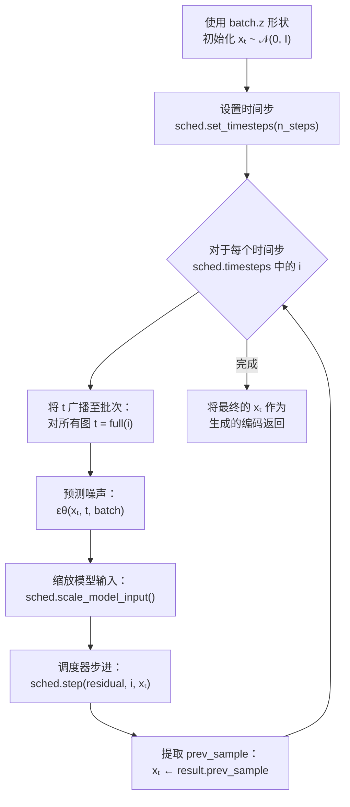
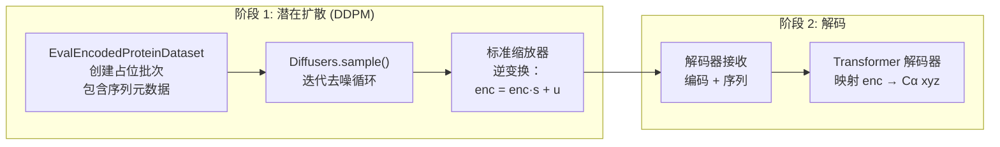

---
slug:7-ddpm-sampling-process
blog_type:normal
---


DDPM（去噪扩散概率模型）采样过程是 idpSAM 潜在扩散阶段的核心生成引擎。它运行在**经学习的 16 维潜在空间**中——而非原始 3D 坐标上——逐步将纯高斯噪声去噪为结构化的蛋白质编码，随后解码器将这些编码映射为 Cα 坐标。本页将阐述其数学公式、迭代的逆向过程、由 Hugging Face Diffusers 支持的调度器配置，以及采样如何集成到完整的推理流程中。

## 数学基础

idpSAM 在潜在空间中采用了**前向-逆向扩散框架**。在训练期间，干净的编码 **x₀** 通过在 *T* 个时间步上添加高斯噪声被逐步破坏，产生带噪分布 *q(xₜ|x₀)*。在推理时，该过程被逆转：从纯噪声 **xₜ** ~ 𝒩(0, I) 开始，训练好的噪声预测网络 εθ 迭代地去噪以恢复干净的编码。

**前向过程**（仅用于训练——定义破坏进度）：

*q(xₜ|x₀) = 𝒩(xₜ; √ᾱₜx₀, (1−ᾱₜ)I)*

其中 ᾱₜ 是 (1−βₜ) 的累积乘积，由调度器的 beta schedule 控制。

**逆向过程**（采样——核心生成循环）：

*xₜ₋₁ = (1/√αₜ)(xₜ − (βₜ/√(1−ᾱₜ))εθ(xₜ, t)) + σₜz*

其中当 *t > 1* 时 *z ~ 𝒩(0, I)*，当 *t = 1* 时 *z = 0*。方差 σₜ 由 `variance_type` 设置决定。预测目标为 **ε-prediction**（噪声预测），意味着网络学习预测被添加的噪声，而非直接预测干净信号。

来源: [diffusers_dm.py](sam/diffusion/diffusers_dm.py#L27-L42), [models.yaml](config/models.yaml#L60-L70)

## 调度器配置

扩散过程由 Hugging Face 的 `DDPMScheduler` 编排，在 `Diffusers` 类内部构建。默认配置（来自 `config/models.yaml`）定义了以下参数：

| 参数 | 默认值 | 描述 |
|-----------|---------------|-------------|
| `name` | `ddpm` | 调度器类型（也支持 `ddim`） |
| `num_train_timesteps` | `1000` | 总扩散时间步 *T*（训练） |
| `beta_start` | `0.0001` | 起始噪声水平 β₁ |
| `beta_end` | `0.02` | 结束噪声水平 βₜ |
| `beta_schedule` | `sigmoid` | 在起始和结束之间插值 β 的进度安排 |
| `variance_type` | `fixed_small` | 后验方差：使用下界 σ²ₜ = βₜ(1−ᾱₜ₋₁)/(1−ᾱₜ) |
| `prediction_type` | `epsilon` | 网络预测噪声 ε（而非 x₀ 或速度） |

**sigmoid beta schedule** 使用 sigmoid 函数在 `beta_start` 和 `beta_end` 之间平滑地插值 β 值，产生平缓的噪声增加，避免了急剧的过渡。**`fixed_small` 方差**选项使用解析推导的后验方差（两个有效选择中较小的一个），这往往能产生更稳定的样本。关键的是，`clip_sample=False`——调度器从不裁剪中间样本，从而保留了潜在空间的完整动态范围。

在采样时，可以通过 `n_steps` 参数（默认值：100）将步数减少到 1000 以下，该参数调用 `sched.set_timesteps(n_steps)` 对 1000 步的调度进行子采样。这是权衡样本质量与速度的主要调节旋钮。

来源: [diffusers_dm.py](sam/diffusion/diffusers_dm.py#L27-L61), [models.yaml](config/models.yaml#L62-L70)

## 迭代去噪循环

`Diffusers` 类中的 `sample()` 方法将逆向扩散过程实现为遍历调度器时间步序列的确定性循环。以下是精确的流程：



**逐步机制：**

1. **初始化** —— 使用 `torch.randn_like(batch.z)` 创建纯高斯噪声张量 `x_t`，其形状与潜在编码张量 *(B, L, 16)* 匹配，其中 *B* 为批次大小，*L* 为序列长度，16 为编码维度。

2. **时间步广播** —— 对于调度器时间步序列中的每个离散时间步 `i`，通过用相同值 `i` 填充批次大小的向量来创建张量 `t`，确保批次中的所有样本处于相同的扩散步骤。

3. **噪声预测** —— 调用噪声预测网络 `model(xt=x_t, t=t, batch=batch)`。这是 [噪声预测网络](8-noise-prediction-network)，一个 16 层的 Transformer，它接收带噪潜在表示 `xₜ`、时间步嵌入 `t` 以及来自 `batch` 的氨基酸序列上下文。它输出与 `xₜ` 形状相同的预测噪声 ε 张量。

4. **模型输入缩放** —— `sched.scale_model_input()` 应用调度器公式所需的任何依赖于时间步的缩放。对于使用 epsilon 预测的标准 DDPM 调度器，这本质上是一个无操作（identity），但它确保了与其他预测类型的兼容性。

5. **调度器步进** —— `sched.step(noisy_residual, i, x_t)` 使用预测的噪声、当前时间步和当前带噪样本计算逆向转换 *xₜ → xₜ₋₁*。结果的 `.prev_sample` 属性保存在下一个较低时间步的去噪样本。

6. **循环完成** —— 在所有时间步耗尽后，最终的 `x_t` 即为标准化潜在空间中完全去噪的编码。

来源: [diffusers_dm.py](sam/diffusion/diffusers_dm.py#L151-L187)

## 与 SAM 推理流程的集成

DDPM 采样器并非孤立运行——它被嵌入到由 `SAM` 类编排的两阶段推理流程中。`generate()` 方法处理扩散阶段，其输出流入 `decode()` 以进行坐标重建。



**用于采样的数据集准备** —— `EvalEncodedProteinDataset` 仅从氨基酸序列构建轻量级数据集对象。它创建 `n_frames` 个形状为 *(n_frames, L, 16)* 的全零占位编码张量。这些零张量**并不**用作输入数据——它们仅仅定义了供 `torch.randn_like()` 用来生成初始噪声的张量形状 `batch.z`。实际的氨基酸特征（`batch.a`）是传入扩散循环的唯一有意义的信息，提供了将去噪引导至正确蛋白质的序列条件。

**批量生成** —— `generate()` 方法遍历 DataLoader，为每个批次调用 `diffusion.sample(batch, n_steps=n_steps)`，并拼接结果直到生成 `n_samples` 个构象。这允许通过 `batch_size` 控制内存使用量，从而生成任意大的系综。

**标准缩放器逆变换** —— 采样后，如果训练期间使用了标准缩放器（由 `use_enc_std_scaler: true` 控制），生成的编码将通过 `enc_gen = enc_gen * s + u` 进行反归一化，其中 `s` 和 `u` 是保存的标准差和均值张量。这将在传递给解码器之前，把标准化后的潜在表示映射回编码器的原始分布。

来源: [model.py](sam/model.py#L201-L266), [cg_protein.py](sam/data/cg_protein.py#L1275-L1321), [diffusers_dm.py](sam/diffusion/diffusers_dm.py#L151-L187)

## 噪声预测作为去噪核心

在逆向过程的每一步中，生成样本的质量完全取决于噪声预测网络 εθ。网络在采样循环中的 `forward` 签名为：

```python
model(xt=x_t, t=t, batch=batch)
```

这由 `SAM_EpsTransformer` 封装，它从批次中提取氨基酸特征（`batch.a`）、残基索引（`batch.r`）和模板编码（`batch.z_t`），然后委托给核心的 `EpsTransformer.forward(z_t, t, a, r, z_tem)`。该网络处理三种类型的条件：

| 条件类型 | 来源 | 在采样中的作用 |
|-------------------|--------|-----------------|
| **时间步** *t* | 扩散循环 | 告知网络在此步中要去除*多少*噪声 |
| **氨基酸** *a* | `batch.a`（独热编码） | 将去噪引导至正确蛋白质的潜在分布 |
| **带噪潜在表示** *xₜ* | 上一步的输出 | 正在被逐步净化的信号 |

氨基酸条件至关重要——没有它，模型将生成随机的类蛋白质编码，而非特定输入序列的编码。这正是 idpSAM 成为**条件**扩散模型的原因。

如需深入了解实现 εθ 的 Transformer 架构，请参阅[噪声预测网络](8-noise-prediction-network)。

来源: [eps.py](sam/nn/noise_prediction/eps.py#L699-L708), [eps.py](sam/nn/noise_prediction/eps.py#L634-L678)

## 训练损失：学习预测噪声

扩散模型通过 `loss()` 方法进行训练，该方法实现了标准的 DDPM 训练目标。该过程以与逆向采样循环相反的顺序进行：

1. **采样时间步** —— 对于批次中的每个图，从 {0, 1, ..., *T*−1} 中均匀采样 *t*。
2. **采样噪声** —— 采样与干净编码 `batch.z` 形状相同的 ε ~ 𝒩(0, I)。
3. **创建带噪输入** —— `xₜ = sched.add_noise(x₀, noise, t)` 将前向过程应用于干净编码。
4. **预测噪声** —— 网络预测 εθ(xₜ, t, batch)，输出通过 `sched.scale_model_input()` 进行缩放。
5. **计算损失** —— 在 `prediction_type="epsilon"` 的情况下，目标是真实噪声 ε，损失为 **L2 (MSE)**：`F.mse_loss(noise, model_out)`。

这是简化后的 DDPM 目标——数据对数似然变分下界的单样本蒙特卡洛估计，这对于训练有效的去噪网络已足够。

来源: [diffusers_dm.py](sam/diffusion/diffusers_dm.py#L89-L148)

## EMA 与推理时的模型选择

`DiffusionCommon` 基类提供了 `get_sample_model()`，它决定了在采样期间使用哪个版本的噪声预测网络：

- 如果 **EMA（指数移动平均）** 可用，则使用 EMA 平滑后的权重（`self.ema.ema_model`）。
- 否则，使用标准的训练权重（`self.eps_model`）。

在当前的推理流程（`SAM.__init__`）中，`self.eps_ema` 被设置为 `None`，因此始终使用标准权重。然而，配置文件表明训练期间使用了 EMA 参数（`_use_ema: true`，`beta: 0.9999`），并且发布的权重（`nn.eps.pt`）可能已经包含了内置的 EMA 平均参数。

来源: [common.py](sam/diffusion/common.py#L5-L11), [model.py](sam/model.py#L90-L93), [models.yaml](config/models.yaml#L100-L105)

## DDIM 支持：加速采样

虽然 DDPM 是默认选项，但 `Diffusers` 类也支持 **DDIM**（去噪扩散隐式模型）调度。DDIM 用确定性过程取代了随机逆向过程，从而实现：

- **更少步骤下更高质量** —— DDIM 能够以远少于 DDPM 的步数生成优质样本，因为它以有原则的方式跳过时间步，而不是对 DDPM 调度进行子采样。
- **确定性生成** —— 给定相同的初始噪声，DDIM 总是产生相同的输出（逆向过程中无随机性）。

要切换至 DDIM，请在 `sched_params` 配置块中设置 `name: ddim`。DDIM 调度器中的 `set_alpha_to_one=True` 和 `steps_offset=0` 参数控制累积 alpha 乘积的边界行为。在推理时，必须为 DDIM 显式调用 `sched.set_timesteps(n_steps)`（不像 DDPM 那样是可选的）。

<CgxTip>当使用极少步数（例如 20–50）的 DDIM 时，对于这种潜在空间扩散模型，样本质量仍能保持出人意料的高水平，使其成为快速原型设计或交互式探索的绝佳选择。然而，带有 `fixed_small` 方差的 DDPM 调度器通常能产生更多样化的系综——当目标是捕获 IDP 构象分布的全貌时，这更为可取。</CgxTip>

来源: [diffusers_dm.py](sam/diffusion/diffusers_dm.py#L43-L61), [diffusers_dm.py](sam/diffusion/diffusers_dm.py#L166-L168)

## 自条件化（实验性）

配置基础设施包含一个**自条件化**机制（`sc_params`），该机制将允许模型在每个去噪步中以其自身的先前预测为条件——将预测的 x₀ 作为额外输入馈送到下一步中。这种技术受图像扩散模型中类似机制的启发，可以通过在每一步为网络提供更纯净信号的估计来提高样本质量。然而，在当前的代码库中，自条件化在 `loss()` 和 `sample()` 路径中均引发 `NotImplementedError`，表明这是一个尚未完全集成的实验性特性。

来源: [diffusers_dm.py](sam/diffusion/diffusers_dm.py#L68-L73), [diffusers_dm.py](sam/diffusion/diffusers_dm.py#L114-L123)

## 实践中的关键采样参数

当调用 `SAM.sample()` 或生成脚本时，有三个参数直接控制 DDPM 过程：

| 参数 | 默认值 | 范围 | 影响 |
|-----------|---------|-------|--------|
| `n_samples` | 1000 | ≥ 1 | 要生成的总构象数；更大的值能更好地捕获 IDP 分布 |
| `n_steps` | 100 | 1–1000 | 扩散去噪步数；更多步 = 更高质量但更慢；100 是强有力的默认值 |
| `batch_size_eps` | 256 | ≥ 1 | 控制采样期间的 GPU 内存使用量；更大的批次每样本效率更高 |

`n_steps` 参数是对质量与速度权衡影响最大的参数。在 1000 步（完整6完整训练调度）时，每个去噪步非常小，模型的噪声预测最为准确。在 100 步时，调度器对每第 10 个时间步进行子采样，模型必须进行更大的修正——由于潜在空间平滑，它能很好地处理这一点，但会损失一些细粒度细节。在 ~50 步以下，质量退化将变得明显。

来源: [model.py](sam/model.py#L134-L160), [generate_ensemble.py](scripts/generate_ensemble.py#L29-L33)

## 接下来去哪

DDPM 采样过程依赖于本指南其他部分中记录的两个关键组件：

- **[噪声预测网络](8-noise-prediction-network)** —— 驱动每个去噪步的 16 层条件 Transformer (εθ)，包括其时间步/序列条件化机制和自适应层归一化。
- **[两阶段架构概述](4-two-stage-architecture-overview)** —— DDPM 潜在扩散阶段如何融入将氨基酸序列转换为 3D 构象系综的完整编码器 → 扩散 → 解码器流程中。