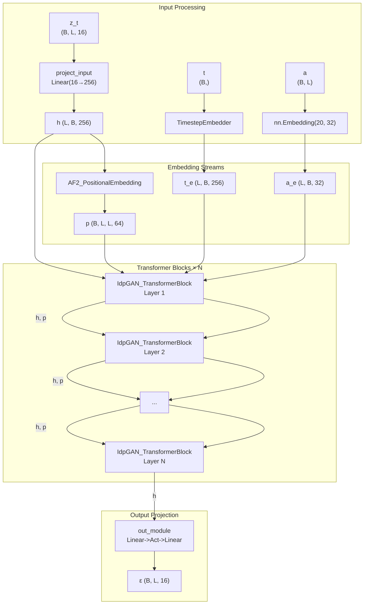
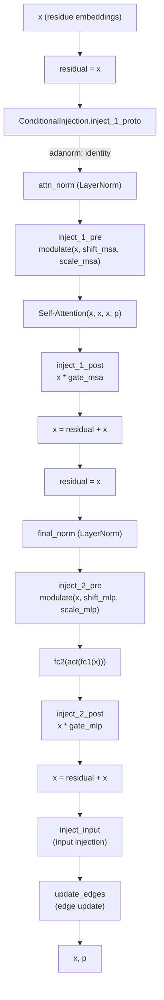

---
slug:8-noise-prediction-network
blog_type:normal
---

**噪声预测网络**（ε-network）是 idpSAM 潜在扩散过程的神经骨干——这是一种基于 Transformer 的架构，用于学习预测在任意扩散时间步 *t* 下注入潜在编码中的噪声 ε。在 DDPM 采样期间，对该网络的迭代调用会逐步将随机潜在向量去噪为结构化的蛋白质构象编码。该设计借鉴了 DiT（Diffusion Transformer）范式，引入了**自适应层归一化**以实现时间步和氨基酸的条件化，通过 AlphaFold2 风格的相对序列嵌入实现了**成对位置偏置**，以及可选的**边表示更新**，从而跨层丰富残基间的信息交流。

## 架构概述

该网络被实现为 `EpsTransformer`——一个由 `IdpGAN_TransformerBlock` 层组成的堆栈，通过条件化自注意力和 MLP 更新来处理一系列潜在向量（每个残基一个）。三条并行的嵌入流为每一层提供输入：**时间步嵌入**（扩散时间 *t*）、**氨基酸嵌入**（序列标识）和**成对位置嵌入**（相对序列间隔）。整体的数据流过程如下：

**输入维度**（`input_dim=16`）与自编码器的编码维度相匹配，这意味着网络直接在每个残基的 16 维潜在向量上进行操作。这些向量在进入 Transformer 堆栈之前被向上投影到 `embed_dim=256`，而最终的输出模块则将其重新向下投影到 16 维——从而生成与输入形状相同的噪声估计。

来源：[eps.py](/sam/nn/noise_prediction/eps.py#L403-L588), [models.yaml](/config/models.yaml#L68-L106)

## 输入嵌入流水线

在 Transformer 层进行任何处理之前，四个不同的嵌入分支会准备条件化的输入。每个分支都发挥着特定作用，为网络提供关于我们在扩散过程中的**何时**、正在建模**何种**蛋白质序列以及残基之间**相对何处**的信息。

### 时间步嵌入

`TimestepEmbedder` 遵循 GLIDE / DiT 系列模型的正弦频率嵌入策略，将标量扩散时间步 *t* 转换为密集向量。首先，正弦位置编码使用最大周期为 10,000 的半余弦/半正弦基函数，将 *t* 映射到 `frequency_embedding_size=256` 维度。随后，一个两层 MLP（层间带有 SiLU 激活函数）将其投影到 `time_embed_dim=256` 维度。生成的嵌入将在所有 *L* 个残基位置上复制，以便序列中的每个 token 都能接收到相同的时间上下文。

来源：[embedding.py](/sam/nn/noise_prediction/embedding.py#L14-L50)

### 氨基酸嵌入

当 `use_bead_embed=True` 时，一个可学习的 `nn.Embedding(20, bead_embed_dim)` 查找表会将 20 种标准氨基酸中的每一种映射为一个 32 维向量（通过 `bead_embed_dim=32` 配置）。该嵌入与时间步嵌入一起被**条件化注入**——在默认的 `adanorm` 模式下，氨基酸嵌入首先通过一个线性层投影到 `time_embed_dim`，然后与时间步嵌入相加，再进入自适应层归一化调制路径。设置 `use_bead_embed=False` 将完全禁用此分支，从而生成一个**氨基酸无条件**模型。

来源：[eps.py](/sam/nn/noise_prediction/eps.py#L518-L530), [embedding.py](/sam/nn/noise_prediction/embedding.py#L100-L130)

### 成对位置嵌入

`AF2_PositionalEmbedding` 生成一个 2D 表示，用于编码每对残基 (i, j) 之间的**相对序列间隔**。对于长度为 *L* 的序列，这会生成一个形状为 `(B, L, L, pos_embed_dim)` 的张量。该模块计算所有残基对的 `|i - j|`，将结果划分到 `2 × pos_embed_r + 1` 个区间之一（其中 `pos_embed_r=32`），并索引到可学习的嵌入查找表中。该成对信号作为**偏置项**被送入每个 Transformer 层的自注意力计算中，使网络能够根据序列距离进行不同的注意力分配——这是蛋白质结构建模中一种关键的归纳偏置。

来源：[common.py](/sam/nn/common.py#L130-L198)

### 边嵌入（可选）

当设置了 `edge_embed_mode`（例如 `"concat"`）时，`EPS_EdgeEmbedder` 模块会通过将位置嵌入与时间步嵌入（在残基对上广播）和氨基酸嵌入（针对残基 i 和 j）进行拼接来丰富成对位置嵌入，然后通过 MLP 将组合后的向量投影到目标 `edge_embed_dim`。在默认配置中，此模块处于**禁用**状态（`edge_embed_mode: null`），因此原始位置嵌入将直接作为成对信号传递。

来源：[eps.py](/sam/nn/noise_prediction/eps.py#L272-L307)

## Transformer 块：IdpGAN_TransformerBlock

每个 `IdpGAN_TransformerBlock` 实现了一个条件化 Transformer 层，按顺序执行以下子操作：

### 条件化自注意力

自注意力机制通过 `attention_type` 参数支持两种后端实现：

| 后端 | 类 | 核心特征 |
|---|---|---|
| `"transformer"` | `TransformerLayer` | 自定义多头注意力，将成对位置偏置直接加到点积亲和力矩阵中 |
| `"pytorch"` | `PyTorchAttentionLayer` | 封装了 `nn.MultiheadAttention`，将边投影的注意力偏置作为 `attn_mask` 输入 |

在这两种情况下，形状为 `(B, L, L, pos_embed_dim)` 的成对嵌入 *p* 会被线性投影到 `num_heads` 个通道，然后重塑并作为**逐头偏置** 在 softmax 之前加到注意力 logits 中。这使得每个注意力头都能学习独特的成对交互模式。

默认配置使用 `attention_type: "transformer"`，包含 16 个头，`embed_dim=256`，且没有单独的 `d_model`（默认为 `embed_dim`），从而产生为 16 的头维度。

来源：[eps.py](/sam/nn/noise_prediction/eps.py#L30-L165), [transformer.py](/sam/nn/transformer.py#L11-L118)

### 条件注入：AdaLN-Zero

`ConditionalInjectionModule` 是使每个 Transformer 层具备**时间和序列感知**能力的核心机制。支持三种注入模式，默认模式为 `adanorm`：

| 模式 | 机制 | 输出维度 |
|---|---|---|
| `"adanorm"` | 自适应层归一化（DiT 风格）——生成 6 个调制参数 × {attention, MLP} | 与 `embed_dim` 相同 |
| `"concat"` | 在 MLP 之前将条件拼接到隐藏状态 | `embed_dim + bead_embed_dim + time_embed_dim` |
| `"add"` | 将条件加性投影到隐藏状态 | 与 `embed_dim` 相同 |

在 **adanorm** 模式下，组合条件向量 `c = bead_project(a) + t` 会经过一个 `SiLU → Linear(time_embed_dim, 6 × embed_dim)` 调制网络，然后被切分为六个参数：

- **(shift_msa, scale_msa)** —— 在自注意力*之前*通过 `modulate(x, shift, scale) = x * (1 + scale) + shift` 应用
- **gate_msa** —— 在自注意力*之后*作为乘法门应用：`x = x * gate_msa`
- **(shift_mlp, scale_mlp)** —— 在 MLP 块*之前*通过相同的 `modulate` 函数应用
- **gate_mlp** —— 在 MLP 块*之后*作为乘法门应用

**adaLN-Zero** 初始化（将最终线性层的权重和偏置零初始化）确保了每个 Transformer 块最初充当恒等映射——这是 DiT 论文中一项关键的训练稳定化技术，允许网络从平凡函数平滑过渡到完整的噪声预测器。

来源：[embedding.py](/sam/nn/noise_prediction/embedding.py#L63-L190)

### 输入注入

`input_inject_mode` 参数控制如何将**原始噪声输入** `z_t` 重新注入到每个 Transformer 层的输出中。可用两种模式：

- **`"add"`**（默认）：通过一个可学习的线性层将 `z_t` 投影到 `embed_dim`，将其加到层输出中，然后应用 LayerNorm。这为每一层提供了到原始输入的直接“跳跃连接”，有助于保留有关当前噪声状态的信息。
- **`"adanorm"`**：使用 `InputInjectionModule`，该模块应用以 `z_t` 和时间步 `t` 为条件的 adaLN 风格调制，随后是一个带有残差连接的小型 MLP。这是一种更具表达力的路径，允许网络学习如何基于当前扩散时间来整合输入。

当 `input_inject_mode` 为 `None` 时，不发生输入注入，Transformer 层仅处理其内部表示。

来源：[eps.py](/sam/nn/noise_prediction/eps.py#L202-L230), [embedding.py](/sam/nn/noise_prediction/embedding.py#L197-L288)

### 边表示更新

每个 Transformer 块可以选择在节点更新之后，通过以下两个边更新模块之一来更新成对（边）表示 *p*：

| 更新器 | 核心操作 |
|---|---|
| `EdgeUpdaterFrameDiff` | 计算下投影节点特征的外积（通过拼接或相加），与当前边特征拼接，应用带残差的 MLP，然后进行 LayerNorm |
| `EdgeUpdaterSAM_0` | 将对称的成对节点贡献加到投影的边特征中，应用带残差的 MLP 和 LayerNorm |

边更新由 `edge_update_mode` 和 `edge_update_freq` 控制——后者决定边更新器运行的频率（每 *k* 层运行一次）。**最后一个 Transformer 层从不执行边更新**，因为其边输出不会被使用。在默认配置中，边更新处于**禁用**状态（`edge_update_mode: null`）。

来源：[eps.py](/sam/nn/noise_prediction/eps.py#L309-L396)

## 输出模块

在最后一个 Transformer 层之后，形状为 `(L, B, 256)` 的残基嵌入 *h* 会通过一个两层 MLP 输出模块。可用两种输出模式：

| 模式 | 架构 |
|---|---|
| `"idpgan"`（默认） | `Linear(256, 256) → Activation → Linear(256, 16)` |
| `"esm"` | `Linear(256, 256) → Activation → LayerNorm(256) → Linear(256, 16)` |

输出被转置回 `(B, L, 16)` 以匹配输入形状——为每个残基的潜在编码生成预测噪声 ε_θ(z_t, t, a)。在训练期间，此预测将与通过前向扩散过程采样的真实噪声通过 L2 损失进行比较（参见 [DDPM 采样过程](7-ddpm-sampling-process)）。

来源：[eps.py](/sam/nn/noise_prediction/eps.py#L590-L600)

## SAM_EpsTransformer 包装器

`SAM_EpsTransformer` 类封装了 `EpsTransformer`，通过 `prepare_eps_input` 处理批次级别的输入准备。该函数根据网络的配置标志（`use_bead_embed`、`use_pt_aa_embeddings`、`use_res_ids`、`tem_inject_mode`）从批次对象中提取氨基酸索引、残基索引和模板张量。包装器的 `forward` 签名接受 `(xt, t, batch)`，将扩散循环与批次数据布局的细节解耦。

工厂函数 `get_eps_network(model_cfg)` 会检查 `EpsTransformer.__init__` 的签名，从 `model_cfg["latent_network"]` 中提取匹配的参数，并自动从 `model_cfg["generative_model"]["encoding_dim"]` 设置 `input_dim`——确保噪声预测器的输入/输出维度始终与自编码器的潜在空间相匹配。

来源：[eps.py](/sam/nn/noise_prediction/eps.py#L728-L779)

## 默认配置摘要

下表总结了在 idpSAM v1.0 中部署的噪声预测网络，数据直接取自模型配置：

| 参数 | 值 | 描述 |
|---|---|---|
| `arch` | `eps_trf` | 架构标识符 |
| `num_layers` | 16 | Transformer 块的数量 |
| `attention_type` | `transformer` | 带有成对偏置的自定义注意力 |
| `embed_dim` | 256 | 隐藏嵌入维度 |
| `num_heads` | 16 | 多头注意力头数 |
| `mlp_dim` | 512 | MLP 隐藏维度 (4× embed_dim) |
| `norm_pos` | `pre` | 前归一化（在 attention/MLP 之前进行 LayerNorm） |
| `activation` | `gelu` | GELU 非线性 |
| `out_mode` | `idpgan` | 两层输出投影 |
| `time_embed_dim` | 256 | 时间步嵌入维度 |
| `bead_embed_dim` | 32 | 氨基酸嵌入维度 |
| `pos_embed_dim` | 64 | 成对位置嵌入维度 |
| `embed_inject_mode` | `adanorm` | AdaLN-Zero 条件化 |
| `input_inject_mode` | `add` | 加性输入注入 |
| `edge_embed_mode` | `null` | 无边嵌入丰富 |
| `edge_update_mode` | `null` | 无边表示更新 |
| `_use_fp16` | `true` | 混合精度训练 |
| `_use_ema` | `true` | β=0.9999 的 EMA |

<CgxTip>adaLN-Zero 条件化与加性输入注入相结合，创建了一种双跳跃架构：adaLN-Zero 初始化使每个块作为恒等映射开始，而输入注入提供了从 z_t 到每一层的直接路径。这种组合对于在扩散设置中稳定训练深达 16 层的噪声预测器至关重要。</CgxTip>

<CgxTip>故意将 `bead_embed_dim=32` 设置为小于 `time_embed_dim=256`。氨基酸嵌入在进入 adaLN 路径求和之前会被向上投影到时间嵌入维度，这意味着这个 32 维瓶颈充当了信息正则化器——在序列条件化调制完整的 256 维隐藏状态之前，强制其通过紧凑的表示。</CgxTip>

来源：[models.yaml](/config/models.yaml#L68-L106)

## 在扩散流水线中的角色

在**训练**期间，ε-network 接收噪声潜在变量 `z_t = √(ᾱ_t) · z_0 + √(1 - ᾱ_t) · ε` 和时间步 *t*，并通过 L2 损失训练以恢复噪声 ε。在**采样**期间，训练好的网络在每个反向扩散步骤中被迭代调用：从纯高斯噪声 z_T 开始，调度器利用网络的预测计算去噪估计 z_{t-1}。此反向过程在 `Diffusers` 类中实现（参见 [DDPM 采样过程](7-ddpm-sampling-process)），该类将 HuggingFace 的 `DDPMScheduler` 委托用于噪声调度和步长计算。

完整的推理流程——从氨基酸序列到 3D 坐标——将 ε-network 的去噪与解码器的潜在到坐标映射相链接，由 `SAM.sample()` 方法编排。

来源：[diffusers_dm.py](/sam/diffusion/diffusers_dm.py#L75-L145), [model.py](/sam/model.py#L82-L112)

## 建议阅读

- **[DDPM 采样过程](7-ddpm-sampling-process)** —— ε-network 的预测如何驱动反向扩散循环
- **[自适应层归一化](12-adaptive-layer-normalization)** —— 深入探讨 adaLN-Zero 条件化机制
- **[自定义 Transformer 注意力](11-custom-transformer-attention)** —— 成对偏置注意力实现的详细信息
- **[时间步与序列嵌入](13-timestep-and-sequence-embedding)** —— 正弦时间步和氨基酸嵌入策略