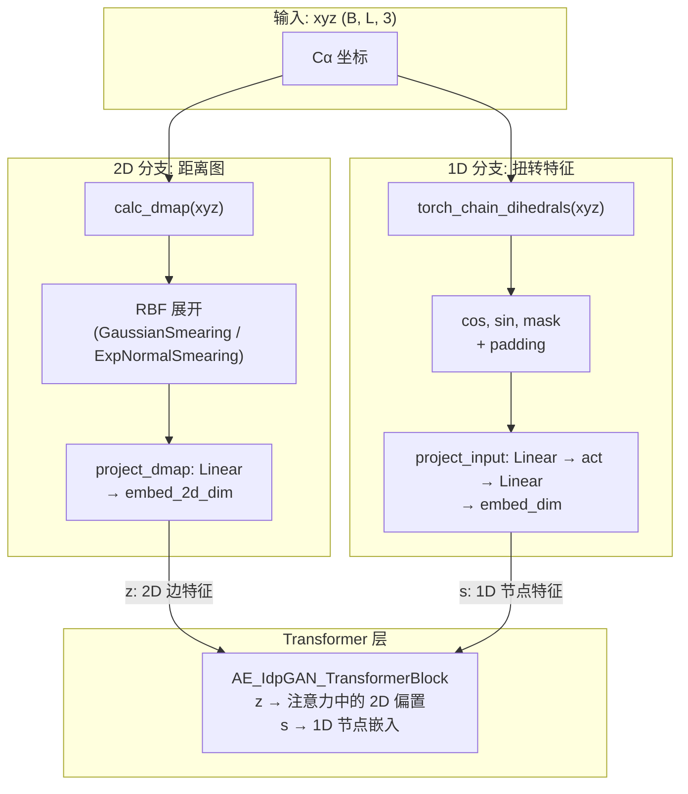

---
slug:9-distance-map-and-torsion-features
blog_type:normal
---

距离图和主链扭转角特征是两种互补的几何表示，它们为 idpSAM 两阶段架构的 **编码器** 提供动力。距离图以 2D 信号的形式捕获所有残基对之间的**成对**空间关系，而扭转特征则以 1D 信号的形式编码主链上的**序列**角度几何。它们共同提供了每个构象的欧几里得不变描述——根据构造，距离图是置换等变的且旋转/平移不变的，而扭转角则是内部旋转不变的。这种双重表示使得编码器能够生成独立于坐标系的编码结构，这是稳定隐式扩散采样的先决条件。

## 距离图计算

距离图由 `calc_dmap` 函数计算，该函数接收形状为 `(B, L, 3)`（批次 × 残基 × xyz）的 3D 坐标张量，并返回形状为 `(B, 1, L, L)` 的成对欧几里得距离矩阵。核心计算是广播减法：对于每对残基 *(i, j)*，函数计算 `√(Σ(xyz_i − xyz_j)² + ε)`，其中极小值 epsilon (`1e-12`) 用于防止零距离处的梯度奇异性。预处理管道也支持 NumPy 后端。输出中保留单一通道维度，以便与后续沿该通道轴操作的 RBF 展开层干净地对接。

来源: [coords.py](sam/coords.py#L5-L37)

### 上三角提取

伴随函数 `calc_dmap_triu` 仅提取距离图的上三角元素（offset=1，排除对角线）。这在计算损失或序列化时非常有用，因为此时完整的对称矩阵是冗余的。它接受原始坐标或预计算的距离图张量，检测输入形状并在必要时委托给 `calc_dmap`。

来源: [coords.py](sam/coords.py#L40-L70)

### 边级距离图

对于图结构输入（例如，噪声预测网络中使用的稀疏邻居图），`get_edge_dmap` 仅计算由 `nr_edge_index` 对指定的边的距离，避免了完整距离图 O(L²) 的物化。给定坐标 `xyz` 以及包含 `(row, col)` 索引张量的 `batch.nr_edge_index` 批次对象，它返回形状为 `(num_edges,)` 的 1D 距离向量。

来源: [coords.py](sam/coords.py#L144-L150)

## 主链扭转（二面角）特征

主链二面角由 `torch_chain_dihedrals` 计算，它计算链上每四个连续 Cα 原子的类 φ 二面角。给定形状为 `(B, L, 3)` 的坐标，它为每个四元组构造三个键向量 — **b₀** = −(r_{i+1} − r_i)，**b₁** = r_{i+2} − r_{i+1}，**b₂** = r_{i+3} − r_{i+2} — 然后计算叉积 **b₀×b₁** 和 **b₂×b₁**。二面角通过 `atan2(y, x)` 恢复，其中 *x* = (b₀×b₁)·(b₂×b₁) 且 *y* = ((b₀×b₁)×(b₂×b₁))·b₁ / ‖b₁‖。这会生成形状为 `(B, L−3)` 且值在 `[−π, π]` 范围内的张量。可选的 `norm` 标志会除以 π 将其归一化至 `[−1, 1]`。

来源: [coords.py](sam/coords.py#L73-L92)

### 扭转特征构造

原始二面角通过编码器模块中的 `get_chain_torsion_features` 转换为丰富的 3 通道特征。对于每个二面角 *α*，生成三个值：**cos(α)**、**sin(α)** 和 **1**（掩码/有效性指示符）。这种 cos-sin 编码避免了原始角度在 ±π 处的不连续性，并在单位圆上提供了唯一的 2D 表示。沿残基维度应用 `(1, 2)` 的填充：前置一个位置（用于没有前置二面角的第一个残基），追加两个位置（用于没有足够邻居来定义二面角的最后两个残基）。生成的张量形状为 `(B, L, 3)`，提供了完整的逐残基扭转特征向量。

来源: [encoder.py](sam/nn/autoencoder/encoder.py#L20-L25)

## 编码器集成管道

距离图和扭转特征通过编码器（`CA_TransformerEncoder.forward`）的两个并行分支流入，并在 Transformer 层内部汇聚：

**2D 分支（距离图 → 边偏置）：** 计算完整的成对距离图，然后通过径向基函数 (RBF) 核进行展开——`GaussianSmearing`（默认，`"rbf"`）或 `ExpNormalSmearing`（`"expnorm"`）——生成形状为 `(B, L, L, num_gaussians)` 的多通道 2D 特征图。该特征图通过 `E `project_dmap`（单层线性层，或当 `use=-use_dmap_mlp-True` 时为两层 MLP）投影至 `embed_2d_dim` 个通道。生成的张量 **z** 作为**8成(成对)偏置**注入到每个 Transformer 块4(的)(注)意力机制中。

**1D 分支（扭转 → 节点嵌入）：** 形状为 `(B, L, 3)` 的扭转特征向量通过 `project_input`（带激活函数的两层 MLP）投影至 `embed_dim`，生成进入 Transformer 堆栈的初始逐残基节点嵌入 **s**。

来源: [encoder.py](sam/nn/autoencoder/encoder.py#L190-L225), [encoder.py](sam/nn/autoencoder/encoder.py#L90-L117)

## 键角计算

尽管当前未接入编码器的前向传播，该模块还提供了 `calc_chain_bond_angles` 和 `calc_angles` 用于计算每个连续三原子组的键角。给定角度索引 `[i, i+1, i+2]`，函数归一化共享中心原子的两个键向量并返回 `arccos(u · v)`。该功能在 NumPy 中实现，可作为未来扩展的潜在附加 1D 几何特征。

来源: [coords.py](sam/coords.py#L95-L114)

## 配置参考

距离图和扭转特征参数在模型 YAML 的 `encoder` 部分进行配置。下表列出了所有相关键及其在发布的 `v1.0` 模型中的默认值：

| 参数 | 默认值 | 描述 |
|---|---|---|
| `dmap_ca_min` | `0.0` | RBF 核中心范围的最小距离 (Å) |
| `dmap_ca_cutoff` | `3.0` | RBF 核中心范围的最大距离 (Å)；超出此范围的距离将收到可忽略的激活 |
| `dmap_ca_num_gaussians` | `320` | RBF 展开中的高斯基函数数量 |
| `dmap_embed_type` | `"rbf"` | RBF 展开类型：`"rbf"` (GaussianSmearing) 或 `"expnorm"` (ExpNormalSmearing) |
| `dmap_embed_trainable` | `False` | RBF 中心/宽度是否可训练（仅适用于 `"expnorm"`） |
| `use_dmap_mlp` | `True` | 若为 `True`，`project_dmap` 为两层 MLP；若为 `False`，为单层线性层 |
| `use_torsions` | `True` | 启用扭转角特征作为 1D 输入（为清晰起见存在于配置中） |
| `embed_2d_dim` | `192` | 距离图投影的输出维度（2D 边特征维度） |

来源: [models.yaml](config/models.yaml#L30-L35), [encoder.py](sam/nn/autoencoder/encoder.py#L57-L65)

<CgxTip>高达 320 的 `dmap_ca_num_gaussians` 值配合 3.0 Å 的窄截断，提供了极细粒度的距离分辨率（每个高斯中心约 0.009 Å）。这是有意为之：IDP 构象变异性由局部和中等范围接触主导，因此编码器将其绝大部分 2D 表示容量分配给 3 nm 以下的距离，以捕捉区分不同无序系综的细微空间变化。</CgxTip>

## 与下游模块的关系

距离图和扭转特征仅供**编码器**阶段使用。解码器和噪声预测网络操作的是隐式编码而非原始几何特征。然而，噪声预测网络确实使用 `AF2_PositionalEmbedding` 为其自身的注意力层构造 2D 成对位置偏置——这是一种基于残基分离的学习型位置编码，而非根据坐标计算的距离图。RBF 展开模块（`GaussianSmearing`、`ExpNormalSmearing`）定义在几何模块中，并在 [RBF 距离嵌入](10-rbf-distance-embedding) 页面上有详细文档说明。

来源: [geometric.py](sam/nn/geometric.py#L6-L64), [eps.py](sam/nn/noise_prediction/eps.py#L557-L567)

要深入了解编码器的 Transformer 块如何在注意力机制内融合 1D 扭转嵌入与 2D 距离图偏置，请参阅 [欧几里得不变编码器](5-euclidean-invariant-encoder)。有关高斯和指数正态涂抹核的数学细节，请参阅 [RBF 距离嵌入](10-rbf-distance-embedding)。