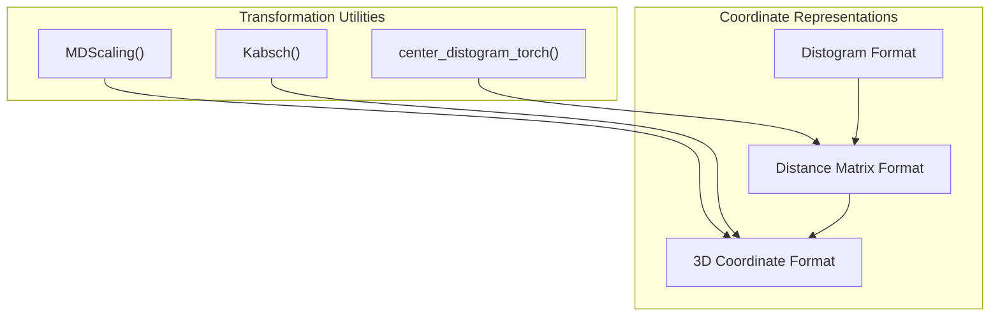
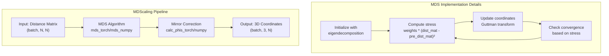
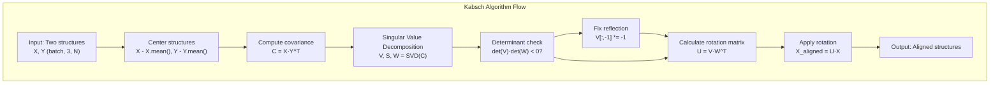
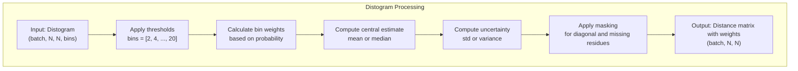
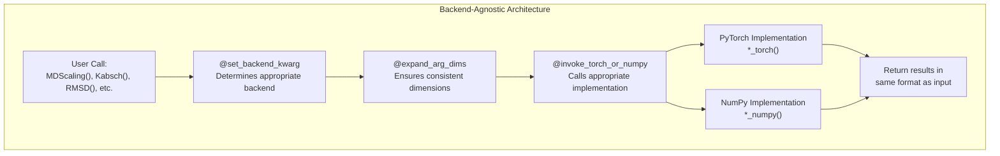
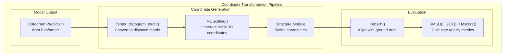

# Coordinate Transformations

> **Relevant source files**
> * [alphafold2_pytorch/utils.py](https://github.com/lucidrains/alphafold2/blob/931466e4/alphafold2_pytorch/utils.py)
> * [notebooks/structure_utils_tests.ipynb](https://github.com/lucidrains/alphafold2/blob/931466e4/notebooks/structure_utils_tests.ipynb)

This page documents the coordinate transformation utilities implemented in the AlphaFold2 PyTorch repository. These utilities provide essential functions for manipulating, aligning, and evaluating 3D protein structures throughout the protein structure prediction pipeline.

The coordinate transformation module includes functions for:

* Converting distance matrices to 3D coordinates
* Aligning predicted structures with reference structures
* Calculating geometric features like dihedral angles
* Measuring structural similarity between proteins

These utilities serve as critical building blocks for both the Structure Module's coordinate generation process (see [Structure Module](/lucidrains/alphafold2/2.2-structure-module)) and evaluation metrics for structure quality assessment (see [Structure Evaluation Metrics](/lucidrains/alphafold2/3.2-structure-evaluation-metrics)).

## Coordinate System Conventions

In this codebase, protein structures are represented in various coordinate formats:

Key coordinate conventions:

* 3D coordinates are typically represented as tensors of shape `(batch, 3, N)` where N is the number of atoms/residues
* Distance matrices are represented as tensors of shape `(batch, N, N)`
* Distograms are represented as tensors of shape `(batch, N, N, bins)` where bins represent discretized distance ranges

Sources: [alphafold2_pytorch/utils.py L766-L879](https://github.com/lucidrains/alphafold2/blob/931466e4/alphafold2_pytorch/utils.py#L766-L879)

 [alphafold2_pytorch/utils.py L999-L1051](https://github.com/lucidrains/alphafold2/blob/931466e4/alphafold2_pytorch/utils.py#L999-L1051)

 [alphafold2_pytorch/utils.py L718-L761](https://github.com/lucidrains/alphafold2/blob/931466e4/alphafold2_pytorch/utils.py#L718-L761)

## Distance Matrix to 3D Coordinate Conversion

The repository implements Multi-Dimensional Scaling (MDS) to convert distance matrices to 3D coordinates, which is a critical step in the structure generation process.

The `MDScaling` function converts distance matrices to 3D coordinates with the following steps:

1. Initialize coordinates using eigendecomposition of a double-centered distance matrix
2. Iteratively refine coordinates using the Guttman transform
3. Correct chirality/mirroring by analyzing phi angles in the protein backbone

The implementation supports both PyTorch and NumPy backends through backend-agnostic wrappers.

Sources: [alphafold2_pytorch/utils.py L766-L834](https://github.com/lucidrains/alphafold2/blob/931466e4/alphafold2_pytorch/utils.py#L766-L834)

 [alphafold2_pytorch/utils.py L835-L879](https://github.com/lucidrains/alphafold2/blob/931466e4/alphafold2_pytorch/utils.py#L835-L879)

 [alphafold2_pytorch/utils.py L1254-L1279](https://github.com/lucidrains/alphafold2/blob/931466e4/alphafold2_pytorch/utils.py#L1254-L1279)

## Structure Alignment with Kabsch Algorithm

The Kabsch algorithm is implemented to optimally align predicted structures with reference structures, minimizing RMSD (Root Mean Square Deviation).

The implementation features:

* Support for batched operations in both PyTorch and NumPy versions
* Proper handling of chirality to ensure correct alignment
* Automatic detection of the appropriate backend based on input type

Sources: [alphafold2_pytorch/utils.py L999-L1030](https://github.com/lucidrains/alphafold2/blob/931466e4/alphafold2_pytorch/utils.py#L999-L1030)

 [alphafold2_pytorch/utils.py L1031-L1051](https://github.com/lucidrains/alphafold2/blob/931466e4/alphafold2_pytorch/utils.py#L1031-L1051)

 [alphafold2_pytorch/utils.py L1282-L1294](https://github.com/lucidrains/alphafold2/blob/931466e4/alphafold2_pytorch/utils.py#L1282-L1294)

## Dihedral Angle Calculations

Dihedral angles are essential for protein structure analysis and validation. The codebase implements functions to calculate these angles efficiently.

Key dihedral angle functions:

* `get_dihedral_torch/numpy`: Calculates the dihedral angle between four points
* `calc_phis_torch/numpy`: Calculates phi angles of the protein backbone, used for mirror correction

Sources: [alphafold2_pytorch/utils.py L881-L915](https://github.com/lucidrains/alphafold2/blob/931466e4/alphafold2_pytorch/utils.py#L881-L915)

 [alphafold2_pytorch/utils.py L917-L993](https://github.com/lucidrains/alphafold2/blob/931466e4/alphafold2_pytorch/utils.py#L917-L993)

## Distogram Processing

Distograms (discretized distance distributions) are a key output of the AlphaFold2 model that need to be converted to distance matrices for structure generation.

The `center_distogram_torch` function processes distograms with these steps:

1. Apply distance thresholds to bin probabilities
2. Calculate central estimates (mean or median) for each residue pair
3. Compute uncertainty measures (standard deviation or variance)
4. Generate weights based on the inverse of uncertainty
5. Apply masking for diagonal elements (same residue pairs)

Sources: [alphafold2_pytorch/utils.py L718-L761](https://github.com/lucidrains/alphafold2/blob/931466e4/alphafold2_pytorch/utils.py#L718-L761)

 [alphafold2_pytorch/utils.py L45-L50](https://github.com/lucidrains/alphafold2/blob/931466e4/alphafold2_pytorch/utils.py#L45-L50)

## Backend-Agnostic Design

The coordinate transformation system is designed to work with both PyTorch and NumPy backends seamlessly through a system of decorators and wrappers.

Key components of the backend-agnostic design:

* `@set_backend_kwarg`: Decorator that automatically determines the backend based on input type
* `@expand_arg_dims`: Ensures consistent input dimensions across backends
* `@invoke_torch_or_numpy`: Invokes the appropriate implementation based on the backend

This design allows users to use the same function interface regardless of whether they're working with PyTorch tensors or NumPy arrays.

Sources: [alphafold2_pytorch/utils.py L54-L97](https://github.com/lucidrains/alphafold2/blob/931466e4/alphafold2_pytorch/utils.py#L54-L97)

 [alphafold2_pytorch/utils.py L1254-L1343](https://github.com/lucidrains/alphafold2/blob/931466e4/alphafold2_pytorch/utils.py#L1254-L1343)

## Structure Evaluation Metrics

The coordinate transformation utilities also provide implementations of common protein structure evaluation metrics.

| Metric | Function | Description | Score Range |
| --- | --- | --- | --- |
| RMSD | `RMSD()` | Root Mean Square Deviation between structures | Lower is better (0 = perfect) |
| GDT | `GDT()` | Global Distance Test (TS or HA variants) | Higher is better (1 = perfect) |
| TM-score | `TMscore()` | Template Modeling score | Higher is better (>0.5 suggests same fold) |
| LDDT | `lddt_ca_torch()` | Local Distance Difference Test | Higher is better (1 = perfect) |
| Distogram Loss | `distmat_loss_torch()` | Loss function based on distance matrices | Lower is better |

These metrics are implemented with both PyTorch and NumPy backends and use the coordinate transformation functions described above.

Sources: [alphafold2_pytorch/utils.py L1098-L1151](https://github.com/lucidrains/alphafold2/blob/931466e4/alphafold2_pytorch/utils.py#L1098-L1151)

 [alphafold2_pytorch/utils.py L1202-L1247](https://github.com/lucidrains/alphafold2/blob/931466e4/alphafold2_pytorch/utils.py#L1202-L1247)

 [alphafold2_pytorch/utils.py L1057-L1096](https://github.com/lucidrains/alphafold2/blob/931466e4/alphafold2_pytorch/utils.py#L1057-L1096)

## Example Usage Flow

The following diagram illustrates how the coordinate transformation utilities are typically used in the protein structure prediction pipeline:

This flow demonstrates how the coordinate transformation utilities work together to:

1. Convert model outputs (distograms) to distance matrices
2. Generate initial 3D coordinates using MDS
3. Refine these coordinates in the Structure Module
4. Align the predicted structure with the ground truth
5. Calculate quality metrics for evaluation

Sources: [alphafold2_pytorch/utils.py L764-L879](https://github.com/lucidrains/alphafold2/blob/931466e4/alphafold2_pytorch/utils.py#L764-L879)

 [alphafold2_pytorch/utils.py L718-L761](https://github.com/lucidrains/alphafold2/blob/931466e4/alphafold2_pytorch/utils.py#L718-L761)

 [alphafold2_pytorch/utils.py L999-L1051](https://github.com/lucidrains/alphafold2/blob/931466e4/alphafold2_pytorch/utils.py#L999-L1051)

 [alphafold2_pytorch/utils.py L1098-L1151](https://github.com/lucidrains/alphafold2/blob/931466e4/alphafold2_pytorch/utils.py#L1098-L1151)

## Implementation Considerations

When working with the coordinate transformation utilities, keep these important considerations in mind:

1. **Performance**: The PyTorch implementations support GPU acceleration and are generally faster for large batch sizes.
2. **Memory Usage**: MDS can be memory-intensive for large proteins. The eigendecomposition initialization helps reduce the number of required iterations.
3. **Mirror Correction**: Protein structures have a specific chirality. The `MDScaling` function includes mechanisms to fix potential mirror images.
4. **Batched Operations**: Most functions support batched operations for efficient processing of multiple structures simultaneously.
5. **Custom Distance Functions**: The `distmat_loss_torch` function supports custom loss functions for specialized distance matrix comparisons.

Sources: [alphafold2_pytorch/utils.py L766-L834](https://github.com/lucidrains/alphafold2/blob/931466e4/alphafold2_pytorch/utils.py#L766-L834)

 [alphafold2_pytorch/utils.py L1162-L1201](https://github.com/lucidrains/alphafold2/blob/931466e4/alphafold2_pytorch/utils.py#L1162-L1201)

 [alphafold2_pytorch/utils.py L1057-L1096](https://github.com/lucidrains/alphafold2/blob/931466e4/alphafold2_pytorch/utils.py#L1057-L1096)

## Related Systems

The coordinate transformation utilities are closely integrated with other components of the AlphaFold2 PyTorch implementation:

* **Structure Module** ([Structure Module](/lucidrains/alphafold2/2.2-structure-module)): Uses coordinate transformations to generate and refine 3D structures
* **Structure Evaluation Metrics** ([Structure Evaluation Metrics](/lucidrains/alphafold2/3.2-structure-evaluation-metrics)): Builds upon coordinate transformations to evaluate structure quality
* **Memory-Efficient Computation** ([Memory-Efficient Computation](/lucidrains/alphafold2/2.3-memory-efficient-computation)): Optimized implementations to reduce memory usage during training