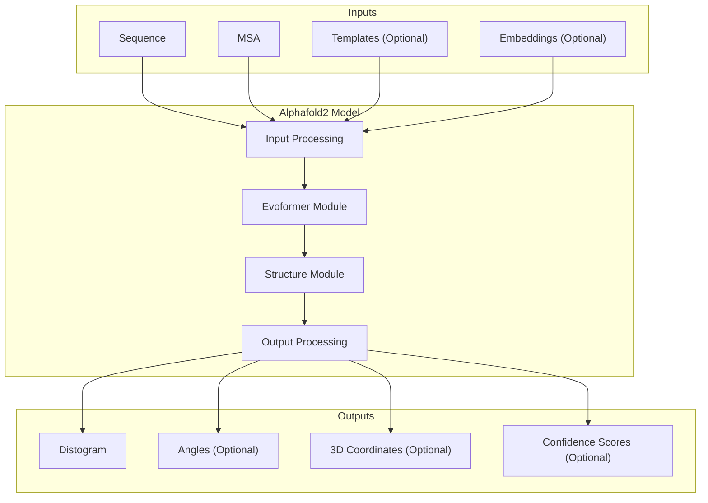
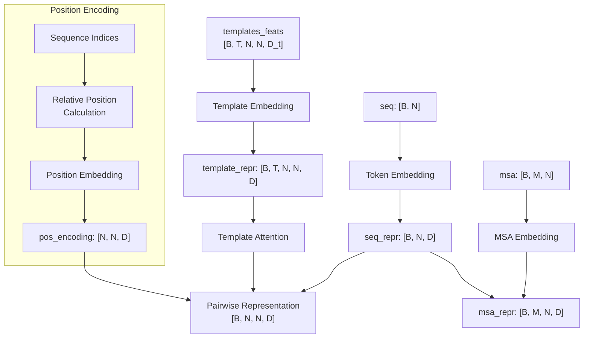
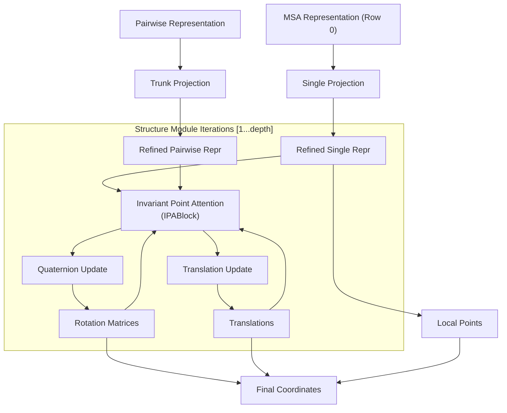
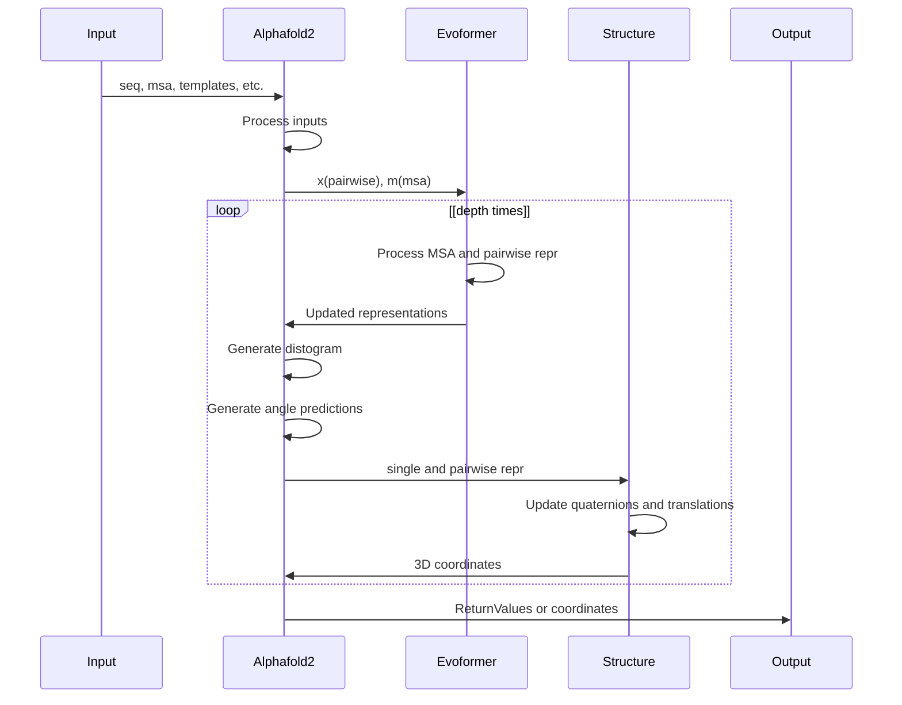
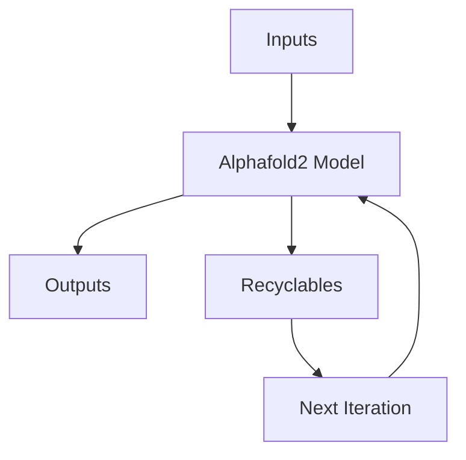

# Core Model Architecture

> **Relevant source files**
> * [alphafold2_pytorch/alphafold2.py](https://github.com/lucidrains/alphafold2/blob/931466e4/alphafold2_pytorch/alphafold2.py)
> * [tests/test_attention.py](https://github.com/lucidrains/alphafold2/blob/931466e4/tests/test_attention.py)

This document details the core architecture of the AlphaFold2 PyTorch implementation. It covers the overall structure of the model, how components interact, and the data flow from input sequences to predicted protein structures. For detailed information about specific modules, see [Evoformer Module](/lucidrains/alphafold2/2.1-evoformer-module) and [Structure Module](/lucidrains/alphafold2/2.2-structure-module).

## Overview

The AlphaFold2 implementation follows the architecture described in the original DeepMind papers, adapted for PyTorch. The model transforms amino acid sequences and multiple sequence alignments (MSAs) into 3D protein structures through a series of specialized neural network modules.



Sources: [alphafold2_pytorch/alphafold2.py L469-L905](https://github.com/lucidrains/alphafold2/blob/931466e4/alphafold2_pytorch/alphafold2.py#L469-L905)

## Model Initialization and Parameters

The `Alphafold2` class is the main entry point for the model implementation. It accepts numerous parameters that configure the behavior and capacity of the model.

```markdown
model = Alphafold2(    dim=256,             # Embedding dimension    depth=48,            # Number of Evoformer blocks    heads=8,             # Number of attention heads    dim_head=64,         # Dimension per attention head    predict_angles=True, # Whether to predict torsion angles    predict_coords=True  # Whether to predict 3D coordinates    # ... many other parameters)
```

Key parameters include:

| Parameter | Default | Description |
| --- | --- | --- |
| `dim` | Required | Base dimension for embeddings and representations |
| `max_seq_len` | 2048 | Maximum supported sequence length |
| `depth` | 6 | Number of Evoformer blocks |
| `heads` | 8 | Number of attention heads |
| `dim_head` | 64 | Dimension per attention head |
| `predict_angles` | False | Whether to predict torsion angles |
| `predict_coords` | False | Whether to produce 3D coordinates |
| `structure_module_depth` | 4 | Depth of the structure module |
| `extra_msa_evoformer_layers` | 4 | Number of extra MSA processing layers |

Sources: [alphafold2_pytorch/alphafold2.py L469-L500](https://github.com/lucidrains/alphafold2/blob/931466e4/alphafold2_pytorch/alphafold2.py#L469-L500)

## Data Structures and Types

The model uses several data structures for passing information between components:

```

```

Sources: [alphafold2_pytorch/alphafold2.py L24-L37](https://github.com/lucidrains/alphafold2/blob/931466e4/alphafold2_pytorch/alphafold2.py#L24-L37)

## Input Processing

The model accepts several types of inputs:

1. **Sequence**: Primary amino acid sequence (required)
2. **MSA**: Multiple sequence alignment (optional)
3. **Templates**: Structural templates (optional)
4. **Embeddings**: Pre-computed embeddings (optional)

The input processing stage converts these inputs into internal representations:



Sources: [alphafold2_pytorch/alphafold2.py L630-L786](https://github.com/lucidrains/alphafold2/blob/931466e4/alphafold2_pytorch/alphafold2.py#L630-L786)

## Core Structure: The Evoformer

The Evoformer is the central component that processes MSA and pairwise representations through multiple layers of attention and feed-forward networks. The Evoformer maintains two parallel representations:

1. **MSA Representation**: Captures evolutionary information from multiple sequence alignments
2. **Pairwise Representation**: Captures relationships between residue pairs

```mermaid
flowchart TD

msa_attn["MSA Attention Block"]
msa_ff["MSA FeedForward"]
pair_attn["Pairwise Attention Block"]
pair_ff["Pairwise FeedForward"]
msa_in["MSA Repr [B, M, N, D]"]
pair_in["Pairwise Repr [B, N, N, D]"]
msa_out["Updated MSA Repr"]
pair_out["Updated Pairwise Repr"]

msa_in --> msa_attn
pair_in --> pair_attn
msa_ff --> msa_out
pair_ff --> pair_out

subgraph Evoformer ["Evoformer"]

subgraph EvoformerBlock[1...depth] ["EvoformerBlock[1...depth]"]
    msa_attn --> pair_attn
    pair_attn --> msa_attn

subgraph subGraph1 ["Pairwise Processing"]
    pair_attn
    pair_ff
    pair_attn --> pair_ff
end

subgraph subGraph0 ["MSA Processing"]
    msa_attn
    msa_ff
    msa_attn --> msa_ff
end
end
end
```

Sources: [alphafold2_pytorch/alphafold2.py L412-L467](https://github.com/lucidrains/alphafold2/blob/931466e4/alphafold2_pytorch/alphafold2.py#L412-L467)

### Evoformer Block Components

Each Evoformer block consists of:

1. **Pairwise Attention Block**: * Triangle Multiplication (outgoing and ingoing) * Triangle Attention (outgoing and ingoing) * Outer product mean for communication between MSA and pairwise representations
2. **MSA Attention Block**: * Row-wise self-attention (processes rows of the MSA) * Column-wise self-attention (processes columns of the MSA) * Communication with pairwise representation
3. **Feed-Forward Networks**: * Applied to both MSA and pairwise representations

Sources: [alphafold2_pytorch/alphafold2.py L353-L409](https://github.com/lucidrains/alphafold2/blob/931466e4/alphafold2_pytorch/alphafold2.py#L353-L409)

### Memory-Efficient Implementation

The Evoformer uses PyTorch's checkpoint mechanism to reduce memory usage during training:

```markdown
# In Evoformer forward methodx, m, *_ = checkpoint_sequential(self.layers, 1, inp)
```

This allows training of deeper models by trading computation for memory. For more details, see [Memory-Efficient Computation](/lucidrains/alphafold2/2.3-memory-efficient-computation).

Sources: [alphafold2_pytorch/alphafold2.py L458-L467](https://github.com/lucidrains/alphafold2/blob/931466e4/alphafold2_pytorch/alphafold2.py#L458-L467)

## Structure Module

When `predict_coords=True`, the model includes a Structure Module that converts Evoformer outputs into 3D protein structures using invariant point attention (IPA).



The Structure Module iteratively refines a set of rotations and translations to produce the final 3D coordinates.

Sources: [alphafold2_pytorch/alphafold2.py L838-L904](https://github.com/lucidrains/alphafold2/blob/931466e4/alphafold2_pytorch/alphafold2.py#L838-L904)

## Output Types

The model produces different types of outputs depending on configuration:

1. **Distogram**: Distance distribution between residue pairs (always produced)
2. **Angle Predictions**: Torsion angles (when `predict_angles=True`)
3. **3D Coordinates**: Atom positions (when `predict_coords=True`)
4. **Confidence Scores**: Per-residue confidence (when `return_confidence=True`)

For recycling capabilities, the model can also return `Recyclables` that can be fed back into the model for iterative refinement.

Sources: [alphafold2_pytorch/alphafold2.py L30-L37](https://github.com/lucidrains/alphafold2/blob/931466e4/alphafold2_pytorch/alphafold2.py#L30-L37)

 [alphafold2_pytorch/alphafold2.py L810-L904](https://github.com/lucidrains/alphafold2/blob/931466e4/alphafold2_pytorch/alphafold2.py#L810-L904)

## Model Lifecycle



Sources: [alphafold2_pytorch/alphafold2.py L630-L905](https://github.com/lucidrains/alphafold2/blob/931466e4/alphafold2_pytorch/alphafold2.py#L630-L905)

 [tests/test_attention.py L8-L385](https://github.com/lucidrains/alphafold2/blob/931466e4/tests/test_attention.py#L8-L385)

## Template Processing

When template information is available, the model processes it through special embedding and attention mechanisms:

1. Template features are projected to the model dimension
2. Templates are processed through pairwise attention layers
3. Template information is added to the pairwise representation
4. If template angle features are provided, they're added to the MSA representation

Templates provide structural guidance that can improve prediction accuracy, especially for proteins with known homologs.

Sources: [alphafold2_pytorch/alphafold2.py L743-L786](https://github.com/lucidrains/alphafold2/blob/931466e4/alphafold2_pytorch/alphafold2.py#L743-L786)

## Recycling Capability

The model supports iterative refinement through recycling:



Recyclable information includes:

* Predicted coordinates
* Single MSA representation (first row)
* Pairwise representation

This allows the model to refine its predictions over multiple iterations.

Sources: [alphafold2_pytorch/alphafold2.py L622-L629](https://github.com/lucidrains/alphafold2/blob/931466e4/alphafold2_pytorch/alphafold2.py#L622-L629)

 [alphafold2_pytorch/alphafold2.py L896-L898](https://github.com/lucidrains/alphafold2/blob/931466e4/alphafold2_pytorch/alphafold2.py#L896-L898)

 [tests/test_attention.py L344-L385](https://github.com/lucidrains/alphafold2/blob/931466e4/tests/test_attention.py#L344-L385)

## Usage Example

The model is flexible and can accommodate various input combinations, as shown in the test cases:

* Basic usage with sequence and MSA
* Sequence only (no MSA)
* With angle prediction
* With template information
* With external embeddings
* With coordinate prediction
* With recycling

Sources: [tests/test_attention.py L8-L385](https://github.com/lucidrains/alphafold2/blob/931466e4/tests/test_attention.py#L8-L385)