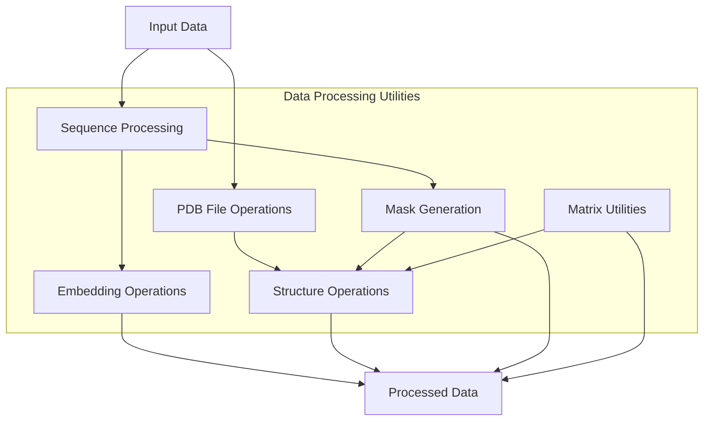
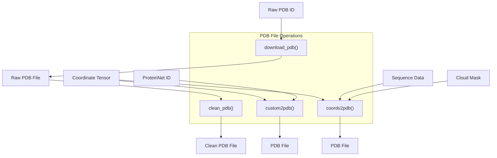
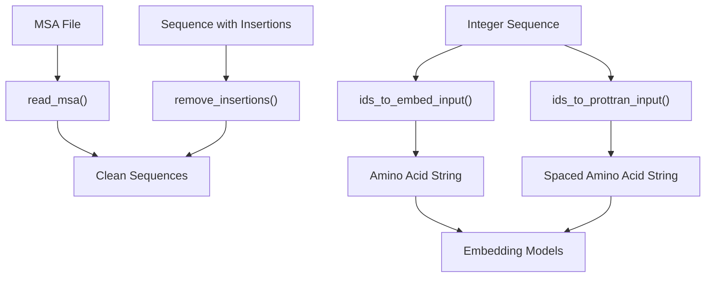
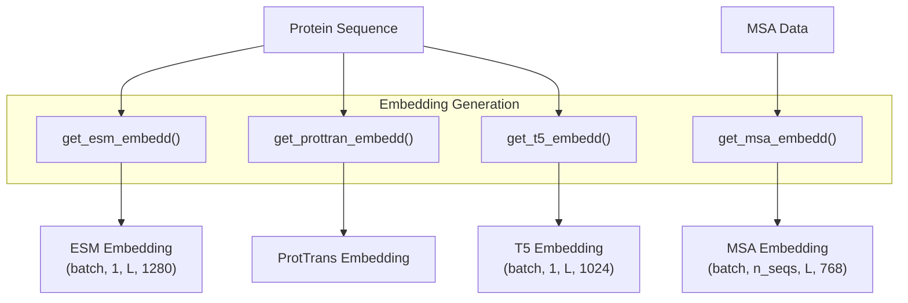
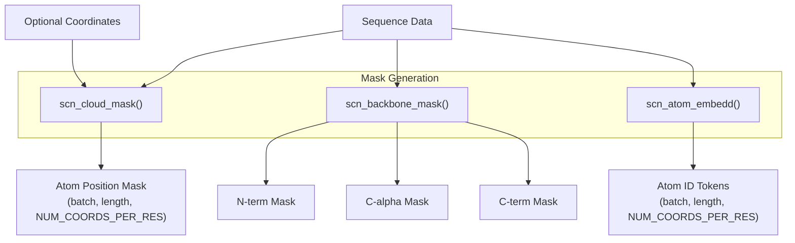
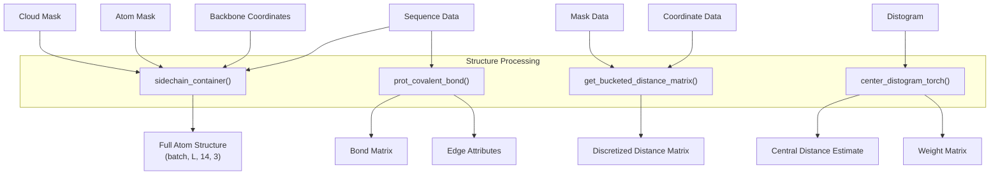
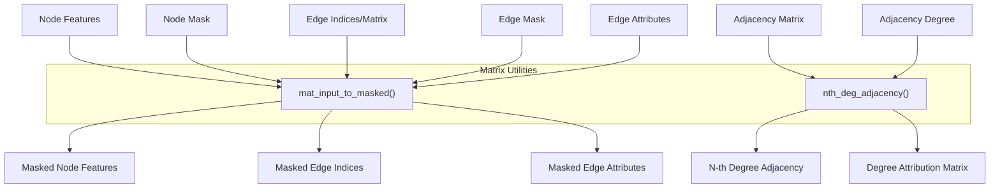
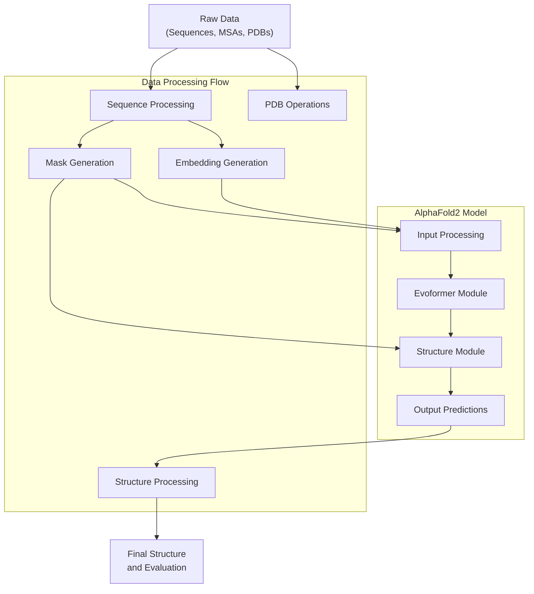

# Data Processing Utilities

> **Relevant source files**
> * [alphafold2_pytorch/utils.py](https://github.com/lucidrains/alphafold2/blob/931466e4/alphafold2_pytorch/utils.py)
> * [setup.cfg](https://github.com/lucidrains/alphafold2/blob/931466e4/setup.cfg)
> * [tests/test_utils.py](https://github.com/lucidrains/alphafold2/blob/931466e4/tests/test_utils.py)

This document details the utilities provided in the AlphaFold2 PyTorch implementation for processing protein sequence and structure data. These utilities handle everything from file I/O for protein structures to complex operations on protein coordinates and sequence embeddings. For information about coordinate transformations specifically, see [Coordinate Transformations](/lucidrains/alphafold2/3.1-coordinate-transformations), and for structure evaluation metrics, see [Structure Evaluation Metrics](/lucidrains/alphafold2/3.2-structure-evaluation-metrics).

## Overview

The data processing utilities form a critical foundation for the AlphaFold2 implementation, providing tools to manipulate and transform protein data throughout the model pipeline.



Sources: [alphafold2_pytorch/utils.py L1-L106](https://github.com/lucidrains/alphafold2/blob/931466e4/alphafold2_pytorch/utils.py#L1-L106)

## PDB File Operations

The utilities provide several functions for manipulating PDB (Protein Data Bank) files, which are the standard format for storing protein structural data.



Sources: [alphafold2_pytorch/utils.py L152-L237](https://github.com/lucidrains/alphafold2/blob/931466e4/alphafold2_pytorch/utils.py#L152-L237)

### Key Functions

* **`download_pdb`**: Downloads a PDB entry from the RCSB PDB database ```markdown download_pdb(name, route)  # name: PDB ID, route: destination file path ```
* **`clean_pdb`**: Removes extraneous information from PDB files, keeping only the relevant structural parts ```markdown clean_pdb(name, route=None, chain_num=None)  # Optionally filter for specific chains ```
* **`custom2pdb`**: Converts custom coordinate representations to PDB format ```markdown custom2pdb(coords, proteinnet_id, route)  # coords: (3 x N) or (N x 3) ```
* **`coords2pdb`**: Converts coordinates with sequence information to PDB files ``` coords2pdb(seq, coords, cloud_mask, prefix="", name="af2_struct.pdb") ```

Sources: [alphafold2_pytorch/utils.py L152-L237](https://github.com/lucidrains/alphafold2/blob/931466e4/alphafold2_pytorch/utils.py#L152-L237)

## Sequence Processing

The module provides utilities for handling protein sequences and multiple sequence alignments (MSAs), which are crucial inputs for the AlphaFold2 model.



Sources: [alphafold2_pytorch/utils.py L240-L291](https://github.com/lucidrains/alphafold2/blob/931466e4/alphafold2_pytorch/utils.py#L240-L291)

### Key Functions

* **`remove_insertions`**: Removes insertions (lowercase letters, dots, asterisks) from sequences in MSAs ```markdown remove_insertions(sequence)  # sequence: string with possible insertions ```
* **`read_msa`**: Reads multiple sequence alignments from a FASTA file ```markdown read_msa(filename, nseq)  # filename: path to MSA file, nseq: number of sequences to read ```
* **`ids_to_embed_input`**: Converts integer sequence IDs to amino acid strings for embedding models ```markdown ids_to_embed_input(x)  # x: list of integer IDs corresponding to amino acids ```
* **`ids_to_prottran_input`**: Similar to above but formats specifically for ProtTrans models ```markdown ids_to_prottran_input(x)  # x: list of integer IDs ```

Sources: [alphafold2_pytorch/utils.py L240-L291](https://github.com/lucidrains/alphafold2/blob/931466e4/alphafold2_pytorch/utils.py#L240-L291)

 [alphafold2_pytorch/utils.py L390-L420](https://github.com/lucidrains/alphafold2/blob/931466e4/alphafold2_pytorch/utils.py#L390-L420)

## Embedding Generation

AlphaFold2 uses various protein language models to generate embeddings, which are high-dimensional representations of protein sequences that capture evolutionary information.



Sources: [alphafold2_pytorch/utils.py L293-L390](https://github.com/lucidrains/alphafold2/blob/931466e4/alphafold2_pytorch/utils.py#L293-L390)

### Key Functions

* **`get_esm_embedd`**: Generates embeddings using the ESM-1b protein language model ``` get_esm_embedd(seq, embedd_model, batch_converter, msa_data=None) ```
* **`get_msa_embedd`**: Generates embeddings using the MSA Transformer model ``` get_msa_embedd(msa, embedd_model, batch_converter, device=None) ```
* **`get_t5_embedd`**: Generates embeddings using the ProtT5-XL-U50 model ``` get_t5_embedd(seq, tokenizer, encoder, msa_data=None, device=None) ```
* **`get_prottran_embedd`**: Generates embeddings using general ProtTrans models ``` get_prottran_embedd(seq, model, tokenizer, device=None) ```

Sources: [alphafold2_pytorch/utils.py L293-L390](https://github.com/lucidrains/alphafold2/blob/931466e4/alphafold2_pytorch/utils.py#L293-L390)

## Mask Generation

Various masks are used throughout the AlphaFold2 pipeline to identify specific atoms, residues, or structures within proteins.



Sources: [alphafold2_pytorch/utils.py L423-L495](https://github.com/lucidrains/alphafold2/blob/931466e4/alphafold2_pytorch/utils.py#L423-L495)

### Key Functions

* **`scn_cloud_mask`**: Creates a boolean mask for atom positions (not all amino acids have the same atoms) ``` scn_cloud_mask(scn_seq, boolean=True, coords=None) ```
* **`scn_backbone_mask`**: Creates boolean masks for backbone atoms (N, CA, C) ``` scn_backbone_mask(scn_seq, boolean=True, n_aa=3) ```
* **`scn_atom_embedd`**: Returns token identifiers for each atom in amino acids ``` scn_atom_embedd(scn_seq) ```

Sources: [alphafold2_pytorch/utils.py L423-L495](https://github.com/lucidrains/alphafold2/blob/931466e4/alphafold2_pytorch/utils.py#L423-L495)

## Structure Processing Utilities

These utilities handle operations on 3D protein structures, including generating sidechains, calculating bonds, and manipulating coordinate matrices.



Sources: [alphafold2_pytorch/utils.py L653-L761](https://github.com/lucidrains/alphafold2/blob/931466e4/alphafold2_pytorch/utils.py#L653-L761)

### Key Functions

* **`sidechain_container`**: Generates full protein structures with sidechains from backbone coordinates ``` sidechain_container(seqs, backbones, atom_mask, cloud_mask=None, padding_tok=20) ```
* **`prot_covalent_bond`**: Calculates covalent bonds in a protein structure ``` prot_covalent_bond(seqs, adj_degree=1, cloud_mask=None, mat=True, sparse=False) ```
* **`get_bucketed_distance_matrix`**: Creates a distance matrix with values binned into buckets ``` get_bucketed_distance_matrix(coords, mask, num_buckets=DISTOGRAM_BUCKETS, ignore_index=-100) ```
* **`center_distogram_torch`**: Calculates central estimates of distances from a distogram ``` center_distogram_torch(distogram, bins=DISTANCE_THRESHOLDS, min_t=1., center="mean", wide="std") ```

Sources: [alphafold2_pytorch/utils.py L45-L50](https://github.com/lucidrains/alphafold2/blob/931466e4/alphafold2_pytorch/utils.py#L45-L50)

 [alphafold2_pytorch/utils.py L653-L761](https://github.com/lucidrains/alphafold2/blob/931466e4/alphafold2_pytorch/utils.py#L653-L761)

## Matrix and Graph Utilities

The library includes utilities for manipulating matrices and graphs, which are often used in protein structure representation.



Sources: [alphafold2_pytorch/utils.py L497-L602](https://github.com/lucidrains/alphafold2/blob/931466e4/alphafold2_pytorch/utils.py#L497-L602)

### Key Functions

* **`mat_input_to_masked`**: Transforms padded inputs and edges into non-padded form ``` mat_input_to_masked(x, x_mask=None, edges_mat=None, edges=None,                    edge_mask=None, edge_attr_mat=None, edge_attr=None) ```
* **`nth_deg_adjacency`**: Calculates nth-degree adjacency matrices ``` nth_deg_adjacency(adj_mat, n=1, sparse=False) ```

Sources: [alphafold2_pytorch/utils.py L497-L602](https://github.com/lucidrains/alphafold2/blob/931466e4/alphafold2_pytorch/utils.py#L497-L602)

## Integration with AlphaFold2 Model

These data processing utilities are extensively used throughout the AlphaFold2 implementation. Below is a diagram showing how they integrate with the overall model architecture:



Sources: [alphafold2_pytorch/utils.py L1-L1345](https://github.com/lucidrains/alphafold2/blob/931466e4/alphafold2_pytorch/utils.py#L1-L1345)

## Using the Utilities

The utilities are designed to work together in a pipeline. A typical workflow might include:

1. Loading sequence data and generating embeddings
2. Creating masks for atoms and residues
3. Processing structural data or predictions
4. Evaluating model outputs

Most utilities support both PyTorch and NumPy backends, with automatic detection based on input type:

```markdown
# Example workflowsequences = load_sequences(...)  # Load protein sequencesembeddings = get_esm_embedd(sequences, model, converter)  # Generate embeddingsatom_masks = scn_cloud_mask(sequences)  # Generate atom maskspredictions = model(embeddings, atom_masks)  # Run AlphaFold2 modelprocessed_structure = sidechain_container(sequences, predictions, atom_masks)  # Process predictionscoords2pdb(sequences, processed_structure, atom_masks, name="prediction.pdb")  # Export as PDB
```

Sources: [alphafold2_pytorch/utils.py L53-L105](https://github.com/lucidrains/alphafold2/blob/931466e4/alphafold2_pytorch/utils.py#L53-L105)

## Helper Utilities

The module also provides several helper functions and decorators that support the main utilities:

| Function | Purpose |
| --- | --- |
| `exists` | Checks if a value is not None |
| `expand_dims_to` | Expands tensor dimensions to a specified length |
| `expand_arg_dims` | Decorator that ensures inputs have correct dimensions |
| `set_backend_kwarg` | Decorator that sets the backend (torch/numpy) based on input type |
| `invoke_torch_or_numpy` | Decorator that calls appropriate backend implementation |
| `torch_default_dtype` | Context manager for setting the default dtype in torch |

Sources: [alphafold2_pytorch/utils.py L35-L105](https://github.com/lucidrains/alphafold2/blob/931466e4/alphafold2_pytorch/utils.py#L35-L105)

These data processing utilities form the backbone of the AlphaFold2 PyTorch implementation, enabling efficient manipulation of protein data throughout the model pipeline.