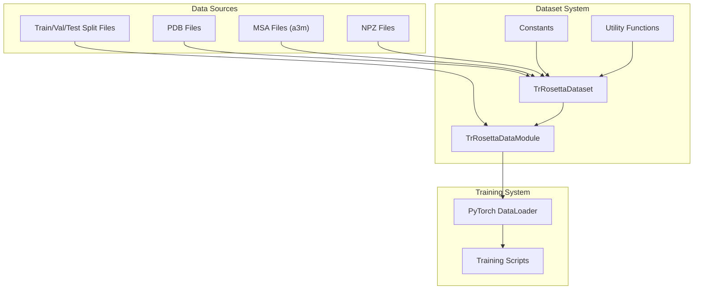
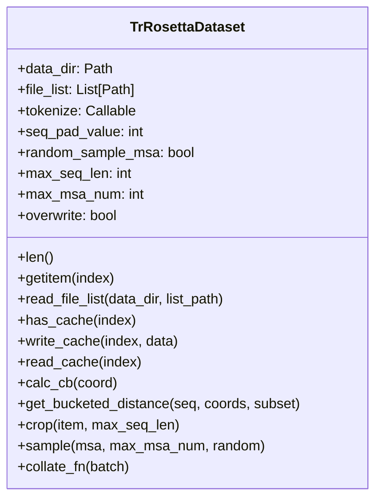
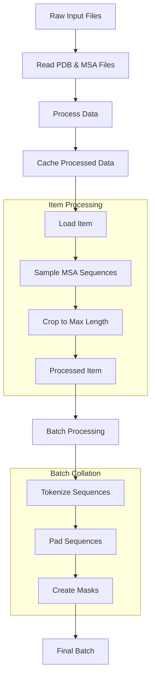
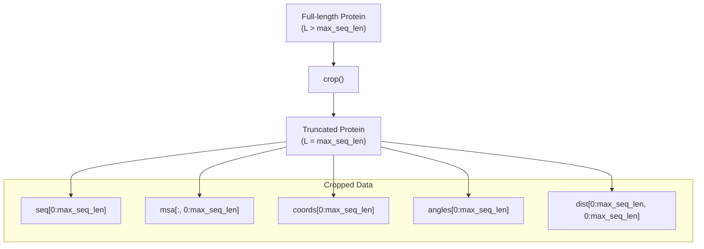
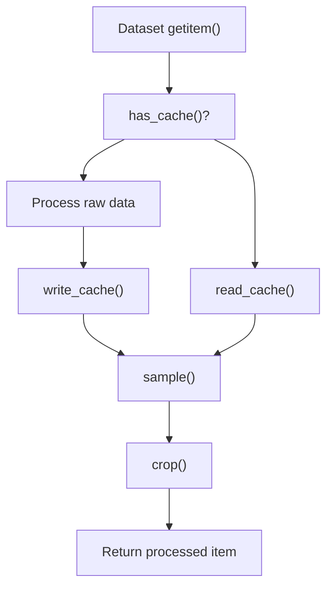
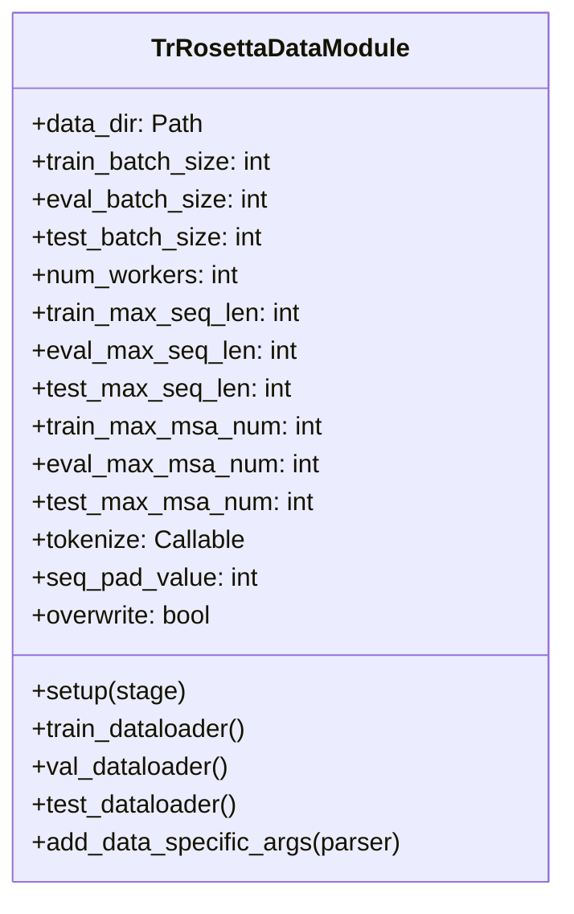
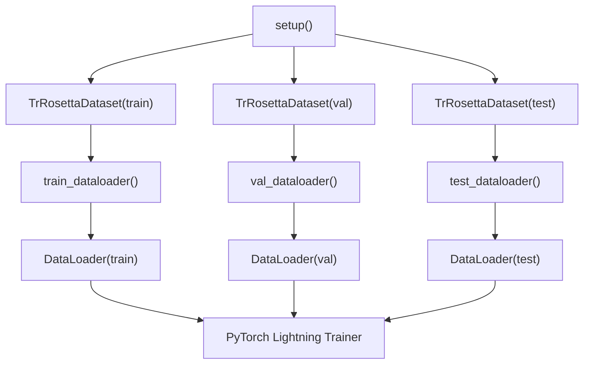
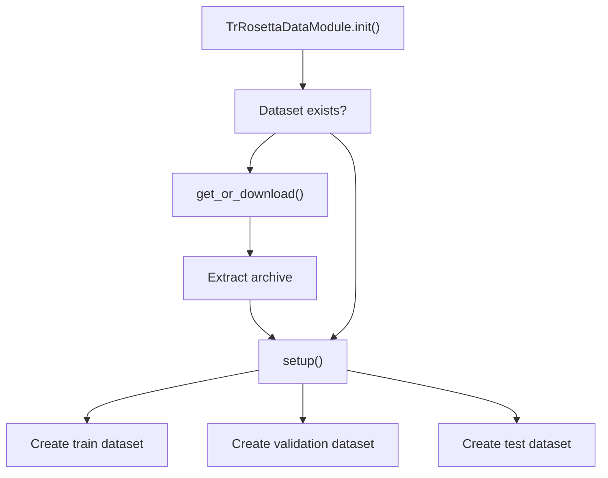

# Dataset Handling

> **Relevant source files**
> * [alphafold2_pytorch/constants.py](https://github.com/lucidrains/alphafold2/blob/931466e4/alphafold2_pytorch/constants.py)
> * [training_scripts/datasets/__init__.py](https://github.com/lucidrains/alphafold2/blob/931466e4/training_scripts/datasets/__init__.py)
> * [training_scripts/datasets/trrosetta.py](https://github.com/lucidrains/alphafold2/blob/931466e4/training_scripts/datasets/trrosetta.py)

The dataset handling system in the AlphaFold2 PyTorch implementation manages the loading, processing, and batching of protein structure data for training the model. This document provides an overview of the dataset architecture, focusing on the TrRosetta dataset implementation, which is the main dataset used for training the model.

## Overview

The dataset system is responsible for:

* Loading protein sequences, structures, and multiple sequence alignments (MSAs)
* Processing raw data into formats suitable for the model
* Implementing efficient caching mechanisms to speed up training
* Batching and padding data appropriately for model input
* Integration with PyTorch Lightning for streamlined training

For information about the training system that uses these datasets, see [Training System](/lucidrains/alphafold2/4-training-system).

## Dataset System Architecture

Sources: [training_scripts/datasets/trrosetta.py L136-L296](https://github.com/lucidrains/alphafold2/blob/931466e4/training_scripts/datasets/trrosetta.py#L136-L296)

 [training_scripts/datasets/trrosetta.py L352-L476](https://github.com/lucidrains/alphafold2/blob/931466e4/training_scripts/datasets/trrosetta.py#L352-L476)

## TrRosetta Dataset

The TrRosetta dataset contains protein structures with their corresponding sequences and multiple sequence alignments. It's implemented through the `TrRosettaDataset` class which handles loading and processing this data.

Sources: [training_scripts/datasets/trrosetta.py L136-L296](https://github.com/lucidrains/alphafold2/blob/931466e4/training_scripts/datasets/trrosetta.py#L136-L296)

### Data Structure

Each item in the TrRosetta dataset contains:

| Field | Description | Dimensions |
| --- | --- | --- |
| `id` | Protein identifier | String |
| `seq` | Amino acid sequence | [L] |
| `msa` | Multiple sequence alignment | [D, L] |
| `coords` | 3D coordinates of atoms | [L, 14, 3] |
| `angles` | Torsion angles of the protein | [L, 12] |
| `dist` | Distance map (bucketed) | [L, L] |

*Where L is sequence length and D is MSA depth*

Sources: [training_scripts/datasets/trrosetta.py L215-L223](https://github.com/lucidrains/alphafold2/blob/931466e4/training_scripts/datasets/trrosetta.py#L215-L223)

### Data Processing Pipeline

Sources: [training_scripts/datasets/trrosetta.py L202-L227](https://github.com/lucidrains/alphafold2/blob/931466e4/training_scripts/datasets/trrosetta.py#L202-L227)

 [training_scripts/datasets/trrosetta.py L298-L349](https://github.com/lucidrains/alphafold2/blob/931466e4/training_scripts/datasets/trrosetta.py#L298-L349)

## Data Processing Functions

### 1. MSA Sampling

The system controls the number of MSA sequences used during training with the `sample` function, which either:

* Randomly samples sequences if `random_sample_msa=True` (useful for training)
* Takes the first N sequences if `random_sample_msa=False` (useful for validation/testing)

Sources: [training_scripts/datasets/trrosetta.py L284-L296](https://github.com/lucidrains/alphafold2/blob/931466e4/training_scripts/datasets/trrosetta.py#L284-L296)

### 2. Sequence Cropping

To handle variable-length proteins efficiently, the `crop` function limits sequences to a maximum length:

Sources: [training_scripts/datasets/trrosetta.py L268-L282](https://github.com/lucidrains/alphafold2/blob/931466e4/training_scripts/datasets/trrosetta.py#L268-L282)

### 3. Distance Map Calculation

The `get_bucketed_distance` function computes pairwise distances between residues and converts them to discrete buckets:

* Uses either Cα or Cβ atoms for distance calculation
* Assigns distances to buckets for model prediction
* Creates a 2D distance map representing protein structure

Sources: [training_scripts/datasets/trrosetta.py L240-L266](https://github.com/lucidrains/alphafold2/blob/931466e4/training_scripts/datasets/trrosetta.py#L240-L266)

### 4. Caching Mechanism

To speed up data loading, the dataset implements a caching system:

Sources: [training_scripts/datasets/trrosetta.py L177-L200](https://github.com/lucidrains/alphafold2/blob/931466e4/training_scripts/datasets/trrosetta.py#L177-L200)

 [training_scripts/datasets/trrosetta.py L202-L227](https://github.com/lucidrains/alphafold2/blob/931466e4/training_scripts/datasets/trrosetta.py#L202-L227)

## PyTorch Lightning Integration

The dataset is integrated with PyTorch Lightning through the `TrRosettaDataModule` class, which provides a standardized interface for training.

Sources: [training_scripts/datasets/trrosetta.py L352-L476](https://github.com/lucidrains/alphafold2/blob/931466e4/training_scripts/datasets/trrosetta.py#L352-L476)

### DataModule Configuration

The DataModule exposes a comprehensive set of configuration options:

| Parameter | Description | Default |
| --- | --- | --- |
| `data_dir` | Directory containing dataset files | `~/.cache/alphafold2_pytorch/trrosetta` |
| `train_batch_size` | Batch size for training | 1 |
| `eval_batch_size` | Batch size for validation | 1 |
| `test_batch_size` | Batch size for testing | 1 |
| `num_workers` | Number of worker processes for data loading | 0 |
| `train_max_seq_len` | Maximum sequence length for training | 256 |
| `eval_max_seq_len` | Maximum sequence length for validation | 256 |
| `test_max_seq_len` | Maximum sequence length for testing | -1 (no limit) |
| `train_max_msa_num` | Maximum number of MSA sequences for training | 32 |
| `eval_max_msa_num` | Maximum number of MSA sequences for validation | 32 |
| `test_max_msa_num` | Maximum number of MSA sequences for testing | 64 |
| `overwrite` | Whether to overwrite existing cache files | False |

Sources: [training_scripts/datasets/trrosetta.py L353-L372](https://github.com/lucidrains/alphafold2/blob/931466e4/training_scripts/datasets/trrosetta.py#L353-L372)

 [training_scripts/datasets/trrosetta.py L375-L414](https://github.com/lucidrains/alphafold2/blob/931466e4/training_scripts/datasets/trrosetta.py#L375-L414)

### Data Loading Process

Sources: [training_scripts/datasets/trrosetta.py L417-L476](https://github.com/lucidrains/alphafold2/blob/931466e4/training_scripts/datasets/trrosetta.py#L417-L476)

## Constants and Configuration

Key constants used in dataset handling:

| Constant | Value | Description |
| --- | --- | --- |
| `MAX_NUM_MSA` | 20 | Maximum number of MSA sequences |
| `MAX_NUM_TEMPLATES` | 10 | Maximum number of templates |
| `NUM_AMINO_ACIDS` | 21 | Number of amino acid types (including gap) |
| `NUM_COORDS_PER_RES` | 14 | Number of 3D coordinates per residue |
| `DISTOGRAM_BUCKETS` | 37 | Number of distance buckets for distogram |

Sources: [alphafold2_pytorch/constants.py L5-L16](https://github.com/lucidrains/alphafold2/blob/931466e4/alphafold2_pytorch/constants.py#L5-L16)

## Dataset Download and Initialization

The system includes functionality to automatically download and extract the TrRosetta dataset if it's not already available locally:

Sources: [training_scripts/datasets/trrosetta.py L91-L114](https://github.com/lucidrains/alphafold2/blob/931466e4/training_scripts/datasets/trrosetta.py#L91-L114)

 [training_scripts/datasets/trrosetta.py L415](https://github.com/lucidrains/alphafold2/blob/931466e4/training_scripts/datasets/trrosetta.py#L415-L415)