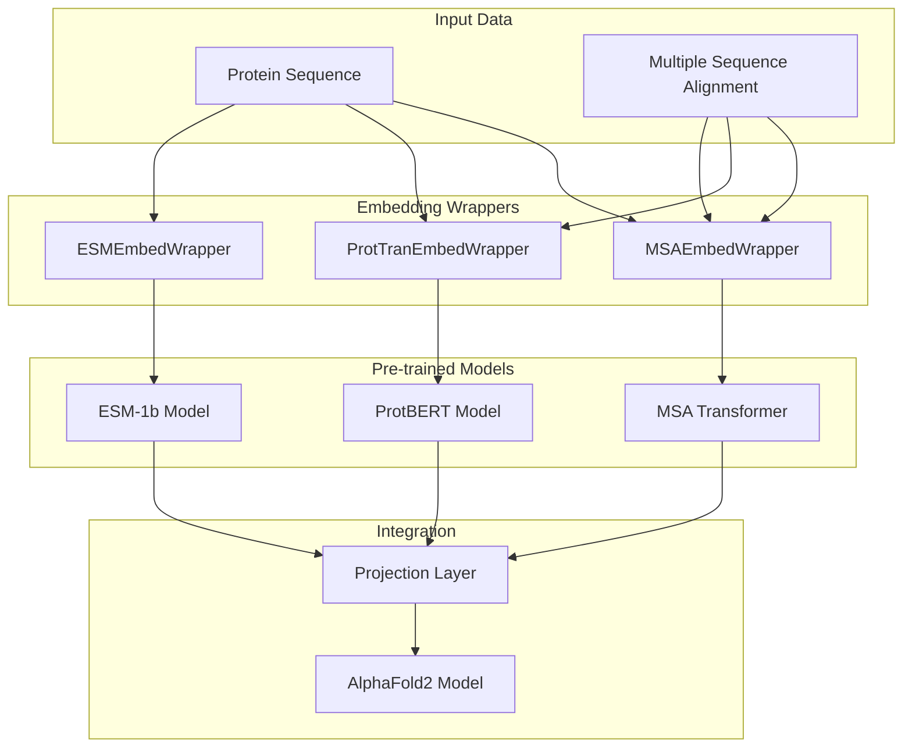
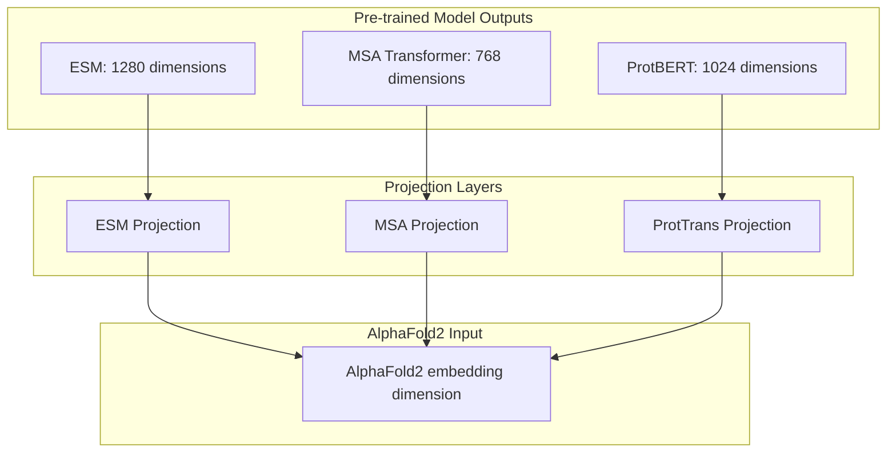
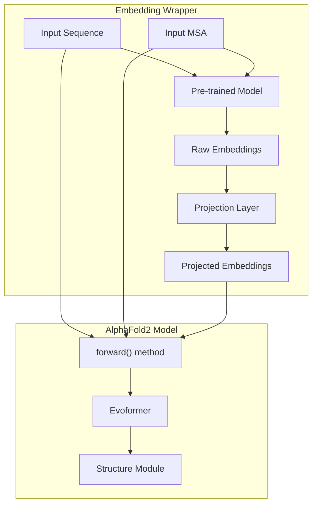

# Embedding System

> **Relevant source files**
> * [alphafold2_pytorch/embeds.py](https://github.com/lucidrains/alphafold2/blob/931466e4/alphafold2_pytorch/embeds.py)

## Purpose and Scope

The Embedding System provides interfaces to pre-trained protein language models for the AlphaFold2 PyTorch implementation. It enables the integration of state-of-the-art protein representations from models like ESM-1b, MSA Transformer, and ProtTrans (ProtBERT) into the AlphaFold2 architecture. This system handles loading the pre-trained models, generating embeddings for protein sequences and multiple sequence alignments (MSAs), and projecting these embeddings to the appropriate dimensions for use by the AlphaFold2 model.

For information about the Core Model Architecture, see [Core Model Architecture](/lucidrains/alphafold2/2-core-model-architecture).

## System Overview

The embedding system consists of three wrapper classes that encapsulate different pre-trained protein language models:



Sources: [alphafold2_pytorch/embeds.py](https://github.com/lucidrains/alphafold2/blob/931466e4/alphafold2_pytorch/embeds.py)

## Embedding Wrapper Classes

Each wrapper class follows a similar pattern:

1. Initialize with a reference to the AlphaFold2 model
2. Load the appropriate pre-trained model
3. Define a projection layer to map from model-specific embedding dimensions to AlphaFold2 dimensions
4. Implement a forward method that generates and projects embeddings before passing them to AlphaFold2

### ESMEmbedWrapper

The `ESMEmbedWrapper` uses the ESM-1b protein language model, which is a transformer model trained on millions of protein sequences.

```mermaid
sequenceDiagram
  participant Input (seq, msa)
  participant ESMEmbedWrapper
  participant ESM-1b Model
  participant Projection Layer
  participant AlphaFold2

  Input (seq, msa)->>ESMEmbedWrapper: Forward sequence and optional MSA
  ESMEmbedWrapper->>ESM-1b Model: Process sequence through ESM-1b
  ESM-1b Model->>ESMEmbedWrapper: Return sequence embeddings
  loop [MSA provided]
    ESMEmbedWrapper->>ESM-1b Model: Process flattened MSA through ESM-1b
    ESM-1b Model->>ESMEmbedWrapper: Return MSA embeddings
  end
  ESMEmbedWrapper->>Projection Layer: Project embeddings to AlphaFold2 dimension
  Projection Layer->>ESMEmbedWrapper: Return projected embeddings
  ESMEmbedWrapper->>AlphaFold2: Forward with projected embeddings
  AlphaFold2->>ESMEmbedWrapper: Return protein structure predictions
```

Implementation details:

* Loads the ESM-1b model and batch converter via `torch.hub`
* Processes the input sequence through ESM-1b to generate sequence embeddings
* Optionally processes the MSA data, flattening it first
* Projects both sets of embeddings to the AlphaFold2 dimension
* Passes the projected embeddings to AlphaFold2

Sources: [alphafold2_pytorch/embeds.py L77-L103](https://github.com/lucidrains/alphafold2/blob/931466e4/alphafold2_pytorch/embeds.py#L77-L103)

### MSAEmbedWrapper

The `MSAEmbedWrapper` uses the MSA Transformer, which is specifically designed to process multiple sequence alignments.

```mermaid
sequenceDiagram
  participant Input (seq, msa)
  participant MSAEmbedWrapper
  participant MSA Transformer
  participant Projection Layer
  participant AlphaFold2

  Input (seq, msa)->>MSAEmbedWrapper: Forward sequence and MSA
  MSAEmbedWrapper->>MSAEmbedWrapper: Combine sequence and MSA data
  loop [For each batch element]
    MSAEmbedWrapper->>MSAEmbedWrapper: Process each batch element individually
    MSAEmbedWrapper->>MSA Transformer: Process valid rows through MSA Transformer
    MSA Transformer->>MSAEmbedWrapper: Return embeddings
    MSAEmbedWrapper->>MSAEmbedWrapper: Pad embeddings back to full size
    MSAEmbedWrapper->>MSA Transformer: Process combined data through MSA Transformer
    MSA Transformer->>MSAEmbedWrapper: Return embeddings for all rows
  end
  MSAEmbedWrapper->>Projection Layer: Project embeddings to AlphaFold2 dimension
  Projection Layer->>MSAEmbedWrapper: Return projected embeddings
  MSAEmbedWrapper->>MSAEmbedWrapper: Split into sequence and MSA embeddings
  MSAEmbedWrapper->>AlphaFold2: Forward with separated embeddings
  AlphaFold2->>MSAEmbedWrapper: Return protein structure predictions
```

Implementation details:

* Loads the MSA Transformer model and batch converter via `torch.hub`
* Combines the sequence and MSA data (sequence becomes the first row)
* Handles masked MSA rows (padding) by processing each batch element individually if needed
* Projects the embeddings to the AlphaFold2 dimension
* Splits the embeddings into sequence embeddings (first row) and MSA embeddings (remaining rows)
* Passes the separated embeddings to AlphaFold2

Sources: [alphafold2_pytorch/embeds.py L33-L75](https://github.com/lucidrains/alphafold2/blob/931466e4/alphafold2_pytorch/embeds.py#L33-L75)

### ProtTranEmbedWrapper

The `ProtTranEmbedWrapper` uses ProtBERT (from the ProtTrans family), which is a BERT-based model adapted for protein sequences.

```mermaid
sequenceDiagram
  participant Input (seq, msa)
  participant ProtTranEmbedWrapper
  participant HuggingFace Tokenizer
  participant ProtBERT Model
  participant Projection Layer
  participant AlphaFold2

  Input (seq, msa)->>ProtTranEmbedWrapper: Forward sequence and MSA
  ProtTranEmbedWrapper->>ProtTranEmbedWrapper: Flatten MSA data
  ProtTranEmbedWrapper->>HuggingFace Tokenizer: Tokenize sequence
  HuggingFace Tokenizer->>ProtBERT Model: Process sequence tokens
  ProtBERT Model->>ProtTranEmbedWrapper: Return sequence embeddings
  ProtTranEmbedWrapper->>HuggingFace Tokenizer: Tokenize flattened MSA
  HuggingFace Tokenizer->>ProtBERT Model: Process MSA tokens
  ProtBERT Model->>ProtTranEmbedWrapper: Return MSA embeddings
  ProtTranEmbedWrapper->>Projection Layer: Project embeddings to AlphaFold2 dimension
  Projection Layer->>ProtTranEmbedWrapper: Return projected embeddings
  ProtTranEmbedWrapper->>ProtTranEmbedWrapper: Reshape MSA embeddings to original dimensions
  ProtTranEmbedWrapper->>AlphaFold2: Forward with projected embeddings
  AlphaFold2->>ProtTranEmbedWrapper: Return protein structure predictions
```

Implementation details:

* Uses HuggingFace's `transformers` library to load the ProtBERT tokenizer and model
* Flattens the MSA data for processing (from shape [batch, num_seqs, seq_len] to [(batch×num_seqs), seq_len])
* Generates embeddings for the sequence and flattened MSA using ProtBERT
* Projects both embeddings to the AlphaFold2 dimension
* Reshapes the MSA embeddings back to the original dimensions
* Passes the projected embeddings to AlphaFold2

Sources: [alphafold2_pytorch/embeds.py L10-L31](https://github.com/lucidrains/alphafold2/blob/931466e4/alphafold2_pytorch/embeds.py#L10-L31)

## Embedding Projection System

All wrapper classes include a projection layer to ensure the embeddings are compatible with the AlphaFold2 model's expected dimensions.



Implementation details:

* Each wrapper creates a projection layer: `nn.Linear(MODEL_EMBED_DIM, alphafold2.dim)`
* If the pre-trained model's dimension matches AlphaFold2's dimension, an `nn.Identity()` layer is used instead
* The embedding dimensions are defined in constants: * `ESM_EMBED_DIM`: 1280 * `MSA_EMBED_DIM`: 768 * `PROTTRAN_EMBED_DIM`: 1024

Sources: [alphafold2_pytorch/embeds.py L16](https://github.com/lucidrains/alphafold2/blob/931466e4/alphafold2_pytorch/embeds.py#L16-L16)

 [alphafold2_pytorch/embeds.py L43](https://github.com/lucidrains/alphafold2/blob/931466e4/alphafold2_pytorch/embeds.py#L43-L43)

 [alphafold2_pytorch/embeds.py L87](https://github.com/lucidrains/alphafold2/blob/931466e4/alphafold2_pytorch/embeds.py#L87-L87)

## Integration with AlphaFold2

The embedding wrappers integrate with the AlphaFold2 model by providing pre-computed embeddings as arguments to the model's forward function.



Implementation details:

* All wrappers share the same pattern in their forward methods: 1. Process inputs through the pre-trained model 2. Project the resulting embeddings 3. Call `self.alphafold2(seq, msa, seq_embed=seq_embeds, msa_embed=msa_embeds, ...)`
* The AlphaFold2 model is designed to accept optional pre-computed embeddings via the `seq_embed` and `msa_embed` parameters
* This design allows the AlphaFold2 model to either use its own embedding layer or take advantage of pre-trained embeddings

Sources: [alphafold2_pytorch/embeds.py L31](https://github.com/lucidrains/alphafold2/blob/931466e4/alphafold2_pytorch/embeds.py#L31-L31)

 [alphafold2_pytorch/embeds.py L75](https://github.com/lucidrains/alphafold2/blob/931466e4/alphafold2_pytorch/embeds.py#L75-L75)

 [alphafold2_pytorch/embeds.py L103](https://github.com/lucidrains/alphafold2/blob/931466e4/alphafold2_pytorch/embeds.py#L103-L103)

## Usage Example

To use one of these embedding wrappers, you first create an AlphaFold2 model instance and then wrap it with the desired embedding wrapper:

```sql
# Create an AlphaFold2 modelalphafold2_model = Alphafold2(...) # Wrap it with an embedding wrappermodel = ESMEmbedWrapper(alphafold2=alphafold2_model) # Use the wrapped modeloutput = model(seq, msa)
```

This approach allows for easy experimentation with different embedding strategies while keeping the core AlphaFold2 model unchanged.