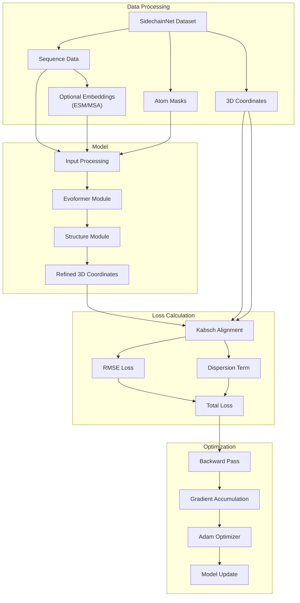
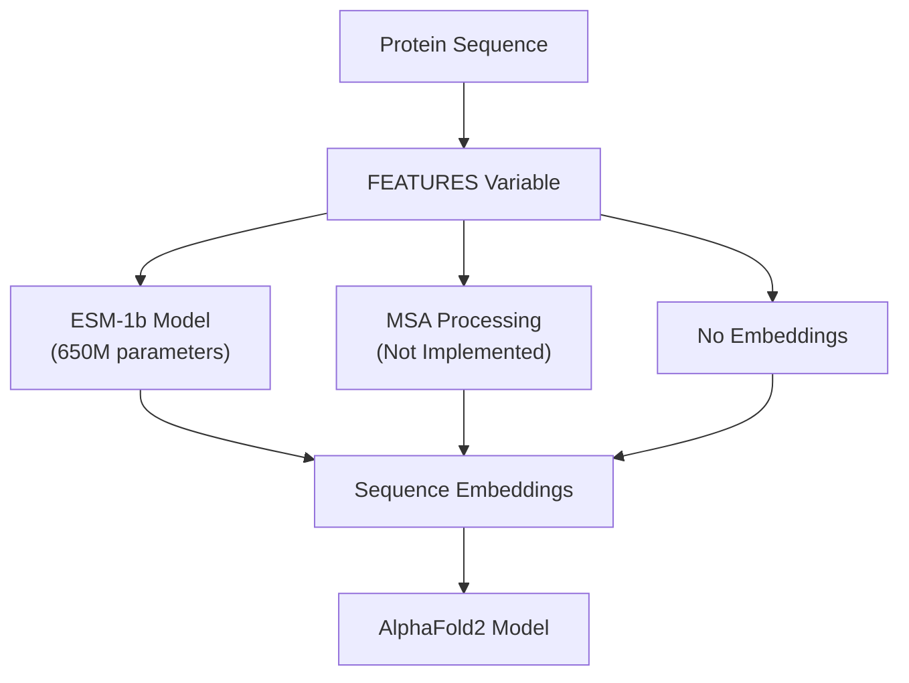
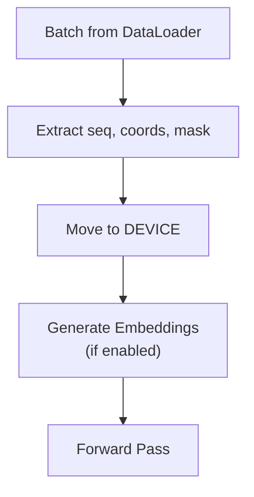
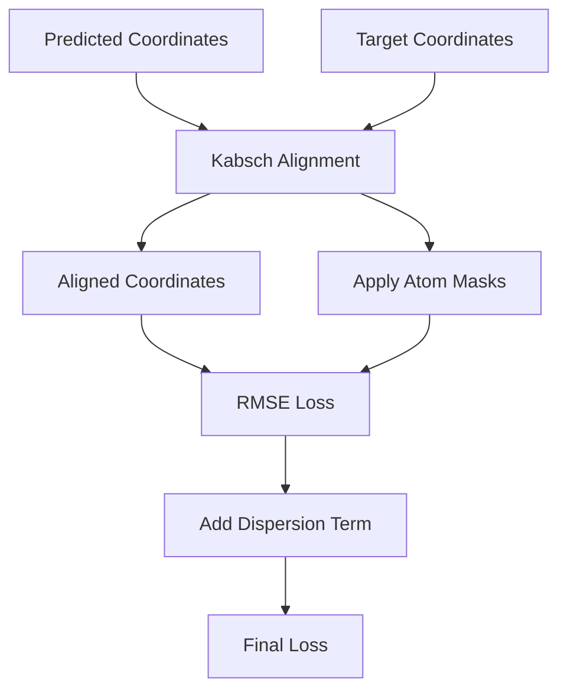
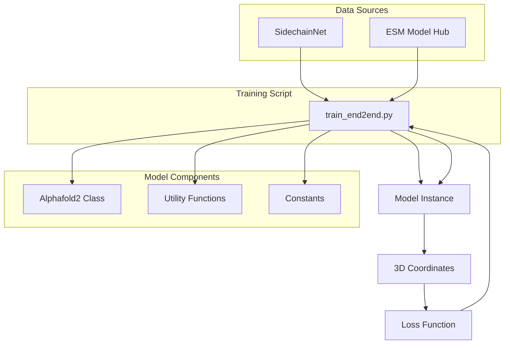

# End-to-End Training

> **Relevant source files**
> * [train_end2end.py](https://github.com/lucidrains/alphafold2/blob/931466e4/train_end2end.py)

## Purpose and Scope

This document details the end-to-end training process for the AlphaFold2 PyTorch implementation. It covers the training pipeline, data preparation, model configuration, loss calculation, and optimization process used to train the model to predict protein structures directly from sequence information. For information about pretraining focused on distogram prediction, see [Pretraining](/lucidrains/alphafold2/4.2-pretraining).

## Training Pipeline Overview

The end-to-end training of AlphaFold2 involves training the full model to predict 3D protein coordinates from input sequences, optionally enhanced with embeddings from protein language models. The process includes gradient accumulation to handle memory constraints and specialized loss functions for structure prediction.



Sources: [train_end2end.py L97-L166](https://github.com/lucidrains/alphafold2/blob/931466e4/train_end2end.py#L97-L166)

## Data Preparation

### Dataset Loading

The training process uses the SidechainNet dataset, which contains protein sequences, 3D coordinates, and masks. The data is loaded with specific configurations to ensure manageable batch sizes and processing.

```
data = scn.load(    casp_version = 12,    thinning = 30,    with_pytorch = 'dataloaders',    batch_size = 1,    dynamic_batching = False)
```

The training loop also filters proteins by length to avoid sequences that are too long:

```
data_cond = lambda t: t[1].shape[1] < THRESHOLD_LENGTHdl = cycle(data, data_cond)
```

Sources: [train_end2end.py L63-L73](https://github.com/lucidrains/alphafold2/blob/931466e4/train_end2end.py#L63-L73)

### Sequence Embeddings

The training pipeline supports multiple types of sequence embeddings:



For ESM embeddings, the implementation uses the pretrained ESM-1b model from Facebook Research, loaded via PyTorch Hub.

Sources: [train_end2end.py L41-L48](https://github.com/lucidrains/alphafold2/blob/931466e4/train_end2end.py#L41-L48)

 [train_end2end.py L110-L121](https://github.com/lucidrains/alphafold2/blob/931466e4/train_end2end.py#L110-L121)

## Model Configuration

The AlphaFold2 model is instantiated with specific hyperparameters for the Evoformer and Structure modules. The configuration used in the training script is:

```
model = Alphafold2(    dim = 256,    depth = 1,    heads = 8,    dim_head = 64,    predict_coords = True,    structure_module_dim = 8,    structure_module_depth = 2,    structure_module_heads = 4,    structure_module_dim_head = 16,    structure_module_refinement_iters = 2).to(DEVICE)
```

This configuration specifies:

* A smaller model than the original AlphaFold2 (for development purposes)
* The Evoformer module with 1 block, 8 attention heads
* The Structure module with 2 blocks, 4 attention heads, and 2 refinement iterations
* Direct coordinate prediction is enabled

Sources: [train_end2end.py L77-L88](https://github.com/lucidrains/alphafold2/blob/931466e4/train_end2end.py#L77-L88)

## Training Loop

### Data Batching and Preprocessing

Each training iteration processes a batch from the SidechainNet dataset:

1. Extract sequence, coordinates, and masks from the batch
2. Convert data to the correct device
3. Generate embeddings if required (ESM, MSA, etc.)



Sources: [train_end2end.py L98-L121](https://github.com/lucidrains/alphafold2/blob/931466e4/train_end2end.py#L98-L121)

### Forward Pass and Coordinate Prediction

The forward pass through the model produces refined 3D coordinates:

```
refined = model(    seq,    msa = msa,    embedds = embedds,    mask = mask)
```

The implementation also creates a sidechain container and performs Kabsch alignment to align the predicted coordinates with the ground truth:

```markdown
# build SC container. set SC points to CA and optionally place carbonyl Oproto_sidechain = sidechain_container(coords_3d, n_aa=batch,                                     cloud_mask=cloud_mask, place_oxygen=False) # rotate / aligncoords_aligned, labels_aligned = Kabsch(refined, coords[flat_cloud_mask])
```

Sources: [train_end2end.py L125-L137](https://github.com/lucidrains/alphafold2/blob/931466e4/train_end2end.py#L125-L137)

### Loss Calculation

The loss function combines a root mean squared error (RMSE) term for coordinate prediction with a dispersion term:

```
loss = torch.sqrt(criterion(coords_aligned[flat_chain_mask], labels_aligned[flat_chain_mask])) + \                 dispersion_weight * torch.norm( (1/weights)-1 )
```

The loss is only calculated on the valid atoms specified by the cloud mask and chain mask:



Sources: [train_end2end.py L139-L159](https://github.com/lucidrains/alphafold2/blob/931466e4/train_end2end.py#L139-L159)

### Optimization Process

The training uses the Adam optimizer with gradient accumulation to handle memory constraints:

```sql
optim = Adam(model.parameters(), lr = LEARNING_RATE) # Training loop with gradient accumulationfor _ in range(NUM_BATCHES):    for _ in range(GRADIENT_ACCUMULATE_EVERY):        # Forward pass and loss calculation        loss.backward()        # Update model after accumulating gradients    optim.step()    optim.zero_grad()
```

Gradient accumulation helps stabilize training by effectively increasing the batch size without increasing memory requirements.

Sources: [train_end2end.py L92-L166](https://github.com/lucidrains/alphafold2/blob/931466e4/train_end2end.py#L92-L166)

## Visualization

The training loop can optionally save predicted structures and ground truth in PDB format for visualization:

```python
if TO_PDB:     # idx from batch to save prot and label    idx = 0    coords2pdb(seq[idx, :, 0], coords_aligned[idx], cloud_mask, prefix=SAVE_DIR, name="pred.pdb")    coords2pdb(seq[idx, :, 0], labels_aligned[idx], cloud_mask, prefix=SAVE_DIR, name="label.pdb")
```

This allows for qualitative assessment of the model's predictions during training.

Sources: [train_end2end.py L151-L155](https://github.com/lucidrains/alphafold2/blob/931466e4/train_end2end.py#L151-L155)

## Configuration Parameters

The training script defines several key configuration parameters that control the training process:

| Parameter | Default Value | Description |
| --- | --- | --- |
| `FEATURES` | "esm" | Type of sequence embeddings to use ("esm", "msa", or None) |
| `DEVICE` | CUDA if available | Device for model training |
| `NUM_BATCHES` | 100,000 | Total number of batches to train for |
| `GRADIENT_ACCUMULATE_EVERY` | 16 | Number of forward passes before updating weights |
| `LEARNING_RATE` | 3e-4 | Learning rate for Adam optimizer |
| `THRESHOLD_LENGTH` | 250 | Maximum sequence length to process |
| `TO_PDB` | False | Whether to save PDB files for visualization |
| `dispersion_weight` | 0.1 | Weight for the dispersion term in the loss function |

These parameters can be adjusted to optimize training performance and outcomes.

Sources: [train_end2end.py L24-L33](https://github.com/lucidrains/alphafold2/blob/931466e4/train_end2end.py#L24-L33)

 [train_end2end.py L92-L93](https://github.com/lucidrains/alphafold2/blob/931466e4/train_end2end.py#L92-L93)

## Integration with Overall Training System

The end-to-end training script directly integrates with the AlphaFold2 model implementation and utility functions:



Sources: [train_end2end.py L1-L19](https://github.com/lucidrains/alphafold2/blob/931466e4/train_end2end.py#L1-L19)