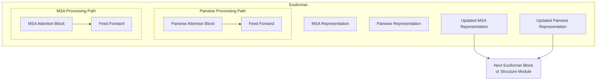
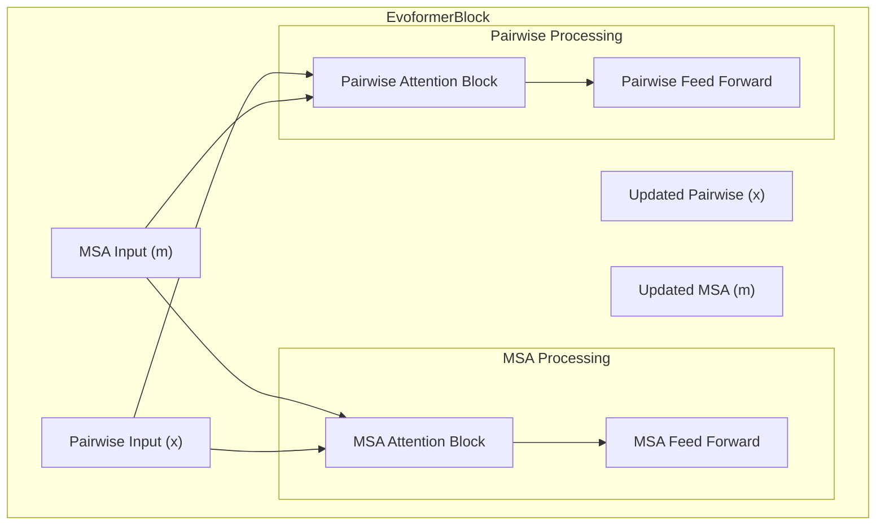
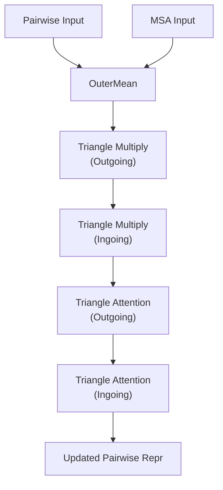
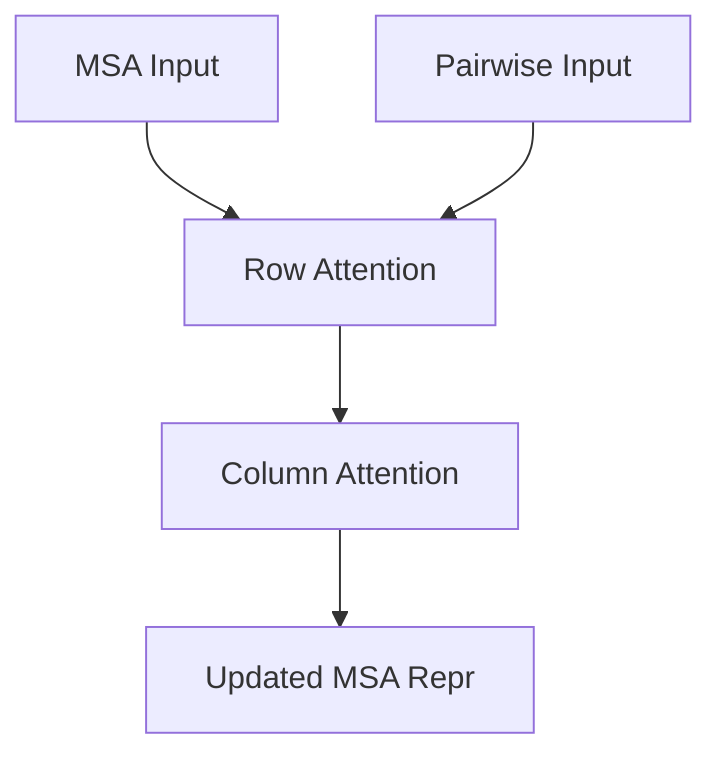
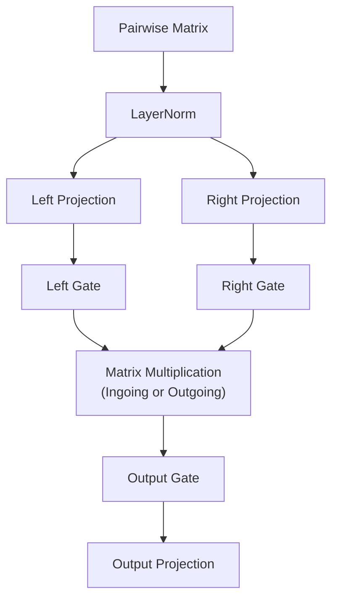
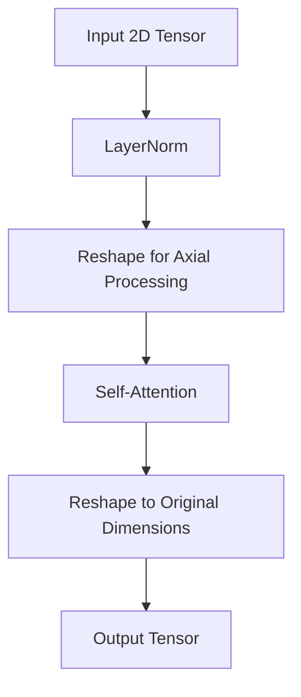
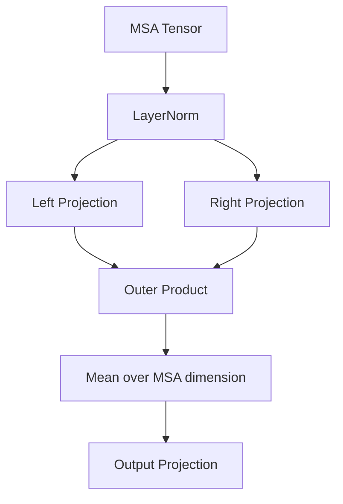
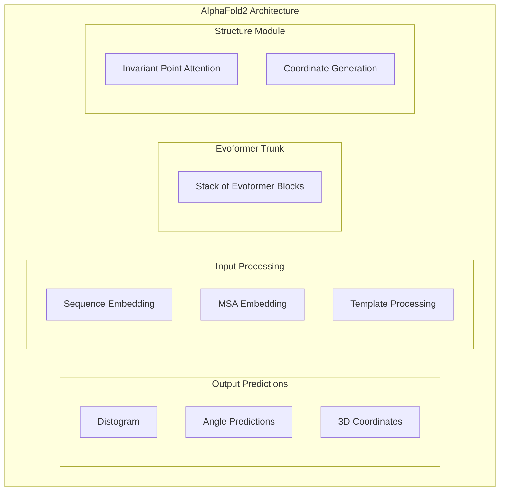

# Evoformer Module

> **Relevant source files**
> * [alphafold2_pytorch/alphafold2.py](https://github.com/lucidrains/alphafold2/blob/931466e4/alphafold2_pytorch/alphafold2.py)
> * [alphafold2_pytorch/reversible.py](https://github.com/lucidrains/alphafold2/blob/931466e4/alphafold2_pytorch/reversible.py)
> * [alphafold2_pytorch/rotary.py](https://github.com/lucidrains/alphafold2/blob/931466e4/alphafold2_pytorch/rotary.py)

## Purpose and Scope

The Evoformer module is a core component of the AlphaFold2 architecture responsible for processing Multiple Sequence Alignments (MSAs) and pairwise representations through attention mechanisms. It serves as the computational trunk of the model, extracting evolutionary information from sequence alignments and building representations that capture both local and global protein structure patterns. This document details the architecture, components, and operation of the Evoformer module in the PyTorch implementation.

For information about the Structure Module that transforms Evoformer outputs into 3D coordinates, see [Structure Module](/lucidrains/alphafold2/2.2-structure-module).

## Overview

The Evoformer module consists of a stack of identical blocks that process two distinct representations simultaneously:

1. **MSA representation** - Encodes evolutionary information from multiple sequence alignments
2. **Pairwise representation** - Captures residue-residue relationships to model spatial structure

Through iterative refinement and information exchange between these representations, the Evoformer builds increasingly sophisticated features that capture protein structure information.



Sources: [alphafold2_pytorch/alphafold2.py L412-L467](https://github.com/lucidrains/alphafold2/blob/931466e4/alphafold2_pytorch/alphafold2.py#L412-L467)

## Evoformer Block Architecture

Each Evoformer block operates on both MSA and pairwise representations simultaneously, with information flowing bidirectionally between them. The block consists of four main components applied in sequence:

1. **Pairwise Attention Block** - Processes the pairwise representations with input from MSA
2. **Pairwise Feed Forward** - Further transforms pairwise features
3. **MSA Attention Block** - Processes MSA representations with input from pairwise data
4. **MSA Feed Forward** - Further transforms MSA features



Sources: [alphafold2_pytorch/alphafold2.py L412-L447](https://github.com/lucidrains/alphafold2/blob/931466e4/alphafold2_pytorch/alphafold2.py#L412-L447)

### Pairwise Attention Block

The Pairwise Attention Block processes the pairwise representation through four sequential operations:

1. **Outer Mean** - Captures MSA information and projects it onto the pairwise representation
2. **Triangle Multiplication (Outgoing)** - Updates residue pairs using outgoing edges
3. **Triangle Multiplication (Ingoing)** - Updates residue pairs using incoming edges
4. **Triangle Attention (Outgoing and Ingoing)** - Self-attention over the rows and columns of the pairwise matrix



Sources: [alphafold2_pytorch/alphafold2.py L353-L385](https://github.com/lucidrains/alphafold2/blob/931466e4/alphafold2_pytorch/alphafold2.py#L353-L385)

### MSA Attention Block

The MSA Attention Block processes the MSA representation through two attention mechanisms:

1. **Row Attention** - Self-attention along the rows of the MSA matrix, with access to pairwise information
2. **Column Attention** - Self-attention along the columns of the MSA matrix



Sources: [alphafold2_pytorch/alphafold2.py L387-L408](https://github.com/lucidrains/alphafold2/blob/931466e4/alphafold2_pytorch/alphafold2.py#L387-L408)

## Detailed Components

### Triangle Multiplicative Module

This module performs an information update across triplets of residues, applying multiplicative updates in either an "ingoing" or "outgoing" direction. It consists of:

1. **Left/Right Projections** - Transform the input features
2. **Gating Mechanisms** - Control information flow
3. **Multiplication Operator** - Combine features according to the specified mixing pattern



Sources: [alphafold2_pytorch/alphafold2.py L257-L317](https://github.com/lucidrains/alphafold2/blob/931466e4/alphafold2_pytorch/alphafold2.py#L257-L317)

### Axial Attention

Specialized attention mechanism that operates along a single axis (row or column) of a 2D representation. It can operate in two modes:

* **Row Attention** - Attending along rows, with each row processed independently
* **Column Attention** - Attending along columns, with each column processed independently



Sources: [alphafold2_pytorch/alphafold2.py L192-L255](https://github.com/lucidrains/alphafold2/blob/931466e4/alphafold2_pytorch/alphafold2.py#L192-L255)

### OuterMean

Computes the outer product of MSA representation features, then averages over the MSA dimension, providing a way to inject MSA information into the pairwise representation.



Sources: [alphafold2_pytorch/alphafold2.py L321-L351](https://github.com/lucidrains/alphafold2/blob/931466e4/alphafold2_pytorch/alphafold2.py#L321-L351)

## Memory-Efficient Implementation

The Evoformer uses checkpoint_sequential to reduce memory usage during training, which is critical given the large number of parameters and the size of protein sequences being processed.

```python
def forward(self, x, m, mask=None, msa_mask=None):    inp = (x, m, mask, msa_mask)    x, m, *_ = checkpoint_sequential(self.layers, 1, inp)    return x, m
```

For more advanced memory-efficient techniques used in the implementation, see the [Memory-Efficient Computation](/lucidrains/alphafold2/2.3-memory-efficient-computation) page.

Sources: [alphafold2_pytorch/alphafold2.py L458-L467](https://github.com/lucidrains/alphafold2/blob/931466e4/alphafold2_pytorch/alphafold2.py#L458-L467)

## Data Flow in the Evoformer

The following diagram illustrates how data flows through the complete Evoformer system, including the interactions between MSA and pairwise representations:

```

```

Sources: [alphafold2_pytorch/alphafold2.py L448-L467](https://github.com/lucidrains/alphafold2/blob/931466e4/alphafold2_pytorch/alphafold2.py#L448-L467)

## Implementation Details

### Evoformer Class

The main `Evoformer` class stacks multiple `EvoformerBlock` instances and handles the forward pass:

```python
class Evoformer(nn.Module):    def __init__(self, *, depth, **kwargs):        super().__init__()        self.layers = nn.ModuleList([EvoformerBlock(**kwargs) for _ in range(depth)])     def forward(self, x, m, mask=None, msa_mask=None):        inp = (x, m, mask, msa_mask)        x, m, *_ = checkpoint_sequential(self.layers, 1, inp)        return x, m
```

The `EvoformerBlock` class constructs the core processing units and handles the forward pass for a single block:

```python
class EvoformerBlock(nn.Module):    def __init__(self, *, dim, seq_len, heads, dim_head, attn_dropout, ff_dropout, global_column_attn=False):        super().__init__()        self.layer = nn.ModuleList([            PairwiseAttentionBlock(dim=dim, seq_len=seq_len, heads=heads, dim_head=dim_head,                                  dropout=attn_dropout, global_column_attn=global_column_attn),            FeedForward(dim=dim, dropout=ff_dropout),            MsaAttentionBlock(dim=dim, seq_len=seq_len, heads=heads, dim_head=dim_head, dropout=attn_dropout),            FeedForward(dim=dim, dropout=ff_dropout),        ])     def forward(self, inputs):        x, m, mask, msa_mask = inputs        attn, ff, msa_attn, msa_ff = self.layer                # MSA attention and transition        m = msa_attn(m, mask=msa_mask, pairwise_repr=x)        m = msa_ff(m) + m                # Pairwise attention and transition        x = attn(x, mask=mask, msa_repr=m, msa_mask=msa_mask)        x = ff(x) + x                return x, m, mask, msa_mask
```

Sources: [alphafold2_pytorch/alphafold2.py L412-L467](https://github.com/lucidrains/alphafold2/blob/931466e4/alphafold2_pytorch/alphafold2.py#L412-L467)

## Integration with AlphaFold2

The Evoformer module is integrated into the complete AlphaFold2 architecture, which consists of:

1. **Input Processing** - Embeds sequences, MSAs, and templates
2. **Evoformer Module** - Processes MSAs and builds pairwise representations (this page)
3. **Structure Module** - Converts the Evoformer outputs into 3D structures
4. **Output Heads** - Generate final predictions for coordinates, angles, and confidence scores



Sources: [alphafold2_pytorch/alphafold2.py L469-L905](https://github.com/lucidrains/alphafold2/blob/931466e4/alphafold2_pytorch/alphafold2.py#L469-L905)

## Parameters and Configuration

The Evoformer module and its components are configured through a set of parameters:

| Parameter | Description | Default |
| --- | --- | --- |
| `dim` | Hidden dimension size | 256 (typical) |
| `depth` | Number of Evoformer blocks | 6-48 (varies) |
| `heads` | Number of attention heads | 8 |
| `dim_head` | Dimension per attention head | 64 |
| `max_seq_len` | Maximum sequence length | 2048 |
| `attn_dropout` | Dropout rate for attention | 0.1 (typical) |
| `ff_dropout` | Dropout rate for feed-forward | 0.1 (typical) |
| `global_column_attn` | Whether to use global column attention | False |

Sources: [alphafold2_pytorch/alphafold2.py L469-L501](https://github.com/lucidrains/alphafold2/blob/931466e4/alphafold2_pytorch/alphafold2.py#L469-L501)

## Conclusion

The Evoformer module is a critical component of AlphaFold2 that processes evolutionary information from MSAs and builds sophisticated pairwise representations. Through its iterative refinement approach and bidirectional information flow, it captures complex spatial patterns in protein structures. These representations are then used by the Structure Module to generate accurate 3D protein structures.