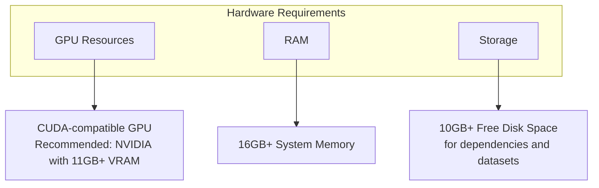
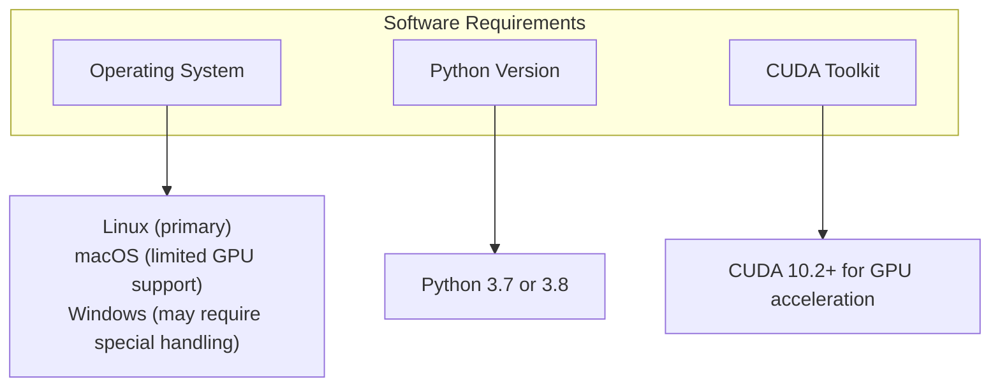
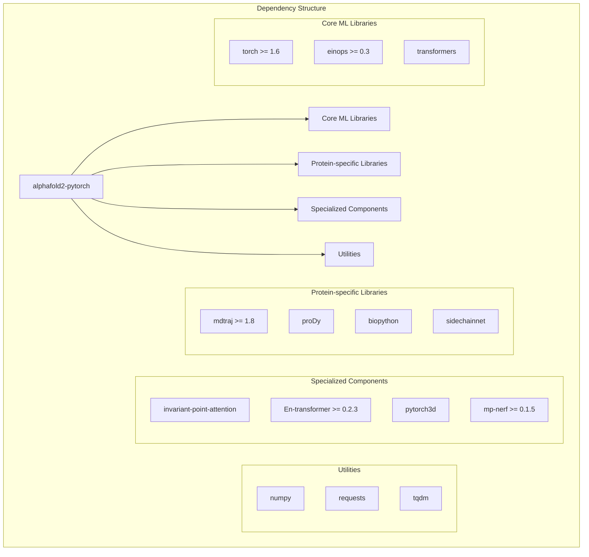
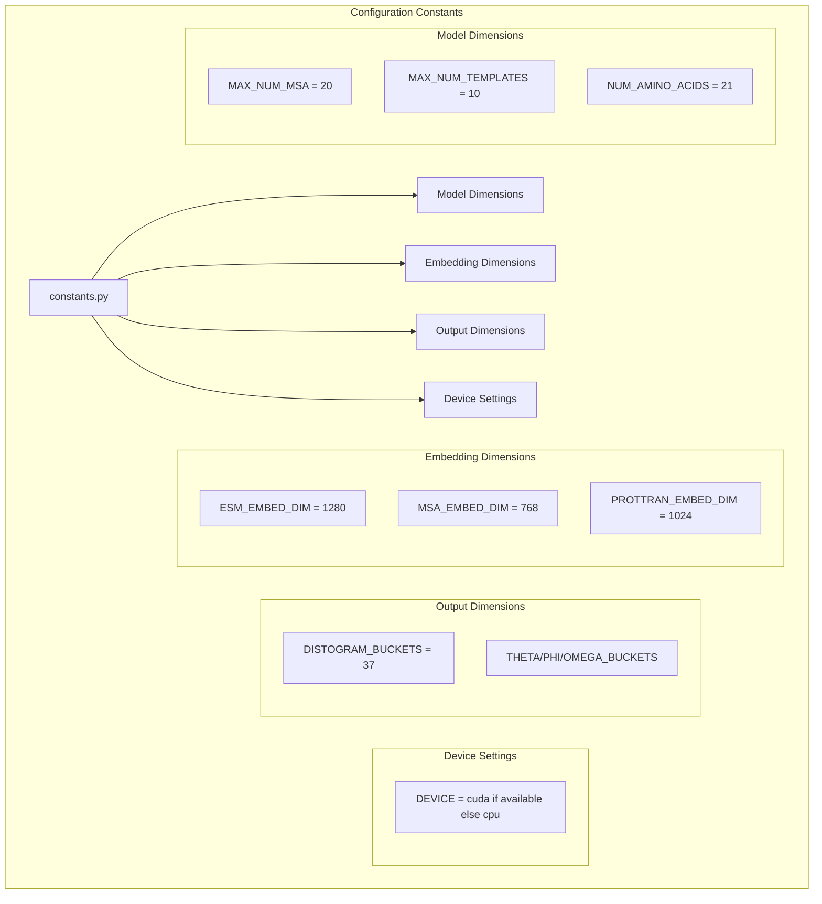

# Installation and Setup

> **Relevant source files**
> * [.github/workflows/python-package.yml](https://github.com/lucidrains/alphafold2/blob/931466e4/.github/workflows/python-package.yml)
> * [.gitignore](https://github.com/lucidrains/alphafold2/blob/931466e4/.gitignore)
> * [LICENSE](https://github.com/lucidrains/alphafold2/blob/931466e4/LICENSE)
> * [alphafold2_pytorch/constants.py](https://github.com/lucidrains/alphafold2/blob/931466e4/alphafold2_pytorch/constants.py)
> * [setup.py](https://github.com/lucidrains/alphafold2/blob/931466e4/setup.py)

This document provides detailed instructions for installing and setting up the AlphaFold2 PyTorch implementation. For information about the core model architecture and how to use it after installation, see [Core Model Architecture](/lucidrains/alphafold2/2-core-model-architecture).

## System Requirements

### Hardware Requirements

The AlphaFold2 PyTorch implementation has substantial computational requirements due to the complexity of protein structure prediction:



Sources: [setup.py L18-L32](https://github.com/lucidrains/alphafold2/blob/931466e4/setup.py#L18-L32)

### Software Requirements



Sources: [.github/workflows/python-package.yml L17-L18](https://github.com/lucidrains/alphafold2/blob/931466e4/.github/workflows/python-package.yml#L17-L18)

 [setup.py L45](https://github.com/lucidrains/alphafold2/blob/931466e4/setup.py#L45-L45)

## Installation Methods

### Method 1: Using pip

The simplest way to install the AlphaFold2 PyTorch implementation is directly from PyPI:

```
pip install alphafold2-pytorch
```

This command will install the package and its dependencies automatically.

### Method 2: Installing from Source

For development purposes or to get the latest features, you can install directly from the GitHub repository:

```
git clone https://github.com/lucidrains/alphafold2cd alphafold2pip install -e .
```

The `-e` flag installs the package in "editable" mode, allowing you to modify the source code and have those changes reflected immediately.

Sources: [setup.py L3-L47](https://github.com/lucidrains/alphafold2/blob/931466e4/setup.py#L3-L47)

## Dependencies

The AlphaFold2 PyTorch implementation relies on several Python libraries for functionality. These dependencies are automatically installed when using pip, but understanding them helps with troubleshooting.

### Core Dependencies



Sources: [setup.py L18-L32](https://github.com/lucidrains/alphafold2/blob/931466e4/setup.py#L18-L32)

### Dependency Installation Notes

Some dependencies require special attention:

1. **pytorch3d**: Installation can be complex depending on your platform. ```python # PyTorch3D often requires installation from conda or build from sourceconda install -c pytorch3d pytorch3d# OR, for pip (requires proper CUDA setup)pip install pytorch3d ```
2. **sidechainnet**: Contains protein structure datasets used for training and testing.
3. **proDy**: Molecular dynamics and protein structural analysis library.
4. **CUDA Toolkit**: Required for GPU acceleration with PyTorch.

Sources: [setup.py L18-L32](https://github.com/lucidrains/alphafold2/blob/931466e4/setup.py#L18-L32)

## Environment Setup

It's recommended to use a virtual environment to avoid dependency conflicts with other projects.

### Creating a Virtual Environment

```sql
# Using venv (Python standard library)python -m venv alphafold2_envsource alphafold2_env/bin/activate  # On Windows: alphafold2_env\Scripts\activate # OR using condaconda create -n alphafold2_env python=3.8conda activate alphafold2_env
```

### Installing with GPU Support

To utilize GPU acceleration (highly recommended for performance):

```markdown
# First ensure you have CUDA installed on your system# Then install PyTorch with CUDA supportpip install torch>=1.6 torchvision --extra-index-url https://download.pytorch.org/whl/cu113 # Then install alphafold2-pytorchpip install alphafold2-pytorch
```

Sources: [setup.py L28](https://github.com/lucidrains/alphafold2/blob/931466e4/setup.py#L28-L28)

 [constants.py L28-L30](https://github.com/lucidrains/alphafold2/blob/931466e4/constants.py#L28-L30)

## Verification of Installation

After installation, you can verify that everything is working correctly by running a simple Python script:

```javascript
import torchfrom alphafold2_pytorch import Alphafold2 # Check CUDA availabilityprint(f"CUDA available: {torch.cuda.is_available()}")print(f"Device being used: {torch.device('cuda' if torch.cuda.is_available() else 'cpu')}") # Create a simple model instancemodel = Alphafold2(    dim = 256,    depth = 2,    heads = 8,    dim_head = 64) print("AlphaFold2 model initialized successfully!")
```

If this code runs without errors, your installation is working correctly.

Sources: [constants.py L28-L30](https://github.com/lucidrains/alphafold2/blob/931466e4/constants.py#L28-L30)

## Configuration Files and Data

### Default Settings

The AlphaFold2 PyTorch implementation includes default constants that control various aspects of the model:



Sources: [constants.py L1-L30](https://github.com/lucidrains/alphafold2/blob/931466e4/constants.py#L1-L30)

### Training Data

For training purposes, you may need to download additional datasets:

* **SidechainNet**: Data directory is automatically created during first use
* Ignore configuration files (as listed in `.gitignore`)

```markdown
# Common data directories (will be created as needed)
sidechainnet_data/
```

Sources: [.gitignore L1-L2](https://github.com/lucidrains/alphafold2/blob/931466e4/.gitignore#L1-L2)

## Troubleshooting Common Issues

### CUDA Issues

If you encounter CUDA-related errors:

1. Verify your GPU is CUDA-compatible
2. Check CUDA toolkit version matches PyTorch version
3. Try reinstalling PyTorch with the appropriate CUDA version

### Dependency Conflicts

If you encounter dependency conflicts:

1. Use a clean virtual environment
2. Install dependencies in the order specified
3. Check for version conflicts, especially with PyTorch ecosystem packages

### Memory Errors

During model training or inference:

1. Reduce batch size
2. Use gradient accumulation for training
3. Consider using a machine with more GPU memory

## Next Steps

After successfully installing the AlphaFold2 PyTorch implementation, you can explore:

* [Core Model Architecture](/lucidrains/alphafold2/2-core-model-architecture) to understand how the model works
* [Evoformer Module](/lucidrains/alphafold2/2.1-evoformer-module) for details on sequence processing
* [Structure Module](/lucidrains/alphafold2/2.2-structure-module) for how 3D structures are predicted
* [Training System](/lucidrains/alphafold2/4-training-system) to learn how to train the model

Sources: [setup.py L3-L47](https://github.com/lucidrains/alphafold2/blob/931466e4/setup.py#L3-L47)

 [constants.py L1-L30](https://github.com/lucidrains/alphafold2/blob/931466e4/constants.py#L1-L30)