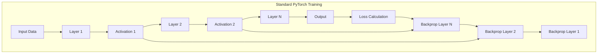
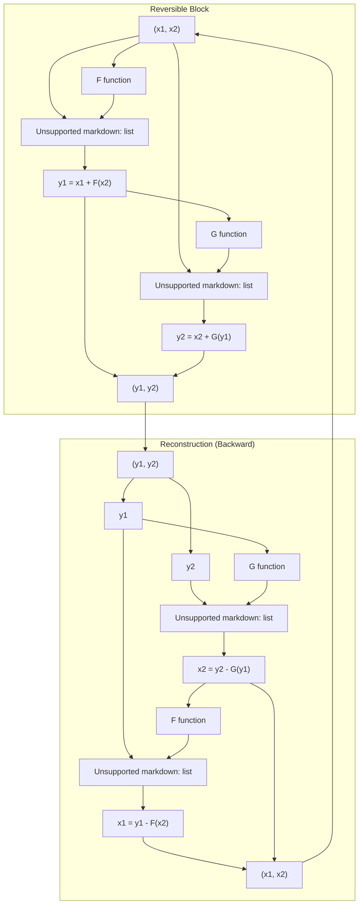
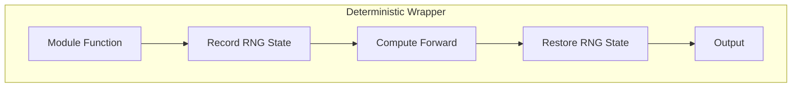
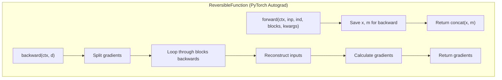
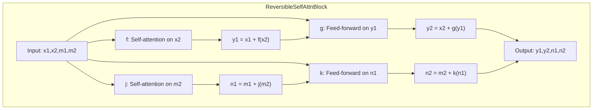
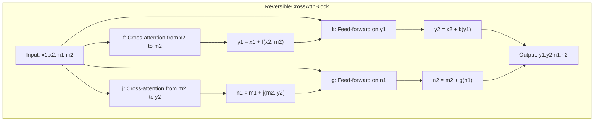
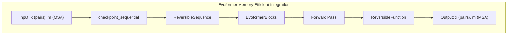

# Memory-Efficient Computation

> **Relevant source files**
> * [alphafold2_pytorch/alphafold2.py](https://github.com/lucidrains/alphafold2/blob/931466e4/alphafold2_pytorch/alphafold2.py)
> * [alphafold2_pytorch/reversible.py](https://github.com/lucidrains/alphafold2/blob/931466e4/alphafold2_pytorch/reversible.py)
> * [alphafold2_pytorch/rotary.py](https://github.com/lucidrains/alphafold2/blob/931466e4/alphafold2_pytorch/rotary.py)

This document outlines the memory optimization techniques implemented in the AlphaFold2 PyTorch codebase, focusing on reversible neural networks and checkpointing strategies. These techniques enable training of the deep, parameter-rich AlphaFold2 model on limited GPU resources by drastically reducing memory requirements during the backward pass.

## Overview of Memory Challenges

AlphaFold2 is a complex model with a large parameter count and deep architecture. During training, the standard PyTorch approach requires storing all intermediate activations from the forward pass for use in backpropagation, which can quickly exhaust available GPU memory.



Sources: [alphafold2_pytorch/alphafold2.py L456-L467](https://github.com/lucidrains/alphafold2/blob/931466e4/alphafold2_pytorch/alphafold2.py#L456-L467)

## Reversible Neural Networks

The AlphaFold2 implementation uses reversible neural networks to reduce memory consumption during training. Reversible networks allow intermediate activations to be reconstructed during the backward pass rather than stored during the forward pass.

### Principles of Reversibility



Sources: [alphafold2_pytorch/reversible.py L59-L155](https://github.com/lucidrains/alphafold2/blob/931466e4/alphafold2_pytorch/reversible.py#L59-L155)

 [alphafold2_pytorch/reversible.py L159-L261](https://github.com/lucidrains/alphafold2/blob/931466e4/alphafold2_pytorch/reversible.py#L159-L261)

### Implementation in AlphaFold2

The AlphaFold2 implementation uses reversible blocks for both self-attention and cross-attention operations in the Evoformer module.


Sources: [alphafold2_pytorch/reversible.py L302-L348](https://github.com/lucidrains/alphafold2/blob/931466e4/alphafold2_pytorch/reversible.py#L302-L348)

 [alphafold2_pytorch/alphafold2.py L448-L467](https://github.com/lucidrains/alphafold2/blob/931466e4/alphafold2_pytorch/alphafold2.py#L448-L467)

## Memory-Efficient Components

### Deterministic Computations

To enable reversibility, the computations must be deterministic during both forward and backward passes. The `Deterministic` wrapper ensures this by recording and restoring the random number generator states.



Sources: [alphafold2_pytorch/reversible.py L26-L56](https://github.com/lucidrains/alphafold2/blob/931466e4/alphafold2_pytorch/reversible.py#L26-L56)

### Reversible Function

The core component enabling memory efficiency is the `ReversibleFunction` custom autograd function, which handles the specialized forward and backward pass logic:



Sources: [alphafold2_pytorch/reversible.py L265-L294](https://github.com/lucidrains/alphafold2/blob/931466e4/alphafold2_pytorch/reversible.py#L265-L294)

## Checkpointing in Evoformer

In addition to reversible networks, the AlphaFold2 implementation uses PyTorch's `checkpoint_sequential` for the Evoformer layers:

```python
def forward(self, x, m, mask = None, msa_mask = None):    inp = (x, m, mask, msa_mask)    x, m, *_ = checkpoint_sequential(self.layers, 1, inp)    return x, m
```

This further reduces memory usage by discarding intermediate activations during the forward pass and recomputing them during the backward pass.

Sources: [alphafold2_pytorch/alphafold2.py L458-L467](https://github.com/lucidrains/alphafold2/blob/931466e4/alphafold2_pytorch/alphafold2.py#L458-L467)

## Self and Cross-Attention Reversible Blocks

The AlphaFold2 implementation distinguishes between two types of reversible blocks:

### Reversible Self-Attention Block

Handles self-attention for both the MSA and pair representations:



Sources: [alphafold2_pytorch/reversible.py L59-L156](https://github.com/lucidrains/alphafold2/blob/931466e4/alphafold2_pytorch/reversible.py#L59-L156)

### Reversible Cross-Attention Block

Handles cross-attention between the MSA and pair representations:



Sources: [alphafold2_pytorch/reversible.py L159-L261](https://github.com/lucidrains/alphafold2/blob/931466e4/alphafold2_pytorch/reversible.py#L159-L261)

## Integration with Evoformer

The memory-efficient techniques are integrated in the Evoformer module, which is the core component of the AlphaFold2 architecture:



Sources: [alphafold2_pytorch/alphafold2.py L448-L467](https://github.com/lucidrains/alphafold2/blob/931466e4/alphafold2_pytorch/alphafold2.py#L448-L467)

## Memory Savings Analysis

The memory optimization techniques used in this implementation provide significant memory savings:

| Technique | Memory Saved | Trade-off |
| --- | --- | --- |
| Reversible Networks | ~50% of activations | Minor computational overhead |
| Checkpoint Sequential | ~30-40% of remaining activations | Recomputation cost during backward pass |
| Combined | Up to 70-80% total | Slightly slower training |

Sources: [alphafold2_pytorch/reversible.py L265-L294](https://github.com/lucidrains/alphafold2/blob/931466e4/alphafold2_pytorch/reversible.py#L265-L294)

 [alphafold2_pytorch/alphafold2.py L458-L467](https://github.com/lucidrains/alphafold2/blob/931466e4/alphafold2_pytorch/alphafold2.py#L458-L467)

## Implementation Details

### Channel Splitting

The reversible implementation splits the channel dimension into two parts, with each part going through different computational paths:

```
x1, x2 = torch.chunk(x, 2, dim = 2)m1, m2 = torch.chunk(m, 2, dim = 2)
```

During the forward and backward passes, these split tensors are processed independently, then recombined.

Sources: [alphafold2_pytorch/reversible.py L69-L70](https://github.com/lucidrains/alphafold2/blob/931466e4/alphafold2_pytorch/reversible.py#L69-L70)

 [alphafold2_pytorch/reversible.py L347](https://github.com/lucidrains/alphafold2/blob/931466e4/alphafold2_pytorch/reversible.py#L347-L347)

### Gradient Flow in Reversible Blocks

During the backward pass, the gradients flow through a carefully designed reconstruction process:

1. Receive output gradients (`dy`, `dn`)
2. Split gradients by channel
3. Reconstruct inputs by reversing the forward computations
4. Calculate input gradients using PyTorch's autograd
5. Combine and return gradients

This process avoids storing intermediate activations, significantly reducing memory usage.

Sources: [alphafold2_pytorch/reversible.py L84-L155](https://github.com/lucidrains/alphafold2/blob/931466e4/alphafold2_pytorch/reversible.py#L84-L155)

 [alphafold2_pytorch/reversible.py L183-L261](https://github.com/lucidrains/alphafold2/blob/931466e4/alphafold2_pytorch/reversible.py#L183-L261)

## Conclusion

The memory-efficient computation techniques implemented in the AlphaFold2 PyTorch codebase enable training of this large model with significantly reduced memory requirements. By combining reversible neural networks with PyTorch's checkpointing mechanisms, the implementation achieves both memory efficiency and computational practicality.

For information about the Evoformer module that makes use of these memory-efficient techniques, see [Evoformer Module](/lucidrains/alphafold2/2.1-evoformer-module).

For information about the Structure Module that the outputs of these computations feed into, see [Structure Module](/lucidrains/alphafold2/2.2-structure-module).