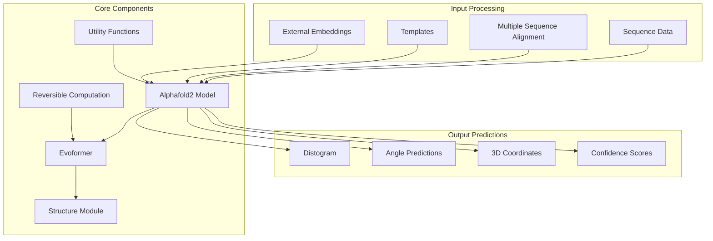
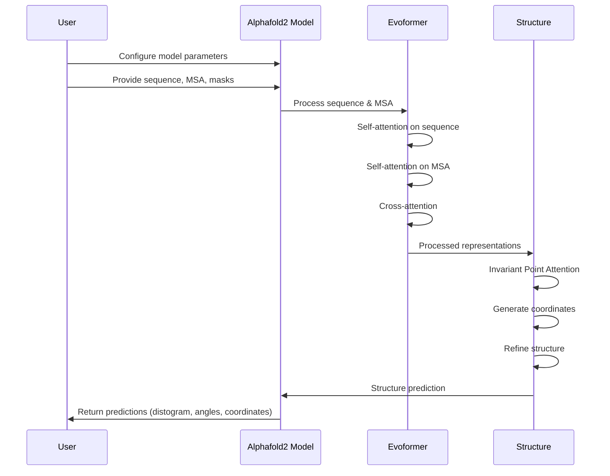
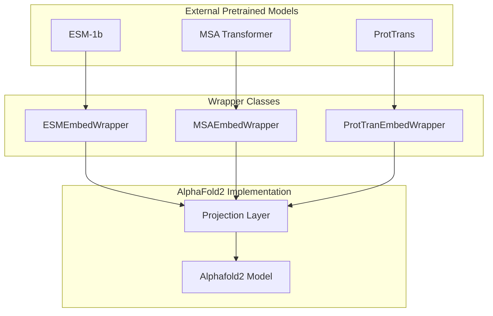

# Overview

> **Relevant source files**
> * [.github/workflows/python-package.yml](https://github.com/lucidrains/alphafold2/blob/931466e4/.github/workflows/python-package.yml)
> * [README.md](https://github.com/lucidrains/alphafold2/blob/931466e4/README.md?plain=1)
> * [alphafold2_pytorch/__init__.py](https://github.com/lucidrains/alphafold2/blob/931466e4/alphafold2_pytorch/__init__.py)
> * [setup.py](https://github.com/lucidrains/alphafold2/blob/931466e4/setup.py)

This document provides an introduction to the AlphaFold2 PyTorch implementation, a reimplementation of DeepMind's groundbreaking protein structure prediction system. This unofficial PyTorch port aims to faithfully reproduce AlphaFold2's architecture while adding flexibility and optimizations specific to the PyTorch ecosystem.

For detailed information about specific components, see:

* For details on the Evoformer module, see [Evoformer Module](/lucidrains/alphafold2/2.1-evoformer-module)
* For information on the Structure Module, see [Structure Module](/lucidrains/alphafold2/2.2-structure-module)
* For training procedures, see [Training System](/lucidrains/alphafold2/4-training-system)
* For embedding details, see [Embedding System](/lucidrains/alphafold2/5-embedding-system)

## Purpose and Scope

This implementation provides a PyTorch-based protein structure prediction system that can:

1. Process protein sequences and multiple sequence alignments (MSAs)
2. Generate distograms (distance predictions between residues)
3. Predict angles and 3D coordinates of protein structures
4. Utilize pretrained protein language models for embeddings
5. Support memory-efficient training through reversible layers

Sources: [README.md L3-L9](https://github.com/lucidrains/alphafold2/blob/931466e4/README.md?plain=1#L3-L9)

 [setup.py L4-L17](https://github.com/lucidrains/alphafold2/blob/931466e4/setup.py#L4-L17)

## System Architecture

The following diagram illustrates the high-level architecture of the AlphaFold2 PyTorch implementation:

The system consists of several key components:

1. **Alphafold2 Model**: The main model class that coordinates the processing of sequence and MSA data
2. **Evoformer**: Processes sequence and MSA data through attention mechanisms
3. **Structure Module**: Converts processed features into 3D protein structures
4. **Utility Functions**: Various functions for protein structure processing and evaluation
5. **Reversible Computation**: Techniques to reduce memory usage during training

Sources: [alphafold2_pytorch/__init__.py L1-L2](https://github.com/lucidrains/alphafold2/blob/931466e4/alphafold2_pytorch/__init__.py#L1-L2)

 [README.md L28-L86](https://github.com/lucidrains/alphafold2/blob/931466e4/README.md?plain=1#L28-L86)

## Core Model Architecture

The following diagram shows the detailed architecture of the core model components:

Key architectural components:

1. **Input Processing**: * Takes protein sequences, MSAs, and optional templates * Embeds these inputs into learned representations
2. **Evoformer**: * Processes MSA and pair representations through attention mechanisms * Uses self-attention within representations and cross-attention between them * Can utilize reversible layers to save memory during training
3. **Structure Module**: * Uses invariant point attention for coordinate prediction * Can be configured with different equivariant network types (SE3, EGNN, E(n)) * Performs structure refinement through iterative updates

Sources: [README.md L88-L126](https://github.com/lucidrains/alphafold2/blob/931466e4/README.md?plain=1#L88-L126)

 [README.md L128-L167](https://github.com/lucidrains/alphafold2/blob/931466e4/README.md?plain=1#L128-L167)

## Feature Diagram

The following diagram illustrates the key features and options available in this implementation:

This implementation provides numerous configuration options:

1. **Input Flexibility**: * Can work with just sequences or with sequences and MSAs * Supports template information when available * Can leverage pretrained protein language models
2. **Prediction Capabilities**: * Distogram prediction (similar to AlphaFold1 but with attention) * Optional angle prediction (θ, φ, ω) * 3D coordinate prediction with various refinement options
3. **Memory Optimization**: * Reversible layers to reduce memory consumption * Multiple attention optimization strategies * Configurable model size and depth
4. **Structure Module Options**: * Multiple equivariant network options for coordinate prediction * Configurable atom representation (backbone only, with C-beta, all atoms)

Sources: [README.md L177-L219](https://github.com/lucidrains/alphafold2/blob/931466e4/README.md?plain=1#L177-L219)

 [README.md L388-L488](https://github.com/lucidrains/alphafold2/blob/931466e4/README.md?plain=1#L388-L488)

 [README.md L489-L506](https://github.com/lucidrains/alphafold2/blob/931466e4/README.md?plain=1#L489-L506)

 [README.md L588-L602](https://github.com/lucidrains/alphafold2/blob/931466e4/README.md?plain=1#L588-L602)

## Usage Example Workflow

The following diagram shows a typical workflow when using this implementation:

A typical usage pattern involves:

1. Creating an instance of the `Alphafold2` class with desired configuration
2. Providing protein sequence and MSA data (with appropriate masks)
3. Optionally providing templates or external embeddings
4. Running inference to get structure predictions
5. Processing the output (distogram, angles, or 3D coordinates)

Sources: [README.md L28-L53](https://github.com/lucidrains/alphafold2/blob/931466e4/README.md?plain=1#L28-L53)

 [README.md L97-L126](https://github.com/lucidrains/alphafold2/blob/931466e4/README.md?plain=1#L97-L126)

## Implementation Details

The implementation provides numerous options for customization:

| Feature | Description | Default Setting |
| --- | --- | --- |
| Reversible Computation | Reduces memory usage by not storing activations | Optional (set with `reversible=True`) |
| Angle Prediction | Predicts θ, φ, ω angles between residues | Optional (set with `predict_angles=True`) |
| Coordinate Prediction | Predicts 3D coordinates of protein structures | Optional (set with `predict_coords=True`) |
| Atom Representation | Which atoms to include in structure | Backbone (C, Ca, N) |
| Structure Module | Type of equivariant network for coordinates | SE3 Transformer |
| Embedding Options | Support for pretrained protein language models | None by default, wrappers available |
| Convolutional Blocks | Additional convolutional processing | Optional (set with `use_conv=True`) |
| Memory-Efficient Attention | Various attention optimizations | Multiple options available |

The model can be configured for different stages of protein structure prediction, from distogram prediction (similar to AlphaFold1) to full 3D coordinate prediction with the structure module.

Sources: [README.md L56-L86](https://github.com/lucidrains/alphafold2/blob/931466e4/README.md?plain=1#L56-L86)

 [README.md L128-L167](https://github.com/lucidrains/alphafold2/blob/931466e4/README.md?plain=1#L128-L167)

 [README.md L271-L327](https://github.com/lucidrains/alphafold2/blob/931466e4/README.md?plain=1#L271-L327)

## Integration with External Models

The implementation offers wrappers for integrating with pretrained protein language models:

These integration features allow:

1. Direct use of state-of-the-art protein language models
2. Leveraging pre-existing protein representations
3. Combining different embedding approaches
4. Projected to match the model's hidden dimension

The implementation supports both token embeddings and pretrained embeddings, with options to disable one or the other as needed.

Sources: [README.md L177-L231](https://github.com/lucidrains/alphafold2/blob/931466e4/README.md?plain=1#L177-L231)

This overview provides a foundation for understanding the AlphaFold2 PyTorch implementation. For more details on specific components, please refer to the other sections of this documentation.