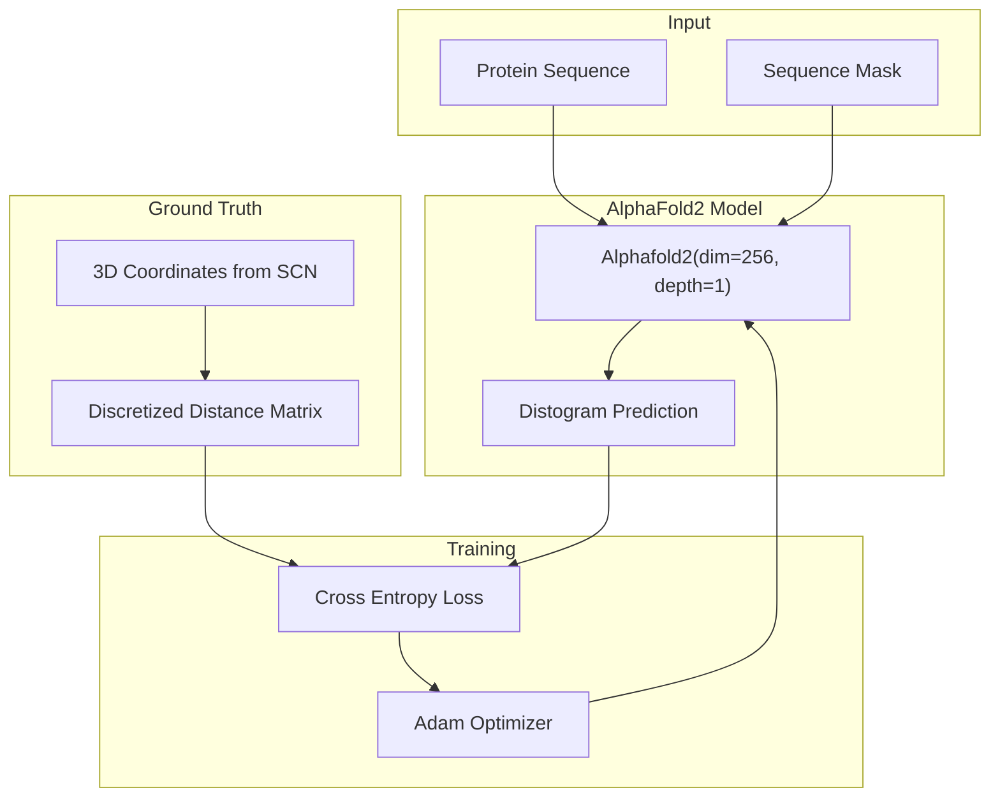
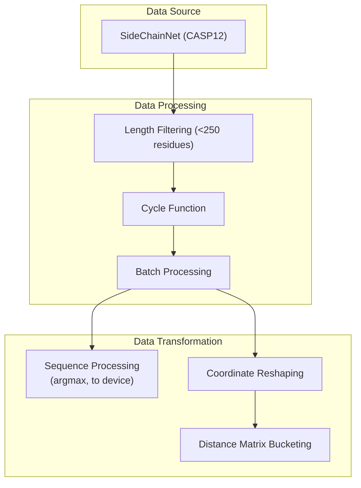
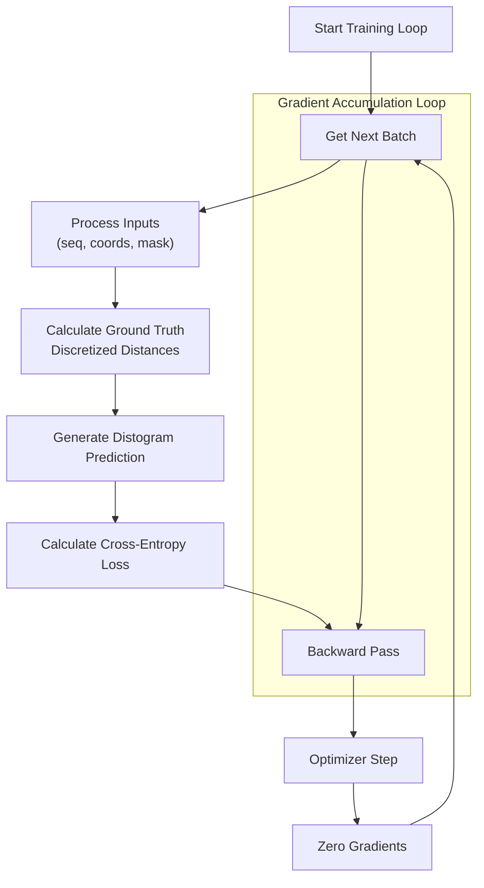
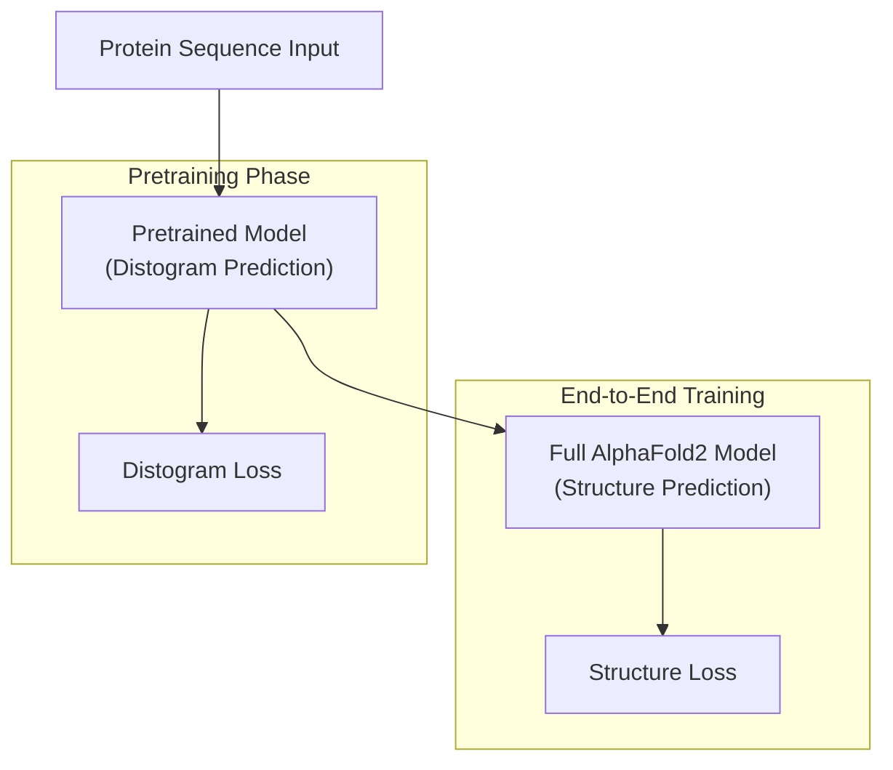

# Pretraining

> **Relevant source files**
> * [train_pre.py](https://github.com/lucidrains/alphafold2/blob/931466e4/train_pre.py)

## Purpose and Scope

This document describes the pretraining process for the AlphaFold2 PyTorch implementation. Pretraining focuses specifically on training the model to predict distograms (discretized distance matrices between residues) before full end-to-end structure prediction training. This approach allows the model to learn important residue-residue distance relationships first, creating a foundation for subsequent structural predictions.

For information about the complete end-to-end training process, see [End-to-End Training](/lucidrains/alphafold2/4.1-end-to-end-training).

## Pretraining Overview

The pretraining system trains the AlphaFold2 model on a more focused task of distogram prediction, which is a critical component of the full protein structure prediction pipeline.



Sources: [train_pre.py L50-L56](https://github.com/lucidrains/alphafold2/blob/931466e4/train_pre.py#L50-L56)

 [train_pre.py L60-L96](https://github.com/lucidrains/alphafold2/blob/931466e4/train_pre.py#L60-L96)

## Data Processing Pipeline

The pretraining process uses SideChainNet (SCN) as its data source, which provides protein sequences, coordinates, and masks.



Sources: [train_pre.py L28-L47](https://github.com/lucidrains/alphafold2/blob/931466e4/train_pre.py#L28-L47)

 [train_pre.py L66-L76](https://github.com/lucidrains/alphafold2/blob/931466e4/train_pre.py#L66-L76)

## Model Configuration

For pretraining, the AlphaFold2 model is initialized with a simplified configuration compared to the full end-to-end model:

| Parameter | Value | Description |
| --- | --- | --- |
| dim | 256 | Embedding dimension |
| depth | 1 | Number of Evoformer blocks |
| heads | 8 | Number of attention heads |
| dim_head | 64 | Dimension per attention head |

The model is specifically tasked with predicting distograms directly from protein sequences, without the full structure module activated.

Sources: [train_pre.py L50-L56](https://github.com/lucidrains/alphafold2/blob/931466e4/train_pre.py#L50-L56)

## Training Process

### Data Handling

The pretraining script:

1. Loads CASP12 data from SideChainNet with thinning factor 30
2. Filters proteins to those with length less than 250 residues
3. Creates a cyclic iterator over the training data

```python
# Example data loading from the codedata = scn.load(    casp_version = 12,    thinning = 30,    with_pytorch = 'dataloaders',    batch_size = 1,    dynamic_batching = False)
```

Sources: [train_pre.py L36-L47](https://github.com/lucidrains/alphafold2/blob/931466e4/train_pre.py#L36-L47)

### Training Loop

The pretraining process uses gradient accumulation to effectively train with larger batch sizes. The key steps in each iteration are:

1. Extract sequence, coordinates, and mask data
2. Process sequences to get amino acid indices
3. Reshape coordinates to the proper format
4. Calculate discretized distance matrix (ground truth)
5. Generate distogram prediction from the model
6. Calculate cross-entropy loss
7. Backpropagate and update weights



Sources: [train_pre.py L64-L96](https://github.com/lucidrains/alphafold2/blob/931466e4/train_pre.py#L64-L96)

## Implementation Details

### Distance Matrix Calculation

A critical component of the pretraining process is the conversion of 3D coordinates to discretized distance matrices. This is done using the `get_bucketed_distance_matrix` function, which:

1. Calculates pairwise distances between Cβ atoms (index 1 in the atom dimension)
2. Discretizes these distances into buckets
3. Handles masking for padded positions

```markdown
discretized_distances = get_bucketed_distance_matrix(    coords[:, :, 1],  # Cβ atom coordinates    mask,     DISTOGRAM_BUCKETS,     IGNORE_INDEX)
```

Sources: [train_pre.py L76](https://github.com/lucidrains/alphafold2/blob/931466e4/train_pre.py#L76-L76)

### Loss Calculation

The pretraining uses cross-entropy loss to compare predicted distograms with the ground truth discretized distance matrices:

```markdown
loss = F.cross_entropy(    distogram,               # Model predictions (shape: batch x classes x length x length)    discretized_distances,   # Ground truth (shape: batch x length x length)    ignore_index = IGNORE_INDEX)
```

The `IGNORE_INDEX` (-100) is used to exclude padded positions from loss calculation.

Sources: [train_pre.py L85-L89](https://github.com/lucidrains/alphafold2/blob/931466e4/train_pre.py#L85-L89)

## Training Configuration

The pretraining uses the following hyperparameters:

| Parameter | Value | Description |
| --- | --- | --- |
| NUM_BATCHES | 1e5 | Total number of batches for training |
| GRADIENT_ACCUMULATE_EVERY | 16 | Number of batches to accumulate gradients |
| LEARNING_RATE | 3e-4 | Learning rate for Adam optimizer |
| THRESHOLD_LENGTH | 250 | Maximum sequence length for filtering |

Sources: [train_pre.py L13-L19](https://github.com/lucidrains/alphafold2/blob/931466e4/train_pre.py#L13-L19)

## Relation to Full AlphaFold2 Training

The pretraining phase focuses specifically on the distogram prediction capability, which serves as a foundation for the more complex task of full 3D structure prediction. This staged approach has several advantages:

1. **Focused Learning**: By first learning to predict residue-residue distances, the model builds an understanding of protein structural constraints
2. **Efficient Training**: Distogram prediction requires less compute than full structure prediction
3. **Model Stability**: Pretraining helps establish stable model weights before tackling the complete structure prediction task

Once pretraining is complete, the model can be further trained end-to-end for complete structure prediction as described in the [End-to-End Training](/lucidrains/alphafold2/4.1-end-to-end-training) page.



Sources: [train_pre.py L50-L56](https://github.com/lucidrains/alphafold2/blob/931466e4/train_pre.py#L50-L56)

 [train_pre.py L64-L96](https://github.com/lucidrains/alphafold2/blob/931466e4/train_pre.py#L64-L96)

## Summary

The pretraining system provides a foundation for the AlphaFold2 model by training it to predict distograms before tackling the more complex task of full 3D structure prediction. The system uses SideChainNet data, focuses on proteins under 250 residues in length, and employs a simplified model configuration with a single Evoformer block. The training process uses gradient accumulation and cross-entropy loss to efficiently learn residue-residue distance relationships.