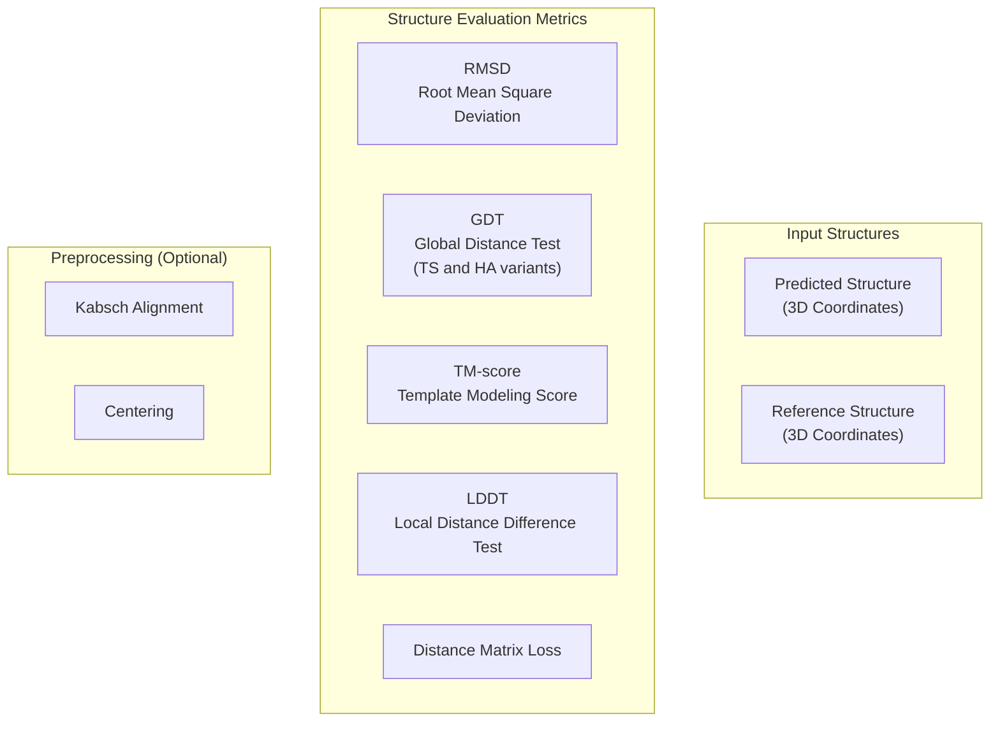
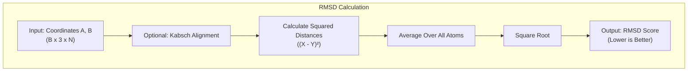
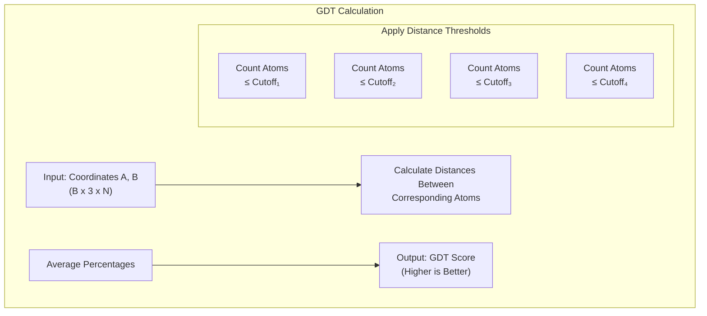
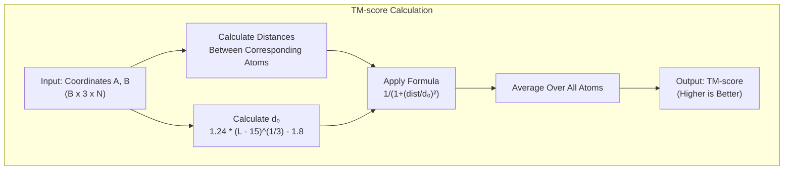
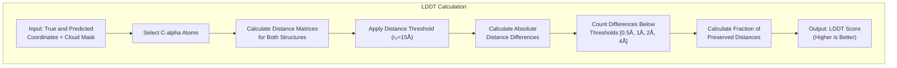
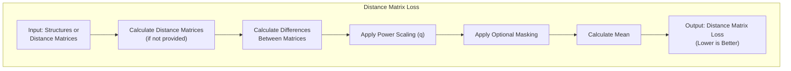
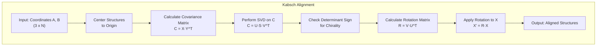
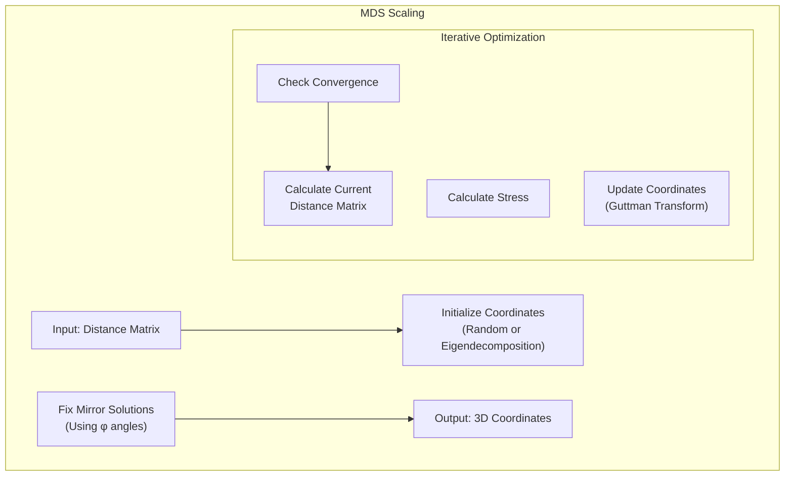
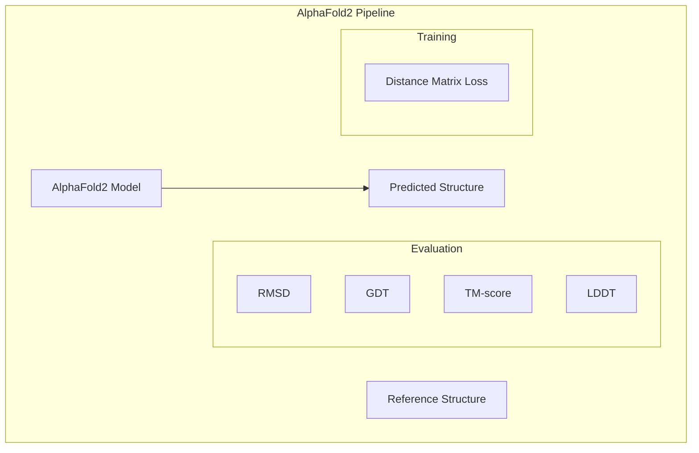

# Structure Evaluation Metrics

> **Relevant source files**
> * [alphafold2_pytorch/utils.py](https://github.com/lucidrains/alphafold2/blob/931466e4/alphafold2_pytorch/utils.py)
> * [notebooks/structure_utils_tests.ipynb](https://github.com/lucidrains/alphafold2/blob/931466e4/notebooks/structure_utils_tests.ipynb)

This document covers the protein structure evaluation metrics implemented in the AlphaFold2 PyTorch codebase. These metrics are essential for quantitatively assessing the quality of predicted protein structures by comparing them to their native or reference structures. For information about coordinate transformations needed before applying these metrics, see [Coordinate Transformations](/lucidrains/alphafold2/3.1-coordinate-transformations).

## Overview of Metrics

The codebase implements several standard metrics used in the protein structure prediction field, all exposed through consistent interfaces. These metrics primarily measure the similarity between predicted and reference protein structures.



Sources: [alphafold2_pytorch/utils.py L1051-L1153](https://github.com/lucidrains/alphafold2/blob/931466e4/alphafold2_pytorch/utils.py#L1051-L1153)

 [alphafold2_pytorch/utils.py L1204-L1247](https://github.com/lucidrains/alphafold2/blob/931466e4/alphafold2_pytorch/utils.py#L1204-L1247)

## Metric Implementations

The codebase provides both PyTorch (GPU-accelerated) and NumPy (CPU) implementations of each metric, allowing for flexible usage in various contexts. The backend selection is handled automatically based on input tensor types.

### RMSD (Root Mean Square Deviation)

RMSD measures the average distance between corresponding atoms of superimposed structures. Lower values indicate better structural similarity.



Implementation details:

* Function: `RMSD()` - wrapper around `rmsd_torch()` and `rmsd_numpy()`
* Formula: RMSD = √(∑(Xᵢ - Yᵢ)² / N)

Sources: [alphafold2_pytorch/utils.py L1098-L1104](https://github.com/lucidrains/alphafold2/blob/931466e4/alphafold2_pytorch/utils.py#L1098-L1104)

 [alphafold2_pytorch/utils.py L1297-L1308](https://github.com/lucidrains/alphafold2/blob/931466e4/alphafold2_pytorch/utils.py#L1297-L1308)

### GDT (Global Distance Test)

GDT measures the percentage of residues that can be superimposed within specified distance cutoffs. It's less sensitive to local errors than RMSD. Higher values indicate better structural similarity.

Two variants are implemented:

* GDT-TS: Uses cutoffs [1Å, 2Å, 4Å, 8Å]
* GDT-HA: Uses cutoffs [0.5Å, 1Å, 2Å, 4Å] (more stringent)



Implementation details:

* Function: `GDT()` - wrapper around `gdt_torch()` and `gdt_numpy()`
* Supports custom cutoffs and weights
* Default cutoffs: [1, 2, 4, 8] for GDT-TS and [0.5, 1, 2, 4] for GDT-HA

Sources: [alphafold2_pytorch/utils.py L1106-L1141](https://github.com/lucidrains/alphafold2/blob/931466e4/alphafold2_pytorch/utils.py#L1106-L1141)

 [alphafold2_pytorch/utils.py L1312-L1327](https://github.com/lucidrains/alphafold2/blob/931466e4/alphafold2_pytorch/utils.py#L1312-L1327)

### TM-score (Template Modeling Score)

TM-score is length-normalized and less sensitive to local errors. It ranges between 0 and 1, with higher values indicating better structural similarity. TM-score > 0.5 typically indicates the same fold.



Implementation details:

* Function: `TMscore()` - wrapper around `tmscore_torch()` and `tmscore_numpy()`
* Scale factor d₀ depends on protein length
* Score interpretation: >0.5 (likely same fold), >0.6 (highly likely same fold)

Sources: [alphafold2_pytorch/utils.py L1143-L1160](https://github.com/lucidrains/alphafold2/blob/931466e4/alphafold2_pytorch/utils.py#L1143-L1160)

 [alphafold2_pytorch/utils.py L1331-L1344](https://github.com/lucidrains/alphafold2/blob/931466e4/alphafold2_pytorch/utils.py#L1331-L1344)

### LDDT (Local Distance Difference Test)

LDDT evaluates local distance differences, focusing on C-alpha atoms. It measures the preservation of local distance patterns, making it less sensitive to domain movements.



Implementation details:

* Function: `lddt_ca_torch()`
* Focuses on C-alpha atoms only
* Uses reference cutoff r₀=15Å
* Uses thresholds [0.5Å, 1Å, 2Å, 4Å]

Sources: [alphafold2_pytorch/utils.py L1204-L1247](https://github.com/lucidrains/alphafold2/blob/931466e4/alphafold2_pytorch/utils.py#L1204-L1247)

### Distance Matrix Loss

This metric provides a direct comparison between distance matrices without requiring structural alignment, making it useful during training.



Implementation details:

* Function: `distmat_loss_torch()`
* Supports custom loss functions
* Optional masking for specific residue pairs
* Configurable distance metric (p) and loss scaling (q)

Sources: [alphafold2_pytorch/utils.py L1057-L1096](https://github.com/lucidrains/alphafold2/blob/931466e4/alphafold2_pytorch/utils.py#L1057-L1096)

## Alignment Methods

Before applying metrics, structures often need to be aligned for meaningful comparison. The codebase provides two main alignment methods:

### Kabsch Algorithm

The Kabsch algorithm finds the optimal rotation to align two structures after centering them.



Implementation details:

* Functions: `Kabsch()`, `kabsch_torch()`, `kabsch_numpy()`
* Ensures proper handling of chirality (reflection vs. rotation)
* Computationally efficient implementation for batched inputs

Sources: [alphafold2_pytorch/utils.py L999-L1052](https://github.com/lucidrains/alphafold2/blob/931466e4/alphafold2_pytorch/utils.py#L999-L1052)

 [alphafold2_pytorch/utils.py L1281-L1294](https://github.com/lucidrains/alphafold2/blob/931466e4/alphafold2_pytorch/utils.py#L1281-L1294)

### Multidimensional Scaling (MDS)

MDS reconstructs 3D coordinates from distance matrices, useful for converting distograms to structures.



Implementation details:

* Functions: `MDScaling()`, `mds_torch()`, `mds_numpy()`
* Supports weighted distance matrices
* Special handling for protein mirror solutions
* Fast initialization using eigendecomposition

Sources: [alphafold2_pytorch/utils.py L766-L801](https://github.com/lucidrains/alphafold2/blob/931466e4/alphafold2_pytorch/utils.py#L766-L801)

 [alphafold2_pytorch/utils.py L1162-L1202](https://github.com/lucidrains/alphafold2/blob/931466e4/alphafold2_pytorch/utils.py#L1162-L1202)

 [alphafold2_pytorch/utils.py L1276-L1279](https://github.com/lucidrains/alphafold2/blob/931466e4/alphafold2_pytorch/utils.py#L1276-L1279)

## Integration with AlphaFold2

These metrics serve two primary purposes in the AlphaFold2 pipeline:

1. **Training Supervision**: Distance matrix loss is used during training to guide the model toward correct structure predictions.
2. **Evaluation**: RMSD, GDT, TM-score, and LDDT are used to evaluate final model predictions against known structures.



## Usage Examples

The metrics system is designed for easy use, with consistent interfaces for all metrics:

```javascript
# Example usageimport torchfrom alphafold2_pytorch.utils import RMSD, GDT, TMscore, Kabsch # Assuming we have predicted and reference structures# Shape: (batch, 3, num_residues)pred_coords = torch.rand(1, 3, 100)ref_coords = torch.rand(1, 3, 100) # Align structuresaligned_pred, aligned_ref = Kabsch(pred_coords, ref_coords) # Calculate metricsrmsd_score = RMSD(aligned_pred, aligned_ref)gdt_ts_score = GDT(aligned_pred, aligned_ref, mode="TS")gdt_ha_score = GDT(aligned_pred, aligned_ref, mode="HA")tm_score = TMscore(aligned_pred, aligned_ref) print(f"RMSD: {rmsd_score.item():.4f} (lower is better)")print(f"GDT-TS: {gdt_ts_score.item():.4f} (higher is better)")print(f"GDT-HA: {gdt_ha_score.item():.4f} (higher is better)")print(f"TM-score: {tm_score.item():.4f} (higher is better)")
```

The system automatically selects the appropriate backend (PyTorch or NumPy) based on input tensor types, allowing for seamless GPU acceleration when available.

Sources: [alphafold2_pytorch/utils.py L1297-L1344](https://github.com/lucidrains/alphafold2/blob/931466e4/alphafold2_pytorch/utils.py#L1297-L1344)

## Metric Selection Guidelines

| Metric | Strengths | Limitations | Use Cases |
| --- | --- | --- | --- |
| RMSD | Simple, intuitive | Sensitive to outliers, not length-normalized | Quick assessments, well-aligned structures |
| GDT | Robust to local errors, length-normalized | Less sensitive to small improvements | CASP evaluations, overall fold assessment |
| TM-score | Length-normalized, robust statistical properties | Less established than GDT | Fold similarity evaluation |
| LDDT | Sensitive to local structural quality | Requires C-alpha selection | Local structure quality assessment |
| Distance Matrix Loss | No alignment needed, differentiable | Less interpretable | Training objectives |

Sources: [alphafold2_pytorch/utils.py L1057-L1247](https://github.com/lucidrains/alphafold2/blob/931466e4/alphafold2_pytorch/utils.py#L1057-L1247)