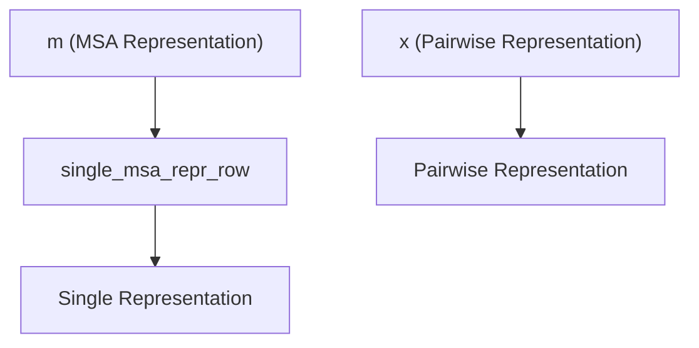
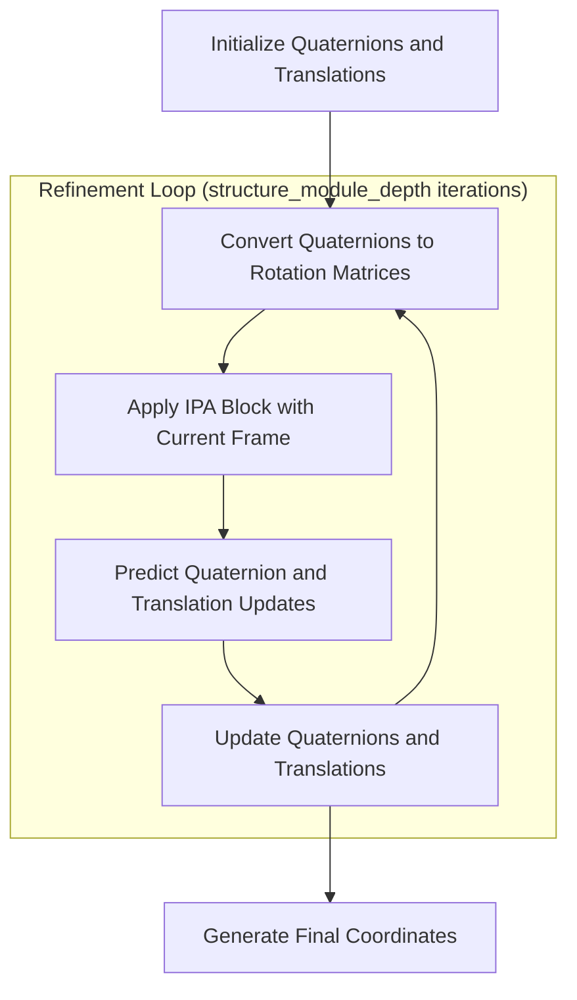
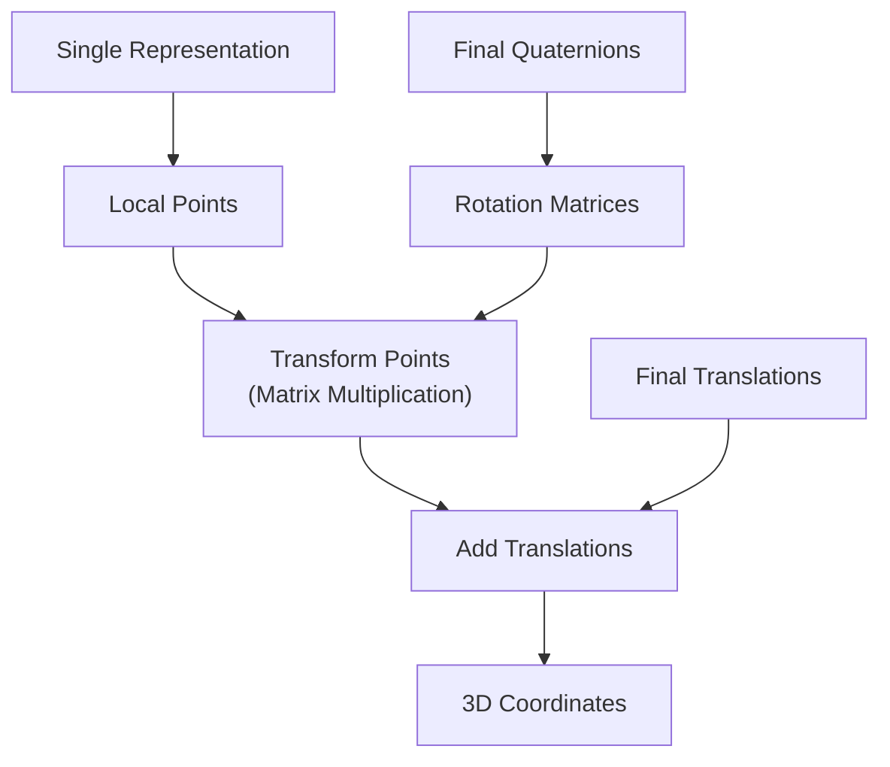
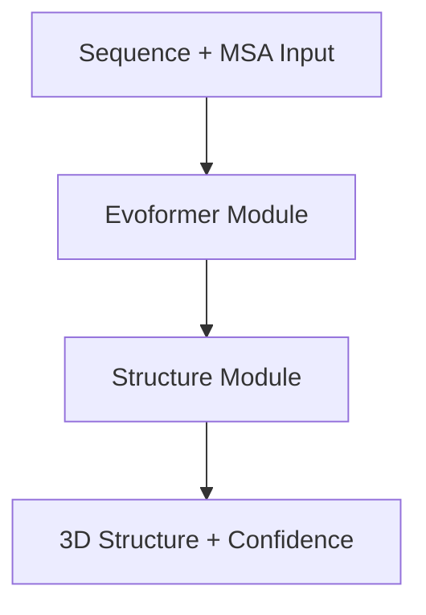

# Structure Module

> **Relevant source files**
> * [alphafold2_pytorch/alphafold2.py](https://github.com/lucidrains/alphafold2/blob/931466e4/alphafold2_pytorch/alphafold2.py)
> * [tests/test_attention.py](https://github.com/lucidrains/alphafold2/blob/931466e4/tests/test_attention.py)

## Purpose and Scope

The Structure Module is a critical component of the AlphaFold2 architecture that transforms the abstract representations from the [Evoformer Module](/lucidrains/alphafold2/2.1-evoformer-module) into 3D protein structure coordinates. It uses equivariant neural networks with Invariant Point Attention (IPA) to iteratively refine protein backbone coordinates in 3D space, providing the final output of the model: the predicted protein structure.

This document explains the architecture, components, and workflow of the Structure Module implementation in the AlphaFold2 PyTorch codebase.

Sources: [alphafold2_pytorch/alphafold2.py L17-L21](https://github.com/lucidrains/alphafold2/blob/931466e4/alphafold2_pytorch/alphafold2.py#L17-L21)

 [alphafold2_pytorch/alphafold2.py L491-L495](https://github.com/lucidrains/alphafold2/blob/931466e4/alphafold2_pytorch/alphafold2.py#L491-L495)

## Architecture Overview

The Structure Module takes learned representations from the Evoformer and progressively refines them into 3D coordinates through an iterative process that maintains geometric equivariance, which is crucial for accurate protein structure prediction.

Sources: [alphafold2_pytorch/alphafold2.py L838-L905](https://github.com/lucidrains/alphafold2/blob/931466e4/alphafold2_pytorch/alphafold2.py#L838-L905)

 [alphafold2_pytorch/alphafold2.py L603-L624](https://github.com/lucidrains/alphafold2/blob/931466e4/alphafold2_pytorch/alphafold2.py#L603-L624)

## Components

### Input Preparation

The Structure Module begins by extracting two key inputs from the Evoformer output:

1. **Single Representation**: The first row of the final MSA representation, capturing information about each residue.
2. **Pairwise Representation**: The final pairwise representation, capturing relationships between residues.

These inputs are processed through linear projections to the appropriate dimension:



Sources: [alphafold2_pytorch/alphafold2.py L844-L847](https://github.com/lucidrains/alphafold2/blob/931466e4/alphafold2_pytorch/alphafold2.py#L844-L847)

 [alphafold2_pytorch/alphafold2.py L603-L604](https://github.com/lucidrains/alphafold2/blob/931466e4/alphafold2_pytorch/alphafold2.py#L603-L604)

### Invariant Point Attention (IPA)

The core of the Structure Module is the Invariant Point Attention (IPA) block, which implements a form of attention that respects 3D geometric invariances. This allows the network to reason about protein geometry while being invariant to rotations and translations.

The IPA block:

* Takes residue-level features and current 3D frame (rotations and translations)
* Updates residue features using a specialized attention mechanism
* Preserves equivariance properties essential for structural modeling

Sources: [alphafold2_pytorch/alphafold2.py L605-L609](https://github.com/lucidrains/alphafold2/blob/931466e4/alphafold2_pytorch/alphafold2.py#L605-L609)

 [alphafold2_pytorch/alphafold2.py L873-L879](https://github.com/lucidrains/alphafold2/blob/931466e4/alphafold2_pytorch/alphafold2.py#L873-L879)

### Iterative Refinement Process

The Structure Module uses an iterative refinement process with the following steps:

1. **Initial Frame**: Start with identity rotations (quaternions) and zero translations
2. **For each iteration**: * Convert quaternions to rotation matrices * Apply IPA to update single representation * Predict quaternion and translation updates * Update frame (rotations and translations)
3. **Final Coordinate Generation**: Convert final representations to local points and transform using the final frame



Sources: [alphafold2_pytorch/alphafold2.py L855-L891](https://github.com/lucidrains/alphafold2/blob/931466e4/alphafold2_pytorch/alphafold2.py#L855-L891)

## Implementation Details

### Initialization

The Structure Module components are initialized in the Alphafold2 class constructor:

```markdown
# Single/pair representation transformationself.msa_to_single_repr_dim = nn.Linear(dim, dim)self.trunk_to_pairwise_repr_dim = nn.Linear(dim, dim) # IPA block for equivariant attention (forced to use float32 precision)with torch_default_dtype(torch.float32):    self.ipa_block = IPABlock(        dim = dim,        heads = structure_module_heads,    )    self.to_quaternion_update = nn.Linear(dim, 6) # Point generationself.to_points = nn.Linear(dim, 3) # Confidence predictionself.lddt_linear = nn.Linear(dim, 1)
```

Sources: [alphafold2_pytorch/alphafold2.py L603-L624](https://github.com/lucidrains/alphafold2/blob/931466e4/alphafold2_pytorch/alphafold2.py#L603-L624)

### Key Parameters

The Structure Module's behavior can be configured with several parameters:

| Parameter | Description | Default |
| --- | --- | --- |
| `predict_coords` | Enable or disable coordinate prediction | `False` |
| `structure_module_depth` | Number of refinement iterations | `4` |
| `structure_module_heads` | Number of attention heads in IPA | `1` |
| `structure_module_dim_head` | Dimension per head in IPA | `4` |

Sources: [alphafold2_pytorch/alphafold2.py L491-L495](https://github.com/lucidrains/alphafold2/blob/931466e4/alphafold2_pytorch/alphafold2.py#L491-L495)

### Frame Representation

The protein frame is represented using:

1. **Quaternions**: 4D vectors representing rotations in 3D space
2. **Translations**: 3D vectors representing positions in 3D space

The module uses quaternion operations from pytorch3d for stable rotation representation:

* `quaternion_to_matrix`: Converts quaternions to rotation matrices
* `quaternion_multiply`: Combines quaternion rotations

Sources: [alphafold2_pytorch/alphafold2.py L19-L20](https://github.com/lucidrains/alphafold2/blob/931466e4/alphafold2_pytorch/alphafold2.py#L19-L20)

 [alphafold2_pytorch/alphafold2.py L868-L887](https://github.com/lucidrains/alphafold2/blob/931466e4/alphafold2_pytorch/alphafold2.py#L868-L887)

## Coordinate Generation

The final step converts the refined representations to 3D coordinates:

1. Generate local points from the single representation
2. Transform local points using the final rotation matrices
3. Add the final translations to get global coordinates



Sources: [alphafold2_pytorch/alphafold2.py L889-L891](https://github.com/lucidrains/alphafold2/blob/931466e4/alphafold2_pytorch/alphafold2.py#L889-L891)

## Additional Outputs

Besides 3D coordinates, the Structure Module can also provide:

1. **Confidence Scores**: LDDT-based confidence prediction for the structure
2. **Recyclable Information**: For iterative refinement across multiple passes of the full model

These additional outputs are controlled via function parameters:

* `return_confidence`: Return confidence scores along with coordinates
* `return_recyclables`: Return information for recycling in the next iteration

Sources: [alphafold2_pytorch/alphafold2.py L895-L904](https://github.com/lucidrains/alphafold2/blob/931466e4/alphafold2_pytorch/alphafold2.py#L895-L904)

## Technical Considerations

The Structure Module requires high numerical precision for stable equivariant operations. It enforces float32 precision during computation regardless of the model's overall dtype:

```markdown
# prepare float32 precision for equivarianceoriginal_dtype = single_repr.dtypesingle_repr, pairwise_repr = map(lambda t: t.float(), (single_repr, pairwise_repr)) # iterative refinement with equivariant transformer in high precisionwith torch_default_dtype(torch.float32):    # Structure Module operations here... # Restore original dtypecoords.type(original_dtype)
```

Sources: [alphafold2_pytorch/alphafold2.py L850-L893](https://github.com/lucidrains/alphafold2/blob/931466e4/alphafold2_pytorch/alphafold2.py#L850-L893)

## Integration with AlphaFold2

The Structure Module forms the final stage of the AlphaFold2 prediction pipeline:



The Structure Module is only activated when `predict_coords=True` is set during model initialization, otherwise the model only returns distance and angle predictions from the trunk.

Sources: [alphafold2_pytorch/alphafold2.py L838-L842](https://github.com/lucidrains/alphafold2/blob/931466e4/alphafold2_pytorch/alphafold2.py#L838-L842)

 [tests/test_attention.py L158-L184](https://github.com/lucidrains/alphafold2/blob/931466e4/tests/test_attention.py#L158-L184)