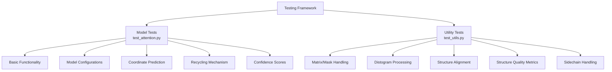
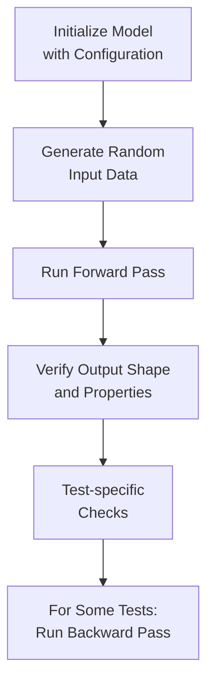
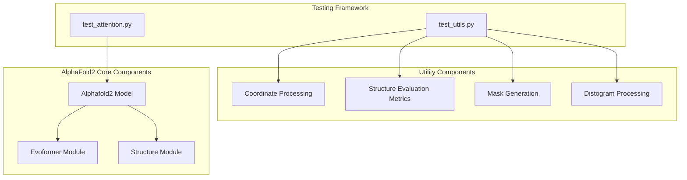

# Testing Framework

> **Relevant source files**
> * [setup.cfg](https://github.com/lucidrains/alphafold2/blob/931466e4/setup.cfg)
> * [tests/test_attention.py](https://github.com/lucidrains/alphafold2/blob/931466e4/tests/test_attention.py)
> * [tests/test_utils.py](https://github.com/lucidrains/alphafold2/blob/931466e4/tests/test_utils.py)

## Purpose and Scope

This document describes the testing framework used in the AlphaFold2 PyTorch implementation. It covers the organization of test files, test case types, and how to run and extend tests. The framework ensures model correctness through comprehensive testing of both the core model components and utility functions.

Sources: [tests/test_attention.py](https://github.com/lucidrains/alphafold2/blob/931466e4/tests/test_attention.py)

 [tests/test_utils.py](https://github.com/lucidrains/alphafold2/blob/931466e4/tests/test_utils.py)

 [setup.cfg](https://github.com/lucidrains/alphafold2/blob/931466e4/setup.cfg)

## Testing Structure Overview

The testing framework is built using pytest and is organized into two primary test files focused on different aspects of the codebase.

### Test Organization



Sources: [tests/test_attention.py](https://github.com/lucidrains/alphafold2/blob/931466e4/tests/test_attention.py)

 [tests/test_utils.py](https://github.com/lucidrains/alphafold2/blob/931466e4/tests/test_utils.py)

## Model Tests

The `test_attention.py` file contains tests that validate the core AlphaFold2 model functionality across various configurations and input formats.

### Test Flow Pattern

Most model tests follow a consistent pattern:



Sources: [tests/test_attention.py L8-L385](https://github.com/lucidrains/alphafold2/blob/931466e4/tests/test_attention.py#L8-L385)

### Model Test Categories

#### Basic Functionality Tests

These tests verify the model initializes and runs correctly with different input configurations:

| Test Function | Purpose | Configuration |
| --- | --- | --- |
| `test_main` | Basic model with MSA | Standard configuration |
| `test_no_msa` | Model without MSA | No MSA input |
| `test_anglegrams` | Angle prediction | `predict_angles=True` |

Sources: [tests/test_attention.py L8-L66](https://github.com/lucidrains/alphafold2/blob/931466e4/tests/test_attention.py#L8-L66)

#### Configuration Tests

These tests validate different model configuration options:

| Test Function | Purpose | Configuration |
| --- | --- | --- |
| `test_templates` | Template features | With template inputs |
| `test_extra_msa` | Extra MSA handling | With extra MSA inputs |
| `test_embeddings` | Pre-computed embeddings | With embedding inputs |

Sources: [tests/test_attention.py L68-L156](https://github.com/lucidrains/alphafold2/blob/931466e4/tests/test_attention.py#L68-L156)

#### Structure Prediction Tests

These tests focus on the coordinate prediction capabilities:

| Test Function | Purpose | Configuration |
| --- | --- | --- |
| `test_coords` | Basic coordinate prediction | `predict_coords=True` |
| `test_coords_backbone_with_cbeta` | Backbone+CB coordinates | `predict_coords=True` |
| `test_coords_all_atoms` | All-atom coordinates | `predict_coords=True` |
| `test_mds` | Multidimensional scaling | `predict_coords=True` |
| `test_edges_to_equivariant_network` | Edge features for equivariant network | `predict_coords=True`, `predict_angles=True` |
| `test_coords_backwards` | Backward pass through coordinate prediction | `predict_coords=True` |

Sources: [tests/test_attention.py L158-L317](https://github.com/lucidrains/alphafold2/blob/931466e4/tests/test_attention.py#L158-L317)

#### Advanced Features Tests

These tests verify more complex model features:

| Test Function | Purpose | Configuration |
| --- | --- | --- |
| `test_confidence` | Confidence score calculation | `return_confidence=True` |
| `test_recycling` | Recycling mechanism | With recyclables |

Sources: [tests/test_attention.py L319-L385](https://github.com/lucidrains/alphafold2/blob/931466e4/tests/test_attention.py#L319-L385)

## Utility Function Tests

The `test_utils.py` file contains tests for various utility functions that support protein structure processing and analysis.

### Utility Test Categories

#### Matrix and Mask Handling

| Test Function | Purpose | Function Tested |
| --- | --- | --- |
| `test_mat_to_masked` | Converting matrices to masked format | `mat_input_to_masked` |
| `test_masks` | Generating atom masks | `scn_backbone_mask` |

Sources: [tests/test_utils.py L5-L37](https://github.com/lucidrains/alphafold2/blob/931466e4/tests/test_utils.py#L5-L37)

#### Distogram and Structure Processing

| Test Function | Purpose | Function Tested |
| --- | --- | --- |
| `test_center_distogram_median` | Distogram centering | `center_distogram_torch` |
| `test_mds_and_mirrors` | Multidimensional scaling | `MDScaling` |
| `test_sidechain_container` | Sidechain handling | `sidechain_container` |

Sources: [tests/test_utils.py L26-L68](https://github.com/lucidrains/alphafold2/blob/931466e4/tests/test_utils.py#L26-L68)

#### Structure Quality Metrics

| Test Function | Purpose | Function Tested |
| --- | --- | --- |
| `test_distmat_loss` | Distance matrix loss | `distmat_loss_torch` |
| `test_lddt` | LDDT score calculation | `lddt_ca_torch` |
| `test_kabsch` | Structure alignment | `Kabsch` |
| `test_tmscore` | TM-score calculation | `TMscore` |
| `test_gdt` | GDT score calculation | `GDT` |

Sources: [tests/test_utils.py L71-L101](https://github.com/lucidrains/alphafold2/blob/931466e4/tests/test_utils.py#L71-L101)

## Test Coverage Map

The following diagram shows how the test files map to components of the AlphaFold2 implementation:



Sources: [tests/test_attention.py](https://github.com/lucidrains/alphafold2/blob/931466e4/tests/test_attention.py)

 [tests/test_utils.py](https://github.com/lucidrains/alphafold2/blob/931466e4/tests/test_utils.py)

## Running Tests

The testing framework uses pytest with configuration specified in `setup.cfg`:

```
[aliases]
test=pytest

[tool:pytest]
addopts = --verbose
python_files = tests/*.py
```

To run all tests:

```
python -m pytest
```

To run a specific test file:

```
python -m pytest tests/test_attention.py
```

To run a specific test:

```
python -m pytest tests/test_attention.py::test_coords
```

Sources: [setup.cfg L1-L6](https://github.com/lucidrains/alphafold2/blob/931466e4/setup.cfg#L1-L6)

## Extending the Test Framework

When adding new tests, follow these guidelines:

1. For model tests: * Add to `tests/test_attention.py` * Follow the pattern of initializing the model, generating input data, running forward pass, and verifying outputs
2. For utility function tests: * Add to `tests/test_utils.py` * Test both normal operation and edge cases
3. Test naming convention: * Use `test_` prefix for all test functions to ensure pytest discovers them * Use descriptive names that indicate what functionality is being tested

Sources: [tests/test_attention.py](https://github.com/lucidrains/alphafold2/blob/931466e4/tests/test_attention.py)

 [tests/test_utils.py](https://github.com/lucidrains/alphafold2/blob/931466e4/tests/test_utils.py)