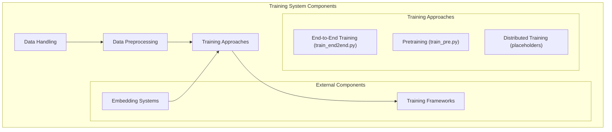
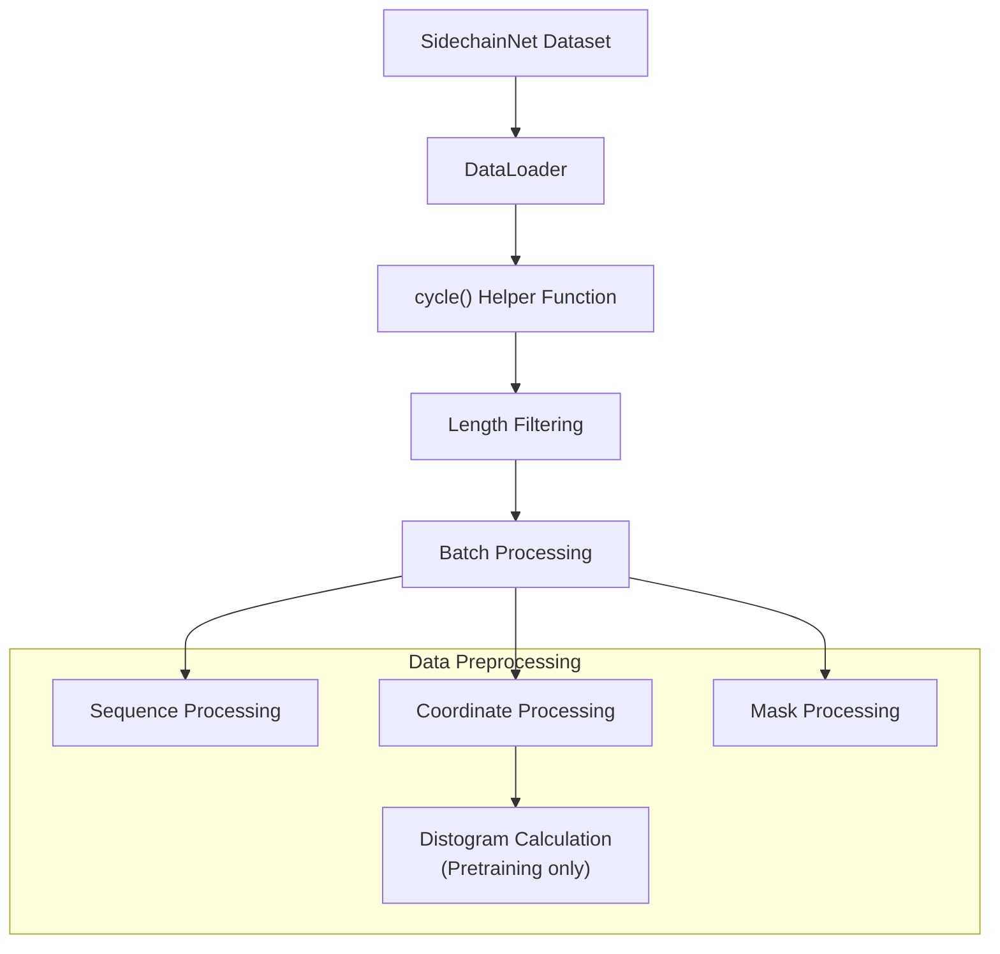
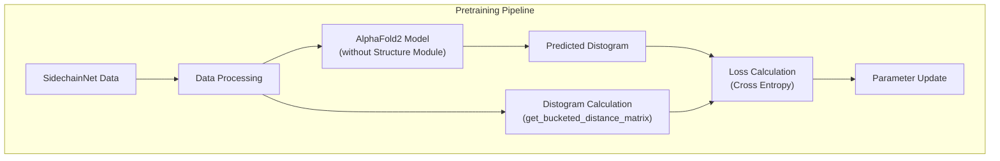
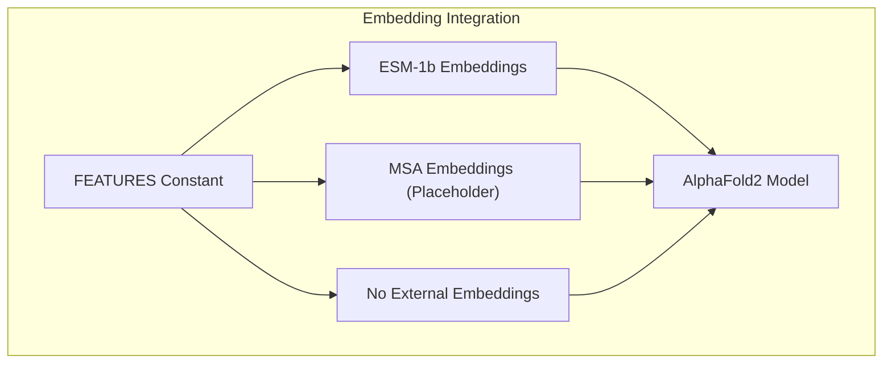

# Training System

> **Relevant source files**
> * [train_end2end.py](https://github.com/lucidrains/alphafold2/blob/931466e4/train_end2end.py)
> * [train_pre.py](https://github.com/lucidrains/alphafold2/blob/931466e4/train_pre.py)
> * [training_scripts/deepspeed.py](https://github.com/lucidrains/alphafold2/blob/931466e4/training_scripts/deepspeed.py)
> * [training_scripts/lightning.py](https://github.com/lucidrains/alphafold2/blob/931466e4/training_scripts/lightning.py)

This page documents the training infrastructure for the AlphaFold2 PyTorch implementation. It covers how to train the model using different approaches, data handling mechanisms, and training configurations. For information about the core model architecture, see [Core Model Architecture](/lucidrains/alphafold2/2-core-model-architecture).

## Overview

The AlphaFold2 training system provides two primary training approaches:

1. **End-to-end training** - For complete structure prediction including 3D coordinates
2. **Pretraining** - Focused on distogram prediction (inter-residue distance matrices)

The system includes support for gradient accumulation to handle larger effective batch sizes, embedding integration from protein language models, and hooks for distributed training frameworks.



Sources: [train_end2end.py](https://github.com/lucidrains/alphafold2/blob/931466e4/train_end2end.py)

 [train_pre.py](https://github.com/lucidrains/alphafold2/blob/931466e4/train_pre.py)

 [training_scripts/deepspeed.py](https://github.com/lucidrains/alphafold2/blob/931466e4/training_scripts/deepspeed.py)

 [training_scripts/lightning.py](https://github.com/lucidrains/alphafold2/blob/931466e4/training_scripts/lightning.py)

## Data Handling

The training system uses the SidechainNet dataset for both training approaches. SidechainNet provides protein sequences, coordinates, and masks that are used to train the model.



The data handling follows these steps:

1. Load SidechainNet data with specified CASP version and thinning parameter
2. Create an iterator over the training data
3. Filter sequences by length (using a threshold)
4. Process sequences, coordinates, and masks for model input
5. Calculate ground truth values (either 3D coordinates or distograms)

### Code Implementation

```markdown
# Data loadingdata = scn.load(    casp_version = 12,    thinning = 30,    with_pytorch = 'dataloaders',    batch_size = 1,    dynamic_batching = False) # Data filtering and cyclingdata = iter(data['train'])data_cond = lambda t: t[1].shape[1] < THRESHOLD_LENGTHdl = cycle(data, data_cond)
```

The `cycle()` helper function creates an infinite iterator that continuously yields data batches meeting a specified condition.

Sources: [train_end2end.py L53-L73](https://github.com/lucidrains/alphafold2/blob/931466e4/train_end2end.py#L53-L73)

 [train_pre.py L27-L47](https://github.com/lucidrains/alphafold2/blob/931466e4/train_pre.py#L27-L47)

## Training Approaches

### End-to-End Training

The end-to-end training approach trains the complete AlphaFold2 model, including the structure module that predicts 3D coordinates. This is implemented in `train_end2end.py`.


Key components of end-to-end training:

1. **Model Configuration**: Initializes AlphaFold2 with structure module enabled
2. **Embedding Integration**: Optional external embeddings from protein language models
3. **Coordinate Prediction**: Outputs 3D coordinates for protein structure
4. **Alignment**: Kabsch algorithm aligns predicted coordinates with ground truth
5. **Loss Calculation**: RMSE loss between aligned coordinates plus dispersion term
6. **Visualization**: Optional conversion of coordinates to PDB format for visualization

Sources: [train_end2end.py L76-L166](https://github.com/lucidrains/alphafold2/blob/931466e4/train_end2end.py#L76-L166)

### Pretraining

The pretraining approach focuses on training the model to predict distograms (inter-residue distance matrices) without the structure module. This is implemented in `train_pre.py`.



Key components of pretraining:

1. **Model Configuration**: Initializes AlphaFold2 without structure module
2. **Distogram Calculation**: Computes bucketed distance matrices from ground truth coordinates
3. **Distogram Prediction**: Model outputs predicted distance probabilities between residues
4. **Loss Calculation**: Cross-entropy loss between predicted and ground truth distograms
5. **Simple Processing**: No need for coordinate alignment or additional loss terms

Sources: [train_pre.py L49-L96](https://github.com/lucidrains/alphafold2/blob/931466e4/train_pre.py#L49-L96)

## Model Configuration

Both training approaches initialize the AlphaFold2 model with specific parameters, but with notable differences based on the training objective.

### End-to-End Model Configuration

```
model = Alphafold2(    dim = 256,    depth = 1,    heads = 8,    dim_head = 64,    predict_coords = True,    structure_module_dim = 8,    structure_module_depth = 2,    structure_module_heads = 4,    structure_module_dim_head = 16,    structure_module_refinement_iters = 2).to(DEVICE)
```

### Pretraining Model Configuration

```
model = Alphafold2(    dim = 256,    depth = 1,    heads = 8,    dim_head = 64).to(DEVICE)
```

Sources: [train_end2end.py L76-L88](https://github.com/lucidrains/alphafold2/blob/931466e4/train_end2end.py#L76-L88)

 [train_pre.py L50-L56](https://github.com/lucidrains/alphafold2/blob/931466e4/train_pre.py#L50-L56)

## Training Configuration

Both training approaches share common training configuration parameters:

| Parameter | Value | Description |
| --- | --- | --- |
| `NUM_BATCHES` | 1e5 | Total number of batches to train |
| `GRADIENT_ACCUMULATE_EVERY` | 16 | Number of batches to accumulate gradients |
| `LEARNING_RATE` | 3e-4 | Learning rate for Adam optimizer |
| `THRESHOLD_LENGTH` | 250 | Maximum sequence length for training |
| `DEVICE` | CUDA/CPU | Device for training (defaults to CUDA if available) |

### Gradient Accumulation

Both training implementations use gradient accumulation to effectively increase batch size without increasing memory requirements:

```sql
for _ in range(NUM_BATCHES):    for _ in range(GRADIENT_ACCUMULATE_EVERY):        # Forward pass        # Loss calculation        # Backward pass        # Parameter update    optim.step()    optim.zero_grad()
```

Sources: [train_end2end.py L24-L32](https://github.com/lucidrains/alphafold2/blob/931466e4/train_end2end.py#L24-L32)

 [train_pre.py L13-L24](https://github.com/lucidrains/alphafold2/blob/931466e4/train_pre.py#L13-L24)

 [train_end2end.py L97-L166](https://github.com/lucidrains/alphafold2/blob/931466e4/train_end2end.py#L97-L166)

 [train_pre.py L64-L96](https://github.com/lucidrains/alphafold2/blob/931466e4/train_pre.py#L64-L96)

## Embedding Integration

The end-to-end training script supports integration with external protein language models to provide sequence embeddings. This is configured through the `FEATURES` constant, which can be set to:

* `"esm"` - Use embeddings from ESM-1b model
* `"msa"` - Use embeddings from MSA (placeholder)
* `None` - No external embeddings



The ESM-1b model is loaded using PyTorch hub:

```python
if FEATURES == "esm":    # from pytorch hub (almost 30gb)    embedd_model, alphabet = torch.hub.load("facebookresearch/esm", "esm1b_t33_650M_UR50S")    batch_converter = alphabet.get_batch_converter()
```

During training, the appropriate embeddings are provided to the model:

```
refined = model(    seq,    msa = msa,    embedds = embedds,    mask = mask)
```

Sources: [train_end2end.py L24](https://github.com/lucidrains/alphafold2/blob/931466e4/train_end2end.py#L24-L24)

 [train_end2end.py L41-L49](https://github.com/lucidrains/alphafold2/blob/931466e4/train_end2end.py#L41-L49)

 [train_end2end.py L112-L121](https://github.com/lucidrains/alphafold2/blob/931466e4/train_end2end.py#L112-L121)

 [train_end2end.py L125-L130](https://github.com/lucidrains/alphafold2/blob/931466e4/train_end2end.py#L125-L130)

## Advanced Training Options

The repository includes placeholder files for integrating with advanced training frameworks:

1. **DeepSpeed Integration**: Placeholder file `training_scripts/deepspeed.py` for implementing distributed training using Microsoft's DeepSpeed.
2. **PyTorch Lightning Integration**: Placeholder file `training_scripts/lightning.py` for implementing training using PyTorch Lightning, which provides abstractions for distributed training, mixed precision, and other training optimizations.

These files suggest a planned extension of the training system to support more scalable and efficient training scenarios.

Sources: [training_scripts/deepspeed.py](https://github.com/lucidrains/alphafold2/blob/931466e4/training_scripts/deepspeed.py)

 [training_scripts/lightning.py](https://github.com/lucidrains/alphafold2/blob/931466e4/training_scripts/lightning.py)

## Loss Functions

The training approaches use different loss functions:

### End-to-End Training Loss

The end-to-end training uses a combination of RMSE (Root Mean Square Error) loss for coordinate prediction and a dispersion term:

```
loss = torch.sqrt(criterion(coords_aligned[flat_chain_mask], labels_aligned[flat_chain_mask])) + \                  dispersion_weight * torch.norm( (1/weights)-1 )
```

Where:

* `coords_aligned` and `labels_aligned` are the predicted and ground truth coordinates after Kabsch alignment
* `flat_chain_mask` identifies the atoms to include in the loss calculation
* `dispersion_weight` controls the contribution of the dispersion term (set to 0.1)

### Pretraining Loss

The pretraining uses cross-entropy loss for distogram prediction:

```
loss = F.cross_entropy(    distogram,    discretized_distances,    ignore_index = IGNORE_INDEX)
```

Where:

* `distogram` is the predicted probability distribution over distance buckets
* `discretized_distances` are the ground truth distance buckets
* `IGNORE_INDEX` is used to mask padded or ignored positions (set to -100)

Sources: [train_end2end.py L157-L159](https://github.com/lucidrains/alphafold2/blob/931466e4/train_end2end.py#L157-L159)

 [train_pre.py L85-L89](https://github.com/lucidrains/alphafold2/blob/931466e4/train_pre.py#L85-L89)

## Summary

The AlphaFold2 training system provides a flexible framework for training protein structure prediction models. It supports both end-to-end training for full structure prediction and pretraining for distogram prediction. The system integrates with external protein language models for embeddings and includes placeholders for advanced distributed training options.

The modular design allows for experimentation with different model configurations, loss functions, and training strategies, making it suitable for research and development in protein structure prediction.