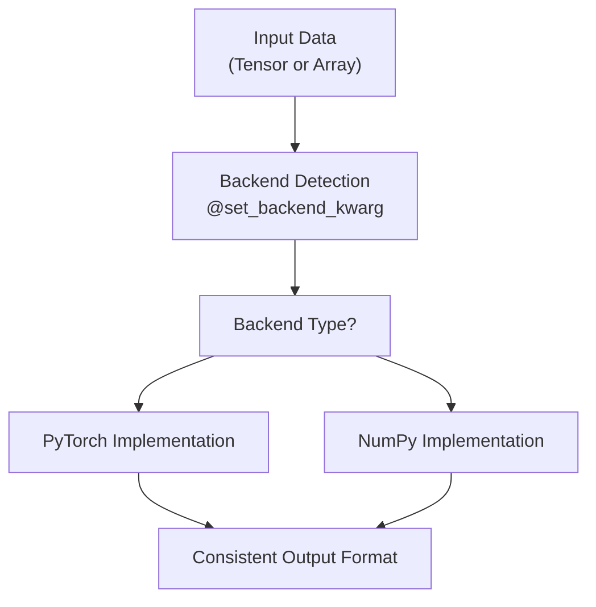
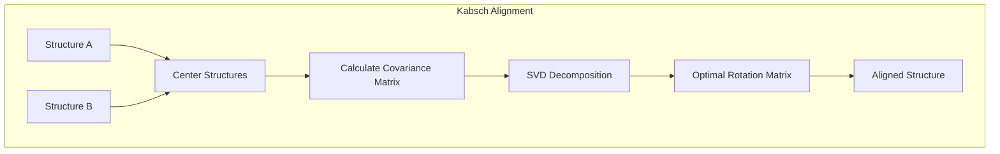
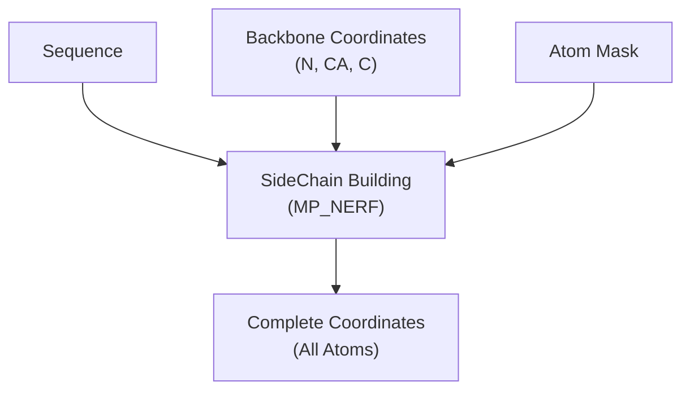
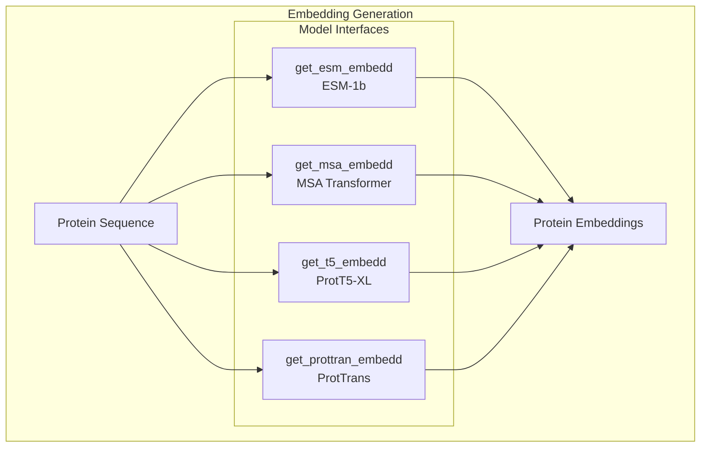
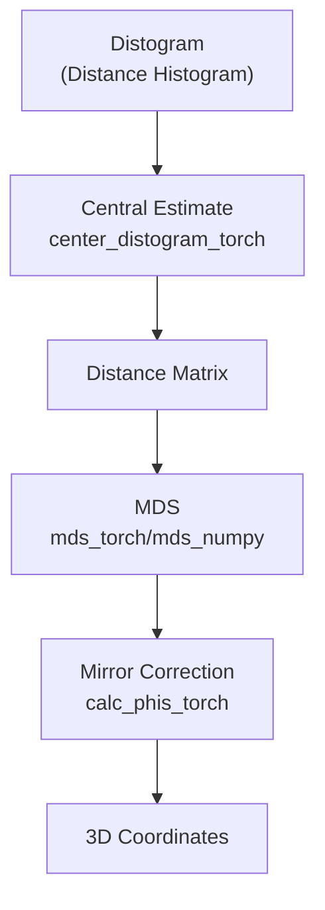
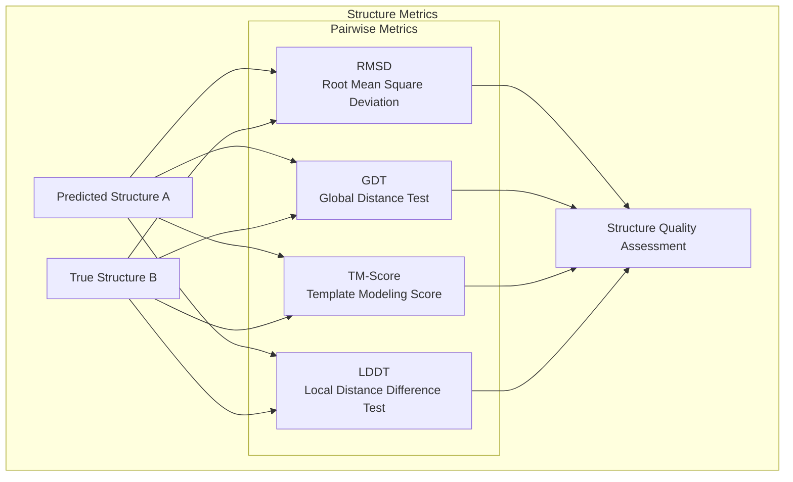
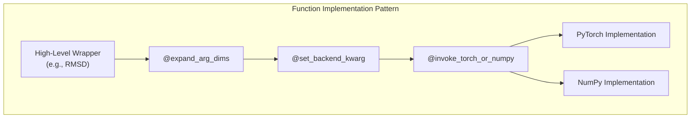
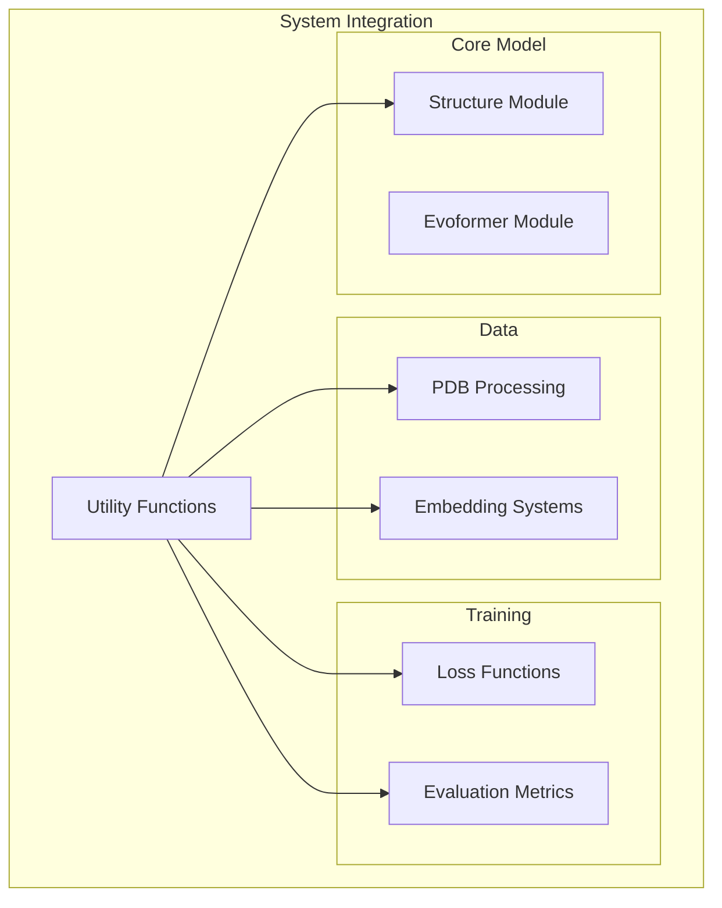

# Utility Functions

> **Relevant source files**
> * [alphafold2_pytorch/utils.py](https://github.com/lucidrains/alphafold2/blob/931466e4/alphafold2_pytorch/utils.py)
> * [setup.cfg](https://github.com/lucidrains/alphafold2/blob/931466e4/setup.cfg)
> * [tests/test_utils.py](https://github.com/lucidrains/alphafold2/blob/931466e4/tests/test_utils.py)

This document covers the extensive set of utility functions provided by the AlphaFold2 PyTorch implementation for protein structure processing, manipulation, and evaluation. These utilities form a critical foundation for the model's operation, providing tools for coordinate transformations, structural metrics, PDB file handling, embedding generation, and more.

For information about the core model architecture, see [Core Model Architecture](/lucidrains/alphafold2/2-core-model-architecture). For training-related utilities, see [Training System](/lucidrains/alphafold2/4-training-system).

## Overview of Utility Functions

The utility functions in the AlphaFold2 PyTorch implementation are organized into several categories, each serving a specific purpose in the protein structure prediction pipeline.

Sources: [alphafold2_pytorch/utils.py L1-L1344](https://github.com/lucidrains/alphafold2/blob/931466e4/alphafold2_pytorch/utils.py#L1-L1344)

## Basic Helper Functions

The codebase provides various helper functions that facilitate backend flexibility (torch vs. numpy), dimension handling, and other common operations.

### Backend-Agnostic Functions

Many utility functions are designed to work with either PyTorch tensors or NumPy arrays through decorator patterns:

Key decorators include:

* `set_backend_kwarg`: Automatically detects input type (torch/numpy) and sets the appropriate backend
* `expand_arg_dims`: Ensures inputs have the required dimensionality
* `invoke_torch_or_numpy`: Selects the appropriate implementation based on backend

Sources: [alphafold2_pytorch/utils.py L53-L97](https://github.com/lucidrains/alphafold2/blob/931466e4/alphafold2_pytorch/utils.py#L53-L97)

 [alphafold2_pytorch/utils.py L1253-L1344](https://github.com/lucidrains/alphafold2/blob/931466e4/alphafold2_pytorch/utils.py#L1253-L1344)

## Protein Structure Processing

### PDB File Handling

Functions for downloading, cleaning, and converting between PDB format and internal representations:

| Function | Purpose |
| --- | --- |
| `download_pdb` | Downloads a PDB entry from the RCSB PDB |
| `clean_pdb` | Cleans the structure to retain only the important parts |
| `custom2pdb` | Converts custom representation to PDB format |
| `coords2pdb` | Converts coordinates to PDB format |

Sources: [alphafold2_pytorch/utils.py L149-L237](https://github.com/lucidrains/alphafold2/blob/931466e4/alphafold2_pytorch/utils.py#L149-L237)

### Coordinate Transformations

Functions for transforming and aligning 3D protein structures:

The key coordinate transformation functions include:

* `Kabsch`: Aligns one structure to another using the Kabsch algorithm
* `kabsch_torch`/`kabsch_numpy`: Backend-specific implementations

Sources: [alphafold2_pytorch/utils.py L999-L1052](https://github.com/lucidrains/alphafold2/blob/931466e4/alphafold2_pytorch/utils.py#L999-L1052)

 [alphafold2_pytorch/utils.py L1282-L1294](https://github.com/lucidrains/alphafold2/blob/931466e4/alphafold2_pytorch/utils.py#L1282-L1294)

### Angle Calculations

Functions for calculating dihedral angles and using them to identify and correct structural mirrors:

* `get_dihedral_torch`/`get_dihedral_numpy`: Calculates dihedral angles between four points
* `calc_phis_torch`/`calc_phis_numpy`: Calculates phi angles for backbone validation

Sources: [alphafold2_pytorch/utils.py L881-L957](https://github.com/lucidrains/alphafold2/blob/931466e4/alphafold2_pytorch/utils.py#L881-L957)

### Sidechain Generation

The `sidechain_container` function builds complete atom coordinates from backbone coordinates:

Sources: [alphafold2_pytorch/utils.py L653-L714](https://github.com/lucidrains/alphafold2/blob/931466e4/alphafold2_pytorch/utils.py#L653-L714)

## Data Processing Utilities

### Sequence Processing

Functions for converting between sequence IDs and formats required by various embedding models:

* `ids_to_embed_input`: Converts sequence IDs to format for ESM and MSA embeddings
* `ids_to_prottran_input`: Converts sequence IDs to format for ProtTrans embeddings

Sources: [alphafold2_pytorch/utils.py L257-L294](https://github.com/lucidrains/alphafold2/blob/931466e4/alphafold2_pytorch/utils.py#L257-L294)

### Embedding Generation

Functions for generating embeddings from various pre-trained protein language models:

The implementation supports various protein language models through dedicated functions:

* `get_esm_embedd`: Gets embeddings from the ESM-1b model
* `get_msa_embedd`: Gets embeddings from the MSA Transformer model
* `get_t5_embedd`: Gets embeddings from the ProtT5-XL-U50 model
* `get_prottran_embedd`: Gets embeddings from ProtTrans models

Sources: [alphafold2_pytorch/utils.py L295-L390](https://github.com/lucidrains/alphafold2/blob/931466e4/alphafold2_pytorch/utils.py#L295-L390)

### Mask Generation

Functions for creating various masks for protein structures:

* `scn_cloud_mask`: Creates masks for atom positions (not all amino acids have the same atoms)
* `scn_backbone_mask`: Creates masks for backbone N, CA, and C positions
* `scn_atom_embedd`: Returns the token for each atom in the amino acid

Sources: [alphafold2_pytorch/utils.py L423-L495](https://github.com/lucidrains/alphafold2/blob/931466e4/alphafold2_pytorch/utils.py#L423-L495)

 [tests/test_utils.py L31-L37](https://github.com/lucidrains/alphafold2/blob/931466e4/tests/test_utils.py#L31-L37)

## 3D Structure Generation from Distances

### Distogram Processing

Functions for processing distograms (distance histograms) into distance matrices:

* `center_distogram_torch`: Extracts central estimates (mean/median) from distograms
* `get_bucketed_distance_matrix`: Converts continuous distances to discretized buckets

Sources: [alphafold2_pytorch/utils.py L45-L50](https://github.com/lucidrains/alphafold2/blob/931466e4/alphafold2_pytorch/utils.py#L45-L50)

 [alphafold2_pytorch/utils.py L718-L761](https://github.com/lucidrains/alphafold2/blob/931466e4/alphafold2_pytorch/utils.py#L718-L761)

 [tests/test_utils.py L26-L29](https://github.com/lucidrains/alphafold2/blob/931466e4/tests/test_utils.py#L26-L29)

### Multidimensional Scaling (MDS)

Functions for converting distance matrices to 3D coordinates:

Key functions include:

* `MDScaling`: High-level wrapper for MDS that handles mirrors and protein-specific considerations
* `mds_torch`/`mds_numpy`: Core MDS implementations
* `mdscaling_torch`/`mdscaling_numpy`: Protein-specific MDS with mirror correction

Sources: [alphafold2_pytorch/utils.py L765-L1201](https://github.com/lucidrains/alphafold2/blob/931466e4/alphafold2_pytorch/utils.py#L765-L1201)

 [tests/test_utils.py L39-L61](https://github.com/lucidrains/alphafold2/blob/931466e4/tests/test_utils.py#L39-L61)

## Structure Evaluation Metrics

The implementation provides a comprehensive set of metrics for evaluating protein structure predictions:

### Key Metric Functions

| Metric | Function | Description |
| --- | --- | --- |
| RMSD | `RMSD` | Root Mean Square Deviation between structures |
| GDT | `GDT` | Global Distance Test score (TS or HA variants) |
| TM-score | `TMscore` | Template Modeling score for fold similarity |
| LDDT | `lddt_ca_torch` | Local Distance Difference Test for local structure quality |
| Distance Matrix Loss | `distmat_loss_torch` | Loss function based on distance matrices |

Sources: [alphafold2_pytorch/utils.py L1053-L1247](https://github.com/lucidrains/alphafold2/blob/931466e4/alphafold2_pytorch/utils.py#L1053-L1247)

 [tests/test_utils.py L71-L101](https://github.com/lucidrains/alphafold2/blob/931466e4/tests/test_utils.py#L71-L101)

## Graph and Network Utilities

Functions for generating and manipulating protein structure graphs:

* `nth_deg_adjacency`: Calculates the n-th degree adjacency matrix
* `prot_covalent_bond`: Returns indices of covalent bonds for a protein
* `mat_input_to_masked`: Converts padded inputs and edges to non-padded form

Sources: [alphafold2_pytorch/utils.py L497-L650](https://github.com/lucidrains/alphafold2/blob/931466e4/alphafold2_pytorch/utils.py#L497-L650)

 [tests/test_utils.py L5-L23](https://github.com/lucidrains/alphafold2/blob/931466e4/tests/test_utils.py#L5-L23)

## Implementation Patterns

The utility functions follow several patterns that enable flexibility and performance:

1. **Backend Flexibility**: Functions support both PyTorch and NumPy through decorator patterns
2. **Batch Processing**: Many functions handle batched inputs for parallel processing
3. **Function Wrappers**: Higher-level wrappers (like `MDScaling`, `Kabsch`, `RMSD`) provide easy interfaces to complex operations
4. **Mirror Handling**: Special handling for protein mirror structures when reconstructing 3D coordinates

Sources: [alphafold2_pytorch/utils.py L1253-L1344](https://github.com/lucidrains/alphafold2/blob/931466e4/alphafold2_pytorch/utils.py#L1253-L1344)

## Relationship to Other Systems

The utility functions interface with other components of the AlphaFold2 PyTorch implementation:

The utility functions provide essential services to:

* Structure Module: For coordinate transformations and sidechain building
* Loss Functions: For calculating structure-based losses
* Evaluation: For assessing prediction quality
* Data Processing: For handling PDB files and generating embeddings

Sources: [alphafold2_pytorch/utils.py L1-L1344](https://github.com/lucidrains/alphafold2/blob/931466e4/alphafold2_pytorch/utils.py#L1-L1344)

## Conclusion

The utility functions form a comprehensive toolkit for protein structure manipulation, evaluation, and generation. They provide the fundamental operations needed for the AlphaFold2 model to transform sequence and MSA information into accurate 3D protein structures.

These utilities handle everything from low-level geometric transformations to high-level structure quality assessment, creating a flexible foundation that supports both model training and inference.