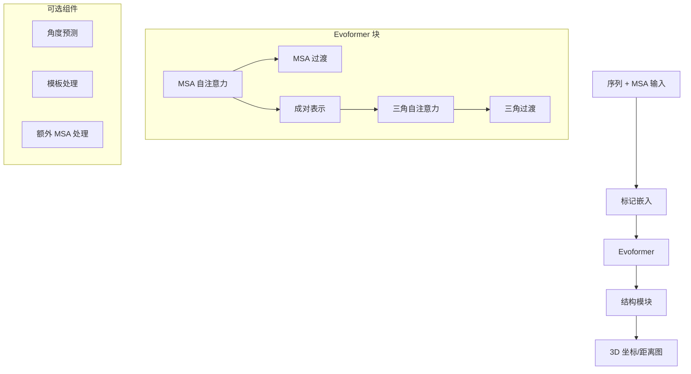

---
slug:1-overview
blog_type:normal
---

**alphafold2-pytorch** 是 DeepMind 革命性 AlphaFold2 的非官方 PyTorch 实现，该深度学习模型在 CASP14 中实现了蛋白质结构预测的突破性性能。此存储库提供了一个基于 PyTorch 的框架，用于使用类似于 AlphaFold2 论文中描述的基于注意力机制的神经网络进行蛋白质结构预测。

## 什么是 AlphaFold2？

AlphaFold2 代表了计算生物学的一项里程碑式进步，它使用深度学习从未知氨基酸序列中预测蛋白质的 3D 结构，具有前所未有的准确性。此实现提供了：

- **蛋白质结构预测**：从序列和多重序列比对（MSA）输入
- **距离图和角度预测**：类似于 trRosetta，但具有改进的注意力机制
- **端到端坐标预测**：使用先进的等变网络
- **基于 PyTorch 的架构**：使其对 PyTorch 社区开放

来源：[README.md](README.md)，[alphafold2.py#L469-L502](alphafold2_pytorch/alphafold2.py#L469-L502)

## 主要特性

该实现提供了一些显著特性：

| 特性 | 描述 |
|------|------|
| **Evoformer 架构** | 核心注意力网络，处理 MSA 并生成成对表示 |
| **坐标预测** | 可选的结构模块，用于预测 3D 坐标 |
| **角度预测** | 可选的扭转角（θ, φ, ω）预测 |
| **预训练嵌入** | 与 ESM、MSA 和 ProtTrans 嵌入集成 |
| **结构细化** | 支持 SE3 Transformer 或 E(n)-Transformer 细化 |

<CgxTip>
尽管这是一个非官方实现，但据报道，它在类似任务上与 trRosetta 相比取得了有竞争力的结果。该存储库的重点已转向提供一个干净的 PyTorch 翻译，并在位置编码技术上进行改进。
</CgxTip>

来源：[README.md#Status](README.md)，[alphafold2.py#L556-L563](alphafold2_pytorch/alphafold2.py#L556-L563)

## 架构概述

该实现遵循模块化架构，类似于 AlphaFold2 论文中描述的设计：

该模型通过一系列基于注意力的模块处理**主要氨基酸序列**和**多重序列比对（MSA）**，提取进化信息以预测蛋白质结构。

来源：[alphafold2.py#L469-L598](alphafold2_pytorch/alphafold2.py#L469-L598)，[alphafold2.py#L412-L467](alphafold2_pytorch/alphafold2.py#L412-L467)

## 核心组件

### Evoformer

网络的核心是**Evoformer**，它由交替层组成：

1. **MSA 注意力块**：使用行和列注意力处理多重序列比对
2. **成对注意力块**：通过三角注意力（输入和输出）处理成对表示
3. **前馈网络**：在注意力后转换表示

Evoformer 生成了丰富的表示，捕捉残基之间的进化关系。

来源：[alphafold2.py#L412-L467](alphafold2_pytorch/alphafold2.py#L412-L467)，[alphafold2.py#L387-L408](alphafold2_pytorch/alphafold2.py#L387-L408)

### 结构模块

对于坐标预测，该实现提供了以下集成：

- **SE3 Transformer**：用于等变处理原子坐标
- **E(n)-Transformer**：等变结构细化的替代方案
- **图 Transformer**：基于 Baker 实验室最近的改进

这些模块支持从序列信息进行蛋白质 3D 坐标的端到端预测。

来源：[README.md#predicting-coordinates](README.md)，[alphafold2.py#L491-L512](alphafold2_pytorch/alphafold2.py#L491-L512)

## 存储库结构

该存储库组织为几个关键目录：

- **alphafold2_pytorch/**：核心实现文件
  - `alphafold2.py`：主要模型实现
  - `embeds.py`：序列和 MSA 的嵌入系统
  - `rotary.py`：旋转位置编码
  - `reversible.py`：内存高效的可逆层
  
- **notebooks/**：使用模型的示例笔记本
  - `egnn_esm_end2end.ipynb`：端到端蛋白质结构预测
  - 示例蛋白质数据在 `notebooks/data/`
  
- **training_scripts/**：训练模型的资源
  - `datasets/trrosetta.py`：trRosetta 数据集的接口

来源：[__init__.py](alphafold2_pytorch/__init__.py)

## 下一步

要开始使用 alphafold2-pytorch，请查看[快速入门](2-quick-start)指南，了解安装说明和基本使用示例。有关架构的详细信息，请访问 Deep Dive 部分的[AlphaFold2 架构](9-alphafold2-architecture)页面。

以下部分将指导您完成：
- 安装和设置库
- 进行您的首次蛋白质结构预测
- 理解底层模型架构
- 训练和微调方法