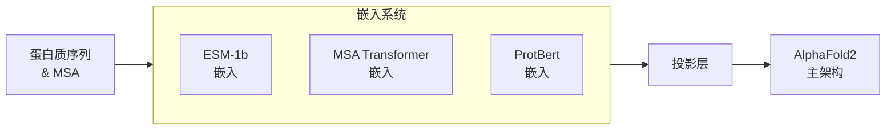

---
slug:10-embedding-system
blog_type:normal
---


嵌入系统是AlphaFold2实现中的关键组件，提供了丰富的蛋白质序列和进化信息的表示。本文深入探讨了嵌入是如何生成并整合到架构中，以驱动准确的蛋白质结构预测。

## 什么是蛋白质嵌入？

蛋白质嵌入是氨基酸序列的密集向量表示，捕捉了生化特性、进化模式和结构倾向。在AlphaFold2中，嵌入作为理解蛋白质序列的基础，在尝试预测其3D结构之前发挥作用。

该实现支持三种强大的嵌入方法：

| 嵌入模型 | 维度 | 来源 | 主要用途 |
|----------|------|------|----------|
| ESM-1b | 1280 | Facebook Research | 单序列表示 |
| MSA Transformer | 768 | Facebook Research | 多序列比对表示 |
| ProtBert | 1024 | RostLab | 替代单序列表示 |

来源：[constants.py#L18-L25](alphafold2_pytorch/constants.py#L18-L25)

## 架构概述

嵌入系统遵循包装器模式，每个嵌入模型被封装在一个专用的包装器类中，处理以下任务：
1. 加载预训练模型
2. 处理输入序列
3. 生成嵌入
4. 将嵌入投影到AlphaFold2所需的维度

以下是嵌入如何融入模型架构的高级视图：



让我们详细看看每种嵌入方法。

## ESM-1b嵌入

ESM-1b（进化规模建模）是一个具有33层和6.5亿参数的Transformer模型，训练于大量蛋白质序列语料库。它能从单序列中捕捉丰富的表示。

### 实现

`ESMEmbedWrapper`类处理ESM-1b嵌入：

```python
class ESMEmbedWrapper(nn.Module):
    def __init__(self, *, alphafold2):
        super().__init__()
        self.alphafold2 = alphafold2
        
        # 加载预训练的ESM-1b模型
        model, alphabet = torch.hub.load(*ESM_MODEL_PATH) 
        batch_converter = alphabet.get_batch_converter()
        
        self.model = model
        self.batch_converter = batch_converter
        # 如需，投影到AlphaFold2的维度
        self.project_embed = nn.Linear(ESM_EMBED_DIM, alphafold2.dim) if ESM_EMBED_DIM != alphafold2.dim else nn.Identity()
```

该包装器处理主序列和可选的MSA序列以生成嵌入。

来源：[embeds.py#L77-L103](alphafold2_pytorch/embeds.py#L77-L103)

### 嵌入生成

实际的嵌入生成发生在`get_esm_embedd`函数中，该函数：
1. 将序列ID转换为字符串表示
2. 使用ESM批量转换器准备输入
3. 将序列通过ESM-1b模型
4. 从第33层（最终层）提取表示

```python
def get_esm_embedd(seq, embedd_model, batch_converter, msa_data=None):
    device = seq.device
    REPR_LAYER_NUM = 33
    max_seq_len = seq.shape[-1]
    embedd_inputs = ids_to_embed_input(seq.cpu().tolist())
    
    batch_labels, batch_strs, batch_tokens = batch_converter(embedd_inputs)
    with torch.no_grad():
        results = embedd_model(batch_tokens.to(device), repr_layers=[REPR_LAYER_NUM], return_contacts=False)
    # 索引0是起始标记，所以从索引1开始取
    token_reps = results["representations"][REPR_LAYER_NUM][..., 1:max_seq_len+1, :].unsqueeze(dim=1)
    return token_reps
```

来源：[utils.py#L331-L352](alphafold2_pytorch/utils.py#L331-L352)

## MSA Transformer嵌入

多序列比对（MSA）提供了关于蛋白质家族的进化信息。MSA Transformer专门设计用于同时处理整个比对。

### 实现

`MSAEmbedWrapper`类处理MSA嵌入：

```python
class MSAEmbedWrapper(nn.Module):
    def __init__(self, *, alphafold2):
        super().__init__()
        self.alphafold2 = alphafold2
        
        model, alphabet = torch.hub.load(*MSA_MODEL_PATH) 
        batch_converter = alphabet.get_batch_converter()
        
        self.model = model
        self.batch_converter = batch_converter
        self.project_embed = nn.Linear(MSA_EMBED_DIM, alphafold2.dim) if MSA_EMBED_DIM != alphafold2.dim else nn.Identity()
```

该包装器一起处理序列和MSA，小心处理可能填充的MSA行。

来源：[embeds.py#L33-L75](alphafold2_pytorch/embeds.py#L33-L75)

### 嵌入生成

`get_msa_embedd`函数通过以下步骤生成MSA嵌入：
1. 将序列ID转换为字符串表示
2. 使用MSA批量转换器准备输入
3. 将序列通过MSA Transformer模型
4. 从第12层提取表示

一个关键方面是处理MSA中的掩码行：

```python
if exists(msa_mask):
    # 单独处理每个批次元素以处理填充的MSA
    num_msa = msa_mask.any(dim = -1).sum(dim = -1).tolist()
    seq_and_msa_list = seq_and_msa.unbind(dim = 0)
    num_rows = seq_and_msa.shape[1]
    
    embeds = []
    for num, batch_el in zip(num_msa, seq_and_msa_list):
        batch_el = rearrange(batch_el, '... -> () ...')
        batch_el = batch_el[:, :num]
        embed = get_msa_embedd(batch_el, model, batch_converter, device = device)
        embed = F.pad(embed, (0, 0, 0, 0, 0, num_rows - num), value = 0.)
        embeds.append(embed)
    
    embeds = torch.cat(embeds, dim = 0)
```

来源：[embeds.py#L51-L68](alphafold2_pytorch/embeds.py#L51-L68), [utils.py#L308-L329](alphafold2_pytorch/utils.py#L308-L329)

## ProtBert嵌入

ProtBert是一个在Hugging Face Transformers库中训练的BERT风格模型，提供了单序列嵌入的替代方法。

### 实现

`ProtTranEmbedWrapper`类处理ProtBert嵌入：

```python
class ProtTranEmbedWrapper(nn.Module):
    def __init__(self, *, alphafold2):
        super().__init__()
        from transformers import AutoTokenizer, AutoModel
        
        self.alphafold2 = alphafold2
        self.project_embed = nn.Linear(PROTTRAN_EMBED_DIM, alphafold2.dim)
        self.tokenizer = AutoTokenizer.from_pretrained('Rostlab/prot_bert', do_lower_case=False)
        self.model = AutoModel.from_pretrained('Rostlab/prot_bert')
```

来源：[embeds.py#L10-L31](alphafold2_pytorch/embeds.py#L10-L31)

### 嵌入生成

`get_prottran_embedd`函数使用Hugging Face流程生成ProtBert嵌入：

```python
def get_prottran_embedd(seq, model, tokenizer, device = None):
    from transformers import pipeline
    
    fe = pipeline('feature-extraction', model = model, tokenizer = tokenizer, 
                  device = (-1 if not exists(device) else device.index))
    
    max_seq_len = seq.shape[1]
    embedd_inputs = ids_to_prottran_input(seq.cpu().tolist())
    
    embedding = fe(embedd_inputs)
    embedding = torch.tensor(embedding, device = device)
    
    # 跳过第一个标记（[CLS]）并仅包含实际序列标记
    return embedding[:, 1:(max_seq_len + 1)]
```

来源：[utils.py#L295-L306](alphafold2_pytorch/utils.py#L295-L306)

## 与AlphaFold2的集成

生成嵌入后，它们被传递到AlphaFold2模型以驱动结构预测过程。集成发生在每个包装器的`forward`方法中：

```python
# 来自ESMEmbedWrapper的示例
def forward(self, seq, msa=None, **kwargs):
    # 生成嵌入
    seq_embeds = get_esm_embedd(seq, model, batch_converter, device = device)
    seq_embeds = self.project_embed(seq_embeds)
    
    if msa is not None:
        # 如提供，生成MSA嵌入
        flat_msa = rearrange(msa, 'b m n -> (b m) n')
        msa_embeds = get_esm_embedd(flat_msa, model, batch_converter, device = device)
        msa_embeds = rearrange(msa_embeds, '(b m) n d -> b m n d')
        msa_embeds = self.project_embed(msa_embeds)
    else: 
        msa_embeds = None
    
    # 将嵌入传递给AlphaFold2
    return self.alphafold2(seq, msa, seq_embed = seq_embeds, msa_embed = msa_embeds, **kwargs)
```

来源：[embeds.py#L89-L103](alphafold2_pytorch/embeds.py#L89-L103)

## 使用示例

要在预测管道中使用嵌入系统，您需要：

1. 初始化AlphaFold2模型
2. 用您选择的嵌入包装器包装它
3. 将序列和MSA传递给包装器

```python
from alphafold2_pytorch import Alphafold2
from alphafold2_pytorch.embeds import ESMEmbedWrapper, MSAEmbedWrapper, ProtTranEmbedWrapper

# 初始化基础模型
model = Alphafold2(
    dim = 256,
    depth = 4,
    heads = 8,
    dim_head = 32
)

# 选择嵌入方法（此例中使用ESM）
model = ESMEmbedWrapper(alphafold2 = model)

# 使用模型
pred = model(
    seq = protein_sequence,      # 形状: (批次, 长度)
    msa = multiple_sequence_alignment  # 形状: (批次, 对齐数量, 长度)
)
```

<CgxTip>
在计算资源有限的情况下，当MSA不可用时，使用ESM-1b处理单序列可获得最佳结果。如果您有高质量的MSA，MSA Transformer方法通常会提供信息更丰富的嵌入，从而带来更好的结构预测。
</CgxTip>

## 性能考虑

嵌入模型较大，可能会消耗大量内存：

| 模型 | 参数 | 内存使用 | 处理速度 |
|------|------|----------|----------|
| ESM-1b | 650M | ~2.6GB | 中等 |
| MSA Transformer | 100M | ~400MB | 慢（取决于MSA大小） |
| ProtBert | 420M | ~1.7GB | 中等 |

为了在准确性和计算效率之间取得最佳平衡：
- 尽可能使用批处理处理多个蛋白质
- 考虑在训练期间冻结嵌入模型
- 对于长序列的推理，当GPU内存有限时，考虑分块处理