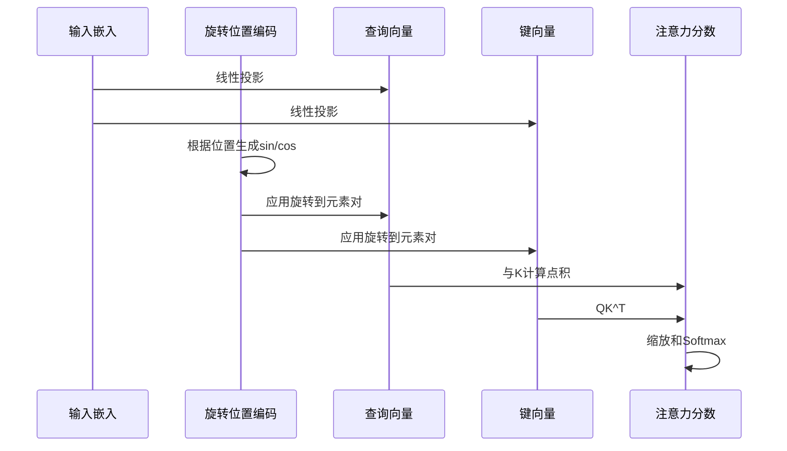

---
slug:11-rotary-position-encoding
blog_type:normal
---


旋转位置编码（RoPE）是AlphaFold2实现中的关键组件，它通过将相对位置信息直接编码到注意力计算中，增强了注意力机制。本指南解释了旋转位置编码的工作原理、其对蛋白质结构预测的重要性以及如何在您的模型中使用它。

## 什么是旋转位置编码？

旋转位置编码是一种通过应用位置依赖的旋转到查询和键向量，将位置信息注入到注意力机制中的技术。与传统的加性位置编码不同，旋转编码：

- 保留了标记之间的**相对位置依赖性**
- 创建了**连续**的位置表示
- 自然处理**任意长度的序列**
- 对更长的序列提供**更好的泛化能力**

这些特性对于蛋白质结构预测尤其宝贵，因为捕捉氨基酸之间的相对空间关系至关重要。

来源：[rotary.py#L7-L20](alphafold2_pytorch/rotary.py#L7-L20)

## 工作原理

旋转位置编码对注意力查询和键向量中的元素对应用位置依赖的旋转。核心机制包括：

1. **成对旋转**：使用正弦和余弦函数成对旋转元素
2. **位置依赖频率**：旋转角度取决于位置和频率
3. **维度依赖频率**：不同维度以不同频率旋转

让我们看看关键组件：

### 核心函数

```python
def rotate_every_two(x):
    x = rearrange(x, '... (d j) -> ... d j', j = 2)
    x1, x2 = x.unbind(dim = -1)
    x = torch.stack((-x2, x1), dim = -1)
    return rearrange(x, '... d j -> ... (d j)')

def apply_rotary_pos_emb(x, sinu_pos):
    sin, cos = map(lambda t: rearrange(t, 'b ... -> b () ...'), sinu_pos)
    rot_dim = sin.shape[-1]
    x, x_pass = x[..., :rot_dim], x[..., rot_dim:]
    x = x * cos + rotate_every_two(x) * sin
    return torch.cat((x, x_pass), dim = -1)
```

`rotate_every_two`函数取元素对并进行2D旋转。然后`apply_rotary_pos_emb`使用基于位置的的正弦和余弦值应用这种旋转。

来源：[rotary.py#L9-L20](alphafold2_pytorch/rotary.py#L9-L20)

## 实现类

该存储库提供了两个位置嵌入类：

### 1. FixedPositionalEmbedding

此类实现了一个具有正弦模式的标准1D位置嵌入：

```python
class FixedPositionalEmbedding(nn.Module):
    def __init__(self, dim):
        super().__init__()
        inv_freq = 1. / (10000 ** (torch.arange(0, dim, 2).float() / dim))
        self.register_buffer('inv_freq', inv_freq)

    def forward(self, n, device):
        seq = torch.arange(n, device = device).type_as(self.inv_freq)
        freqs = einsum('i , j -> i j', seq, self.inv_freq)
        freqs = repeat(freqs, 'i j -> () i (j r)', r = 2)
        return [freqs.sin(), freqs.cos()]
```

此实现创建了随维度呈指数下降的正弦模式，遵循原始Transformer设计，但适配了旋转用途。

来源：[rotary.py#L35-L45](alphafold2_pytorch/rotary.py#L35-L45)

### 2. AxialRotaryEmbedding

这是一个专门的2D版本，为两个轴生成位置编码（特别适用于具有空间维度的蛋白质结构数据）：

```python
class AxialRotaryEmbedding(nn.Module):
    def __init__(self, dim, max_freq = 10):
        super().__init__()
        self.dim = dim // 2
        inv_freq = 1. / (10000 ** (torch.arange(0, self.dim, 2).float() / self.dim))
        self.register_buffer('inv_freq', inv_freq)

    def forward(self, n, device):
        seq = torch.arange(n, device = device).type_as(self.inv_freq)

        x = einsum('n, d -> n d', seq, self.inv_freq)
        y = einsum('n, d -> n d', seq, self.inv_freq)

        x_sinu = repeat(x, 'i d -> i j d', j = n)
        y_sinu = repeat(y, 'j d -> i j d', i = n)

        sin = torch.cat((x_sinu.sin(), y_sinu.sin()), dim = -1)
        cos = torch.cat((x_sinu.cos(), y_sinu.cos()), dim = -1)

        sin, cos = map(lambda t: repeat(t, 'i j d -> () (i j) (d r)', r = 2), (sin, cos))
        return [sin, cos]
```

此类对于蛋白质结构预测尤为重要，因为它创建了一个2D位置编码网格，可以表示蛋白质序列中氨基酸之间的空间关系。

来源：[rotary.py#L47-L67](alphafold2_pytorch/rotary.py#L47-L67)

## 旋转编码在注意力中的工作方式

当集成到注意力机制中时，旋转编码通过在计算注意力分数之前修改查询和键向量，影响标记之间的交互。以下是概念流程：



这种编码方法高效地将相对位置信息直接编码到注意力计算中，非常适合捕捉蛋白质结构中的复杂空间关系。

<CgxTip>
**专业提示**：在处理蛋白质结构时，AxialRotaryEmbedding通常比标准位置嵌入更有效，因为蛋白质自然形成2D和3D结构。使用轴向编码有助于更准确地捕捉这些空间关系。
</CgxTip>

## 对蛋白质结构预测的益处

旋转位置编码为蛋白质结构预测提供了多项特定优势：

1. **相对位置感知**：捕捉氨基酸之间的空间关系，对于理解蛋白质折叠至关重要
2. **不变性特性**：帮助模型关注形状和结构而非绝对位置
3. **长距离依赖**：更好地捕捉蛋白质远端部分之间的相互作用
4. **参数效率**：在不增加额外参数的情况下编码位置信息

## 在您的模型中使用旋转位置编码

以下是如何将旋转位置编码集成到您的注意力机制中：

```python
# 初始化位置编码模块
rotary_pos_emb = AxialRotaryEmbedding(
    dim = 64,  # 维度应适合您的模型
)

# 在您的注意力机制中
def forward(self, q, k, v, seq_len):
    # 为序列长度生成位置编码
    sin, cos = rotary_pos_emb(seq_len, device=q.device)
    
    # 将旋转编码应用到查询和键
    q = apply_rotary_pos_emb(q, (sin, cos))
    k = apply_rotary_pos_emb(k, (sin, cos))
    
    # 继续正常的注意力计算
    attention = torch.matmul(q, k.transpose(-2, -1))
    # ... 注意力机制的其余部分
```

## 与其他位置编码方法的比较

| 方法 | 类型 | 相对位置感知 | 参数数量 | 长序列处理 |
|------|------|---------------|----------|------------|
| 绝对位置嵌入 | 加性 | 低 | 高（可学习） | 差 |
| 正弦编码 | 加性 | 中 | 无（固定） | 中 |
| 旋转位置编码 | 乘性 | 高 | 无（固定） | 优 |
| 相对位置编码 | 注意力偏置 | 高 | 高 | 好 |

旋转位置编码在位置感知和参数效率之间提供了最佳平衡，使其成为蛋白质结构预测等复杂任务的理想选择。

## 结论

旋转位置编码是一种强大的技术，增强了蛋白质结构预测的注意力机制。通过将相对位置信息直接编码到注意力计算中，它帮助模型更好地理解氨基酸之间的空间关系，从而实现更准确的结构预测。

在您继续探索AlphaFold2时，了解这种位置编码的工作原理将有助于您理解模型如何捕捉蛋白质结构中的复杂3D关系。