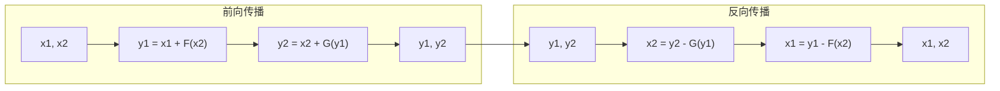

---
slug:12-reversible-networks
blog_type:normal
---


可逆网络是AlphaFold2实现中使用的强大内存优化技术。本文深入探讨了它们的工作原理、价值所在以及在该存储库中的实现方式。对于处理大型蛋白质模型的深度学习从业者来说，理解可逆网络可以显著减少训练过程中的内存占用。

## 可逆网络的重要性

在训练像AlphaFold2这样的深度神经网络时，最大的限制之一是GPU内存。在反向传播过程中，框架通常需要存储前向传播中的所有中间激活值，这对于深度模型来说会消耗大量内存。

**可逆网络解决了这个问题**，它们通过在反向传播过程中重建中间激活值而不是存储它们，显著减少了内存需求——通常减少的量与网络深度成比例！

参考资料：[reversible.py#L264-L294](alphafold2_pytorch/reversible.py#L264-L294)

## 可逆网络的工作原理

可逆网络背后的关键洞察非常简单：如果我们能从层的输出中重建其输入，就不需要存储输入。

### 核心概念：可逆块

实现围绕特殊设计的块展开，这些块将输入张量分成两部分并应用可逆的变换：

1. **分割输入**：将输入张量分为两部分（x1, x2）
2. **应用变换**：
   - y1 = x1 + F(x2)
   - y2 = x2 + G(y1)
3. **在反向传播过程中**：
   - 恢复 x2 = y2 - G(y1)
   - 恢复 x1 = y1 - F(x2)

这种方法允许在不存储中间激活值的情况下进行高效的梯度计算。



参考资料：[reversible.py#L59-L156](alphafold2_pytorch/reversible.py#L59-L156)

## 在AlphaFold2中的实现

该存储库实现了两种主要的可逆块类型：

| 块类型 | 目的 | 关键组件 |
|--------|------|----------|
| `ReversibleSelfAttnBlock` | MSA或序列内的自注意力 | 四个函数（f,g,j,k）用于变换输入部分 |
| `ReversibleCrossAttnBlock` | MSA和序列之间的交叉注意力 | 结构相似，但具有交叉注意力模式 |

这些块随后被组合成`ReversibleSequence`，可以替换传统的顺序层。

参考资料：[reversible.py#L60-L83](alphafold2_pytorch/reversible.py#L60-L83), [reversible.py#L159-L179](alphafold2_pytorch/reversible.py#L159-L179), [reversible.py#L303-L321](alphafold2_pytorch/reversible.py#L303-L321)

## 魔法：自定义Autograd函数

真正的魔法发生在`ReversibleFunction`类中，该类实现了PyTorch的autograd Function。这个自定义函数：

1. 通过顺序应用块来处理前向传播
2. 在反向传播过程中，实时重建中间激活值
3. 管理复杂的梯度计算链

```python
class ReversibleFunction(Function):
    @staticmethod
    def forward(ctx, inp, ind, blocks, kwargs):
        x, m = split_at_index(1, ind, inp)
        
        for block in blocks:
            x, m = block(x, m, _reverse = True, **kwargs)
        
        ctx.blocks = blocks
        ctx.kwargs = kwargs
        ctx.ind = ind
        ctx.save_for_backward(x.detach(), m.detach())
        return torch.cat((x, m), dim = 1)
    
    @staticmethod
    def backward(ctx, d):
        ind = ctx.ind
        blocks = ctx.blocks
        kwargs = ctx.kwargs
        dy, dn = split_at_index(1, ind, d)
        y, n = ctx.saved_tensors
        
        for block in blocks[::-1]:
            y, n, dy, dn = block.backward_pass(y, n, dy, dn, **kwargs)
        
        d = torch.cat((dy, dn), dim = 1)
        return d, None, None, None
```

这种方法允许在不牺牲计算精度的情况下进行高效的训练。

参考资料：[reversible.py#L265-L293](alphafold2_pytorch/reversible.py#L265-L293)

## 保持确定性

可逆网络的一个关键挑战是确保确定性行为，尤其是在随机操作中。实现通过`Deterministic`包装器来仔细管理随机状态：

```python
class Deterministic(nn.Module):
    def __init__(self, net):
        super().__init__()
        self.net = net
        self.cpu_state = None
        self.cuda_in_fwd = None
        self.gpu_devices = None
        self.gpu_states = None
```

这个包装器在前向传播过程中记录随机数生成器状态，并在反向传播过程中恢复它们，确保结果一致。

参考资料：[reversible.py#L26-L57](alphafold2_pytorch/reversible.py#L26-L57)

## 使用可逆网络

要在您自己的模型中使用可逆网络：

1. 识别可以变为可逆的块（通常是注意力和前馈层）
2. 确保您的输入可以分成两部分
3. 用`ReversibleSequence`替换标准顺序处理

```python
# 示例用法（简化）
reversible_blocks = [
    (self_attn1, ff1, self_attn2, ff2),  # 块1组件
    (self_attn3, ff3, self_attn4, ff4),  # 块2组件
]

block_types = ['self', 'self']  # 块类型

reversible_sequence = ReversibleSequence(reversible_blocks, block_types)

# 前向传播
output = reversible_sequence(sequence, msa, mask=mask)
```

<CgxTip>
**内存节省提示**：当您的模型具有许多结构相似的顺序层时，可逆网络效果最佳。内存节省大约与您使用的可逆层数量成比例。对于像AlphaFold2这样的非常深的网络，这可能意味着在单个GPU上训练与需要多个GPU之间的区别。
</CgxTip>

参考资料：[reversible.py#L342-L347](alphafold2_pytorch/reversible.py#L342-L347)

## 限制和考虑事项

尽管可逆网络提供了显著的内存优势，但也存在一些权衡：

1. **计算开销**：在反向传播过程中重建激活值会增加一些计算成本
2. **实现复杂性**：需要仔细处理随机状态和自定义autograd函数
3. **架构约束**：并非所有网络架构都可以变为可逆；它们需要遵循特定模式

对于AlphaFold2，内存优势通常大于这些限制，尤其是在处理长蛋白质序列或大型多重序列比对时。

## 结论

可逆网络为训练像AlphaFold2这样的深度神经网络的内存限制提供了一个优雅的解决方案。通过巧妙地重建中间激活值而不是存储它们，它们使得在有限的硬件上训练更深的模型成为可能。

理解和实现可逆网络为处理更大模型和更长蛋白质序列打开了可能性，最终推动了蛋白质结构预测及其他领域的边界。